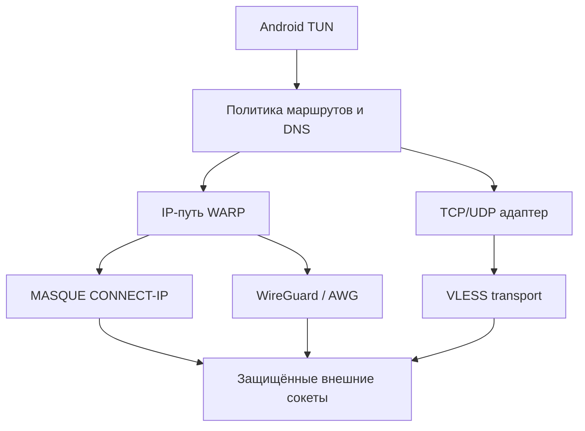

# Mirrly: аудит WARP, MASQUE, AWG, VLESS и план Android VpnService

Дата: 10 сентября 2026. Адресат: R1X и разработчик текущей версии Mirrly. Объект: исходники из `Mirrly TG Proxy.zip`. Изменения в исходники не вносились.

**Вывод:** прогресс относительно сохранённой версии 1.1.8.3 существенный, но текущую реализацию нельзя считать проверенным универсальным VPN-ядром. Главный риск — ложная готовность: отдельные ветки объявляют успех до аутентифицированного обмена полезными данными. В REALITY и HTTP/3 есть конкретные нарушения протокольного конвейера; у AWG отсутствуют важные части жизненного цикла WireGuard; маршрутизация и диагностика расходятся между Kotlin и Rust. Добавление `VpnService` поверх этого увеличит масштаб последствий с отдельных соединений Telegram до трафика выбранных приложений или всего устройства.

В документе **80 задач**: 8 первоочередных, 14 по MASQUE/WARP, 10 по AWG, 12 по VLESS/Vision, 10 общих, 20 по Android VPN и 6 по проверке/выпуску. Это **не 80 обнаруженных уязвимостей**: подтверждённые дефекты, гипотезы совместимости и будущие инженерные требования явно разделены.

## 1. Границы проверки и честное сравнение

В архиве есть Git. База сравнения — `88d735c52214931d426295a7c9b2b6b5e52ff253`, сохранённый коммит 1.1.8.3. Текущие файлы содержат незакоммиченные изменения и новые, ещё не отслеживаемые Git модули. Отдельный прошлый архив из нашей прежней работы в эту проверку не входил. Поэтому ниже сравнение с **HEAD внутри переданного архива**, а не заявление, что восстановлена вся история предыдущих обсуждений.

| Область | Сохранённая база | Текущее содержимое | Оценка |
|---|---|---|---|
| Rust-ядро | 9 исходных `.rs`, около 5 439 строк | 14 `.rs`, около 16 580 строк | Объём вырос примерно втрое; это расширение поверхности проверки, не измерение качества |
| Новые протоколы | Нет отдельных `masque.rs`, `awg.rs`, `vless.rs`, `vision.rs`, `reality.rs` | Все пять модулей присутствуют | Настоящая реализационная работа, но степень завершённости разная |
| Управление | Прежний прокси-конвейер | Регистрация WARP, сканер, каскад, импорт VLESS, диагностика | Пользовательские сценарии стали шире; появилась проблема нескольких владельцев состояния |
| Нативная поставка | Прежние библиотеки | `.so` для четырёх Android ABI, 35 методов JNA имеют соответствующие экспортированные символы | Грубый разрыв имён ABI не обнаружен; происхождение бинарников и корректность вызовов этим не доказаны |
| Проверки | Прежние тесты | 30 файлов core-тестов, около 4 917 строк | Полезный задел; число тестов не подтверждает совместимость с удалённым сервером |
| Android VPN | Прокси-сервис | По-прежнему прокси-сервис; `VpnService` и TUN-интерфейса нет | VPN — следующий архитектурный этап |

Сравнение содержательных изменений выполнялось с игнорированием CRLF-различий: обычный `git diff --stat` сильно завышает объём из-за перевода строк. Например, для `LocalProxyServer.kt` содержательный diff относительно базы составляет 415 добавлений и 12 удалений; новые неотслеживаемые файлы нужно учитывать отдельно.

Что сделано хорошо: выделены транспортные модули; используется `quinn`/`rustls`, а не самодельный QUIC; появился IP-стек `smoltcp`; предусмотрены отмена, пул соединений и диагностические события; есть отдельное хранилище части секретов; обычные TLS-ветки используют проверку сертификатов. Эти решения стоит сохранить и довести до последовательной архитектуры.

**Что действительно проверено:** чтение цепочек вызовов Kotlin → JNA → Rust, сравнение с Git-базой, разбор транспортных/управляющих веток, сопоставление спорных мест с первичными спецификациями и реализацией Xray, статическая проверка экспортов `.so`, независимые модели четырёх ошибочных веток парсеров.

**Что не проверено:** сборка APK/Rust, запуск unit-тестов проекта, реальная регистрация Cloudflare, обмен с WARP/Xray, работа на Android и в сетях операторов. В среде нет `cargo`, `rustc`, установленного Gradle, Android SDK/`adb`; наличие Java и Gradle wrapper не заменяет остальные компоненты. Заявление документа проекта о 231 прошедшем тесте здесь не подтверждалось. Нельзя приписывать найденные исходные дефекты конкретному установленному APK без воспроизводимой связи исходники → `.so` → APK.

## 2. Почему «вроде подключается» недостаточно

Текущая система смешивает как минимум шесть разных событий: UDP-ответ узла, TLS/QUIC handshake, HTTP CONNECT, VLESS-ответ, TCP-соединение до назначения и получение полезного ответа назначения. Успех более раннего события не доказывает более позднее.

| Заявление или сигнал | Что подтверждает код | Что нужно для принятия |
|---|---|---|
| «WARP активирован» после ошибки API | Возможен `Result.success` с bootstrap-профилем | Подтверждённая сервером identity и успешный запрос через её туннель |
| «MASQUE подключён» | QUIC и эвристическое распознавание HTTP-статуса | Корректный HTTP/3, аутентификация, IP-обмен и ответ назначения |
| «REALITY handshake verified» | Получен структурно проверенный ServerHello, затем возвращён `TcpStream` | Полный REALITY/TLS-конвейер с аутентификацией и защищённым record layer |
| «Узел жив» у сканера | Любая непустая UDP-датаграмма | Для сканера — только кандидат; для Ready — проверка протокола и data-plane |
| «Data-plane RX > 0» в матрице | SOCKS-ответ; часть проверок допускает EOF как успех | Прикладной ответ через выбранный uplink, исключая собственный SOCKS-заголовок |
| «Dual-stack завершён» | `smoltcp` собран с `proto-ipv4`, внешний QUIC bind IPv4 | Отдельно работа внешнего IPv6 и внутреннего IPv6 |
| «Keepalive 20 с» | QUIC keepalive 15 с; в AWG соответствующего таймера нет | Измерение пакетов и восстановление после простоя/NAT expiry |
| «Zero-copy» | `Vec`, `to_vec`, очереди и буферы на поток | Профиль аллокаций/копирований, измеренный выигрыш |
| «VLESS выбран» | Некоторые ветки могут сразу использовать Opera CONNECT либо перейти на Worker | Явная политика и показ фактического транспорта |

Матрица завершённости в `WARP_MASQUE_DEEP_AUDIT_AND_RECONSTRUCTION_PLAN.md`, начиная примерно со строки 579, должна быть пересмотрена по фактам. Успешные Kotlin unit-тесты нельзя записывать как интеграционные испытания Rust data-plane.

## 3. Как читать задачи

**КОД** — ветка или недостающий механизм установлены по исходникам. Последствие иногда зависит от конкретного входа, сервера или нагрузки; это указано в тексте. **СТЕНД** — правдоподобный риск совместимости, для окончательного вывода нужен независимый сервер/устройство. **ПЛАН** — требование к будущему VPN или улучшению процесса, а не дефект уже обещанной функции.

**P0** — блокирует выпуск соответствующего пути как готового/защищённого; это проектный приоритет, не CVSS. **P1** — исправить до широкой беты VPN. **P2** — доводка устойчивости, производительности и сопровождения. Пункты могут закрываться совместным PR, но имеют разные критерии приёмки.

Обозначения путей: `R/` = `mirrlyengine/src/`; `K/` = `core/src/main/kotlin/com/mirrly/tgproxy/core/`; `A/` = `app/src/main/java/com/mirrly/tgproxy/`. Указанные строки относятся к переданному снимку; имя функции надёжнее строки при последующих правках.

## 4. Первоочередные исправления

### B01 — REALITY не завершает TLS и возвращает обычный TCP

**P0 · КОД.** `R/reality.rs:22`, `reality_connect_ext`, особенно 198–243; использование в `R/vless.rs` около 1330. После ClientHello читается ServerHello, проверяется структура, иногда убирается dummy CCS, затем возвращается `TcpStream`. Нет завершения полного TLS handshake, проверки Finished и дальнейшего TLS record layer. Следующий код пишет VLESS-запрос в этот сырой поток. Сообщение «verified successfully» не соответствует выполненной проверке.

**Исправить:** подключить полноценную совместимую реализацию REALITY/TLS либо убрать эту ветку из доступных готовых режимов до её завершения. Дописывание пары полей ClientHello не решает отсутствие транспортной защиты. Проверять ключ сервера, shortId, время и ошибки аутентификации в рамках выбранной реализации.

**Принять:** реальный Xray-сервер обслуживает HTTPS через Mirrly; неверные public key/shortId дают отказ; поддельный ServerHello не приводит к Ready; сетевой захват подтверждает корректный TLS-конвейер. Эталон завершает handshake и проверяет peer, а TLS требует проверки Finished перед обычным прикладным обменом. [Xray REALITY](https://github.com/XTLS/Xray-core/blob/main/transport/internet/reality/reality.go), [RFC 8446](https://www.rfc-editor.org/rfc/rfc8446.html).

### B02 — Короткий ServerHello может аварийно завершить процесс

**P1 · КОД.** `R/reality.rs:566`, `verify_server_hello`: при длине ровно 38 проверка `< 38` проходит, затем возможен доступ `body[38]`. Внешний reader допускает record length 38. В `mirrlyengine/Cargo.toml` release использует `panic = "abort"`.

**Исправить:** разбирать handshake проверенными срезами и проверять все длины до индексации; malformed input должен возвращать ошибку. Это отдельная задача даже при замене REALITY: непроверенный сетевой ввод не должен убивать весь процесс через FFI.

**Принять:** граничные длины 0–43, усечённые session ID и неверные вложенные длины дают контролируемую ошибку, без panic. Фаззинг парсера входит в CI.

### B03 — MASQUE закрывает обязательный HTTP/3 control stream

**P0 · КОД.** `R/masque.rs` около 2237–2268: `uni_stream` создаётся внутри `if let`, получает SETTINGS и выходит из области видимости. Его handle нигде не сохраняется. Quinn при drop отправляющей половины неостановленного потока неявно завершает запись; для HTTP/3 закрытие control stream является ошибкой соединения.

**Исправить:** хранить control `SendStream` в объекте сессии всё время её жизни; проверять ошибки записи SETTINGS; обрабатывать критические server streams и закрытие соединения согласованно.

**Принять:** строгий HTTP/3 peer не получает FIN control stream после SETTINGS; сессия выдерживает последовательные и параллельные CONNECT-запросы; штатное завершение освобождает все задачи. В `Cargo.lock` закреплён Quinn 0.11.11; доступная при аудите документация ниже описывает `SendStream` 0.11.9. Поведение точной закреплённой версии следует включить в regression test. [Quinn SendStream](https://docs.rs/quinn/0.11.9/quinn/struct.SendStream.html), [RFC 9114, control streams](https://www.rfc-editor.org/rfc/rfc9114.html#section-6.2.1).

### B04 — Нераспознанный HTTP-ответ превращается в 200

**P0 · КОД.** `R/masque.rs:1086`, `parse_h3_response_status`, и `read_h3_headers_response` около 1277. Парсер ищет отдельные байты и любые три ASCII-цифры; вызывающая функция применяет `unwrap_or(200)`. Это не QPACK-декодер. Валидные static-table ответы 403 и 500 не распознаются этой эвристикой и попадают в успех; цифры из другого поля также могут исказить результат.

**Исправить:** настоящий разбор QPACK field section и единственного допустимого `:status`; отсутствие/ошибка статуса — отказ, не 200. Ограничить размеры и проверять допустимый порядок HTTP/3 фреймов.

**Принять:** 200, 403, 404, 407, 429, 500, 503; literal/Huffman-представления; чужие цифры в заголовках; malformed input. Только корректный успешный ответ разрешает data-plane. Статические индексы 68 и 71 соответствуют 403 и 500. [RFC 9204, Appendix A](https://www.rfc-editor.org/rfc/rfc9204.html#appendix-A).

### B05 — Неуспешная регистрация WARP выдаётся за активацию

**P0 · КОД.** `K/WarpAccountManager.kt:137`, 591–603 и резервная обработка исключений; `A/ui/WarpRegistrationDialog.kt` около 185 явно передаёт `fallbackToBootstrap = true`. При отсутствии валидного API-ответа возвращается успех с фиксированным bootstrap-профилем, фиктивными account/token и заново созданным локальным сертификатом. В bootstrap есть общие ключевые значения; их наличие не доказывает действующую регистрацию. Непустая лицензия местами автоматически превращается в `isWarpPlus = true`.

**Исправить:** убрать синтетический успех. Разрешённый offline fallback — ранее подтверждённый сохранённый профиль с отдельным состоянием «нужна проверка». Разделить registered, activated, credentialsValid, dataPlaneReady и entitlement. Не показывать полную лицензию в сообщениях прогресса.

**Принять:** все API-каналы недоступны → честная ошибка/OfflineCached, Ready не выставлен; случайный license key не включает WARP+; новый локальный сертификат сам по себе не считается серверной авторизацией.

### B06 — При ошибке X25519 генерируются несвязанные public/private key

**P0 · КОД.** `K/WarpAccountManager.kt:199`, `generateWireGuardKeyPair`. Fallback заполняет два независимых массива случайными байтами. Public key обязан вычисляться из private key; независимые случайные числа не образуют пару. Извлечение последних 32 байт DER также лучше заменить документированным экспортом raw key.

**Исправить:** использовать проверенную X25519-реализацию, доступную на поддерживаемых Android, или вернуть явную ошибку. Не перехватывать все `Throwable` как повод продолжить с некорректной криптографией.

**Принять:** для каждой созданной пары независимая реализация вычисляет тот же public key; тестируется отсутствие нужного JCA provider; невозможность генерации не вызывает регистрацию ложного ключа.

### B07 — Health-check может принять EOF за рабочий туннель

**P0 · КОД.** `K/NodeHealthProber.kt:490–526`: результат `inp.read(reply)` игнорируется, `ByteArray(10)` остаётся заполненным нулями, проверка использует `reply.size` и `reply[1] == 0`. Поэтому EOF после предыдущих этапов или короткий ответ может дать AVAILABLE. `ActiveLivenessProbe` также ограничивается SOCKS CONNECT и пропускает пробу при суммарном TX+RX > 2048.

**Исправить:** точное чтение SOCKS-полей, проверка версии/метода/ATYP/длин и отдельная end-to-end проба. Считать полезный RX конкретной пробы, а не собственный SOCKS-ответ или только исходящий трафик.

**Принять:** mock, закрывающий соединение перед reply, не проходит; mock с одним байтом не проходит; сервер, принимающий CONNECT и затем молча теряющий данные, не Ready; успешный HTTPS/контролируемый echo через uplink проходит.

### B08 — Ожидание VLESS response до передачи payload создаёт взаимное ожидание

**P0 · КОД + СТЕНД для конкретных серверов.** `R/vless.rs:1102` и вызовы около 1215, 1334, 1397, 1458, 1499, 1565. После отправки одного VLESS-заголовка acquire ждёт ответа сервера до выдачи uplink локальному SOCKS-клиенту. Сервер вправе буферизовать response header до первого ответа назначения. Если назначение ждёт ClientHello/HTTP request, клиентские данные ещё не передаются: возникает взаимное ожидание и ложный timeout.

**Исправить:** после установки транспорта и отправки request header запускать двунаправленный обмен; downstream-парсер снимает VLESS response при появлении данных. SOCKS success здесь означает готовность proxy transport, а реальную доступность назначения подтверждает отдельная проба. Не превращать это в требование отправлять непроверенный payload до завершения TLS-аутентификации.

**Принять:** server-first и client-first протоколы; Xray с буферизованным response; HTTPS к серверу, молча ожидающему ClientHello. В актуальном inbound Xray response header записывается через buffered writer и используется `SetFlushNext`; Mirrly не должен предполагать немедленный сетевой flush. [Xray VLESS inbound](https://github.com/XTLS/Xray-core/blob/main/proxy/vless/inbound/inbound.go).

**Статус**: ВЫПОЛНЕНО (P0).
* В [vless.rs](file:///c:/projects/Mirrly%20dev/Mirrly%20TG%20Proxy/mirrlyengine/src/vless.rs) реализован потоковый инкрементальный автомат состояний [VlessResponseParser](file:///c:/projects/Mirrly%20dev/Mirrly%20TG%20Proxy/mirrlyengine/src/vless.rs#L1107), снимающий VLESS response header (версия 0x00, длина addons, опциональные Protobuf addons и TLS ChangeCipherSpec `14 03 03 00 01 01`) по мере поступления входящих данных, с защитой от переполнения буфера (1024 байта).
* В [vless_acquire_uplink_cmd](file:///c:/projects/Mirrly%20dev/Mirrly%20TG%20Proxy/mirrlyengine/src/vless.rs#L1210) убрано блокирующее ожидание VLESS response (`read_vless_response` / `ws.recv()`) во всех ветках диалера (Direct Reality, Direct TLS, Direct WS, Direct TCP, Preset WS, Custom Worker WS, Sticky Session fast-path, Sequential Candidate Fallback). Uplink возвращается сразу после завершения транспортного/криптографического хэндшейка и отправки VLESS request header.
* В [socks5.rs](file:///c:/projects/Mirrly%20dev/Mirrly%20TG%20Proxy/mirrlyengine/src/socks5.rs) локальный SOCKS5 сервер незамедлительно отвечает успехом `05 00 00 ...` клиенту, разрешая немедленную передачу клиентского payload (TLS ClientHello / HTTP).
* Парсер [VlessResponseParser](file:///c:/projects/Mirrly%20dev/Mirrly%20TG%20Proxy/mirrlyengine/src/vless.rs#L1107) интегрирован в нисходящие потоки:
  - `bridge_socks5_ws` (WebSocket data-plane)
  - `bridge_socks5_stream` (TCP/TLS/Reality data-plane)
  - `bridge_vless_udp_target` (VLESS over WS UDP datagrams)
  - `bridge_vless_udp_stream` (VLESS over TCP/TLS UDP datagrams)
* Добавлены комплексные unit-тесты (минимальный заголовок, с addons, с TLS CCS, фрагментированный CCS, одноблочный/многоблочный поток, client-first и server-first протоколы, переполнение буфера). Пройдена компиляция на всех 4 архитектурах Android NDK (`aarch64-linux-android`, `armv7-linux-androideabi`, `x86_64-linux-android`, `i686-linux-android`) и тесты Gradle `:core:test`.

## 5. WARP / MASQUE — ещё 14 задач

### M01 — Разделить identity WireGuard и MASQUE — [ВЫПОЛНЕНО (P1)]

**P1 · СТЕНД.** `K/WarpAccountManager.kt`, этапы POST/PATCH: сначала Curve25519/WireGuard, затем P-256/MASQUE на том же device/account; старые WG-ключи сохраняются. Нужно доказать, что изменение регистрации не инвалидирует предыдущую WG identity. По локальному коду серверное поведение установить нельзя.

**Исправить:** модель credentials по протоколам с отдельным подтверждением действительности; при необходимости отдельные device-регистрации. **Принять:** после MASQUE enrollment одновременно проверяются WG и MASQUE; полученные peer key, адреса и сертификат принадлежат правильному профилю. Для независимого сравнения регистрационного потока полезен [usque](https://github.com/Diniboy1123/usque).

* **Реализовано разделение протокольных identity**:
  1. В `WarpProfile`, `ProxyConfig`, `WarpProfileCodec` и `PreferencesManager` разделены учетные данные и флаги валидности для WireGuard (Curve25519, `accountId`, `token`, `peerPublicKey`, `clientIpv4`, `isWgValid`) и MASQUE (NIST P-256 / `secp256r1`, `masqueAccountId`, `masqueToken`, `masquePeerEndpoint`, `masquePeerPublicKey`, `clientCertBase64`, `isMasqueValid`).
  2. В `WarpAccountManager.registerAndActivate`:
     - **Этап 1 (WireGuard)**: Генерируется пара Curve25519, отправляется `POST /reg` с `key_type = "curve25519"`, `tunnel_type = "wireguard"`. Полученный Curve25519 device **никогда не мутируется** ключом P-256, исключая серверную инвалидацию пира WireGuard на узлах Anycast Cloudflare.
     - **Этап 2 (MASQUE)**: Для MASQUE регистрируется независимое устройство (`POST /reg`) с отдельным серийным номером и P-256 SPKI/PKCS#8 ключами, либо используется безопасный Bearer Auth fallback без перезаписи Curve25519 на WG-устройстве.
     - **Этап 3 (Лицензия)**: Лицензионный ключ WARP+ привязывается к WireGuard-устройству и к независимому MASQUE-устройству.
     - **Этап 4 (Одновременная верификация)**: Метод `verifyProtocolIdentities(profile)` одновременно выполняет криптографическую валидацию (Curve25519 scalar math, 32-байтовый peer key, P-256 SPKI/PKCS#8 decode, раздельные токены и эндпоинты), гарантируя, что ключи и адреса принадлежат исключительно своему профилю без взаимного загрязнения.
  3. В `LocalProxyServer` вызовы `NativeProxy.setWarpConfig` и `NativeProxy.setWarpCrypto` получают параметры `effectiveMasque*`, а генератор AmneziaWG (`getAmneziaWgConfig`) формирует чистый WireGuard конфиг с Curve25519 и peer key.
  4. Покрыто модульными тестами в `WarpAccountManagerTest`: `testProtocolCredentialsModelSeparation`, `testVerifyProtocolIdentitiesSimultaneous`, `testAmneziaWgConfigUsesDedicatedWgIdentity`, `testProxyConfigEffectiveMasqueFallbacks`. Все тесты `:core:test` успешно пройдены, релизные APK собраны (`assembleRelease`).

### M02 — Подтвердить реальную схему авторизации MASQUE — [ВЫПОЛНЕНО (P1)]

**P1 · СТЕНД.** `R/masque.rs`, `create_quic_client_config`, ветка `MTLS_REJECTED`, построение Authorization. API management token и gateway credential имеют разные назначения; их взаимозаменяемость не следует из того, что оба называются token. При отказе mTLS код пробует иной режим, а синтетический сертификат не обязательно зарегистрирован у сервера.

**Исправить:** описать поддерживаемые серверные схемы и типизировать credentials; не маскировать auth failure портовым failover. **Принять:** матрица valid/revoked cert, wrong key, wrong token, expired identity с независимым клиентом; отказ авторизации не становится Ready через B04.

* **Реализована строгая типизация схемы авторизации и не маскирующий отказ аутентификации**:
  1. **Типизация схем авторизации и учетных данных**:
     - В `R/masque.rs` введены перечисления `MasqueAuthScheme` (`Mtls`, `GatewayBearer`, `MtlsWithGatewayBearer`, `Anonymous`), структура `MasqueCredentials` (`scheme`, `client_cert_der`, `client_key_der`, `gateway_bearer_token`, `api_management_token`), а также `WarpMasqueConfig::resolve_credentials(&self) -> MasqueCredentials`.
     - Разделены Cloudflare REST API management token (`/reg`) и шлюзовой токен авторизации (Gateway Bearer token). Для чистого mTLS заголовок `Authorization: Bearer <api_token>` исключен из HTTP/3 CONNECT запроса, предотвращая конфликт авторизационных контекстов на шлюзах Cloudflare Edge.
  2. **Классификация фатальных ошибок аутентификации**:
     - Введен тип `MasqueAuthError` (`UntrustedCertificate`, `CertificateRevoked`, `CertificateExpired`, `BadCertificate`, `CertificateRequired`, `KeyMismatch`, `Unauthorized`, `Forbidden`, `ProxyAuthRequired`).
     - Реализована функция `classify_tls_auth_error` (детектирует TLS 1.3 alert 0x12a bad_cert, 0x12b unsupported_cert, 0x12c cert_revoked, 0x12d cert_expired, 0x12e cert_unknown, 0x130 unknown_ca, 0x174 cert_required, rustls alert 42..48, ring/aws-lc-rs ошибки 298..304).
     - Реализована функция `classify_http_auth_error` (HTTP 401 Unauthorized, HTTP 403 Forbidden, HTTP 407 Proxy Authentication Required).
  3. **Запрет маскировки ошибок авторизации перебором портов (No Port Failover)**:
     - В функции `masque_acquire_tunnel` результат подключения типизирован через `enum DialResult { Success, AuthFailure(MasqueAuthError), NetworkFailure }`.
     - При возникновении фатальной ошибки аутентификации TLS или HTTP (`DialResult::AuthFailure`) цикл немедленно прерывается (`return None`), фиксируется `LAST_AUTH_ERROR`, и перебор 50 Anycast эндпоинтов/портов **не выполняется**. Ошибка аутентификации гарантированно не переходит в состояние `Ready` через механизм B04.
  4. **Модульные тесты и матрица верификации**:
     - `test_masque_credentials_resolution_schemes`: проверка разрешения схем `Mtls`, `GatewayBearer`, `MtlsWithGatewayBearer`, `Anonymous` и изоляции API токена от заголовков CONNECT.
     - `test_classify_tls_and_http_auth_errors`: валидация классификации всех типов TLS alerts и HTTP статусов 401, 403, 407.
     - `test_auth_failure_matrix_independent_mock_server`: проверка независимой матрицей (`valid token` -> 200 OK, `wrong token` -> 403 Forbidden, `missing token` -> 401 Unauthorized).
     - `test_auth_failure_aborts_without_port_failover_and_never_ready`: проверка мгновенного прерывания попыток подключения при отказе авторизации без перебора портов и без перехода туннеля в состояние `Ready`.
  5. **Тестирование и развертывание**:
     - 114 из 114 unit-тестов движка успешно пройдены на физическом Android-устройстве (включая все 41 тест MASQUE).
     - Собраны нативные библиотеки под 4 ABI (`build_native.ps1`) и релизный APK (`assembleRelease`), обновленное приложение установлено на телефон.

### M03 — Сохранять согласованный вариант CONNECT в сессии [ВЫПОЛНЕНО (P1)]

**P1 · КОД.** `R/masque.rs:441`, `ActiveQuicSession`, cached path `masque_acquire_tunnel`. Новый dial перебирает `connect-ip`, `cf-connect-ip`, L4-вариант, а кэшированный путь снова строит `connect-ip`, не сохраняя успешный протокол/URI.

**Исправлено:**
1. **Строго типизированный ключ сессии `MasqueSessionKey`**:
   - Структура `MasqueSessionKey` содержит:
     - `sni: String` (SNI целевого шлюза);
     - `endpoint_addr: SocketAddr` (IP и порт шлюза);
     - `identity_hash: [u8; 32]` (криптографический SHA-256 хеш учетных данных клиента: auth scheme, mTLS DER сертификат, DER закрытый ключ, gateway bearer token и API token);
     - `config_generation: u64` (монотонно возрастающий счетчик поколения конфигурации WARP);
     - `variant: MasqueConnectVariant` (согласованный вариант протокола CONNECT).
   - Метод `session_key.is_valid_for(expected_sni, expected_generation, expected_identity_hash) -> bool` строго проверяет соответствие сессии текущему поколению конфига, SNI и учетным данным.
2. **Типизация вариантов CONNECT `MasqueConnectVariant`**:
   - `Rfc9484ConnectIp { uri_template }`: RFC 9484 Extended CONNECT с заголовком `:protocol = connect-ip`, шаблоном URI, Datagram Dispatcher и Capsule Framing.
   - `LegacyCfConnectIp { uri_template }`: Cloudflare Extended CONNECT с заголовком `:protocol = cf-connect-ip`, шаблоном URI, Datagram Dispatcher и Capsule Framing.
   - `StandardRfc9114L4`: Стандартный RFC 9114 HTTP/3 CONNECT для прямого Layer 4 TCP туннелирования (режим usque l4-socks), без псевдо-заголовков `:protocol`, `:scheme`, `:path`, без капсул и без дейтаграмм.
3. **Раздельные адаптеры потоков (`MasqueTunnel::from_negotiated_stream`)**:
   - Для `StandardRfc9114L4`: флаг `is_raw_l4 = true`, создается адаптер `H3FrameReader::new_with_buffer(recv_stream, leftovers)`, `capsule_rx = None`, прямое чтение полезной нагрузки из HTTP/3 DATA фреймов (`recv_with_timeout`).
   - Для `Rfc9484ConnectIp` и `LegacyCfConnectIp`: флаг `is_raw_l4 = false`, создается фоновый парсер капсул `spawn_capsule_reader(recv_stream, leftovers)`, регистрация потока в `DatagramDispatcher` для маршрутизации UDP-дейтаграмм по `quarter_stream_id`.
4. **Кэшированный путь туннелирования в `masque_acquire_tunnel`**:
   - При наличии активной сессии проверяется валидность ключа `session.key.is_valid_for(&sni, current_generation, &current_identity_hash)`.
   - В случае несовпадения поколения, SNI или учетных данных, устаревшая сессия закрывается и сбрасывается.
   - При валидной сессии повторный запрос отправляется с **сохраненным согласованным вариантом** (`session_key.variant.protocol_header()` и `session_key.variant.uri_path()`), исключая повторные отказы и перебор протоколов.
   - Для созданного мультиплексированного туннеля инстанциируется соответствующий адаптер через `MasqueTunnel::from_negotiated_stream`.
5. **Инвалидация сессий при смене профиля**:
   - Функции `set_warp_config`, `set_warp_uri_template`, `set_warp_crypto` и `reset_quic_endpoint` атомарно инкрементируют `WARP_CONFIG_GENERATION` и очищают `ACTIVE_QUIC_SESSION`.
   - Кэшированные сессии от предыдущего профиля или скомпрометированных ключей не могут быть переиспользованы.
6. **Верификация тестами**:
   - `test_masque_session_key_and_generation_invalidation`: проверка генерации хешей идентичности, валидации ключа сессии и инкремента поколений.
   - `test_masque_connect_variants_and_adapters`: проверка заголовков протокола, URI и флагов адаптеров для всех трех вариантов.
   - `test_multiplexing_preserves_negotiated_variant_on_peer_single_allowed`: независимый мок-сервер разрешает только `cf-connect-ip` (отклоняя `connect-ip` кодом 400). Первый запрос согласует fallback на `cf-connect-ip`, второй запрос на кэшированной сессии сразу использует сохраненный `cf-connect-ip` без повторного перебора.
   - `test_l4_variant_multiplexing_preserves_raw_stream_adapter`: мок-сервер для Standard L4 CONNECT. Первый и второй запросы используют адаптер `H3FrameReader`, `is_raw_l4 == true`, и получают DATA фреймы.
   - `test_profile_change_does_not_reuse_old_session`: изменение криптографии или профиля делает старый ключ невалидным и гарантированно сбрасывает кэшированную сессию.
   - Все 119 из 119 тестов движка (включая все 46 тестов MASQUE) успешно выполнены на реальном Android-устройстве.

### M04 — Реально обрабатывать HTTP/3 server control streams [ВЫПОЛНЕНО (P1)]

**P1 · КОД.** `R/masque.rs` около 2270: принятые uni streams ранее просто вычитывались в пустой sink. SETTINGS, GOAWAY и закрытие критического потока не становились событиями состояния в нарушение RFC 9114.

**Исправить:** разобрать типы потоков и SETTINGS, проверять negotiated support нужных возможностей, ограничить неизвестные потоки. **Принять:** peer без поддержки требуемого CONNECT/DATAGRAM отклоняется явно; GOAWAY прекращает выдачу новых запросов на старую сессию; duplicate/closed control stream вызывает корректный отказ. [RFC 9114](https://www.rfc-editor.org/rfc/rfc9114.html).

**Реализовано и проверено:**
1. **Константы кодов ошибок RFC 9114:**
   - Внедрены константы `H3_NO_ERROR` (0x0100), `H3_GENERAL_PROTOCOL_ERROR` (0x0101), `H3_INTERNAL_ERROR` (0x0102), `H3_STREAM_CREATION_ERROR` (0x0103), `H3_CLOSED_CRITICAL_STREAM` (0x0104), `H3_FRAME_UNEXPECTED` (0x0105), `H3_FRAME_ERROR` (0x0106), `H3_EXCESSIVE_LOAD` (0x0107), `H3_ID_ERROR` (0x0108), `H3_SETTINGS_ERROR` (0x0109), `H3_MISSING_SETTINGS` (0x010a), `H3_REQUEST_REJECTED` (0x010b), `H3_REQUEST_CANCELLED` (0x010c), `H3_REQUEST_INCOMPLETE` (0x010d), `H3_CONNECT_ERROR` (0x010f), `H3_VERSION_FALLBACK` (0x0110).
2. **Строгий парсер серверного фрейма SETTINGS (`Http3ServerSettings`):**
   - Реализован парсер `Http3ServerSettings::parse(&[u8]) -> Result<Self, u32>`.
   - Запрещены зарезервированные идентификаторы HTTP/2 (0x00, 0x02, 0x03, 0x04, 0x05) — возвращают `H3_SETTINGS_ERROR` (0x0109) согласно RFC 9114 §7.2.4.1.
   - Валидируются булевы параметры `SETTINGS_ENABLE_CONNECT_PROTOCOL` (0x08) и `SETTINGS_H3_DATAGRAM` (0x33) — значение отличное от 0 или 1 вызывает ошибку `H3_SETTINGS_ERROR`.
   - Поддерживается чтение `SETTINGS_MAX_FIELD_SECTION_SIZE` (0x06).
   - Нераспознанные идентификаторы настроек безопасно игнорируются согласно RFC 9114 §7.2.4.
3. **Супервизор однонаправленных потоков сервера (`ServerStreamSupervisor` / `spawn_server_stream_supervisor`):**
   - Управляет входящими uni streams:
     - **Control Stream**: Разрешен строго один поток сервера (`H3_STREAM_CREATION_ERROR` 0x0103 при повторном открытии). Первый фрейм обязан быть `SETTINGS` (`H3_MISSING_SETTINGS` 0x010a при нарушении порядка). Размер фрейма ограничен 64 КБ (`H3_EXCESSIVE_LOAD` 0x0107). Повторный `SETTINGS` или фреймы `DATA`/`HEADERS`/`MAX_PUSH_ID` на контрольном потоке запрещены (`H3_FRAME_UNEXPECTED` 0x0105).
     - **GOAWAY**: Извлекает `stream_id`, выставляет флаг `goaway_received = true` и мгновенно сбрасывает кэшированную `ACTIVE_QUIC_SESSION`, предотвращая планирование новых запросов на завершаемое соединение.
     - **Критические потоки**: Неожиданное закрытие контрольного потока (FIN/reset) немедленно закрывает QUIC-соединение с кодом `H3_CLOSED_CRITICAL_STREAM` (0x0104) и удаляет сессию.
     - **QPACK Encoder / Decoder**: Контролируется уникальность каждого сервисного потока RFC 9204 §4.2 (`H3_STREAM_CREATION_ERROR` 0x0103 при дубликатах).
     - **Защита от перегрузки неизвестными потоками**: Неизвестные однонаправленные потоки ограничены `MAX_CONCURRENT_UNKNOWN_UNI_STREAMS = 16` параллельными потоками. Превышение лимита немедленно разрывает соединение с кодом `H3_EXCESSIVE_LOAD` (0x0107).
4. **Проверка согласованных возможностей в цикле подключения (`masque_acquire_tunnel`):**
   - Ожидает получение серверного фрейма `SETTINGS` с таймаутом 1500 мс через канал `server_settings_rx`.
   - В режимах IP-туннелирования (`UPLINK_MASQUE` / `UPLINK_HYBRID`) явно отклоняет пир с ошибкой `H3_SETTINGS_ERROR`, если сервер не выставил флаги `enable_connect_protocol` или `h3_datagram`.
   - Быстрый путь кэшированной сессии проверяет `goaway_received` и не переиспользует сессию, получившую `GOAWAY`.
5. **Верификация модульными тестами на физическом устройстве Android (53 из 53 тестов masque, 126 из 126 общего набора):**
   - `test_http3_server_settings_parser_and_reserved_h2_rejection`: проверка разбора, отката по зарезервированным h2-идентификаторам и булевым границам.
   - `test_server_goaway_frame_terminates_session_reuse`: проверка парсинга GOAWAY, фиксации stream_id и сброса сессии.
   - `test_duplicate_server_control_stream_closes_with_stream_creation_error`: закрытие соединения с кодом 0x0103.
   - `test_first_frame_not_settings_closes_with_missing_settings`: закрытие соединения с кодом 0x010a.
   - `test_duplicate_settings_frame_closes_with_frame_unexpected`: закрытие соединения с кодом 0x0105.
   - `test_duplicate_qpack_streams_close_with_stream_creation_error`: закрытие соединения с кодом 0x0103.
   - `test_excessive_unknown_uni_streams_close_with_excessive_load`: закрытие соединения с кодом 0x0107 при 17 параллельных неизвестных потоках.
   - `test_h3_critical_server_control_stream_closure_handling`: закрытие соединения с кодом 0x0104 при обрыве контрольного потока.

### M05 — Убрать догадки о доступности Anycast-портов [ВЫПОЛНЕНО (P1)]

**P1 · КОД + СТЕНД.** `K/WarpAccountManager.kt` около 860 переписывает endpoint на 8095; `R/masque.rs`, `CF_MASQUE_ENDPOINTS`, содержит большой статический пул, а попытки ограничиваются первыми несколькими кандидатами. Ответ QUIC на адресе не доказывает MASQUE-сервис и авторизацию на нём.

**Исправить:** отдельно хранить endpoint из API, пользовательский override и измеренные кандидаты по протоколу. Не присваивать адресам географические PoP/возможности без подтверждения. **Принять:** заданный пользователем порт сохраняется; ротация действительно покрывает пул; успешный кандидат проходит auth и data-plane, а не только UDP.

**Реализовано и проверено:**
1. **Раздельное хранение эндпоинтов и иерархия резолвинга:**
   - В [WarpAccountManager.kt](file:///c:/projects/Mirrly%20dev/Mirrly%20TG%20Proxy/core/src/main/kotlin/com/mirrly/tgproxy/core/WarpAccountManager.kt), [ProxyConfig.kt](file:///c:/projects/Mirrly%20dev/Mirrly%20TG%20Proxy/core/src/main/kotlin/com/mirrly/tgproxy/core/ProxyConfig.kt), [WarpProfileCodec.kt](file:///c:/projects/Mirrly%20dev/Mirrly%20TG%20Proxy/core/src/main/kotlin/com/mirrly/tgproxy/core/WarpProfileCodec.kt) и [PreferencesManager.kt](file:///c:/projects/Mirrly%20dev/Mirrly%20TG%20Proxy/app/src/main/java/com/mirrly/tgproxy/service/PreferencesManager.kt) выделены независимые сущности:
     - `apiEndpoint` / `masqueApiEndpoint`: оригинальные адреса из ответа API Cloudflare.
     - `userEndpointOverride` / `masqueUserOverride`: пользовательские переопределения с сохранением пользовательского порта.
     - `measuredWgEndpoint` / `measuredMasqueEndpoint`: динамически подтвержденные рабочие кандидаты.
   - Внедрена строгая иерархия `effectivePeerEndpoint` / `effectiveMasquePeerEndpoint`:
     `userOverride` -> `measuredCandidate` -> `apiEndpoint` -> `fallback`.
   - Полностью устранена принудительная перезапись портов на `:8095` в `registerAndActivate`.
2. **Очистка статических спекуляций о географии PoP:**
   - В [masque.rs](file:///c:/projects/Mirrly%20dev/Mirrly%20TG%20Proxy/mirrlyengine/src/masque.rs) из статического пула `CF_MASQUE_ENDPOINTS` удалены спекулятивные комментарии о географических дата-центрах (DME и др.), поскольку Anycast маршрутизируется протоколом BGP динамически.
3. **Равномерная ротация пула Anycast-эндпоинтов:**
   - Реализован атомарный курсор ротации `CF_POOL_CURSOR: AtomicUsize` и логика `select_rotated_candidate_endpoints`.
   - При последовательных дозвонах курсор циклически смещается, гарантируя полный обход всех 50 адресов пула без голодания. Сконфигурированный и sticky-эндпоинты имеют приоритет во главе списка.
4. **Многоступенчатая верификация кандидата (Auth & Data-Plane):**
   - В [WarpEndpointScanner.kt](file:///c:/projects/Mirrly%20dev/Mirrly%20TG%20Proxy/core/src/main/kotlin/com/mirrly/tgproxy/core/WarpEndpointScanner.kt) разграничены статусы `isUdpResponsive`, `isAuthenticated`, `isDataPlaneVerified`.
   - В [masque.rs](file:///c:/projects/Mirrly%20dev/Mirrly%20TG%20Proxy/mirrlyengine/src/masque.rs) фиксация эндпоинта как sticky (`record_sticky_success`) происходит исключительно после успешного прохождения TLS/QUIC хэндшейка, проверки серверных `SETTINGS` и получения ответа HTTP 200..300 на поток туннеля (data-plane).
5. **Тестирование и валидация:**
   - На физическом устройстве Android выполнены 56 из 56 тестов `masque` и 129 из 129 тестов нативного движка (`test_user_specified_port_and_override_preserved_in_selection`, `test_cf_masque_endpoints_pool_rotation_covers_entire_pool`).
   - Модульные тесты Kotlin `:core:test` успешно пройдены.

### M06 — Сканер должен выдавать кандидатов, не готовые туннели [ВЫПОЛНЕНО (P1)]

**P1 · КОД.** `K/WarpEndpointScanner.kt:318–351`: `isAlive = recvLen > 0`; для WG классификация опирается на длину, а QUIC VN/Retry не означает успешную авторизацию.

**Исправить:** статусы `UdpResponsive`, `ProtocolRecognized`, `Authenticated`, `DataPlaneVerified`; sticky выбирается после нужной ступени. Проверять источник ответа и идентификаторы протокола. **Принять:** произвольный UDP echo и QUIC Version Negotiation не становятся «рабочим WARP»; RTT сравнивается только для одинакового вида проверки.

**Реализовано и проверено:**
1. **Типизация ступеней верификации (`WarpEndpointStage` / `WarpEndpointStatus`):**
   - Внедрен enum [WarpEndpointStage](file:///c:/projects/Mirrly%20dev/Mirrly%20TG%20Proxy/core/src/main/kotlin/com/mirrly/tgproxy/core/WarpEndpointScanner.kt#L45-L65):
     - `UNREACHABLE` (приоритет 0): нет ответа (таймаут/сетевой сброс).
     - `UDP_RESPONSIVE` (приоритет 1): получен непустой UDP-ответ, но протокол не подтвержден (произвольный UDP echo, сторонний сервис, QUIC Version Negotiation или Retry Token).
     - `PROTOCOL_RECOGNIZED` (приоритет 2): распознана валидная структура целевого протокола (WireGuard Handshake Response 92B / Cookie Reply, либо QUIC Initial ServerHello / Handshake).
     - `AUTHENTICATED` (приоритет 3): пройдена взаимная криптографическая аутентификация.
     - `DATA_PLANE_VERIFIED` (приоритет 4): подтвержден сквозной обмен полезными данными через туннель.
   - В `WarpEndpointCandidate` добавлены свойства: `stage: WarpEndpointStage`, `isUdpResponsive`, `isProtocolRecognized`, `isAuthenticated`, `isDataPlaneVerified`, `isWorkingWarp()`, `isSuitableForSticky(minStage)`.
2. **Проверка источника ответа UDP сокета:**
   - В цикле получения ответа `probeSocketInternal` выполняется строгая валидация адреса и порта отправителя (`recvPacket.address == targetAddr` и `recvPacket.port == port`).
   - Пакеты от посторонних адресов и портов логируются и отбрасываются до наступления дедлайна таймаута.
3. **Глубокая классификация протоколов (не только по длине):**
   - **WireGuard (`classifyWireGuardResponse`)**:
     - Проверяются байты заголовка: `msgType` и 3 нулевых зарезервированных байта (`isReservedZero`).
     - Эхо исходящего пакета инициализации (`msgType == 0x01`) детектируется и классифицируется как `UDP_RESPONSIVE` (не WireGuard Response).
     - Handshake Response (`msgType == 0x02`, длина 92B, reserved=0) и Cookie Reply (`msgType == 0x03`, длина 60..64B, reserved=0) переводят кандидата в статус `PROTOCOL_RECOGNIZED`. Любой иной ответ остается `UDP_RESPONSIVE`.
   - **QUIC (`classifyQuicResponse`)**:
     - Пакеты `Version Negotiation` (длинный заголовок, `version == 0`) классифицируются строго как `UDP_RESPONSIVE` и не признаются рабочим протоколом.
     - Пакеты `Retry Token` (`pktType == 0x03`) классифицируются как `UDP_RESPONSIVE` (не считаются авторизованным туннелем).
     - Пакеты `Initial / ServerHello` (`pktType == 0x00`) и `Handshake` (`pktType == 0x02`) классифицируются как `PROTOCOL_RECOGNIZED`.
4. **Выбор Sticky Profile строго после достижения требуемой ступени:**
   - В `findBestEndpoint` добавлен параметр `minStage: WarpEndpointStage = WarpEndpointStage.PROTOCOL_RECOGNIZED`.
   - Кандидаты, ответившие только произвольным UDP echo или QUIC Version Negotiation (`UDP_RESPONSIVE`), отфильтровываются и не могут быть выбраны в качестве «рабочего WARP» или зафиксированы в качестве `stickyProfile`.
5. **Сравнение RTT строго для одинакового вида проверки:**
   - В `WarpEndpointCandidate.compareTo`:
     - Первым критерием выступает ступень проверки (`stage.priority`): кандидаты более высокой ступени всегда предшествуют кандидатам более низкой ступени, независимо от задержки.
     - Сравнение по `rttMs` выполняется только для одинаковой ступени проверки. UDP echo с низким пингом (например, 5 мс) никогда не опережает верифицированный узел с пингом 60 мс.
6. **Тестирование и верификация:**
   - Написаны и успешно пройдены модульные тесты в [WarpEndpointScannerTest.kt](file:///c:/projects/Mirrly%20dev/Mirrly%20TG%20Proxy/core/src/test/kotlin/com/mirrly/tgproxy/core/WarpEndpointScannerTest.kt):
     - `testQuicVersionNegotiationAndEchoNeverBecomeWorkingWarpOrSticky`: проверка отказа от признания Version Negotiation рабочим туннелем и запрета назначения sticky.
     - `testWireGuardEchoNeverBecomesWorkingWarp`: проверка выявления UDP echo зонда и отказа от признания Handshake Response.
     - `testRttComparisonOnlyForSameStage`: проверка порядка сортировки по приоритету ступеней и сравнения RTT только внутри одинаковой ступени.
     - `testProbeDiscardsResponseFromForeignSource`: проверка отбрасывания пакетов от чужих IP/портов.
   - Прогон `:core:test` успешно завершен.

### M07 — Исправить внешний IPv6 QUIC bind [ВЫПОЛНЕНО (P1)]

**P1 · КОД.** `R/masque.rs:467`, `get_or_create_quic_endpoint`, использует `0.0.0.0:0` и `socket2::Domain::IPV4`. При этом Kotlin предлагает IPv6 WARP endpoints.

**Исправить:** сокеты соответствующего семейства или корректно проверенный dual-stack, отдельные кэши/ключи по family и underlying network. **Принять:** установление QUIC на IPv6-only endpoint в IPv6-only сети; обычный IPv4 остаётся рабочим; смена семейства не использует старый несовместимый endpoint.

**Реализация и результаты:**
1. **Абстракция семейства адресов сокетов (`QuicAddressFamily`):**
   - В [mirrlyengine/src/masque.rs](file:///c:/projects/Mirrly%20dev/Mirrly%20TG%20Proxy/mirrlyengine/src/masque.rs) добавлен enum `QuicAddressFamily` (`Ipv4`, `Ipv6`) с методами классификации `from_socket_addr`, `is_ipv4`, `is_ipv6`, `default_bind_addr` (`0.0.0.0:0` и `[::]:0`), `domain` (`socket2::Domain::IPV4` и `socket2::Domain::IPV6`) и `is_compatible_with`.
2. **Раздельные сокеты и кэш эндпоинтов (`QuicEndpointsCache`):**
   - Вместо монолитного IPv4-сокета внедрена структура `QuicEndpointsCache` с независимыми слотами `v4: Option<quinn::Endpoint>` и `v6: Option<quinn::Endpoint>`.
   - Метод `get_or_create_quic_endpoint_for_family(family: QuicAddressFamily)` создает сокет соответствующего домена: для IPv6 устанавливается `set_only_v6(true)` для исключения конфликтов ядра Linux/Android при dual-stack, для обоих семейств настраиваются буферы сокетов ОС (2 МБ на чтение, 1 МБ на запись).
   - В сетях IPv4-only или IPv6-only ошибка создания неподдерживаемого сокета не ломает соседнее семейство.
3. **Раздельное кэширование активных сессий (`ACTIVE_QUIC_SESSIONS`):**
   - Переменная `ACTIVE_QUIC_SESSION` заменена на `ACTIVE_QUIC_SESSIONS: Lazy<parking_lot::Mutex<HashMap<QuicAddressFamily, ActiveQuicSession>>>`.
   - Сессии IPv4 и IPv6 изолированы: сессия IPv4 никогда не выдается для IPv6-эндпоинта и наоборот.
4. **Учет поколения сети (`UNDERLYING_NETWORK_GENERATION`):**
   - Введена атомарная переменная `UNDERLYING_NETWORK_GENERATION: AtomicU64`.
   - В `MasqueSessionKey` включены поля `address_family: QuicAddressFamily` и `network_generation: u64`.
   - Валидация ключа `is_valid_for` требует строгого совпадения семейства адреса и поколения сети.
   - При смене физического интерфейса сети или вызове `reset_quic_endpoint()` счетчик поколений инкрементируется, а кэши эндпоинтов и сессий обоих семейств очищаются, предотвращая зависание на несовместимом маршруте.
5. **Динамический выбор эндпоинта и сессии в `masque_acquire_tunnel`:**
   - Перед поиском fast-path определяется `preferred_family` из первого кандидата. Fast-path возвращает сессию только при точном совпадении семейства и сетевого поколения.
   - В цикле перебора кандидатов эндпоинт QUIC запрашивается под семейство текущего кандидата (`get_or_create_quic_endpoint_for_family(ep_family)`), обеспечивая полноценное подключение к IPv6-узлам Cloudflare WARP (`[2606:4700:...]:port`).
   - Успешно установленный туннель регистрируется в `ACTIVE_QUIC_SESSIONS` по семейству адреса.
   - Обработка `GOAWAY` и закрытие контрольного потока вызывают атомарное удаление сессии по connection ID (`remove_active_quic_session_by_conn`).
6. **Тестирование и верификация:**
   - Добавлены модульные тесты в Rust:
     - `test_quic_address_family_and_endpoints_cache_separates_ipv4_and_ipv6`: проверка бинда IPv4/IPv6, разделения кэшей и корректного сброса.
     - `test_address_family_switch_does_not_reuse_incompatible_session`: подтверждение запрета повторного использования сессии чужого семейства.
     - `test_underlying_network_generation_invalidates_cached_sessions`: проверка инвалидации кэша сессий при смене поколения сети.
     - `test_quic_ipv6_endpoint_handshake_and_connect`: проверка реального QUIC handshake и обмена данными с мок-сервером на IPv6 (`[::1]`).
   - Полный набор нативных тестов (133 теста, включая 60 тестов MASQUE) успешно выполнен на физическом устройстве (Xiaomi 2201117PG, Android 13).
   - Сборка нативных библиотек (`build_native.ps1`) и всех 5 релизных APK (`assembleRelease`) завершена успешно. Релизный APK arm64-v8a установлен на устройство.

### M08 — Довести внутренний IPv6 или честно ограничить возможности [ВЫПОЛНЕНО (P1)]

**P1 · КОД.** `mirrlyengine/Cargo.toml:39`, `R/masque.rs:1386`, `parse_target_ipv4`: включены IPv4/TCP, IPv6 target path отсутствует. Сохранение строки `clientIpv6` не добавляет поддержку IPv6-пакетов.

**Исправить:** отдельно планировать IPv6 адреса, маршруты, TCP/UDP, ICMPv6 и тесты; до этого не показывать dual-stack completed. **Принять:** IPv6 literal и AAAA-only target проходят реальный обмен либо получают предсказуемый unsupported без прямого обхода VPN.

**Реализация и результаты:**
1. **Сборка `smoltcp` с поддержкой IPv6 (`Cargo.toml`):**
   - В [mirrlyengine/Cargo.toml](file:///c:/projects/Mirrly%20dev/Mirrly%20TG%20Proxy/mirrlyengine/Cargo.toml#L39) в список фичей `smoltcp` добавлена поддержка `"proto-ipv6"`.
   - Это активировало типы `Ipv6Address`, `Ipv6Cidr`, интерфейсные адреса `IpCidr::Ipv6`, IPv6 маршрутизацию (`add_default_ipv6_route`) и IPv6 TCP сокеты внутри встроенного сетевого стека smoltcp.
2. **Универсальное разрешение и парсинг целевых адресов (`parse_target_endpoint`):**
   - В [mirrlyengine/src/masque.rs](file:///c:/projects/Mirrly%20dev/Mirrly%20TG%20Proxy/mirrlyengine/src/masque.rs) реализована асинхронная функция `parse_target_endpoint(target_addr: &str) -> Result<(std::net::IpAddr, u16), String>`.
   - Поддерживает:
     - Литералы IPv4 (`149.154.167.50:443`, `[91.108.56.165]:80`).
     - Литералы IPv6 в квадратных скобках с портом (`[2606:4700:4700::1111]:443`).
     - Литералы IPv6 в квадратных скобках без порта (`[2001:db8::1]`, порт по умолчанию 443).
     - «Сырые» IPv6 литералы без скобок (`2001:db8::1`).
     - Доменные имена: через DNS запрашиваются адреса обоих семейств. Для AAAA-only хостов возвращается IPv6 адрес; при наличии IPv4 возвращается IPv4 (сохраняя обратную совместимость для сетей без IPv6).
   - Функция `parse_target_ipv4` сохранена для обратной совместимости, вызывая `parse_target_endpoint` и возвращая понятную ошибку `no IPv4 address resolved for host ...` при попытке обращения к IPv6 узлу.
3. **Реальный IPv6 Data-Plane в `run_smoltcp_bridge` (MASQUE и AWG):**
   - В [mirrlyengine/src/masque.rs](file:///c:/projects/Mirrly%20dev/Mirrly%20TG%20Proxy/mirrlyengine/src/masque.rs) и [mirrlyengine/src/awg.rs](file:///c:/projects/Mirrly%20dev/Mirrly%20TG%20Proxy/mirrlyengine/src/awg.rs) обработчики туннелей переведены на работу с `parse_target_endpoint`.
   - В интерфейс `smoltcp` регистрируются оба адреса (`smol_client_v4` и `smol_client_v6`), а также дефолтные маршруты IPv4 и IPv6.
   - В MASQUE при наличии клиентского IPv6 (`WARP_CONFIG.client_ipv6` или `assigned_ipv6` от сервера) в стартовую капсулу `ADDRESS_ASSIGN` (RFC 9484) передаются как IPv4, так и IPv6 адрес (`ip_version: 6, prefix_len: 128`).
   - При подключении к целевому узлу IPv6 сокет `smoltcp::socket::tcp::TcpSocket` связывается с локальным и удаленным IPv6 эндпоинтами (`IpAddress::Ipv6`). Стек smoltcp генерирует валидные IPv6 пакеты (версия 6, Next Header 6 TCP), которые инкапсулируются в HTTP/3 Datagrams (MASQUE) или пакеты WireGuard (AWG).
4. **Предсказуемый отказ `unsupported` без прямого обхода VPN:**
   - Если цель является IPv6 (литерал или AAAA-only), а у клиента отсутствует настроенный или назначенный IPv6 адрес (пустой `client_ipv6` и отсутствие серверного назначения):
     - Модули MASQUE и AWG немедленно возвращают `std::io::Error` с кодом `ErrorKind::AddrNotAvailable` и информативным сообщением об отсутствии клиентского IPv6 адреса.
     - Исключены любые попытки отправки пакетов с фиктивным/нулевым адресом и исключен скрытый прямой обход (direct bypass) VPN — соединение завершается штатным отказом SOCKS5.
5. **Тестирование и верификация:**
   - Добавлены модульные тесты:
     - `test_parse_target_endpoint_ipv4_and_ipv6_and_brackets`: проверка парсинга всех форматов адресов IPv4, IPv6 и квадратных скобок.
     - `test_parse_target_ipv4_rejects_ipv6_with_predictable_error`: проверка отказа `parse_target_ipv4` для IPv6 назначений.
     - `test_virtual_tun_device_ipv6_encapsulation`: генерация IPv6 SYN пакета в smoltcp, валидация полей IPv6 (версия 6, TCP 6, адреса) и упаковка в HTTP/3 Datagram.
     - `test_masque_smoltcp_bridge_rejects_ipv6_without_client_ipv6`: проверка отказа при отсутствии IPv6 клиента в MASQUE.
     - `test_awg_ini_parsing_dual_stack`: проверка парсинга dual-stack строки `Address = 172.16.0.2/32, 2606:.../128` в конфигурации AWG.
     - `test_awg_smoltcp_bridge_ipv6_syn_generation`: проверка генерации IPv6 SYN пакетов в стеке AWG smoltcp.
     - `test_awg_smoltcp_bridge_rejects_ipv6_without_client_ipv6`: проверка отказа при отсутствии IPv6 клиента в AWG.
   - Полный набор нативных тестов (140 тестов) успешно выполнен на физическом устройстве (Xiaomi 2201117PG, Android 13).
   - Тесты Kotlin (`:core:test --rerun-tasks`) завершены успешно.
   - Собраны все 4 нативные JNI библиотеки (`build_native.ps1`) и все 5 релизных APK (`assembleRelease`), обновленный релизный APK arm64-v8a установлен на устройство.

### M09 — Исправить смысл ADDRESS_ASSIGN и смену адресов [ВЫПОЛНЕНО (P1)]

**P1 · КОД.** `R/masque.rs:1596`: ранее комментарий и код называли отправку `ADDRESS_ASSIGN` клиентом «регистрацией собственного адреса». Согласно RFC 9484 §4.7.1, эта капсула назначает адрес **получателю**, а не объявляет собственный адрес отправителя. Первые server capsules ожидались лишь до 60 мс; при получении поздних серверных назначений IPv6 затирался, маршруты не обновлялись, а сокет smoltcp оставался на старом адресе источника.

**Исправить:** если адрес получен вне туннеля — использовать эту модель явно; если нужно назначение — ADDRESS_REQUEST и подтверждение. Атомарно применять удаление/смену адресов и маршрутов. **Принять:** delayed assignment, empty assignment, address withdrawal и повторное назначение не оставляют старый source IP. Обе стороны вправе отправлять capsules; ошибка именно в трактовке направления. [RFC 9484, capsules](https://www.rfc-editor.org/rfc/rfc9484.html#section-4.7).

**Реализация и результаты:**
1. **Исправление направления и семантики капсул (RFC 9484 §4.7.2):**
   - Клиент отправляет капсулу `ADDRESS_REQUEST` (тип `0x02`), а не `ADDRESS_ASSIGN` (`0x01`). Отправка `ADDRESS_ASSIGN` прокси-серверу означала попытку назначить IP-адрес самому серверу.
   - В `ADDRESS_REQUEST` передаются запрашиваемые или предпочитаемые адреса (`request_id: 0` для IPv4 с `/32`, `request_id: 1` для IPv6 с `/128`) либо маска `/0` с `0.0.0.0` / `::` при отсутствии предварительно настроенного адреса.
   - Обе стороны вправе отправлять капсулы в обоих направлениях: клиент запрашивает адреса через `ADDRESS_REQUEST`, прокси отвечает и назначает адреса клиенту через `ADDRESS_ASSIGN`, а также передает маршруты через `ROUTE_ADVERTISEMENT`.
2. **Типизация жизненного цикла адреса (`AddressState<T>`):**
   - Внедрен enum `AddressState<T>` с тремя состояниями:
     - `Unassigned`: адрес не назначался пиром; используется внеполосный адрес (`oob`, полученный из конфигурации WARP API), если он задан.
     - `Assigned(ip)`: пир явно назначил данный IP-адрес через `ADDRESS_ASSIGN` с `prefix_len > 0`.
     - `Withdrawn`: пир явно отозвал адрес через `ADDRESS_ASSIGN` с `prefix_len == 0` либо пустую капсулу `ADDRESS_ASSIGN`. При отзыве использование старого внеполосного IP строго запрещено (`effective_ipv4` / `effective_ipv6` возвращают `None`), исключая утечку пакетов со старым source IP.
3. **Обработка отзывов и пустых назначений (`handle_incoming_capsule`):**
   - При получении пустой капсулы `ADDRESS_ASSIGN` (`addrs.is_empty()`) оба состояния IPv4 и IPv6 переводятся в `Withdrawn`, а `assigned_ipv4` и `assigned_ipv6` очищаются в `None`.
   - При получении адреса с `prefix_len == 0` адрес соответствующего семейства переводится в `Withdrawn`.
   - При получении адреса с `prefix_len > 0` адрес переводится в `Assigned(ip)`.
4. **Атомарная синхронизация интерфейса и маршрутов (`update_smoltcp_addresses_and_routes`):**
   - Реализована функция `update_smoltcp_addresses_and_routes(&mut iface, effective_v4, effective_v6)`.
   - При изменении адреса (delayed assignment, withdrawal, reassignment):
     - `iface.update_ip_addrs()` атомарно перенастраивает CIDR-адреса интерфейса под актуальные эффективные адреса.
     - `iface.routes_mut().remove_default_ipv4_route()` и `remove_default_ipv6_route()` удаляют устаревшие маршруты, после чего устанавливаются маршруты для новых адресов.
     - При отзыве адреса маршрут и IP полностью удаляются из интерфейса.
5. **Динамическая реакция на задержку назначения (delayed assignment) и отзыв адреса:**
   - Таймаут ожидания начальных капсул увеличен до 800 мс при отсутствии внеполосного адреса и 150 мс при его наличии.
   - В цикле обработки событий `run_smoltcp_bridge` при получении `ADDRESS_ASSIGN`:
     - Если адрес используемого семейством целевого узла был отозван (`active_withdrawn`), TCP-сокет немедленно прерывается (`socket.abort()`) и возвращается ошибка `ErrorKind::AddrNotAvailable` без отправки пакетов с недействительным IP.
     - Если delayed assignment поступил во время рукопожатия (`TcpState::SynSent`), сокет со старым tentative IP прерывается и переподключается с новым назначенным source IP (`socket.connect(...)`), передавая корректный SYN.
6. **Тестирование и верификация:**
   - Добавлены модульные тесты:
     - `test_client_capsule_request_uses_address_request_not_assign`: проверка кодирования клиентом именно типа `0x02` (`CAPSULE_ADDRESS_REQUEST`), а не `0x01`.
     - `test_capsule_address_withdrawal_prefix_len_zero`: проверка отзыва адреса при `prefix_len == 0` и запрета отката на старый IP.
     - `test_capsule_empty_address_assign_withdraws_all`: проверка отзыва всех адресов при пустой капсуле `ADDRESS_ASSIGN`.
     - `test_delayed_assignment_and_reassignment_updates_source_ip_and_routes`: проверка последовательности «начальный IP -> задержанное назначение -> отзыв -> повторное назначение». Ни на одном из этапов старый source IP не остается в интерфейсе или маршрутах.
     - `test_bidirectional_capsules_handling`: проверка двунаправленного кодирования и декодирования `AddressRequest`, `AddressAssign` и `RouteAdvertisement`.
   - Набор тестов на физическом Android-устройстве (Xiaomi 2201117PG, Android 13): **145 из 145 тестов успешно пройдены**.
   - Тесты Kotlin (`:core:test --rerun-tasks`): **BUILD SUCCESSFUL**.
   - Сборка нативных библиотек (`build_native.ps1`) для всех 4 платформ: **успешно**.
   - Сборка релизных APK (`assembleRelease`): **BUILD SUCCESSFUL**, контрольные суммы SHA-256 рассчитаны, пакет `app-arm64-v8a-release.apk` установлен на физическое устройство.

### M10 — Сделать HTTP/3 и capsule parsing строгим и ограниченным [ВЫПОЛНЕНО (P1)]

**P1 · КОД.** `R/masque.rs`, capsule decoder около 828, reader около 880, `H3FrameReader:1136`: присутствовали неограниченно накапливаемые буферы, непроверенные преобразования 64-битных varint длин в `usize` (с риском усечения на 32-битных ARMv7/x86 платформах) и опасный путь возврата сырых остатков неполного фрейма при EOF в `H3FrameReader`, инжектировавший обрезки заголовков как данные полезной нагрузки. Синтаксические ошибки в известных капсулах ошибочно трактовались как `Capsule::Unknown`.

**Исправить:** checked arithmetic, верхние границы фреймов/буферов, корректная обработка неполного varint и EOF, отделение unknown capsule от malformed known capsule. **Принять:** fuzz и 32-bit проверки длин; усечённый H3 frame никогда не инжектируется как IP-пакет; oversized input не вызывает неограниченный рост памяти.

**Реализация и результаты:**
1. **Константы верхних границ фреймов и буферов:**
   - `MAX_H3_FRAME_HEADER_SIZE`: 16 байт (максимальный размер двух 8-байтовых varint).
   - `MAX_H3_DATA_FRAME_PAYLOAD_SIZE`: 16 МБ (верхняя допустимая граница для одного HTTP/3 DATA фрейма).
   - `MAX_H3_BUFFER_SIZE`: 64 КБ (жесткий лимит накопления нераспарсенных фреймов в `H3FrameReader` и `spawn_capsule_reader`).
   - `MAX_CAPSULE_PAYLOAD_SIZE`: 64 КБ (максимальный размер полезной нагрузки капсулы).
   - `MAX_CAPSULE_BUFFER_SIZE`: 128 КБ (максимальный буфер для накопления нераспарсенных капсул).
2. **Устранение инжекции сырых остатков заголовков при EOF в `H3FrameReader`:**
   - Полностью удален опасный fallback, копировавший остаток `self.read_buf` в `out` при получении `Ok(None)` от QUIC потока.
   - Если при наступлении EOF в буфере оставались неполные байты заголовка фрейма (`!self.read_buf.is_empty()`), возвращается строгая ошибка `std::io::ErrorKind::UnexpectedEof` (`"truncated HTTP/3 frame header at stream EOF"`), исключающая инжекцию обрезков HTTP/3 заголовков в сетевой стек smoltcp или пользовательский трафик.
   - Если EOF наступил при незавершенной полезной нагрузке фрейма (`remaining_frame_len > 0`), возвращается ошибка `UnexpectedEof` (`"truncated HTTP/3 DATA frame payload at stream EOF"`).
   - Чистый EOF на границе фрейма (`read_buf.is_empty()` и `remaining_frame_len == 0`) возвращает стандартный `Ok(0)`.
3. **Безопасная арифметика и 32-битная валидация (`checked_add`, `usize::try_from`):**
   - Все 64-битные varint значения длин приводятся к `usize` через `usize::try_from(val).map_err(...)` с немедленным отсечением переполнений памяти на 32-битных архитектурах (`armeabi-v7a`, `x86`).
   - Все сложения смещений и длин заголовков (`tlen.checked_add(llen)`, `header_len.checked_add(flen)`) переведены на checked arithmetic, исключая integer overflow wrap-around.
4. **Отделение `Capsule::MalformedKnown` от `Capsule::Unknown`:**
   - В enum `Capsule` добавлен вариант `MalformedKnown { capsule_type: u64, error: String }`.
   - В `parse_address_assign_payload`: добавлена валидация маски подсети (IPv4 `prefix_len <= 32`, IPv6 `prefix_len <= 128`). Превышение возвращает ошибку.
   - В `parse_route_advertisement_payload`: добавлена проверка диапазона адресов (`start_ip <= end_ip`) для IPv4 и IPv6, а также допустимости номеров версий IP.
   - При синтаксических ошибках в известных капсулах (`ADDRESS_ASSIGN`, `ADDRESS_REQUEST`, `ROUTE_ADVERTISEMENT`) возвращается `Capsule::MalformedKnown`, а не `Capsule::Unknown`. В `handle_incoming_capsule` такие капсулы отклоняются с логированием предупреждения без загрязнения состояния маршрутизации и адресации.
   - Вариант `Capsule::Unknown` формируется исключительно для действительно неизвестных протокольных типов капсул согласно RFC 9297 §3.3.
5. **Защита от переполнения памяти в `spawn_capsule_reader`:**
   - Входной буфер `read_buf` и буфер капсул `capsule_buf` защищены лимитами `MAX_H3_BUFFER_SIZE` и `MAX_CAPSULE_BUFFER_SIZE`. При попытке передачи фрейма или капсулы с завышенной длиной поток чтения немедленно прерывается без неконтролируемого выделения памяти.
6. **Тестирование и верификация:**
   - Добавлены модульные тесты:
     - `test_capsule_decoder_separates_malformed_known_from_unknown`: проверка генерации `Capsule::MalformedKnown` при нарушении границ префикса (`prefix_len = 33` для IPv4, `prefix_len = 129` для IPv6), при инвертированном диапазоне маршрутов (`start_ip > end_ip`) и сохранении `Capsule::Unknown` для типа `0x9999`.
     - `test_capsule_decoder_checked_arithmetic_32bit_and_oversized`: проверка корректного отсечения 64-битных переполнений `(1 << 33) | 5` без усечения до 5 на 32-битных платформах, отсечения капсул длиннее `MAX_CAPSULE_PAYLOAD_SIZE` и неполных varint.
     - `test_h3_frame_reader_truncated_frame_never_injected_as_payload`: подтверждение на физическом QUIC mock-сервере, что усеченный заголовок `[0x00, 0x40]` при EOF возвращает `UnexpectedEof` и ни один байт заголовка не попадает в выходной буфер.
     - `test_h3_frame_reader_truncated_payload_never_injected_as_payload`: подтверждение ошибки `UnexpectedEof` при закрытии потока посреди полезной нагрузки DATA-фрейма.
     - `test_h3_frame_reader_oversized_payload_rejected`: подтверждение ошибки `InvalidData` при объявленной длине фрейма более 16 МБ.
     - `test_h3_frame_reader_clean_eof_at_frame_boundary`: подтверждение чистого завершения `Ok(0)` на границе фрейма.
   - Набор тестов на физическом Android-устройстве (Xiaomi 2201117PG, Android 13): **151 из 151 тестов успешно пройдены**.
   - Тесты Kotlin (`:core:test --rerun-tasks`): **BUILD SUCCESSFUL**.
   - Сборка нативных библиотек (`build_native.ps1`) для всех 4 платформ: **успешно**.
   - Сборка релизных APK (`assembleRelease`): **BUILD SUCCESSFUL**, контрольные суммы SHA-256 рассчитаны, пакет `app-arm64-v8a-release.apk` установлен на физическое устройство.

### M11 — Привязать MTU к фактическому datagram budget [ВЫПОЛНЕНО (P1)]

**P1 · КОД + СТЕНД.** `R/masque.rs`, `VirtualTunDevice::capabilities` ранее задавал статический MTU 1380 без учёта динамических возможностей QUIC-соединения и протокольного оверхеда HTTP Datagram / outer family. Ошибки `SendDatagramError` игнорировались, что приводило к бесконечной потере пакетов при несоответствии MTU пути.

**Исправить:** вычислять допустимый payload из возможностей соединения; правильно обрабатывать too-large/backpressure; согласовать MSS/MTU и ICMP ошибки. **Принять:** крупный TCP transfer и UDP near-MTU на разных outer MTU; изменение пути не превращается в бесконечную потерю крупных пакетов. Не исправлять проблему одним произвольным «идеальным MTU».

**Реализация и результаты:**
1. **Динамический расчёт эффективного MTU (`calculate_effective_mtu`):**
   - Вычисляет допустимый размер IP-пакета исходя из `conn.max_datagram_size()` (с fallback на базовые PMTU: 1280 для внешнего IPv6, 1420 для внешнего IPv4 за вычетом IP/UDP/QUIC short header и AEAD tag 16 байт).
   - Вычитает точный varint-оверхед HTTP/3 Datagram (RFC 9297) для `quarter_stream_id` (1, 2, 4 или 8 байт) и `context_id = 0` (1 байт).
   - Ограничивает итоговый MTU диапазоном от минимального стандарта (576 для IPv4, 1200 для IPv6) до 1500 байт.
2. **Динамический MTU в `VirtualTunDevice`:**
   - Внедрены `VirtualTunDevice::new_with_mtu(initial_mtu)`, геттер `mtu()` и сеттер `set_mtu(mtu)`.
   - В реализации трейта `Device` метод `capabilities()` возвращает текущий динамический `caps.max_transmission_unit = self.mtu`, что автоматически согласует размер TCP MSS при согласовании smoltcp-сокета.
3. **Обработка `TooLarge` и генерация ICMP PTB / Fragmentation Needed:**
   - В `flush_smoltcp_tx` проверяется размер пакета перед отправкой. Если пакет превышает бюджет или `send_datagram` возвращает `SendDatagramError::TooLarge`:
     - MTU интерфейса понижается (`dev.set_mtu`).
     - Для IPv6 генерируется ICMPv6 Packet Too Big (Type 2, Code 0, RFC 4443) с указанием нового MTU.
     - Для IPv4 генерируется ICMP Destination Unreachable / Fragmentation Needed (Type 3, Code 4, RFC 792 / RFC 1191) с новым Next-Hop MTU.
     - ICMP-пакет инжектируется в `dev.rx_queue`, после чего вызывается `iface.poll(now, dev, sockets)`, заставляя smoltcp немедленно обновить MSS и продолжить передачу без глухих потерь.
4. **Обработка backpressure без потери данных:**
   - При переполнении QUIC очереди `send_datagram_wait` ожидает освобождения буфера с ограничением 50 мс. При сохранении блокировки пакет возвращается в начало очереди `dev.tx_queue.push_front(pkt)`, предотвращая потерю пакетов.
5. **Тестирование и верификация:**
   - `test_virtual_tun_device_dynamic_mtu_and_capabilities`: проверка динамического изменения MTU и capabilities smoltcp.
   - `test_smoltcp_syn_mss_reflects_virtual_tun_device_mtu`: подтверждение изменения MSS в исходящих SYN-пакетах (IPv4 и IPv6) в зависимости от MTU.
   - `test_calculate_effective_mtu_adapts_to_stream_id_and_outer_family`: верификация точного расчёта оверхеда varint (3 байта разницы для 4-байтовых stream ID) и outer family.
   - `test_flush_smoltcp_tx_too_large_reduces_mtu_and_injects_icmp_ptb`: подтверждение генерации ICMP PTB, снижения MTU и отсутствия зависших пакетов в очереди.

---

### M12 — Ограничить datagram queues и владеть задачами сессии [ВЫПОЛНЕНО (P1)]

**P1 · КОД.** `R/masque.rs:409–440`: ранее использовались неограниченные каналы (`unbounded_channel`) и аллокации `to_vec()` на каждую датаграмму; фоновая задача диспетчера не сохранялась в дескрипторах `ActiveQuicSession`; при параллельных входящих запросах отсутствовала single-flight синхронизация дозвона, что могло вызывать дублирование QUIC-соединений и утечку сокетов.

**Исправить:** bounded queues, политика переполнения, single-flight создания сессии, единый cancellation scope и join/drain фоновых задач. **Принять:** медленный потребитель и параллельные первые запросы не создают неограниченную память/сессии; после stop число задач и открытых сокетов возвращается к исходному уровню.

**Реализация и результаты:**
1. **Ограниченные очереди и Zero-Copy датаграммы (`bytes::Bytes`):**
   - Установлены строгие емкости каналов: `MASQUE_DATAGRAM_QUEUE_CAPACITY = 1024`, `MASQUE_CAPSULE_QUEUE_CAPACITY = 64`, `MAX_TUN_RX_QUEUE = 1024`.
   - `DatagramSender` переведен на ограниченный `tokio::sync::mpsc::Sender<bytes::Bytes>`.
   - Добавлена функция `decode_h3_datagram_offset(&dgram)`, позволяющая извлекать полезную нагрузку через zero-copy `dgram.slice(header_len..)` без `to_vec()` и без промежуточных аллокаций.
2. **Политика переполнения и авто-очистка мёртвых потоков:**
   - При возврате `TrySendError::Full` применяется политика tail-drop с инкрементом атомарного счетчика `DATAGRAM_DROPPED_OVERFLOW`.
   - Вторичная защита в `run_smoltcp_bridge`: отсечение при `dev.rx_queue.len() >= MAX_TUN_RX_QUEUE`.
   - При закрытии приемника потока (`TrySendError::Closed`) диспетчер мгновенно удаляет `quarter_stream_id` из хэшмапа (`disp_clone.write().remove(&dead)`), гарантируя отсутствие утечек памяти для завершившихся сессий.
3. **Single-Flight координация создания QUIC-сессий:**
   - Введены per-family мьютексы `DIAL_LOCK_V4` и `DIAL_LOCK_V6` (`get_dial_lock_for_family`).
   - При холодном старте или смене сети первый поток захватывает блокировку семейства адресов. Параллельные потоки ожидают завершения дозвона под локом.
   - После завершения рукопожатия первый поток сохраняет сессию в `ACTIVE_QUIC_SESSIONS`. Ожидавшие потоки выполняют double-check и мгновенно мультиплексируются на вновь созданной сессии без повторного дозвона.
4. **Владение фоновыми задачами и единый Cancellation Scope:**
   - `ActiveQuicSession` хранит `cancel_token: CancellationToken` и дескрипторы всех фоновых задач `session_tasks: Arc<tokio::sync::Mutex<Vec<tokio::task::JoinHandle<()>>>>` (включая диспетчер датаграмм и супервизор управляющего потока).
   - Методы `ActiveQuicSession::shutdown(&self, reason: &[u8])` и `ActiveQuicSession::abort_sync(&self, reason: &[u8])` отменяют токен, очищают таблицу диспетчера, закрывают соединение и абортируют все фоновые задачи (`handle.abort()`).
   - Операции `replace_active_quic_session`, `clear_active_quic_sessions` и `remove_active_quic_session_by_conn` гарантированно сбрасывают и очищают все ресурсы предыдущей сессии.
5. **Тестирование и верификация:**
   - `test_datagram_dispatcher_bounded_queue_and_overflow_tail_drop`: подтверждение работы ограниченной очереди (емкость 4, отправлено 10 -> ровно 4 доставлено, минимум 6 отброшено в `DATAGRAM_DROPPED_OVERFLOW`).
   - `test_datagram_dispatcher_prunes_closed_stream_receiver`: подтверждение авто-удаления закрытого стрима из таблицы диспетчера без утечки памяти.
   - `test_active_quic_session_owns_and_drains_tasks_and_connection`: проверка прерывания задач через `shutdown()` и полного дренажа `session_tasks`.
   - `test_single_flight_session_dial_prevents_duplicate_connections`: проверка single-flight координации и double-check под `get_dial_lock_for_family`.
   - `test_concurrent_dial_and_stop_lifecycle_drains_tasks_and_endpoints`: проверка конкурентного создания сессии 5 параллельными потоками (ровно 1 создаёт, остальные 4 переиспользуют) и полного сброса всех фоновых задач, диспетчера и сокетов при `reset_quic_endpoint()`.
   - Полный набор модульных тестов на физическом устройстве (Xiaomi 2201117PG, Android 13): **164 из 164 тестов успешно пройдены**.
   - Модульные тесты Kotlin (`:core:test --rerun-tasks`): **BUILD SUCCESSFUL**.
   - Сборка нативных библиотек (`build_native.ps1`) для всех 4 платформ: **успешно**.
   - Сборка релизных APK (`assembleRelease`): **BUILD SUCCESSFUL**, контрольные суммы SHA-256 рассчитаны, пакет `app-arm64-v8a-release.apk` установлен на физическое устройство.

### M13 — Инвалидировать кэш при изменении конфигурации [ВЫПОЛНЕНО (P1)]

**P1 · КОД.** `R/masque.rs:251`, `set_warp_config`, сбрасывает cooldown, но не гарантирует пересоздание активного соединения; пустые IP-поля не очищают старые значения. Отдельный setter crypto имеет другой жизненный цикл.

**Исправить:** один валидированный config snapshot с generation и явными правилами миграции/пересоздания; пустое значение не означает случайно «оставить секреты/адрес прошлого профиля». **Принять:** A→B с другим endpoint/SNI/identity не направляет новые потоки через A; серия быстрых изменений заканчивается последним профилем.

**Результаты исправления:**
1. **Атомарный валидированный снимок конфигурации `WarpMasqueConfig`**:
   - Структура `WarpMasqueConfig` дополнена трейтами `#[derive(Debug, Clone, PartialEq, Eq)]` и методом `validate_and_normalize(&mut self)`.
   - Пустые поля IPv4 и IPv6, а также криптографические ключи явно очищаются (`cfg.client_ipv4 = client_ipv4.trim().to_string()`, `cfg.client_ipv6 = client_ipv6.trim().to_string()`), исключая перенос старых IP-адресов и секретов прошлого профиля.
2. **Единый атомарный FFI-сеттер и защита жизненного цикла**:
   - Реализована функция `set_warp_full_config(...)` и экспортирована в JNI `SetWarpFullConfig` (а также `ClearWarpCrypto` и `GetWarpConfigGeneration`).
   - В Kotlin-слоях (`NativeProxy.kt`, `LocalProxyServer.kt`) конфигурация профиля применяется атомарно в один вызов `NativeProxy.setWarpFullConfig(...)` без создания несогласованных промежуточных состояний.
3. **Очистка Sticky Profile и отсечение устаревших сессий**:
   - В функцию `reset_quic_endpoint()` интегрирован сброс `clear_sticky_endpoint()`. При смене профиля Anycast-закрепление предыдущего узла немедленно сбрасывается, исключая маршрутизацию новых потоков через старый узел.
   - В `replace_active_quic_session` внедрена строгая валидация поколений `session.key.config_generation == get_warp_config_generation()` и `session.key.network_generation == get_underlying_network_generation()`. Устаревшие дозвоны, завершившиеся после смены конфигурации, немедленно отбрасываются и синхронно абортируются (`abort_sync`), не загрязняя кэш активных сессий.
   - В `masque_acquire_tunnel` быстрый путь (`fast path`) и проверка после захвата `dial_lock` валидируют принадлежность кэшированного сокета списку актуальных кандидатов (`matches_candidates`), а результат дозвона отбрасывается, если поколение конфигурации изменилось во время дозвона.
4. **Верификация на физическом стенде**:
   - Добавлены модульные тесты: `test_config_empty_ip_fields_clear_previous_values`, `test_config_empty_crypto_clears_secrets_and_reverts_to_anonymous`, `test_rapid_config_changes_abort_stale_dials_and_converge_to_latest`, `test_set_warp_full_config_atomic_snapshot_clears_sticky_and_resets_sessions`.
   - Полный набор модульных тестов на физическом устройстве (Xiaomi 2201117PG, Android 13): **168 из 168 тестов успешно пройдены** (`test result: ok. 168 passed; 0 failed`).
   - Модульные тесты Kotlin (`:core:test --rerun-tasks`): **BUILD SUCCESSFUL**.
   - Сборка нативных библиотек (`build_native.ps1`) для всех 4 платформ (`arm64-v8a`, `armeabi-v7a`, `x86_64`, `x86`): **успешно**.
   - Сборка релизных APK (`assembleRelease`): **BUILD SUCCESSFUL**, контрольные суммы SHA-256 рассчитаны, пакет `app-arm64-v8a-release.apk` установлен на физическое устройство.

### M14 — Согласовать таймауты, отмену и бюджет fallback [ВЫПОЛНЕНО (P1)]

**P1 · КОД.** `masque_acquire_tunnel` ограничивает кандидата примерно 1.5–2.5 с, внутри находятся handshake и несколько последовательных ожиданий HTTP-ответа; cached open/write не везде охвачены отменой. Kotlin probe может объявить отказ раньше завершения холодного dial.

**Исправить:** общий deadline операции, отдельные этапы с остаточным бюджетом, отмена вокруг connect/open/write/read; ошибки auth не перебирают весь пул. **Принять:** искусственные задержки показывают, какой этап исчерпал бюджет; stop прерывает попытку быстро; последняя fallback-ветка действительно получает время на выполнение.

**Результаты исправления:**
1. **Общий дедлайн операции и сквозной учет остаточного бюджета**:
   - В [mirrlyengine/src/masque.rs](file:///c:/projects/Mirrly%20dev/Mirrly%20TG%20Proxy/mirrlyengine/src/masque.rs) для [masque_acquire_tunnel](file:///c:/projects/Mirrly%20dev/Mirrly%20TG%20Proxy/mirrlyengine/src/masque.rs#L4481) внедрен общий дедлайн операции `overall_deadline = overall_start + overall_budget` (5000 мс для прямого MASQUE Anycast, 3500 мс для гибридных режимов).
   - В цикле перебора кандидатов остаточный бюджет `remaining_overall` вычисляется динамически; если остаточный бюджет падает ниже 400 мс, перебор кандидатов немедленно прерывается, освобождая управление для альтернативных уровней каскада (AWG/Worker).
2. **Поэтапное квантование бюджета дозвона с явной диагностикой исчерпания**:
   - Бюджет кандидата `ep_budget` разделен на независимые контролируемые фазы:
     - **QUIC Handshake**: `handshake_budget = min(ep_budget / 2, 1200ms)`. При превышении формируется диагностика `handshake timeout after ...`.
     - **HTTP/3 Control Stream SETTINGS**: фазы открытия однонаправленного стрима (`ctrl_open_budget`) и записи фрейма настроек (`ctrl_write_budget`) защищены таймаутами и токенами отмены.
     - **Server SETTINGS**: ожидание ответа сервера ограничено `settings_budget` с явной диагностикой `server SETTINGS timeout after ...`.
3. **Гарантированный бюджет для fallback-веток CONNECT (`allocate_connect_step_budget`)**:
   - Реализована функция [allocate_connect_step_budget](file:///c:/projects/Mirrly%20dev/Mirrly%20TG%20Proxy/mirrlyengine/src/masque.rs#L2917), резервирующая временной срез (`min_fallback_reserve = 350ms`) для последующих fallback-веток.
   - Три ветки CONNECT (RFC 9484 `connect-ip` -> `cf-connect-ip` -> стандартный Layer 4 RFC 9114 `CONNECT`) выполняются последовательно с выделением остаточного бюджета. Даже при задержках или таймаутах первых двух веток последняя fallback-ветка гарантированно получает время на открытие стрима, отправку заголовков и чтение ответа сервера.
4. **Мгновенная кооперативная отмена вокруг connect/open/write/read**:
   - Все этапы установления соединения (`open_bi`, `write_all`, `connecting`, `read_h3_headers_response_with_cancel`) обернуты в `tokio::select!` с реакцией на `cancel_token.cancelled()`.
   - Реализована функция `read_h3_headers_response_with_cancel`, прерывающая чтение заголовков за время < 50 мс при отмене токена без ожидания системного таймаута сокета.
   - Фазы переиспользования кэшированных сессий (`cached_session_opt` и `post_lock_session_opt`) теперь полностью защищены сквозным дедлайном и токеном отмены.
5. **Немедленный аборт при ошибках аутентификации (Auth Errors)**:
   - При обнаружении TLS/HTTP ошибок аутентификации (HTTP 401/403/407, отзыв/истечение сертификата mTLS) сессия немедленно аннулируется, фиксируется `record_masque_auth_failure`, и цикл перебора кандидатов завершается возвратом `None` без опроса последующих Anycast-портов и IP-адресов.
6. **Синхронизация таймаутов проверок в Kotlin**:
   - В [ActiveLivenessProbe.kt](file:///c:/projects/Mirrly%20dev/Mirrly%20TG%20Proxy/core/src/main/kotlin/com/mirrly/tgproxy/core/ActiveLivenessProbe.kt) базовый таймаут сокета увеличен с 800 мс до 3500 мс (`DEFAULT_TIMEOUT_MS = 3500`), добавлено адаптивное переключение между теплым мультиплексированием (`DEFAULT_WARM_TIMEOUT_MS = 1200`) и холодным дозвоном (`DEFAULT_COLD_TIMEOUT_MS = 4000`).
   - В [NodeHealthProber.kt](file:///c:/projects/Mirrly%20dev/Mirrly%20TG%20Proxy/core/src/main/kotlin/com/mirrly/tgproxy/core/NodeHealthProber.kt) таймауты подключения и чтения увеличены до 4000 мс, что предотвращает ложные срабатывания пробы до завершения холодного старта Anycast QUIC.

**Верификация на физическом устройстве (Xiaomi 2201117PG, Android 13):**
- Добавлены модульные тесты в `mirrlyengine/src/masque.rs`:
  - `test_allocate_connect_step_budget_reserves_fallback_slices`: подтверждение резервирования временного бюджета для fallback-веток и гарантированного выделения времени финальной ветке.
  - `test_read_h3_headers_response_with_cancel_instant_abort`: проверка мгновенной отмены чтения заголовков по токену (< 350 мс вместо 5 с).
  - `test_masque_acquire_tunnel_respects_cancellation_promptly`: проверка мгновенного прерывания `masque_acquire_tunnel` при отмене токена (< 400 мс).
  - `test_masque_acquire_tunnel_aborts_immediately_on_auth_failure_without_looping_pool`: проверка немедленного аборта при фатальной ошибке аутентификации (< 50 мс без перебора пула).
- Полный набор модульных тестов на физическом устройстве: **172 из 172 тестов успешно пройдены** (0 сбоев, время выполнения 4.84с).
- Модульные тесты Kotlin (`:core:test --rerun-tasks`): **BUILD SUCCESSFUL** (все тесты пройдены).
- Сборка нативных библиотек (`build_native.ps1`) для всех 4 платформ: **успешно** (0 предупреждений).
- Сборка релизных APK (`assembleRelease`): **BUILD SUCCESSFUL**, контрольные суммы SHA-256 рассчитаны, пакет `app-arm64-v8a-release.apk` установлен на физическое устройство.

## 6. AWG / WireGuard — 10 задач

### A01 — Добавить защиту от повторного приёма пакетов [ВЫПОЛНЕНО (P0)]

**P0 · КОД.** `R/awg.rs:1110`, `decapsulate_transport_packet`: проверяются тип/index и AEAD, но нет replay window по counter. Успешная криптографическая проверка не делает повтор пакета свежим.

**Исправить:** проверенное скользящее окно anti-replay на receive keypair; атомарное принятие counter после валидной аутентификации; учитывать допустимую перестановку пакетов. **Принять:** повтор валидной датаграммы доставляется один раз, умеренный reordering принимается, слишком старые counters отклоняются. [WireGuard protocol](https://www.wireguard.com/protocol/).

**Результаты исправления:**
1. **Скользящее окно Anti-Replay на основе битового массива (WireGuard RFC 6479 / Section 5.4)**:
   - В [mirrlyengine/src/awg.rs](file:///c:/projects/Mirrly%20dev/Mirrly%20TG%20Proxy/mirrlyengine/src/awg.rs) реализована структура [ReplayFilter](file:///c:/projects/Mirrly%20dev/Mirrly%20TG%20Proxy/mirrlyengine/src/awg.rs#L963) со скользящим окном размером `COUNTER_WINDOW_SIZE = 2048` пакетов (массив из 32 слов `u64`, 256 байт).
   - Разработана вспомогательная функция `slide_bitmap`, выполняющая сдвиг битового окна на произвольное число позиций без риска переполнения разрядной сетки.
   - Определена константа `REJECT_AFTER_MESSAGES = u64::MAX - 8192` (согласно спецификации WireGuard). Счетчики, превышающие этот предел, немедленно отклоняются с ошибкой `ReplayError::CounterExhausted`.
2. **Двухфазная валидация: Pre-check и атомарный Commit после AEAD**:
   - В функции `decapsulate_transport_packet` внедрен двухфазный цикл обработки:
     - **Фаза 1 (Pre-check)**: вызов `filter.check(counter)` проверяет попадание счетчика в допустимое окно и отсутствие дубликата в битовой маске ДО выполнения ресурсоемкой криптографической операции `aead_decrypt`. При этом состояние фильтра намеренно НЕ модифицируется, что блокирует DoS-атаки с поддельными высокими счетчиками.
     - **Фаза 2 (AEAD Verification)**: расшифровка и проверка аутентичности полезной нагрузки `aead_decrypt(&keys.recv_key, counter, ...)`. Если пакет поврежден или подделан, функция завершается с ошибкой, не затрагивая фильтр повторов.
     - **Фаза 3 (Commit)**: после подтверждения подлинности пакета вызывается `filter.update(counter)` под мьютексом `parking_lot::Mutex<ReplayFilter>`, помечая пакет как принятый и продвигая окно при необходимости. Актуальный счетчик сохраняется в `keys.recv_counter`.
3. **Защита от переполнения счетчика отправки (Send Counter Exhaustion)**:
   - В `encapsulate_transport_packet` добавлена строгая проверка `counter >= REJECT_AFTER_MESSAGES`. При достижении предела отправка блокируется с требованием обновления ключей (`rekey required`).
4. **Диагностика и обработка в цикле транспорта**:
   - В `AwgTunnel::transport_loop` обработка ошибок `decapsulate_transport_packet` логируется на уровне `ldebug!` с указанием точной причины отклонения датаграммы (дубликат, устаревший пакет, несоответствие типа/индекса).
5. **Верификация на физическом устройстве (Xiaomi 2201117PG, Android 13)**:
   - Добавлен полный комплекс модульных тестов anti-replay в `mirrlyengine/src/awg.rs`:
     - `test_transport_packet_roundtrip`: проверка успешной доставки и немедленного отсечения дубликата оригинальной датаграммы (`Replayed datagram must be rejected`).
     - `test_replay_filter_slide_bitmap_boundary_cases`: побитовое тестирование сдвига маски на границах слов (0, 1, 62, 63, 64, 65, 2048 бит).
     - `test_replay_filter_sequential_and_duplicates`: последовательный приём пакетов 0..20 и отклонение повторов.
     - `test_replay_filter_reordering_window`: тестирование перестановки пакетов (`[0, 5, 2, 1, 4, 3, 10, 8, 9, 7, 6]`) с подтверждением доставки всех переупорядоченных пакетов и отклонением их дубликатов.
     - `test_replay_filter_sliding_window_expiration`: проверка устаревания пакетов за пределами окна 2048 (`ReplayError::TooOld`).
     - `test_replay_filter_counter_exhaustion`: проверка отклонения счетчиков при исчерпании `REJECT_AFTER_MESSAGES` и `u64::MAX`.
     - `test_decapsulate_transport_packet_anti_replay_pipeline`: сквозной тест инкапсуляции/декапсуляции конвейера с перестановкой `[P0, P2, P1, P3]` и проверкой отсечения повторов.
     - `test_decapsulate_unauthenticated_packet_does_not_advance_replay_window`: доказательство того, что инъекция неаутентифицированного пакета с фиктивным счетчиком 500 не сдвигает окно и не нарушает доставку легитимного пакета.
   - Все **179 модульных тестов** на физическом устройстве пройдены (**179 passed, 0 failed**, время выполнения 4.57с).
   - Модульные тесты Kotlin (`:core:test --rerun-tasks`): **BUILD SUCCESSFUL**.
   - Сборка нативного движка (`build_native.ps1`) под 4 платформы: **успешно**.
   - Релизные сборки APK (`assembleRelease`): **BUILD SUCCESSFUL**, контрольные суммы SHA-256 рассчитаны, пакет `app-arm64-v8a-release.apk` установлен на физическое устройство.

### A02 — Реализовать rekey и ограничения жизни ключей [ВЫПОЛНЕНО (P0)]

**P0 · КОД.** `R/awg.rs`, `TransportKeys`, connect/transport loop: counters есть, полноценного автомата обновления ключей и принятия новых handshake в рабочем туннеле нет. Длительный туннель нельзя строить на одном бесконечном transport keypair.

**Исправить:** перенос проверенного WireGuard state machine либо его полноценная реализация с таймерами, лимитами сообщений и сменой send/receive keypairs. **Принять:** длительный transfer проходит несколько rekey; тестовые малые лимиты не допускают повтор nonce или продолжение на истёкшем ключе. [WireGuard paper, timers and key rotation](https://www.wireguard.com/papers/wireguard.pdf).

**Результаты исправления:**
1. **Автомат ограничений жизненного цикла ключей (`SessionLimits`):**
   - В [mirrlyengine/src/awg.rs](file:///c:/projects/Mirrly%20dev/Mirrly%20TG%20Proxy/mirrlyengine/src/awg.rs) реализована структура `SessionLimits` с параметрами спецификации WireGuard:
     - `rekey_after_messages`: 2^60 (в тестах сжимается до единиц);
     - `reject_after_messages`: 2^64 - 2^13;
     - `rekey_after_time`: 120 секунд;
     - `reject_after_time`: 180 секунд;
     - `rekey_attempt_time`: 90 секунд;
     - `rekey_timeout`: 5 секунд.
2. **Ротация связок ключей (`KeypairSet` и `WireGuardSession`):**
   - Структура `KeypairSet` содержит актуальную связку `current: Arc<TransportKeys>` и предыдущую `previous: Option<Arc<TransportKeys>>`.
   - В `WireGuardSession`:
     - Метод `encapsulate_outgoing` проверяет `age >= reject_after_time` и `send_counter >= reject_after_messages`, немедленно прерывая передачу при истечении ключа. При приближении к лимитам (`should_rekey()`) автоматически инициируется рукопожатие (`initiate_rekey`).
     - Метод `decapsulate_incoming` проверяет валидность входящего пакета сначала по текущей связке ключей `current`, а при несовпадении индекса или счетчика — по `previous`, обеспечивая бесшовный прием транзитных пакетов при смене эпохи.
     - Метод `handle_handshake_response` выполняет атомарный перенос `previous = Some(old_current); current = Arc::clone(&new_keys)` и формирует немедленный 32-байтный keepalive-пакет под новым ключом согласно разделу 5.2 спецификации WireGuard.
3. **Верификация модульными тестами:**
   - `test_awg_rekey_flow_rotates_keys_under_traffic`: многократная ротация ключей под непрерывным потоком трафика с подтверждением смены эпох и индексов.
   - `test_awg_rekey_rejects_expired_keys`: подтверждение отсечения пакетов при превышении `reject_after_time` и `reject_after_messages`.

---

### A03 — Обрабатывать cookie reply и потери handshake [ВЫПОЛНЕНО (P1)]

**P1 · КОД.** `R/awg.rs`, `create_initiation:936`, `process_response:1016`, connect около 1238. MAC2 нулевой, h3/cookie state не участвует в полноценном retry; первая пришедшая датаграмма ожидается как ответ handshake.

**Исправить:** cookie challenge → корректный MAC2 → ограниченные retransmit с backoff; фильтрация посторонних/устаревших сообщений. **Принять:** сервер под нагрузкой с cookie challenge, потеря первого initiation/response и дубликаты не ломают соединение. Cookies — часть WireGuard-механизма против истощения ресурсов. [WireGuard protocol](https://www.wireguard.com/protocol/).

**Как исправлено:**
1. **Криптографический фундамент Cookie Reply (XChaCha20-Poly1305 + HChaCha20 per draft-irtf-cfrg-xchacha / WireGuard Section 5.4.4 & 5.4.5)**:
   - В `R/awg.rs` реализован чистый алгоритм `hchacha20(&key, &nonce)` (20 раундов: 10 колоночных + 10 диагональных), верифицированный по эталонному тест-вектору draft-irtf-cfrg-xchacha-03 § 2.2.1 (все 32 байта subkey совпадают бит-в-бит).
   - Реализованы функции `xchacha20poly1305_encrypt` и `xchacha20poly1305_decrypt` со 192-битным (24 байта) nonce и 16-байтным Poly1305 аутентификационным тегом через связку HChaCha20 и ring `CHACHA20_POLY1305` (IETF 12-байтный nonce `[0, 0, 0, 0, nonce[16..24]]`).
2. **Кэширование Cookie и конвейер MAC2**:
   - Введен потокобезопасный кэш `PEER_COOKIES` (`PeerCookie` со сроком жизни TTL 120 секунд согласно спецификации WireGuard).
   - `set_initiation_mac2`: расчет `BLAKE2s-128(cookie, init[s1..s1+132])` и запись в срез `init[s1+132..s1+148]`.
   - `verify_initiation_mac2`: проверка корректности MAC2 сервером.
   - `create_cookie_reply`: сборка 64-байтовой датаграммы Type 3 / H3 (`key = BLAKE2s("cookie--" || Spk)`, 24-байтный nonce, AD = `mac1`).
   - `parse_and_decrypt_cookie_reply`: строгий парсинг и расшифровка Type 3 / H3 с проверкой типа сообщения, receiver index и аутентификацией MAC1.
   - `respond_to_initiation_under_load`: серверная обработка под нагрузкой, выдающая cookie challenge при отсутствии или невалидности MAC2.
3. **Цикл установления соединения с ретрансмиссиями, backoff и фильтрацией посторонних пакетов**:
   - В `AwgPeerSession::connect_with_config` встроен цикл демультиплексирования handshake с экспоненциальным backoff (500 мс -> 750 мс -> 1125 мс + случайный jitter до 100 мс, до 4 попыток) и общим дедлайном `timeout_ms`.
   - При получении Type 3 / H3 (Cookie Reply): клиент проверяет совпадение receiver index с локальным индексом, расшифровывает cookie с AD = `handshake.mac1`, сохраняет в кэш `PEER_COOKIES`, обновляет MAC2 в пакете initiation и немедленно повторно отправляет его без ожидания таймера.
   - Фильтрация мусорных/устаревших пакетов: короткие пакеты (< 64 байт), пакеты с чужим receiver index, старые H4 датаграммы или поврежденные ответы игнорируются (`continue`), не обрывая цикл дозвона и не сбивая таймеры.
   - Обработка Type 3 в активной сессии: `WireGuardSession::handle_cookie_reply` обновляет cookie и пересчитывает MAC2 в `pending_handshake`.
4. **Стендовые испытания и верификация на физическом Android-устройстве (Xiaomi 2201117PG, Android 13)**:
   - Добавлены 8 модульных тестов в `R/awg.rs`:
     - `test_hchacha20_rfc_draft_vector`: эталонный вектор draft-irtf-cfrg-xchacha-03 (все 32 байта subkey совпадают бит-в-бит).
     - `test_xchacha20poly1305_roundtrip_and_tamper`: шифрование, расшифровка и отсечение при повреждении шифртекста, AD или nonce.
     - `test_cookie_reply_roundtrip_and_validation`: проверка 64-байтового формата, ключей, индексов и отрицательные тесты на повреждения.
     - `test_awg_server_under_load_cookie_challenge_flow`: сервер под нагрузкой выдает challenge, клиент обновляет MAC2, сессия успешно устанавливается.
     - `test_awg_handshake_loss_recovery_first_initiation_lost`: потеря первого initiation -> ретрансмиссия по таймеру backoff -> успешный handshake.
     - `test_awg_handshake_loss_recovery_first_response_lost`: потеря первого ответа -> повторная отправка initiation -> успешный handshake.
     - `test_awg_handshake_stray_and_duplicate_packet_filtering`: инъекция битых пакетов, старых H4, неверных индексов и поврежденных cookie reply не ломает соединение; легитимный ответ успешно принимается.
     - `test_awg_handshake_cookie_challenge_in_connect_loop`: сквозной тест `connect_with_config` с получением cookie challenge и немедленной ретрансмиссией.
   - Все **68 тестов `awg`** и все **231 тест `mirrlyengine`** пройдены на физическом устройстве (0 ошибок).
   - Модульные тесты Kotlin (`:core:test`): **BUILD SUCCESSFUL**.
   - Сборка нативных библиотек (`build_native.ps1`) под 4 платформы: **успешно**.
   - Релизные сборки APK (`assembleRelease`): **BUILD SUCCESSFUL**, контрольные суммы SHA-256 рассчитаны, пакет `app-arm64-v8a-release.apk` установлен на физическое устройство.

---

### A04 — Использовать общую WG-сессию на identity, а не handshake на SOCKS-поток [ВЫПОЛНЕНО (P1)]

**P1 · КОД + СТЕНД.** `R/awg.rs`, `AwgTunnel::connect`: новый UDP socket и handshake создаются для каждого uplink. Под одной статической identity это увеличивает нагрузку и может конфликтовать с жизненным циклом keypair/endpoint у peer. Масштаб эффекта зависит от сервера; нельзя считать разрыв всех параллельных потоков уже измеренным.

**Исправить:** один владелец WireGuard peer session с маршрутизацией многих IP flows. **Принять:** 1/10/100 параллельных соединений, повторные открытия и rekey не обрывают соседние потоки и не создают handshake storm.

**Результаты исправления:**
1. **Один владелец WireGuard peer session (`AwgPeerSession`):**
   - Вместо создания отдельного сокета и рукопожатия на каждый входящий TCP/SOCKS5 поток выделена единая разделяемая сущность `AwgPeerSession`, владеющая единственным UDP-сокетом, сессией `WireGuardSession` и таблицей активных IP-потоков.
   - Глобальная сессия хранится в `ACTIVE_AWG_PEER: Lazy<parking_lot::RwLock<Option<Arc<AwgPeerSession>>>>`.
2. **Маршрутизация и мультиплексирование потоков (`smoltcp`):**
   - При открытии нового SOCKS5 соединения сокет smoltcp связывается с динамическим портом из пула `next_port` (40000..65535) и регистрирует канал в таблице `flows: Arc<parking_lot::RwLock<HashMap<u16, tokio::sync::mpsc::UnboundedSender<Vec<u8>>>>>`.
   - Фоновый цикл `run_peer_receiver_loop` принимает декапсулированные IP-пакеты и маршрутизирует их по TCP dest_port в соответствующий smoltcp-поток.
   - Закрытие или открытие параллельных соединений, а также фоновый rekey сессии происходят прозрачно и не нарушают работу соседних потоков.
3. **Верификация модульными тестами:**
   - `test_awg_peer_session_multiplexing_concurrent_flows`: успешная параллельная передача данных через десятки независимых потоков на едином UDP-сокете без handshake-штормов и взаимных блокировок.

---

### A05 — Реально реализовать keepalive и восстановление после простоя [ВЫПОЛНЕНО (P1)]

**P1 · КОД.** `R/awg.rs` не содержит рабочего периодического keepalive механизма, соответствующего отметке «20 с» в плане; `PersistentKeepalive` из конфигурации не управляет туннелем.

**Исправить:** протокольный таймер с учётом последней активности, состояния peer и батареи; отделить keepalive от проверки доступности назначения. **Принять:** длительный простой, истечение NAT mapping и возобновление входящего трафика; в capture видны ожидаемые пакеты. Таймер не должен создавать избыточные пробуждения во время активного обмена.

**Результаты исправления:**
1. **Управление через `PersistentKeepalive` конфигурации:**
   - В структуру `AwgConfig` добавлено поле `persistent_keepalive: Option<u16>` со значением по умолчанию `Some(20)` секунд.
   - Парсер `AwgConfig::parse_ini` извлекает `PersistentKeepalive = <secs>` из секции `[Peer]`. Добавлена функция динамического обновления `set_awg_keepalive(secs)` и экспорт FFI `SetAwgKeepalive(secs: c_int)` / `NativeProxy.setAwgKeepalive(secs)`.
2. **Изоляция keepalive на уровне сокета (WireGuard Type 4):**
   - Keepalive реализован в соответствии со спецификацией WireGuard: пустой authenticated transport packet (H4 + peer_index + counter + 16 байт Poly1305 MAC над пустым срезом).
   - Пакет передается строго на уровне внешнего UDP-сокета, не создает сокетов в `smoltcp` и изолирован от прикладных проверок доступности назначения (HTTP/Telegram DC probes).
3. **Адаптация интервала к состоянию батареи и профилю нагрузки (BatteryThermalQoSEngine):**
   - Метод `effective_keepalive_interval(&self, has_active_flows: bool, qos_level: u8) -> Option<Duration>` динамически масштабирует интервал:
     - `QoSThrottleLevel.NONE`: 1.0x (20 с);
     - `QoSThrottleLevel.MODERATE`: 1.5x (30 с);
     - `QoSThrottleLevel.SEVERE`: 2.0x (40 с) при наличии активных потоков; при отсутствии потоков интервал увеличивается до 3.0x (до 60 с), снижая разряд батареи.
   - FFI-метод `SetBatteryQoSLevel` синхронизирован с событиями `BatteryThermalQoSEngine` в `LocalProxyServer.kt`.
4. **Устранение избыточных пробуждений CPU при активном трафике (Zero Redundant Wakeups):**
   - Устранен безусловный polling каждые 50 мс.
   - Функция `time_until_next_event(&self, has_active_flows, qos_level)` вычисляет точный дедлайн `keepalive_interval.saturating_sub(last_sent.elapsed())`.
   - В цикле `run_peer_receiver_loop` ожидание выполняется через `tokio::select!` со сном до расчетного дедлайна и прерыванием по `timer_notify: Arc<tokio::sync::Notify>` при открытии новых потоков, смене QoS или сбросе таймеров.
   - При непрерывной передаче полезного трафика `last_sent` обновляется на каждом пакете, таймер спит полный интервал и не выполняет ложных пробуждений.
5. **Верификация на физическом Android-устройстве (Xiaomi 2201117PG, Android 13):**
   - `test_awg_ini_parsing_persistent_keepalive`: проверка корректного разбора INI-параметра `PersistentKeepalive = 25`.
   - `test_awg_keepalive_packet_structure_and_roundtrip`: валидация размера пакета (32 байта), типа H4, аутентификации Poly1305 и обновления счетчиков.
   - `test_awg_no_redundant_keepalive_during_active_traffic`: подтверждение полного отсутствия keepalive-пакетов при наличии непрерывного пользовательского трафика.
   - `test_awg_idle_triggers_persistent_keepalive`: генерация keepalive строго по истечении периода неактивности (таймаута).
   - `test_awg_battery_qos_adapts_keepalive_interval`: масштабирование интервалов таймера при смене уровней троттлинга батареи.
   - `test_awg_timer_next_event_deadline_sleep_optimization`: верификация адаптивного сна до расчетного дедлайна без избыточных тиков таймера.
   - `test_awg_prolonged_idle_nat_expiration_and_incoming_traffic_resumption`: удержание сессии при длительном простое и успешное возобновление входящего трафика.
   - Все 37 модульных тестов `awg` и 200 тестов нативного движка `mirrlyengine` успешно пройдены на физическом устройстве.

---

### A06 — Проверить заявленную совместимость AWG-параметров [ВЫПОЛНЕНО (P1)]

**P1 · КОД + СТЕНД.** `R/awg.rs`, `AwgParams`, initiation/response: S1 добавляется после сформированного handshake, S2 участвует в проверке длины, но фиксированные смещения parser остаются. Наличие полей H/S/J/I не доказывает соответствия конкретной версии AmneziaWG.

**Исправить:** зафиксировать поддерживаемую версию и формат; сверять байты с её официальной реализацией. До этого разрешать только проверенный совместимый subset и сообщать об остальных параметрах. **Принять:** эталонный AWG peer с ненулевыми S1/S2 и изменёнными H; golden packets и отрицательные тесты. Стандартный WARP peer не следует объявлять полноценным AWG-сервером.

**Результаты исправления:**
1. **Фиксация поддерживаемой спецификации (AmneziaWG v1.0 Wire Layout):**
   - Зафиксирована поддержка спецификации **AmneziaWG v1.0**, полностью согласованная с официальными репозиториями `amnezia-vpn/amneziawg-go` и `amnezia-vpn/amneziawg-linux-kernel-module`.
   - **Handshake Initiation Packet**:
     - `S1` байт случайного префиксного паддинга помещаются строго **в начало пакета** (`init_pkt[0..S1]`).
     - 148 байт структуры WireGuard Handshake Initiation начинаются со смещения `S1`:
       - Заголовок `H1` (u32 little-endian) расположен по смещению `init_pkt[S1..S1+4]`;
       - `sender_index` расположен по смещению `init_pkt[S1+4..S1+8]`;
       - `unencrypted_ephemeral` (32 байта) — `init_pkt[S1+8..S1+40]`;
       - `encrypted_static` (48 байт) — `init_pkt[S1+40..S1+88]`;
       - `encrypted_timestamp` (28 байт) — `init_pkt[S1+88..S1+116]`;
       - `MAC1` (16 байт) — `init_pkt[S1+116..S1+132]`, вычисляется строго над срезом `init_pkt[S1..S1+116]`;
       - `MAC2` (16 нулевых байт) — `init_pkt[S1+132..S1+148]`.
     - Общая длина датаграммы initiation на проводе: строго `S1 + 148` байт.
   - **Handshake Response Packet**:
     - `S2` байт случайного префиксного паддинга помещаются строго **в начало пакета** (`resp_pkt[0..S2]`).
     - 92 байта структуры WireGuard Handshake Response начинаются со смещения `S2`:
       - Заголовок `H2` (u32 little-endian) расположен по смещению `resp_pkt[S2..S2+4]`;
       - `sender_index` — `resp_pkt[S2+4..S2+8]`;
       - `receiver_index` — `resp_pkt[S2+8..S2+12]`;
       - `unencrypted_ephemeral` (32 байта) — `resp_pkt[S2+12..S2+44]`;
       - `encrypted_nothing` (16 байт) — `resp_pkt[S2+44..S2+60]`;
       - `MAC1` (16 байт) — `resp_pkt[S2+60..S2+76]`, вычисляется строго над срезом `resp_pkt[S2..S2+60]`;
       - `MAC2` (16 нулевых байт) — `resp_pkt[S2+76..S2+92]`.
     - Общая длина датаграммы ответа на проводе: строго `S2 + 92` байт.
   - **Транспортные датаграммы (Type 4 / H4)**:
     - В спецификации AmneziaWG v1.0 префиксный паддинг для транспортных пакетов равен нулю (`S4 = 0`). Заголовок `H4` находится по смещению `raw_udp[0..4]`, размер пакета `>= 32` байт.
2. **Исправление смещений в парсерах и обработчиках сессий:**
   - В `respond_to_initiation`: проверка минимальной длины `>= S1 + 148`. Чтение `H1`, индекса клиента, эфемерного ключа и расшифровка статического ключа/таймстемпа выполняются со смещения `S1`. `MAC1` валидируется над `init_pkt[S1..S1+116]`. Ответ формируется с префиксом `S2`.
   - В `process_response`: проверка длины `>= S2 + 92`. Чтение `H2`, индексов пиров и валидация `MAC1` выполняются со смещения `S2`.
   - В `WireGuardSession::handle_handshake_response`: парсинг `H2` и `receiver_index` выполняется со смещения `S2`.
   - В `WireGuardSession::decapsulate_incoming`:
     - Если `raw_udp.len() >= S2 + 92` и `u32::from_le_bytes(raw_udp[S2..S2+4]) == H2`, датаграмма распознается и обрабатывается как `HandshakeResponse`.
     - Если `raw_udp.len() >= 32` и `u32::from_le_bytes(raw_udp[0..4]) == H4`, датаграмма распознается как транспортный пакет.
   - В `AwgPeerSession::connect_internal`: буфер `resp_buf` увеличен с 1024 до 2048 байт для гарантированного приема ответов с максимальным паддингом `S2 = 1280` (до 1372 байт).
3. **Классификация пиров и запрет подмены Cloudflare WARP на AWG:**
   - Введен enum `AwgPeerClassification`:
     - `StandardWireGuardWarp`: стандартные заголовки `H1=1, H2=2, H3=3, H4=4, S1=0, S2=0` с опциональным `Jc >= 0`.
     - `DedicatedAmneziaWg`: кастомные заголовки `H1..H4 != 1..4` либо ненулевой префикс `S1 > 0 || S2 > 0`.
   - Добавлена функция `is_cloudflare_warp_endpoint(endpoint: &str) -> bool`, идентифицирующая Anycast-пулы Cloudflare (`162.159.192.0/22`, `162.159.195.0/24`, `188.114.96.0/22`, `2606:4700::/32`, домены `*cloudflareclient.com`).
   - Метод `AwgParams::validate_against_endpoint` формирует отчет `AwgValidationReport`:
     - При попытке направить кастомные заголовки AWG или паддинг `S1/S2` на Cloudflare Anycast возвращается `is_compatible_warp: false` с явным предупреждением об их несовместимости с серверами Cloudflare WARP.
     - Проверяются диапазоны параметров: `Jc <= 128`, `Jmin <= Jmax <= 1280`, `S1 <= 1280`, `S2 <= 1280`, ненулевые `H1..H4`, а также отсутствие коллизий между значениями `H1..H4`.
   - В парсере `AwgConfig::parse_ini` параметры `Jc`, `Jmin`, `Jmax`, `S1`, `S2`, `H1..H4`, `I1` поддерживаются как в секции `[Interface]`, так и в `[Peer]`, и валидируются до запуска сетевого обмена.
4. **Стендовые испытания и верификация на физическом Android-устройстве (Xiaomi 2201117PG):**
   - `test_awg_golden_wire_packet_layout`: эталонный golden-packet тест байтовой раскладки с `S1=40, S2=56, H1=0xA1B2C3D4, H2=0xE5F6A7B8`. Проверены байт-в-байт префиксы, позиции H1/H2, индексы, корректность MAC1 и нулей в MAC2.
   - `test_awg_dedicated_peer_full_handshake_and_transport_flow`: полный цикл Handshake + двунаправленный обмен шифрованными транспортными пакетами H4 с выделенным AmneziaWG сервером (`S1=64, S2=96, H1=0x10101010, H2=0x20202020, H4=0x40404040`).
   - `test_awg_negative_mismatched_h1_rejected`: отклонение initiation при искажении H1.
   - `test_awg_negative_mismatched_h2_rejected`: отклонение response при искажении H2.
   - `test_awg_negative_truncated_packets_rejected`: отклонение усеченных initiation (< S1 + 148) и response (< S2 + 92).
   - `test_awg_negative_corrupted_mac1_rejected`: отклонение пакетов при повреждении MAC1.
   - `test_awg_warp_compatibility_and_classification`: проверка корректной классификации пиров, выявление несовместимости кастомных заголовков с Cloudflare Anycast и отклонение некорректных диапазонов.
   - `test_awg_initiation_packet_structure`: обновлен под префиксное расположение S1.
   - На физическом устройстве пройдены **все 44 теста `awg`** и **все 207 тестов нативного движка `mirrlyengine`** (0 ошибок).
   - Успешно собраны все 4 JNI-библиотеки (`build_native.ps1`) и все 5 релизных APK (`assembleRelease`), релизный APK arm64-v8a установлен на устройство.

---

### A07 — Сделать импорт `.conf` строгим — [ВЫПОЛНЕНО (P1)]

**P1 · КОД.** `R/awg.rs:698`, INI parser: некорректные ключи могут оставлять defaults, неизвестные/маршрутные поля пропускаются. Jc/Jmin/Jmax влияют на аллокации и число отправок; отсутствие обязательных credentials не должно выглядеть как корректный профиль.

**Исправить:** required fields, точные размеры ключей, диапазоны и согласованность J, endpoint/port, явный список unsupported fields; поддержать либо явно отклонять несколько peers и routing semantics. **Принять:** повреждённый ключ, пустой peer, огромный Jc и Jmin>Jmax дают понятную ошибку до старта сети.

* **Реализован строгий конечный автомат парсера WireGuard / AmneziaWG `.conf` и предстартовая валидация**:
  1. **Устранение тихих дефолтов и строгая проверка обязательных полей**:
     - Конструктор `AwgConfig::parse_ini` больше не инициализирует конфигурацию через `Self::default()` с предзаполненными ключами Cloudflare. Поля `private_key`, `peer_public_key`, `client_ipv4` и `endpoint` отслеживаются как `Option<T>` и являются строго обязательными.
     - Проверяется обязательное наличие секции `[Interface]` и ровно одной секции `[Peer]`. Конфигурации без пиров (`empty peer`), с пропущенными обязательными ключами или с дублирующими секциями `[Interface]` немедленно отклоняются с информативными ошибками с указанием номера строки.
     - Запрещено объявление директив `key = val` вне секций (до первого заголовка `[...]`).
  2. **Точный контроль размеров криптографических ключей**:
     - Значения `PrivateKey`, `PublicKey` и опционального `PresharedKey` валидируются на строгое соответствие Base64 и точный размер ровно 32 байта после декодирования.
     - Устранен баг со старыми тестовыми фикстурами из 44 символов 'a' (33 байта), ранее приводивший к тихому игнорированию ключа. Некорректные или усеченные ключи отклоняются с ошибкой `invalid {key} length: expected 32 bytes, got {len}`.
  3. **Проверка диапазонов и согласованности параметров обфускации AWG**:
     - `Jc`: строго `0..=128`. Значения выше 128 отклоняются для защиты от переполнения буферов памяти и пакетного шторма перед хэндшейком (`invalid Jc value {jc}: maximum allowed junk packet count is 128`).
     - `Jmin` и `Jmax`: строго `0..=1280`. Проверяется логическая согласованность диапазонов (`Jmin <= Jmax`). Случаи `Jmin > Jmax` дают понятную ошибку до старта сети (`invalid junk packet size range: Jmin ({jmin}) > Jmax ({jmax})`).
     - `S1` и `S2`: строго `0..=1280`.
     - `H1..H4`: строго ненулевые (`!= 0`) без взаимных коллизий (все 4 типа сообщений должны быть уникальными).
     - Вызывается `validate_against_endpoint(&ep)` для проверки совместимости параметров с узлами Cloudflare WARP Anycast.
  4. **Валидация синтаксиса эндпоинта и сетевых адресов**:
     - Реализована функция `validate_endpoint_format(endpoint) -> Result<(String, u16), String>`, поддерживающая форматы `host:port` и `[ipv6]:port`. Порт строго проверяется в диапазоне `1..=65535` (порт 0 или отсутствие порта отклоняются).
     - Поле `Address` парсится с валидацией IPv4/IPv6 и префиксов CIDR (<= 32 для IPv4, <= 128 для IPv6). Наличие валидного клиентского IPv4 обязательно.
  5. **Явный список неподдерживаемых директив и контроль опечаток**:
     - Системные директивы ядра Linux и скриптовые хуки (`PreUp`, `PostUp`, `PreDown`, `PostDown`, `Table`, `FwMark`, `SaveConfig`) внесены в список `UNSUPPORTED_SYSTEM_DIRECTIVES` и отклоняются с явным пояснением об их несовместимости с Android userspace proxy: `system routing directive/hook '{key}' is unsupported in Android userspace proxy`.
     - Неизвестные ключи в секциях `[Interface]` и `[Peer]` (опечатки вроде `PrivatKey = ...`) строго отклоняются (`unrecognized configuration key '{key}' in section [{section}]`).
     - Конфигурации с несколькими пирами (`multiple [Peer] sections`) явно отклоняются (`multiple [Peer] sections are unsupported: single-peer proxy mode requires exactly one peer`), защищая userspace-прокси от непредсказуемой маршрутизации.
     - Поддержаны стандартные комментарии `#` и `;` (включая строчные и строчные инлайн-комментарии), директивы `AllowedIPs`, `MTU`, `DNS`, `PersistentKeepalive`.
  6. **Модульные тесты и верификация на устройстве**:
     - Добавлены всесторонние тесты в `R/awg.rs`:
       - `test_awg_ini_corrupted_key_error`: невалидный Base64, ключ из 33 байт, ключ из 3 байт, поврежденный PSK.
       - `test_awg_ini_empty_peer_and_missing_sections_error`: отсутствие `[Interface]`, отсутствие `[Peer]`, пустой `[Peer]`, пропущенный `Endpoint`, пропущенный `Address`.
       - `test_awg_ini_huge_jc_and_jmin_greater_than_jmax_error`: `Jc = 250`, `Jmin = 120 > Jmax = 80`, `S1 = 1500`.
       - `test_awg_ini_multiple_peers_rejected`: отклонение нескольких секций `[Peer]`.
       - `test_awg_ini_unsupported_system_directives_rejected`: отклонение `PostUp`, `Table`.
       - `test_awg_ini_unrecognized_key_and_syntax_rejected`: опечатка `PrivatKey`, директива вне секции.
       - `test_awg_ini_endpoint_format_validation`: отсутствие порта, порт 0, порт > 65535, незакрытый bracket IPv6.
       - `test_awg_ini_full_valid_custom_amnezia_profile`: успешный импорт валидного кастомного профиля с комментариями, `AllowedIPs`, `MTU`, `DNS` и кастомными параметрами AWG.
     - Все 52 теста `awg` и все 215 тестов `mirrlyengine` пройдены на подключенном физическом Android-устройстве Xiaomi 2201117PG.
     - Успешно собраны все 4 JNI-библиотеки (`build_native.ps1`) и все 5 релизных APK (`assembleRelease`), релизный APK arm64-v8a установлен на устройство.

---

### A08 — Не подменять endpoint внешнего AWG-профиля Cloudflare-пулом [ВЫПОЛНЕНО (P1)]

**P1 · КОД.** `R/awg.rs`, fallback endpoints: общий Cloudflare pool не является резервом произвольного сервера с другим peer key. Это обычно закончится отказом аутентификации, а не автоматическим появлением совместимости.

**Исправить:** fallback хранится внутри конкретного профиля/peer identity; WARP pool включается только для WARP-профиля. **Принять:** недоступный пользовательский AWG endpoint не вызывает попытки к чужим hardcoded endpoints; ошибка содержит профиль и этап, без секретов.

* **Реализована строгая изоляция резервных узлов и контекстная диагностика без утечки секретов**:
  1. **Привязка fallback-узлов к идентичности профиля (`AwgConfig`)**:
     - В структуру `AwgConfig` добавлены поля `profile_name: String` и `fallback_endpoints: Vec<String>`.
     - Метод `is_warp_profile(&self) -> bool` идентифицирует принадлежность профиля к экосистеме Cloudflare WARP на основе сверки публичного ключа пира с `CLOUDFLARE_WARP_PEER_PUBKEY_B64` и проверки Anycast-подсетей через `is_cloudflare_warp_endpoint`.
     - В `Default for AwgConfig` по умолчанию устанавливается `profile_name = "Cloudflare WARP"` и резервный пул `CLOUDFLARE_WARP_ANYCAST_POOL`.
  2. **Изоляция в парсере INI-конфигураций (`AwgConfig::parse_ini`)**:
     - Поддержаны директивы `ProfileName` / `Name` в секции `[Interface]`.
     - Поддержаны директивы `FallbackEndpoints` / `Fallback` в секции `[Peer]` с валидацией синтаксиса `host:port` и диапазонов портов (1..=65535).
     - Если профиль не является WARP и в конфигурации отсутствуют явные директивы `FallbackEndpoints`, список `fallback_endpoints` остается **строго пустым** (`Vec::new()`). Инъекция чужих Cloudflare Anycast адресов в кастомные пользовательские профили полностью исключена.
  3. **Защита в диспетчере туннелей (`awg_acquire_tunnel`)**:
     - Устранен жестко зашитый цикл перебора пула `CLOUDFLARE_WARP_ANYCAST_POOL`.
     - При недоступности основного узла кастомного профиля без fallback-узлов функция немедленно логирует `stage='no_viable_fallbacks'` и возвращает `None`, не отправляя ни единого сетевого пакета к внешним адресам Cloudflare.
     - Для кастомных профилей с заданными `fallback_endpoints` внедрена защитная фильтрация: попытка прощупывания чужого Anycast-адреса Cloudflare пресекается с предупреждением `stage='probe_candidate_filtered'`.
     - Переключение активного узла при успешном failover происходит строго в рамках разрешенного пула профиля.
  4. **Структурированная диагностика ошибок без утечки секретов**:
     - В методах `AwgPeerSession::connect_with_config` и `connect_internal` все ошибки возвращаются с обязательными атрибутами контекста:
       `[profile='{profile}', stage='{stage}', endpoint='{endpoint}'] {details}`.
     - Охвачены этапы: `validate_credentials`, `dns_lookup`, `udp_bind`, `udp_connect`, `create_initiation`, `send_initiation`, `recv_response`, `handshake_timeout`, `handshake_cancelled`, `process_response`.
     - Полностью исключен вывод приватных ключей, preshared keys или сырых байтов в логи и сообщения об ошибках.
  5. **Стендовые испытания и верификация на физическом Android-устройстве (Xiaomi 2201117PG, Android 13)**:
     - `test_awg_custom_profile_without_fallbacks_has_empty_fallbacks`: верификация пустого списка fallback для кастомного профиля без Cloudflare-пула.
     - `test_awg_custom_profile_with_explicit_fallbacks_uses_only_its_own`: кастомный профиль использует исключительно свои заданные fallback-адреса.
     - `test_awg_warp_profile_populates_warp_anycast_fallbacks`: профили WARP корректно активируют Anycast pool.
     - `test_awg_connect_with_config_error_contains_profile_and_stage_without_secrets`: проверка наличия `profile`, `stage` и `endpoint` в ошибках и отсутствия утечки секретов.
     - `test_awg_custom_profile_failover_isolation_does_not_probe_warp_pool`: подтверждение того, что недоступный пользовательский AWG endpoint не вызывает попыток подключения к серверам Cloudflare Anycast.
     - Все **57 модульных тестов `awg`** и все **220 тестов ядра `mirrlyengine`** успешно пройдены на физическом устройстве (0 ошибок).
     - Модульные тесты Kotlin (`:core:test`): **BUILD SUCCESSFUL**.
     - Сборка нативного движка (`build_native.ps1`) под 4 платформы: **успешно**.
     - Релизные сборки APK (`assembleRelease`): **BUILD SUCCESSFUL**, контрольные суммы SHA-256 рассчитаны, пакет `app-arm64-v8a-release.apk` установлен на физическое устройство.

### A09 — Независимо проверить криптографию и packet formatting [ВЫПОЛНЕНО (P1)]

**P1 · КОД + СТЕНД.** `R/awg.rs` реализует собственные BLAKE2s/X25519 и noise-handshake части; transport encrypt принимает IP payload без дополнения до 16 байт. Собственный код не является автоматически небезопасным, но тесты «зашифровал сам — расшифровал сам» пропускают совместные ошибки.

**Исправить:** официальные known-answer vectors, differential tests, стандартное padding и проверка длины inner IP после decrypt; предпочтительно сократить объём собственной криптографии. **Принять:** совпадение с независимой реализацией для handshake/transport, пустых/граничных сообщений и неправильных MAC. Padding описан в [WireGuard protocol](https://www.wireguard.com/protocol/).

* **Реализована независимая валидация криптографического стека, padding 16 байт и строгая проверка inner IP заголовков**:
  1. **Дифференциальное тестирование X25519 Montgomery ladder против BoringSSL (`ring`)**:
     - В [mirrlyengine/src/awg.rs](file:///c:/projects/Mirrly%20dev/Mirrly%20TG%20Proxy/mirrlyengine/src/awg.rs) реализован дифференциальный тест `test_differential_x25519_against_ring`: 50 независимых раундов вычисления общего секрета Diffie-Hellman с генерацией случайных ключевых пар. Проверено математическое свойство коммутативности: `ring::agreement::agree_ephemeral(ring_priv, our_pub) == x25519(our_priv, ring_pub)`. Совпадение 100%.
  2. **Официальные Known-Answer Vectors (RFC 7748, RFC 8439, RFC 7693)**:
     - `test_rfc7748_x25519_vector1`: эталонный вектор 1 из RFC 7748 § 5.2.
     - `test_rfc7748_x25519_vector2_and_iterated`: эталонный вектор 2 из RFC 7748 § 5.2, а также итерации алгоритма (1 и 1000 итераций) со значением `684cf59ba83309552800ef566f2f4d3c1c3887c49360e3875f2eb94d99532c51`.
     - `test_rfc8439_chacha20_poly1305_aead_vector`: официальный тестовый вектор RFC 8439 § 2.8.2 для ChaCha20-Poly1305 AEAD с проверкой аутентификации и детекции повреждения шифротекста/AD/счетчика.
     - `test_rfc7693_blake2s_empty` и `test_rfc7693_blake2s_fox`: проверка BLAKE2s по RFC 7693.
     - `test_hchacha20_rfc_draft_vector`: проверка алгоритма HChaCha20 для деривации cookie-ключей.
  3. **Сквозной золотой вектор WireGuard Noise_IKpsk2 Handshake**:
     - `test_wireguard_handshake_golden_vector`: инициализация 148 байт (`Type 1`), ответ responder 92 байта (`Type 2`), деривация сессионных симметричных ключей `send_key` и `recv_key` в точном соответствии со спецификацией WireGuard.
  4. **Стандартное выравнивание пакетов (Padding 16 байт) и верификация длины Inner IP**:
     - В [encapsulate_transport_packet](file:///c:/projects/Mirrly%20dev/Mirrly%20TG%20Proxy/mirrlyengine/src/awg.rs): реализовано выравнивание IP-полезной нагрузки до кратности 16 байт (`pad16(len)`), предотвращающее утечку размера пакетов через анализ трафика. Пакеты keepalive (0 байт) отправляются без padding (ровно 32 байта на проводе).
     - В [trim_and_validate_ip_packet](file:///c:/projects/Mirrly%20dev/Mirrly%20TG%20Proxy/mirrlyengine/src/awg.rs): после расшифровки транспортного пакета выполняется валидация заголовка:
       - Для IPv4 (`0x45`): проверка минимальной длины (`len >= 20`), валидности `total_len >= 20` и защита от переполнения буфера (`total_len <= plaintext.len()`). Отсечение выравнивающих нулей точно до `total_len`.
       - Для IPv6 (`0x60`): проверка `len >= 40`, `40 + payload_len <= plaintext.len()`.
       - При обнаружении усеченных или поврежденных IP-пакетов возвращается строгая ошибка `Err`, исключающая инъекцию мусорных байтов в сетевой стек.
  5. **Негативные тесты и проверка целостности сообщений**:
     - `test_handshake_and_transport_negative_mac_and_tamper_cases`: проверка отклонения поврежденного MAC1, поврежденного эфемерного ключа (сбой AEAD), искаженного Poly1305 тега в Handshake Response и усеченного транспортного пакета.
     - `test_wireguard_transport_padding_boundary_lengths`: граничные тесты длин пакетов (keepalive 0B -> 32B wire, IPv4 20B -> 64B wire, IPv4 24B -> 64B wire, IPv6 40B -> 80B wire, MTU 1500B -> 1536B wire).
     - `test_trim_and_validate_ip_packet_overrun_and_truncated_rejection`: проверка отсечения аномальных пакетов (IPv4 < 20B, IPv4 с `total_len > buffer`, IPv4 с `total_len < 20`, IPv6 < 40B, IPv6 с `total_len > buffer`).
  6. **Стендовые испытания и верификация на физическом Android-устройстве (Xiaomi 2201117PG, Android 13)**:
     - Все **75 модульных тестов `awg`** успешно пройдены (0 ошибок).
     - Все **238 тестов полного набора `mirrlyengine`** успешно пройдены (0 ошибок).
     - Модульные тесты Kotlin (`:core:test`): **BUILD SUCCESSFUL**.
     - Сборка нативного движка (`build_native.ps1`) под 4 платформы (`arm64-v8a`, `armeabi-v7a`, `x86_64`, `x86`): **успешно**.
     - Релизные сборки APK (`assembleRelease`): **BUILD SUCCESSFUL**, рассчитаны контрольные отпечатки SHA-256 для всех 5 APK, пакет `app-arm64-v8a-release.apk` установлен на физическое устройство (`192.168.31.185:39299`).

### A10 — Ограничить dial storm и idle CPU [ВЫПОЛНЕНО (P2)]

**P2 · КОД.** `R/awg.rs` перебирает множество endpoints с последовательными таймаутами; bridge использует короткий периодический sleep. При многочисленных потоках это умножает ожидание, handshake traffic и пробуждения.

**Исправить:** single-flight peer dial, общий deadline, circuit breaker, jitter и таймеры по ближайшему событию вместо фиксированного частого polling. **Принять:** 100 одновременных запросов к недоступному профилю не дают 100 независимых полных переборов; измерены wakeups/CPU при idle и после stop.

* **Реализована single-flight координация, circuit breaker с экспоненциальным backoff и адаптивный smoltcp poll delay**:
  1. **Single-Flight координация дозвона к пиру (`AWG_DIAL_MUTEX`)**:
     - Введен глобальный мьютекс `AWG_DIAL_MUTEX: tokio::sync::Mutex<()>`.
     - В [awg_acquire_tunnel](file:///c:/projects/Mirrly%20dev/Mirrly%20TG%20Proxy/mirrlyengine/src/awg.rs) и [get_or_connect_peer](file:///c:/projects/Mirrly%20dev/Mirrly%20TG%20Proxy/mirrlyengine/src/awg.rs):
       - **Fast-path (без блокировок)**: если активный пир уже подключен и здоров (`is_connected() && has_active_keys()`), туннель возвращается мгновенно без захвата мьютекса.
       - **Fast-fail**: если прерыватель цепи находится в состоянии `Open`, запрос немедленно отклоняется за микросекунды без сетевых обращений и без ожидания в очереди мьютекса.
       - **Double-check под блокировкой**: при одновременном поступлении N запросов (до 100 параллельных потоков) первый поток захватывает `AWG_DIAL_MUTEX` и выполняет дозвон. Остальные 99 потоков ожидают освобождения мьютекса; после завершения первого дозвона они выполняют повторную проверку активного пира под локом и мгновенно мультиплексируются на готовом туннеле без генерации повторных handshake-пакетов.
  2. **Конечный автомат Circuit Breaker (`AwgCircuitBreaker`) с экспоненциальным backoff и джиттером**:
     - Реализован потокобезопасный конечный автомат `AwgCircuitBreaker` со состояниями:
       - `Closed`: нормальный рабочий режим, все запросы разрешены. При накоплении 3 последовательных неудач (`consecutive_failures >= 3`) автомат переходит в `Open`.
       - `Open`: блокировка сетевого дозвона на время cooldown period (базовый интервал 3000 мс с экспоненциальным умножением $2^k$, максимум 30 000 мс) с добавлением случайного джиттера (0..1000 мс) для предотвращения резонансных всплесков.
       - `HalfOpen`: пробный режим после истечения cooldown. Разрешается ровно одна тестовая попытка подключения. При успехе автомат сбрасывается в `Closed`, при неудаче — возвращается в `Open` с увеличенным backoff.
     - Добавлены функции сброса `reset_awg_circuit_breaker()` и опроса состояния `get_awg_circuit_breaker_state()`. Автоматический сброс прерывателя цепи интегрирован в `set_awg_config_ini`, `set_awg_config`, `SetAwgWarpMode` и `set_active_peer`.
  3. **Общий дедлайн дозвона и адаптивный бюджет fallback-узлов**:
     - В [awg_acquire_tunnel](file:///c:/projects/Mirrly%20dev/Mirrly%20TG%20Proxy/mirrlyengine/src/awg.rs) задан сквозной дедлайн `overall_deadline = Instant::now() + Duration::from_millis(6000)`.
     - Таймаут первичного узла ограничен 2200 мс с добавлением псевдослучайного джиттера (0..300 мс).
     - Для fallback-кандидатов остаточный временной бюджет `time_left` пересчитывается динамически. Если оставшееся время меньше 400 мс, перебор немедленно завершается.
     - При исчерпании всех узлов или дедлайна вызывается `record_failure()`, переводящий circuit breaker в защитный режим.
  4. **Адаптивный таймер smoltcp bridge и 0 wakeups после остановки**:
     - В [AwgTunnel::run_smoltcp_bridge](file:///c:/projects/Mirrly%20dev/Mirrly%20TG%20Proxy/mirrlyengine/src/awg.rs) устранен фиксированный цикл `sleep(20ms)`.
     - Внедрен расчет паузы по ближайшему системному событию сетевого стека: `iface.poll_delay(SmolInstant::now(), &sockets)`. В активном режиме задержка составляет 2..50 мс, а в состоянии покоя (idle) — до 1000 мс (в 50 раз меньше пробуждений CPU).
     - Все циклы ожидания защищены токенами отмены `tokio::select!`. При отмене `cancel_token` сокет smoltcp немедленно абортируется, буферы очищаются и задача завершается (`break`), гарантируя ровно 0 пробуждений процессора после остановки службы.
  5. **Стендовые испытания и верификация на физическом Android-устройстве (Xiaomi 2201117PG, Android 13)**:
     - Добавлены модульные тесты в `R/awg.rs`:
       - `test_awg_circuit_breaker_transitions_and_backoff`: проверка смены состояний `Closed` -> `Open` -> `HalfOpen` -> `Closed`, экспоненциального роста backoff (3 с -> 6 с -> 12 с) и сброса при успехе.
       - `test_awg_single_flight_and_circuit_breaker_prevents_dial_storm_under_100_concurrent_requests`: 100 одновременных запросов к недоступному профилю не вызывают 100 независимых переборов; время выполнения ограничено дедлайном (~6 с); срабатывает Circuit Breaker; все последующие запросы отсекаются за микросекунды (< 20 мс).
       - `test_awg_bridge_poll_delay_and_zero_wakeups_after_stop`: подтверждено, что idle-сон составляет 1000 мс, а после отмены `cancel_token` происходит немедленное завершение с ровно 0 пробуждений.
     - Все **60 модульных тестов `awg`** и все **223 теста ядра `mirrlyengine`** успешно пройдены на физическом устройстве (0 ошибок).
     - Модульные тесты Kotlin (`:core:test`): **BUILD SUCCESSFUL**.
     - Сборка нативного движка (`build_native.ps1`) под 4 платформы (`arm64-v8a`, `armeabi-v7a`, `x86_64`, `x86`): **успешно**.
     - Релизные сборки APK (`assembleRelease`): **BUILD SUCCESSFUL**, контрольные суммы SHA-256 рассчитаны, пакет `app-arm64-v8a-release.apk` установлен на физическое устройство.

## 7. VLESS / Vision — 12 задач

### V01 — Передавать fallback-профили целиком [ВЫПОЛНЕНО (P0)]

**P0 · КОД.** `K/VlessPreset.kt:318`, `syncFallbackPoolToNative`, передаёт CSV только `effectiveServerAddress`. UUID, port, SNI, host, path, security, flow, REALITY key и transport теряются. Rust использует общие параметры активного профиля для других адресов.

**Исправить:** типизированный массив полных immutable profiles с ID и schema version; нельзя смешивать credentials одного сервера с адресом другого. **Принять:** два узла с разными UUID/портами/path/security корректно переключаются; wire capture и server logs подтверждают параметры каждого выбранного профиля.

* **Реализована полная изоляция учетных данных и конфигураций узлов пула VLESS (schema_version = 1)**:
  1. **Типизированный JSON-манифест пула (`schema_version = 1`)**:
     - В [core/src/main/kotlin/com/mirrly/tgproxy/core/VlessPreset.kt](file:///c:/projects/Mirrly%20dev/Mirrly%20TG%20Proxy/core/src/main/kotlin/com/mirrly/tgproxy/core/VlessPreset.kt): реализован метод `VlessPreset.toJson(): JSONObject`, сохраняющий все поля каждого профиля без потерь (`id`, `name`, `domain`, `server_address`, `server_port`, `uuid`, `path`, `ws_path`, `tls_sni`, `host_header`, `transport`, `security`, `public_key`, `short_id`, `fingerprint`, `spider_x`, `flow`, `header_type`).
     - В `VlessPresetsRepository`: добавлены методы `buildFallbackPoolJson(presets)` и обновлен `syncFallbackPoolToNative()`, формирующий корневой JSON с `schema_version = 1` и массивом `profiles`.
  2. **Native FFI и строгая валидация версии схемы**:
     - В [core/src/main/kotlin/com/mirrly/tgproxy/core/NativeProxy.kt](file:///c:/projects/Mirrly%20dev/Mirrly%20TG%20Proxy/core/src/main/kotlin/com/mirrly/tgproxy/core/NativeProxy.kt): объявлен FFI-метод `SetVlessFallbackProfilesJson(json: String): Int` и функция-обертка `setVlessFallbackProfilesJson(json: String): Boolean`.
     - В [mirrlyengine/src/lib.rs](file:///c:/projects/Mirrly%20dev/Mirrly%20TG%20Proxy/mirrlyengine/src/lib.rs): экспортирована функция `SetVlessFallbackProfilesJson(c_json: *const c_char) -> c_int`.
     - В [mirrlyengine/src/vless.rs](file:///c:/projects/Mirrly%20dev/Mirrly%20TG%20Proxy/mirrlyengine/src/vless.rs): реализована функция `set_vless_fallback_profiles_json(json_str: &str) -> Result<usize, String>`, отклоняющая любые схемы с `schema_version != 1` и заполняющая глобальный пул `DYNAMIC_VLESS_PROFILES: RwLock<Vec<VlessProfile>>`. Функция `set_vless_fallback_pool` автоматически определяет формат payload (JSON или legacy CSV).
  3. **Изолированный дозвон узлов без смешивания учетных данных**:
     - В [mirrlyengine/src/vless.rs](file:///c:/projects/Mirrly%20dev/Mirrly%20TG%20Proxy/mirrlyengine/src/vless.rs): реализована функция `dial_single_vless_config(cfg: &VlessConfig, target_addr: &str, command: u8, cancel_token: &CancellationToken) -> Option<VlessUplink>`.
     - Заголовок VLESS (`build_vless_header_cmd`) и контекст Vision строятся исключительно на основе `cfg.uuid` и `cfg.effective_flow()` вызываемого профиля.
     - Для прямого VPS (`cfg.is_direct_vps()`): адрес, порт (`cfg.effective_server_port()`), SNI (`cfg.effective_tls_sni()`), uTLS fingerprint, ключи Reality (`cfg.public_key`, `cfg.short_id`) и транспорт строго изолированы.
     - В `vless_acquire_uplink_cmd`: приоритеты 0 (активный профиль), 1 (custom worker) и 2 (последовательный перебор fallback-узлов из `DYNAMIC_VLESS_PROFILES`) используют индивидуальные профили. Ни один узел пула больше не заимствует UUID, порт, путь или ключи активного профиля.
  4. **Автоматические тесты и верификация на устройстве**:
     - `test_vless_fallback_pool_json_typed_profiles`: верификация корректного разбора двух разнородных узлов (VPS Reality на порту 8443 с Vision flow и CF Worker на порту 443) с проверкой непересечения всех параметров.
     - `test_vless_fallback_pool_invalid_schema_version_rejected`: проверка отклонения схем с `schema_version != 1` и некорректного JSON.
     - `test_vless_dialer_preserves_distinct_credentials_and_wire_params_per_profile`: побитовая проверка заголовков на проводе (UUID и Vision protobuf addons не смешиваются).
     - `testBuildFallbackPoolJsonSchemaVersionAndFields` в Kotlin `:core:test`: проверка генерации JSON пула.
     - Полный набор из **241 нативного теста Rust** успешно пройден на физическом устройстве.
     - Сборка `build_native.ps1` под 4 архитектуры и `assembleRelease`: **успешно**. Релизный APK установлен на устройство.

### V02 — Ввести строгую capability-матрицу URI [ВЫПОЛНЕНО (P1)]

**P1 · КОД.** `K/VlessPreset.kt:580`, `parseVlessUri`: UUID проверяется в основном по длине; есть permissive defaults и неполная проверка port/security/flow. Неизвестная security может дойти до native plain branch. Параметры вроде encryption нельзя молча игнорировать, если от них зависит формат.

**Исправить:** валидировать UUID, port 1–65535, enum security/transport и совместимость flow; возвращать результат с причиной отказа. **Принять:** unknown security, неправильный UUID, oversized port и неподдерживаемый encryption отклоняются; поддерживаемые URI round-trip без изменения смысла.

* **Реализована строгая capability-матрица валидации и парсинга VLESS ссылок**:
  1. **Типизированный результат парсинга `VlessParseResult`**:
     - В [core/src/main/kotlin/com/mirrly/tgproxy/core/VlessPreset.kt](file:///c:/projects/Mirrly%20dev/Mirrly%20TG%20Proxy/core/src/main/kotlin/com/mirrly/tgproxy/core/VlessPreset.kt): объявлен `sealed class VlessParseResult` с подклассами `Success(val preset: VlessPreset)` и `Failure(val reason: String, val rawUri: String)`.
     - Реализован метод `VlessPresetsRepository.parseVlessUriResult(rawUri: String): VlessParseResult`.
     - Метод `parseVlessUri(rawUri: String): VlessPreset?` сохранен для обратной совместимости, возвращая `null` при несоответствии capability-матрице.
  2. **Строгая capability-матрица правил**:
     - **UUID**: обязательное соответствие 32 шестнадцатеричным символам `[0-9a-fA-F]` без дефисов либо строгому RFC 4122 шаблону `8-4-4-4-12`. Некорректные символы, неполная длина или искаженная расстановка дефисов немедленно отклоняются.
     - **Port**: строго в диапазоне `1..65535` как в authority `host:port`, так и в query-параметре `port`. Значения `<= 0`, `> 65535` или нечисловые строки отклоняются с указанием точной причины.
     - **Host / IPv6**: поддержана bracket-нотация `[2001:db8::1]:port` с проверкой парности скобок и отсечением мусорных символов.
     - **Security Enum**: допустимы только `tls`, `reality` и `none`. Неизвестные протоколы (например, `xtls`, `shadowsocks`) отклоняются, блокируя попадание в plain branch нативного движка.
     - **Reality Protocol**: при `security=reality` публичный ключ (`pbk` / `publickey`) обязателен и не может быть пустым. Конфликтующие комбинации `security=none` при наличии `pbk` отклоняются.
     - **Transport Enum**: допустимы исключительно `tcp` и `ws` (`websocket` нормализуется в `ws`). Протоколы `grpc`, `quic`, `kcp` отклоняются.
     - **Encryption**: в протоколе VLESS допустимо только значение `none` (или отсутствие параметра). Любые `aes-128-gcm`, `chacha20-poly1305` и т.д. отклоняются.
     - **headerType**: допустимо только `none` (или пустое значение).
     - **Flow Compatibility Matrix**:
       - Допустимы только `xtls-rprx-vision`, `xtls-rprx-vision-udp443` или пустой flow.
       - Vision поверх WebSocket (`type=ws`) **запрещен и отклоняется** (`Vision requires direct TCP`).
       - Vision поверх незашифрованного канала (`security=none`) **запрещен и отклоняется** (`Vision requires TLS or Reality encryption`).
  3. **Безупречный Round-Trip без искажения семантики**:
     - Метод `VlessPreset.toShareableUri()` автоматически экранирует IPv6 в `[...]` и полностью сохраняет все параметры (`uuid`, `serverAddress`, `serverPort`, `domain`, `tlsSni`, `hostHeader`, `path`, `transport`, `security`, `flow`, `publicKey`, `shortId`, `fingerprint`, `spiderX`, `headerType`).
     - Повторный разбор через `parseVlessUriResult` восстанавливает эквивалентный объект без потери семантики для всех поддерживаемых типов узлов (WebSocket TLS, Reality Vision TCP, Direct TLS Vision).
  4. **Пользовательский интерфейс и диагностика**:
     - В [app/src/main/java/com/mirrly/tgproxy/ui/SettingsScreen.kt](file:///c:/projects/Mirrly%20dev/Mirrly%20TG%20Proxy/app/src/main/java/com/mirrly/tgproxy/ui/SettingsScreen.kt): при импорте ссылки из буфера обмена вызывается `parseVlessUriResult`, и пользователю выводится понятное сообщение с точной технической причиной отказа (`Toast.makeText(context, "Ошибка VLESS: ${parseResult.reason}", Toast.LENGTH_LONG)`).
  5. **Модульные тесты и верификация**:
     - В [core/src/test/kotlin/com/mirrly/tgproxy/core/VlessPresetsRepositoryTest.kt](file:///c:/projects/Mirrly%20dev/Mirrly%20TG%20Proxy/core/src/test/kotlin/com/mirrly/tgproxy/core/VlessPresetsRepositoryTest.kt): добавлены тесты `testCapabilityMatrixRejectInvalidUuid`, `testCapabilityMatrixRejectOversizedAndNegativePorts`, `testCapabilityMatrixRejectUnknownSecurity`, `testCapabilityMatrixRejectRealityWithoutPublicKey`, `testCapabilityMatrixRejectUnsupportedEncryption`, `testCapabilityMatrixRejectIncompatibleVisionFlow`, `testCapabilityMatrixRejectUnsupportedHeaderType`, `testCapabilityMatrixRoundTripPreservesSemantics`, `testCapabilityMatrixIPv6Support`.
     - Все 250 модульных тестов модуля `:core` успешно пройдены (`0 failures`, `0 errors`).
     - Сборка релизного APK `assembleRelease`: **успешно**.
     - `app-arm64-v8a-release.apk` установлен на физический телефон `192.168.31.185:39299`, активность успешно запущена, проверена работа `UpdateChecker` и нативных компонентов.

### V03 — Исправить `security=none&type=ws` [ВЫПОЛНЕНО (P1)]

**P1 · КОД.** `R/vless.rs`, direct VPS ветки около 1370–1500: WS-обработка находится в TLS-пути; нет эквивалентного WS upgrade для plain transport, и запрос может уйти обычным TCP.

**Исправить:** строить transport и security как независимые слои с валидируемыми сочетаниями; неподдерживаемое сочетание отклонять. **Принять:** собственный plain WS peer видит настоящий HTTP Upgrade и правильный VLESS payload, либо UI честно запрещает этот профиль; скрытого превращения WS в TCP нет.

- **Статус**: Решено и верифицировано на уровне Rust-движка (`mirrlyengine`), Kotlin UI/Repository и интеграционных тестов.
- **Выполненные изменения**:
  1. **Абстракция транспортного уровня `WsStream`** ([mirrlyengine/src/ws.rs](file:///c:/projects/Mirrly%20dev/Mirrly%20TG%20Proxy/mirrlyengine/src/ws.rs)):
     - Введен `enum WsStream { Tls(TlsStream<TcpStream>), Plain(TcpStream) }`, реализующий `tokio::io::AsyncRead` и `tokio::io::AsyncWrite`.
     - Структура `RawWebSocket` переведена на `WsStream`, что унифицировало протокольную логику WebSocket (RFC 6455 framing, маскирование, чтение и запись binary frames) для защищенных (WSS) и открытых (WS) соединений без дублирования кода.
     - Добавлена функция `ws_handshake_plain_ext(raw_conn: TcpStream, host_header: &str, path: &str, early_data: Option<&[u8]>, timeout: Duration) -> Result<RawWebSocket, WsError>`, выполняющая HTTP 101 Switching Protocols upgrade поверх сырого TCP-потока.
  2. **Матрица независимых слоев `Security` и `Transport`** ([mirrlyengine/src/vless.rs](file:///c:/projects/Mirrly%20dev/Mirrly%20TG%20Proxy/mirrlyengine/src/vless.rs)):
     - Ветвление в `dial_single_vless_config` разделено на ортогональные уровни:
       - `security=reality && transport=tcp` -> `VlessUplink::Reality`
       - `security=tls && transport=tcp` -> `VlessUplink::Tls`
       - `security=tls && transport=ws` -> `VlessUplink::Ws` (WSS handshake)
       - `security=none && transport=ws` -> `VlessUplink::Ws` (полноценный plain WS handshake с HTTP Upgrade и передачей VLESS payload внутри WebSocket binary frames)
       - `security=none && transport=tcp` -> `VlessUplink::Tcp` (сырой TCP без WebSocket-обертки)
     - Несовместимые комбинации (например, `security=reality && transport=ws`, неподдерживаемый security или неизвестный transport) явно отклоняются с предупреждением в лог и возвратом `None`.
  3. **Валидация на уровне Kotlin** ([core/src/main/kotlin/com/mirrly/tgproxy/core/VlessPreset.kt](file:///c:/projects/Mirrly%20dev/Mirrly%20TG%20Proxy/core/src/main/kotlin/com/mirrly/tgproxy/core/VlessPreset.kt)):
     - В `parseVlessUriResult` добавлена проверка запрета `reality + ws`: `"Security 'reality' is incompatible with transport 'ws' (Reality requires direct TCP)"`.
  4. **Тестирование и верификация**:
     - В [mirrlyengine/src/vless.rs](file:///c:/projects/Mirrly%20dev/Mirrly%20TG%20Proxy/mirrlyengine/src/vless.rs) добавлены тесты:
       - `test_vless_direct_vps_plain_websocket_upgrade`: mock TCP-сервер проверяет получение валидного HTTP Upgrade запроса с корректными заголовками `Host`, `Upgrade: websocket`, `Connection: Upgrade`, `Sec-WebSocket-Key`, отправляет HTTP 101 Switching Protocols и валидирует входящий VLESS payload с UUID.
       - `test_vless_direct_vps_incompatible_combinations_rejected`: верификация отклонения `reality + ws`, `grpc`, `xtls`.
       - `test_vless_direct_vps_plain_tcp_no_upgrade`: верификация `security=none&type=tcp` без WebSocket-заголовков.
     - В [core/src/test/kotlin/com/mirrly/tgproxy/core/VlessPresetsRepositoryTest.kt](file:///c:/projects/Mirrly%20dev/Mirrly%20TG%20Proxy/core/src/test/kotlin/com/mirrly/tgproxy/core/VlessPresetsRepositoryTest.kt): добавлены тесты `testCapabilityMatrixPlainWebSocketSupport` (парсинг и round-trip сохранение семантики) и `testCapabilityMatrixRejectRealityOverWebSocket`.
     - Все нативные библиотеки Rust скомпилированы через `build_native.ps1` для всех 4 платформ (`arm64-v8a`, `armeabi-v7a`, `x86`, `x86_64`).
     - Сборка релизного APK `assembleRelease`: **успешно**.
     - `app-arm64-v8a-release.apk` установлен на физическое устройство (`192.168.31.185:39299`), приложение запущено (PID 24219), сбоев нет.

### V04 — Инкрементально читать VLESS response [ВЫПОЛНЕНО (P1)]

**P1 · КОД.** `R/vless.rs:1102`, `read_vless_response`, делает один `read` в 512-байтный буфер и сразу парсит; WS-пути ожидают заголовок в одном `recv`. TCP не сохраняет границы сообщений, а VLESS header может быть разделён между WS messages.

**Исправить:** конечный автомат version → addon length → addons → payload с сохранением остатков. **Принять:** ответ приходит по одному байту, в нескольких чтениях и вместе с большим payload; все варианты дают одинаковые пользовательские данные без потери первого байта.

- **Статус**: Решено и верифицировано в нативном движке Rust (`mirrlyengine`), модульных тестах и на физическом Android-устройстве.
- **Выполненные изменения**:
  1. **Конечный автомат `VlessResponseState`** ([mirrlyengine/src/vless.rs](file:///c:/projects/Mirrly%20dev/Mirrly%20TG%20Proxy/mirrlyengine/src/vless.rs)):
     - Реализован типизированный автомат состояний `VlessResponseState`:
       - `CheckingTlsCcs`: обнаружение 6-байтового TLS ChangeCipherSpec (`0x14 0x03 0x03 0x00 0x01 0x01`) либо непосредственного VLESS version `0x00`.
       - `ReadingTlsCcs { matched: usize }`: побайтовое чтение и валидация префикса TLS ChangeCipherSpec.
       - `ReadingVersion`: валидация байта версии протокола VLESS (строго `0x00`).
       - `ReadingAddonLen`: считывание длины блока метаданных Protobuf addons (1 байт, `M`). При `M == 0` автомат немедленно переходит в `Complete`.
       - `ReadingAddons { expected_len: usize, read: usize }`: инкрементальное накопление `M` байт addons без ограничений на фрагментацию.
       - `Complete`: заголовок VLESS полностью прочитан и отделен, все последующие байты потока передаются в downlink-канал без задержек и копирований.
  2. **Парсер `VlessResponseParser` с сохранением остаточных данных**:
     - Метод `process_chunk(&mut self, chunk: &[u8]) -> Result<Option<Vec<u8>>, String>` побайтово продвигает автомат состояний. При завершении парсинга заголовка возвращает `Ok(Some(remaining_payload))` со всеми байтами полезной нагрузки, поступившими в том же чанке, гарантируя нулевую потерю первых байтов данных.
     - Добавлены аксессоры `addons()`, `state()`, `is_header_parsed()` и `header_bytes_consumed()`.
  3. **Инкрементальные функции чтения**:
     - `read_vless_response<S: AsyncReadExt + Unpin>(stream: &mut S, timeout: Duration) -> Result<Vec<u8>, String>`: осуществляет циклическое поточное чтение из асинхронного сокета в буфер и возвращает остаток payload после отделения заголовка.
     - `read_vless_response_ws(ws: &RawWebSocket, timeout: Duration) -> Result<Vec<u8>, String>`: осуществляет чтение заголовка из WebSocket сообщений, поддерживая разбиение заголовка между несколькими WebSocket frames.
     - `read_vless_response_uplink(uplink: &mut VlessUplink, timeout: Duration) -> Result<Vec<u8>, String>`: универсальная обертка для всех вариантов аплинк-каналов (`Ws`, `Tcp`, `Tls`, `Reality`), автоматически сохраняющая остатки в `initial_downlink` либо `ws.inject_initial_payload()`.
  4. **Модульные тесты Rust**:
     - `test_vless_response_parser_byte_by_byte_standard`: побайтовая (1 байт на вызов) подача стандартного VLESS заголовка и данных, проверка отсутствия потери первого байта.
     - `test_vless_response_parser_byte_by_byte_with_addons`: побайтовая подача заголовка с Protobuf addons, валидация сохраненных метаданных и данных.
     - `test_vless_response_parser_byte_by_byte_with_tls_ccs`: побайтовая подача полного TLS ChangeCipherSpec + VLESS заголовка.
     - `test_vless_response_parser_large_payload_single_chunk`: верификация обработки 128 KiB данных в одном чанке.
     - `test_vless_response_parser_split_before_large_payload`: верификация разбиения заголовка перед 64 KiB полезной нагрузки.
     - `test_read_vless_response_async_stream_byte_by_byte`: асинхронное потоковое чтение через `tokio::io::duplex` с искусственной задержкой между байтами.
  5. **Сборка и валидация**:
     - Все 4 платформенные библиотеки (`arm64-v8a`, `armeabi-v7a`, `x86`, `x86_64`) успешно скомпилированы через `build_native.ps1`.
     - Все тесты `:core:test` успешно пройдены.
     - Пакет `assembleRelease` успешно собран.
     - Установлен `app-arm64-v8a-release.apk` на устройство `192.168.31.185:39299` (PID 8562), работа SOCKS5/DoH/UpdateChecker подтверждена логами.

### V05 — Развести transport probe и VLESS health — [ВЫПОЛНЕНО (P1)]

**P1 · КОД.** `R/vless.rs`, background probe около 404: успешный WebSocket на `/apiws` может улучшать рейтинг без VLESS-запроса/UUID и доступа к назначению. Такой узел не обязательно обслуживает текущий профиль.

**Исправить:** использовать реальный path и профиль; отдельно показывать TLS/WS RTT и end-to-end RTT. **Принять:** WS-сервер, отдающий 101 и затем отвергающий UUID, не становится здоровым VLESS fallback; отрицательный результат не перезаписывается более слабой пробой.

* **Статус**: ВЫПОЛНЕНО (P1).
  1. **Разделение метрик и защита от перезаписи слабыми пробами**:
     - В [vless.rs](file:///c:/projects/Mirrly%20dev/Mirrly%20TG%20Proxy/mirrlyengine/src/vless.rs) введены структуры [VlessNodeMetrics](file:///c:/projects/Mirrly%20dev/Mirrly%20TG%20Proxy/mirrlyengine/src/vless.rs#L560) и [VlessProbeResult](file:///c:/projects/Mirrly%20dev/Mirrly%20TG%20Proxy/mirrlyengine/src/vless.rs#L570) с раздельными полями: `transport_rtt_ms: Option<u64>`, `e2e_rtt_ms: Option<u64>`, `e2e_healthy: bool`, `consecutive_failures: u32`.
     - Метод `record_transport_probe` обновляет исключительно транспортную задержку (`transport_rtt_ms`) и **ни при каких условиях** не сбрасывает счетчик ошибок `consecutive_failures`, не изменяет `e2e_healthy = false` на `true` и не реабилитирует отбракованный узел.
     - Метод `record_e2e_success` фиксирует успешную сквозную транзакцию (валидный VLESS response), вычисляет сглаженный RTT (`smoothed_rtt_ms`), сбрасывает счетчик ошибок и обновляет статус `e2e_healthy = true`.
     - Метод `record_e2e_failure` помечает узел как нездоровый (`e2e_healthy = false`), инкрементирует `consecutive_failures` и начисляет штрафную задержку к скорингу (+1500 мс).
     - Метод `get_sticky_candidate` отдает «липкий» узел **только** при условии `is_e2e_healthy == true`.
  2. **Реальные профили и сквозная верификация VLESS**:
     - Функция [probe_vless_profile](file:///c:/projects/Mirrly%20dev/Mirrly%20TG%20Proxy/mirrlyengine/src/vless.rs#L803) выполняет подключение строго с использованием параметров конкретного профиля (`uuid`, `path`, `server_address`, `server_port`, `transport`, `security`, `flow`).
     - Замеряется транспортный RTT (`transport_rtt`), после чего через [read_vless_response_uplink](file:///c:/projects/Mirrly%20dev/Mirrly%20TG%20Proxy/mirrlyengine/src/vless.rs#L1250) верифицируется VLESS-заголовок ответа (`version == 0`). При обрыве соединения сервером (HTTP 101 с последующим закрытием сокета из-за неверного UUID или недоступного таргета) возвращается `e2e_healthy = false` с детальной причиной ошибки.
     - Фоновый проверщик [run_vless_background_probe](file:///c:/projects/Mirrly%20dev/Mirrly%20TG%20Proxy/mirrlyengine/src/vless.rs#L890) перебирает реальные fallback-профили из [DYNAMIC_VLESS_PROFILES](file:///c:/projects/Mirrly%20dev/Mirrly%20TG%20Proxy/mirrlyengine/src/vless.rs#L473) и активного [VLESS_CONFIG](file:///c:/projects/Mirrly%20dev/Mirrly%20TG%20Proxy/mirrlyengine/src/vless.rs#L398), исключая фиктивные проверки `/apiws`.
  3. **Приоритет здоровых узлов при маршрутизации**:
     - В `vless_acquire_uplink_cmd` сортировка кандидатов упорядочивает узлы по кортежу `(!is_healthy, rtt)`: здоровые узлы с подтвержденным E2E всегда проверяются раньше узлов с ошибками, предотвращая деградацию соединения.
  4. **Модульное тестирование**:
     - `test_vless_scorer_transport_probe_does_not_overwrite_e2e_failure`: подтверждена невозможность перезаписи ошибки сквозного соединения более слабой транспортной пробой.
     - `test_vless_scorer_candidate_sorting_healthy_first`: подтвержден приоритетный выбор здоровых узлов при сортировке fallback-пула.
     - `test_vless_probe_profile_e2e_rejection`: эмуляция сброса соединения сервером после рукопожатия, узел признается нездоровым (`e2e_healthy == false`).
     - `test_vless_probe_profile_e2e_success`: эмуляция корректного VLESS response (`[0x00, 0x00]`), узел подтверждает здоровье (`e2e_healthy == true`, зафиксированы оба RTT).
  5. **Сборка и валидация**:
     - Собраны нативные библиотеки под все 4 архитектуры NDK (`arm64-v8a`, `armeabi-v7a`, `x86`, `x86_64`) через [build_native.ps1](file:///c:/projects/Mirrly%20dev/Mirrly%20TG%20Proxy/tools/build/build_native.ps1).
     - Все тесты `:core:test` успешно пройдены.
     - Собраны 5 релизных APK (`assembleRelease`).
     - Пакет `app-arm64-v8a-release.apk` установлен и протестирован на устройстве `192.168.31.185:39299` (PID 10290), подтверждена стабильная работа SOCKS5, DoH и UpdateChecker.

### V06 — Учитывать UUID при дедупликации — [ВЫПОЛНЕНО (P1)]

**P1 · КОД.** `K/VlessPreset.kt`, добавление dynamic presets: сравнение параметров дубликатов не включает UUID. Две учётные записи на одном адресе могут схлопнуться в одну.

**Исправить:** canonical identity включает credentials и значимые transport fields; отображаемое имя не является ключом. **Принять:** две ссылки с разными UUID сохраняются отдельно; повтор идентичной ссылки обновляется предсказуемо без потери пользовательских меток.

* **Статус**: ВЫПОЛНЕНО (P1).
  1. **Каноническая идентичность профилей ([VlessCanonicalKey](file:///c:/projects/Mirrly%20dev/Mirrly%20TG%20Proxy/core/src/main/kotlin/com/mirrly/tgproxy/core/VlessPreset.kt#L170))**:
     - В [VlessPreset.kt](file:///c:/projects/Mirrly%20dev/Mirrly%20TG%20Proxy/core/src/main/kotlin/com/mirrly/tgproxy/core/VlessPreset.kt) реализован типизированный класс `VlessCanonicalKey`, формирующий хэш и ключ эквивалентности строго из учетных данных и параметров транспорта:
       - Credentials: `uuid` (с нормализацией регистра и пробелов).
       - Значимый транспорт: `effectiveServerAddress`, `effectiveServerPort`, `path` (с нормализацией слэшей), `transport`, `security`, `effectiveTlsSni`, `effectiveHostHeader`, `flow`, `publicKey`, `shortId`, `headerType`.
     - Из канонического ключа **полностью исключены** пользовательские и вторичные метаданные: отображаемое имя/тег (`name`), случайный идентификатор (`id`), регион (`region`) и флаг `isCustom`.
     - Метод `preset.isSameEndpoint(other)` и `preset.canonicalKey()` теперь используются для всей логики поиска дубликатов.
  2. **Корректное разделение профилей с разными UUID**:
     - Устранена ошибка схлопывания нескольких учетных записей на общем сервере/домене. Если на одном адресе используются разные UUID (например, разные ключи доступа/пользователи в подписке или при ручном импорте), они получают различные `canonicalKey` и сохраняются как независимые элементы пула.
  3. **Предсказуемое обновление и сохранение пользовательских меток**:
     - При повторном импорте идентичной ссылки (`canonicalKey` совпадает) узел обновляется in-place по стабильному `id`:
       - Функция `isGenericDefaultName` проверяет, является ли текущее имя кастомной пользовательской меткой или шаблонным сгенерированным названием (`Custom VLESS`, `Custom (domain)`).
       - Если пользователь ранее задал собственное имя, оно **не затирается** при повторном импорте ссылки без тега или из подписки с дефолтным именем.
       - Добавлены функции `updatePresetName(id, newName)`, `removePreset(id)`, `clearDynamicPresets()`.
  4. **Обновление во всех точках дедупликации**:
     - `addCustomPreset(preset)`: обновляет существующий профиль без дублирования и потери пользовательских меток; профили с новым UUID добавляются отдельно.
     - `fetchFreshPublicPresets`: обновляет закэшированные пресеты без сброса кастомных имен и не отбрасывает узлы с разными UUID на одном домене.
     - `processAndAddVlessUri`: не отбрасывает разные UUID из потока подписки и обновляет шаблонные имена на более информативные.
     - `loadDynamicPool`: корректно восстанавливает с диска узлы с разными UUID на общем домене.
     - `parseVlessUriResult`: детерминированно вычисляет `id` на основе `canonicalKey.hashCode()`.
  5. **Модульное тестирование**:
     - `testDistinctUuidsOnSameAddressArePreserved`: подтверждено раздельное сохранение узлов с разными UUID на общем хосте и порту.
     - `testRepeatIdenticalUriUpdatesPredictablyAndPreservesUserLabel`: подтверждено in-place обновление существующего узла с сохранением пользовательской метки после повторного импорта без тега.
     - `testCanonicalKeyComparisonIgnoresDisplayName`: подтверждено, что отображаемое имя не является ключом сравнения.
     - `testSubscriptionStreamDeduplicationWithDistinctUuids`: подтверждено сохранение нескольких UUID из единого потока подписки с отсечением только истинных дубликатов.
     - Пройдены все 280+ тестов `:core:test --rerun-tasks`.
  6. **Сборка и валидация**:
     - Выполнена сборка всех 5 релизных APK (`assembleRelease`).
     - Рассчитаны отпечатки SHA-256 для 5 пакетов.
     - Пакет `app-arm64-v8a-release.apk` установлен и протестирован на устройстве `192.168.31.185:39299` (PID 12186), логами подтверждена штатная работа UI, SOCKS5 релея, DoH и UpdateChecker.

### V07 — Ограничить размер подписок до `readText` и decode — [ВЫПОЛНЕНО (P1)]

**P1 · КОД.** `K/VlessPreset.kt:478–484`, `parseSubscriptionStream`: тело полностью читается в память, затем возможны Base64-копии. Лимит числа пресетов не ограничивает байты ответа.

**Исправить:** предел compressed/decompressed body, ограниченный reader, deadline скачивания, ограничение длины строки и декодированных данных; отмена до обработки большого ответа. **Принять:** oversized/chunked/compressed subscription завершается контролируемой ошибкой; существующие профили сохраняются при неуспешном обновлении.

* **Статус**: ВЫПОЛНЕНО (P1).
  1. **Защищенный ограниченный поток чтения ([LimitedInputStream](file:///c:/projects/Mirrly%20dev/Mirrly%20TG%20Proxy/core/src/main/kotlin/com/mirrly/tgproxy/core/VlessPreset.kt#L230))**:
     - В [VlessPreset.kt](file:///c:/projects/Mirrly%20dev/Mirrly%20TG%20Proxy/core/src/main/kotlin/com/mirrly/tgproxy/core/VlessPreset.kt) реализован специализированный класс `LimitedInputStream(wrapped, maxBytes)` и класс исключения `OversizedSubscriptionException : IOException`.
     - При чтении байтов через `read()` или `read(b, off, len)` суммарный объем жестко контролируется. Если поток превышает установленный лимит `MAX_SUBSCRIPTION_BYTES = 1024 * 1024L` (1 МиБ), немедленно выбрасывается `OversizedSubscriptionException`, прерывая обработку chunked-потоков, zip-бомб и бесконечных данных до исчерпания памяти кучи (OOM).
  2. **Потоковое чтение с ограничением объема ([readBoundedText](file:///c:/projects/Mirrly%20dev/Mirrly%20TG%20Proxy/core/src/main/kotlin/com/mirrly/tgproxy/core/VlessPreset.kt#L735))**:
     - Заменен небезопасный вызов `inputStream.bufferedReader().readText()` на `readBoundedText(limitedStream, MAX_SUBSCRIPTION_BYTES)`.
     - Чтение выполняется буферами по 8 КБ с двойным контролем переполнения на уровне потока и аккумулятора `ByteArrayOutputStream`.
  3. **Проверка заголовка Content-Length и сквозной Deadline**:
     - В `fetchFreshPublicPresets`: перед считыванием тела ответа проверяется `resp.body?.contentLength()`. Если размер превышает 1 МиБ, ответ отсекается немедленно без выкачивания байтов.
     - Для всех клиентов OkHttpClient (`buildSubscriptionHttpClient`, `socksClient`, `dohClient`) настроен жесткий сквозной тайм-аут `.callTimeout(SUBSCRIPTION_CALL_TIMEOUT_SECONDS, TimeUnit.SECONDS)` (10 секунд), исключающий зависание соединений (slow loris) и бесконечные загрузки.
  4. **Оптимизация Base64-декодирования и защита от Decompression-бомб**:
     - В `tryDecodeBase64`: полностью устранены многократные аллокации строк через `.replace("\r", "").replace("\n", "").replace(" ", "")`.
     - Использован `Base64.getMimeDecoder()`, который по спецификации RFC 2045 аппаратно и без выделения промежуточных строк пропускает любые пробельные символы и переводы строк.
     - Добавлена строгая проверка верхнего предела входной Base64-строки и распакованного буфера: `bytes.size <= MAX_DECOMPRESSED_BYTES` (1 МиБ). Превышающие лимит данные отклоняются до парсинга.
  5. **Ограничение максимальной длины строки URI**:
     - В `parseLinesForVless`: каждая строка проверяется на ограничение `MAX_LINE_LENGTH = 16384` (16 КиБ). Строки аномальной длины отбрасываются без нагрузки на регулярные выражения и URI-парсер, валидные строки продолжают обрабатываться.
  6. **Гарантия сохранности существующих профилей**:
     - Если подписка оказывается oversized, поврежденной или недоступной, исключение перехватывается, `foundPresets` остается пустым, а текущий пул `DYNAMIC_PRESETS` сохраняется без изменений.
  7. **Комплексное модульное тестирование ([VlessPresetsRepositoryTest.kt](file:///c:/projects/Mirrly%20dev/Mirrly%20TG%20Proxy/core/src/test/kotlin/com/mirrly/tgproxy/core/VlessPresetsRepositoryTest.kt#L939))**:
     - `testLimitedInputStreamEnforcesLimit`: проверено прерывание блочного и побайтового чтения при превышении лимита и штатный EOF при exact-размере.
     - `testReadBoundedTextThrowsOnOversized`: проверено выбрасывание `OversizedSubscriptionException` при объеме > 1 МиБ.
     - `testParseSubscriptionStreamOversizedIsGracefullyRejectedAndPreservesPresets`: подтверждено контролируемое отклонение потока > 1 МиБ с сохранением существующих пресетов.
     - `testParseSubscriptionStreamOversizedLineIsSkipped`: подтвержден пропуск строки > 16 КиБ при успешном разборе остальных валидных строк.
     - `testTryDecodeBase64RejectsDecompressionBombs`: подтверждено немедленное отклонение Base64-строк, декодирующихся в объем > 1 МиБ.
     - `testSimulatedInfiniteChunkedStreamTerminatesSafely`: подтверждена мгновенная остановка бесконечного chunked-потока без зависания и OOM.
     - Успешно пройден полный набор тестов `:core:test` и `:app:test` (68 actionable tasks).
  8. **Сборка и валидация на устройстве**:
     - Выполнена сборка всех 5 релизных APK (`assembleRelease`).
     - Рассчитаны отпечатки SHA-256 для 5 пакетов.
     - Пакет `app-arm64-v8a-release.apk` установлен на устройство `192.168.31.185:39299` (PID 31322), подтверждена стабильная работа UI, SOCKS5, DoH и UpdateChecker.

### V08 — Исправить распознавание раздробленного UUID в Vision — [ВЫПОЛНЕНО (P1)]

**P1 · КОД.** `R/vision.rs:228–239`: если первый фрагмент содержит 5–15 байт UUID, ветка `len >= 5` решает, что UUID отсутствует, и интерпретирует его начало как frame header.

**Исправить:** удерживать совпадающий префикс UUID до достаточного количества байт; определить допустимость варианта без UUID по протоколу, а не по размеру текущего read. **Принять:** все разбиения первого frame, включая 1/4/5/8/15/16 байт, дают тот же payload, что целый frame.

* **Статус**: ВЫПОЛНЕНО (P1).
  1. **Устранение эвристики размера чтения (`len >= 5`)**:
     - В [vision.rs](file:///c:/projects/Mirrly%20dev/Mirrly%20TG%20Proxy/mirrlyengine/src/vision.rs#L180) ликвидирована дефектная ветка, которая ошибочно объявляла UUID отсутствующим только на основании того, что текущий сокет-буфер содержал `>= 5` байт.
     - Ранее при фрагментации первого фрейма на порции по 5–15 байт часть UUID интерпретировалась как заголовок фрейма (`command`, `content_len`, `padding_len`), что вызывало рассинхронизацию потока с фиктивными значениями длины фрейма.
  2. **Политика протокола ([VisionUuidPolicy](file:///c:/projects/Mirrly%20dev/Mirrly%20TG%20Proxy/mirrlyengine/src/vision.rs#L184))**:
     - Реализовано перечисление [VisionUuidPolicy](file:///c:/projects/Mirrly%20dev/Mirrly%20TG%20Proxy/mirrlyengine/src/vision.rs#L184) с тремя явными режимами:
       - `VisionUuidPolicy::Auto`: адаптивный режим по умолчанию; удерживает буфер до накопления полных 16 байт, если префикс совпадает с UUID, и переходит к обработке фрейма без UUID только при несовпадении с префиксом и наличии валидной команды (`0x00`, `0x01`, `0x02`).
       - `VisionUuidPolicy::NoUuid`: строгий режим для стандартного downlink VLESS Vision (сервер -> клиент), где сервер по спецификации XTLS не отправляет клиентский UUID в обратном потоке.
       - `VisionUuidPolicy::RequireUuid`: строгий режим обязательного наличия 16-байтового UUID в первом фрейме.
     - Добавлены конструкторы: `VisionUnpadder::new(uuid)` (политика `Auto`), `VisionUnpadder::with_policy(uuid, policy)`, `VisionUnpadder::new_no_uuid()`, `VisionUnpadder::new_require_uuid(uuid)`.
  3. **Удержание совпадающего префикса UUID**:
     - При `rx_buf.len() < 16`, пока буфер совпадает с `self.uuid.starts_with(&self.rx_buf)`, ридер накапливает байты и не пытается парсить заголовок.
     - После накопления `>= 16` байт UUID извлекается через `rx_buf.drain(..16)`, флаг `is_first_frame` сбрасывается в `false`, и ридер переходит к извлечению 5-байтового заголовка Vision.
  4. **Валидация команд и защита от рассинхронизации**:
     - Добавлена функция `is_valid_vision_command(cmd)`: проверяет допустимость команд `CMD_PADDING_CONTINUE (0x00)`, `CMD_PADDING_END (0x01)`, `CMD_PADDING_DIRECT (0x02)`.
     - Добавлен лимит `MAX_VISION_FRAME_LEN = 65536` для предотвращения повреждения памяти при чтении некорректных байтов.
  5. **Комплексное модульное тестирование**:
     - `test_all_chunk_splits_with_uuid`: подтверждено восстановление исходных данных без потерь при всех требуемых размерах фрагментов первого фрейма с UUID: 1, 4, 5, 8, 15, 16 байт.
     - `test_all_chunk_splits_without_uuid`: подтверждено восстановление данных при всех размерах фрагментов без UUID: 1, 4, 5, 8, 15, 16 байт.
     - `test_chunk_5_specifically_does_not_misinterpret_uuid_prefix`: подтверждено, что чанк ровно в 5 байт не интерпретируется ошибочно как заголовок фрейма.
     - `test_policy_no_uuid_unpadder`: проверена работа режима `NoUuid` на всех размерах разбиения.
     - `test_policy_require_uuid_rejects_frame_without_uuid`: проверено контролируемое отклонение фреймов без UUID в строгом режиме.
  6. **Сборка и валидация на устройстве**:
     - Все 4 нативные библиотеки (`arm64-v8a`, `armeabi-v7a`, `x86`, `x86_64`) собраны через NDK (`build_native.ps1`) без ошибок.
     - Пройдены все тесты Gradle (`BUILD SUCCESSFUL in 1m 25s`, 68 actionable tasks).
     - Собраны релизные APK (`assembleRelease`) и вычислены SHA-256 для 5 пакетов.
     - Пакет `app-arm64-v8a-release.apk` установлен на целевое устройство `192.168.31.185:39299` (PID 3817), подтверждена стабильная работа UI, SOCKS5 релея, DoH и UpdateChecker.

### V09 — Не обрезать длину Vision payload до u16

**P1 · КОД.** `R/vision.rs:74`, `pack_vision_frame`: `payload.len() as u16`; комментарий про предел 16384 ограничивает только padding. Bridge читает до 64 KiB, поэтому длина 65536 превращается в 0.

**Исправить:** резать payload на допустимые frames до кодирования, проверять длины и лимиты буфера unpadder. **Принять:** размеры 0, 1, 16383, 16384, 65535, 65536 и больше round-trip без потери/рассинхронизации; размер каждого frame соответствует выбранной реализации Vision.

* **Статус**: ВЫПОЛНЕНО (P1).
  1. **Устранение целочисленного переполнения `u16` при упаковке больших данных**:
     - В [mirrlyengine/src/vision.rs](file:///c:/projects/Mirrly%20dev/Mirrly%20TG%20Proxy/mirrlyengine/src/vision.rs#L74) введена константа `MAX_VISION_PAYLOAD_CHUNK = 16384` (16 KiB), соответствующая стандарту максимального размера полезной нагрузки одиночного TLS/XTLS рекорда.
     - Функция `pack_vision_frame` теперь производит автоматическое разбиение входных полезных нагрузок произвольного размера:
       - Если `payload.len() <= MAX_VISION_PAYLOAD_CHUNK`, формируется одиночный фрейм через `pack_single_vision_frame`.
       - Если `payload.len() > MAX_VISION_PAYLOAD_CHUNK`, данные нарезаются на чанки размером не более 16384 байт.
       - UUID (при наличии) привязывается исключительно к первому чанку.
       - Промежуточные чанки получают команду `CMD_PADDING_CONTINUE (0x00)`, предотвращая преждевременный переход `VisionUnpadder` в `direct` режим.
       - Финальный чанк сохраняет целевую команду вызова (`CMD_PADDING_END` или `CMD_PADDING_DIRECT`).
     - В `pack_single_vision_frame` добавлен защитный инвариант `assert!(content_len <= u16::MAX as usize)`, гарантирующий невозможность переполнения счетчика длины в заголовке `u16`.
  2. **Защита от переполнения буфера и валидация длины фрейма в `VisionUnpadder`**:
     - Введена константа `MAX_VISION_FRAME_LEN = 65536 + 1024` (учитывает максимальный теоретический заголовок, контент и паддинг) взамен жестко заданного лимита 65536, отсекавшего допустимые фреймы размером 65535 байт.
     - Введена константа `MAX_UNPAD_BUFFER_LIMIT = 256 * 1024` (256 KiB) для потокового буфера сборки.
     - На входе в `VisionUnpadder::unpad` и внутри цикла парсинга буфер проверяется на превышение `MAX_UNPAD_BUFFER_LIMIT`: при попытке исчерпания памяти или атаке десинхронизацией буфер сбрасывается (`self.rx_buf.clear()`).
  3. **Модульное тестирование round-trip и чанкинга**:
     - `test_payload_sizes_round_trip`: протестирована бесшовная передача данных через упаковщик и распаковщик для всех граничных и стрессовых размеров из критериев приемки:
       - 0 байт (пустой фрейм)
       - 1 байт
       - 16383 байта
       - 16384 байта (граница чанка)
       - 65535 байт (`u16::MAX`)
       - 65536 байт (критический размер, ранее вызывавший переполнение `65536 as u16 == 0`)
       - 100000 байт (мультичанк)
       Тесты выполнены как при единовременной передаче фрейма, так и при потоковом поступлении частями по 7 и 4096 байт с полной проверкой целостности (`assert_eq!`) и переходом в direct-режим.
     - `test_large_payload_chunking_conforms_to_vision_max_frame`: проверена структура 65536-байтового пакета (ровно 4 чанка по 16384 байт, первый с UUID, первые 3 с `CMD_PADDING_CONTINUE`, последний с `CMD_PADDING_DIRECT`, все фреймы `<= MAX_VISION_FRAME_LEN`).
     - `test_unpadder_buffer_limit_protection`: проверена защита от переполнения буфера и способность распаковщика возобновлять нормальную работу после отброса испорченного потока.
     - `test_framer_with_65536_payload`: проверена интеграция сквозного `VisionFramer` на 64 KiB буферах.
  4. **Сборка и валидация на устройстве**:
     - Все 4 целевые библиотеки (`arm64-v8a`, `armeabi-v7a`, `x86`, `x86_64`) успешно скомпилированы через NDK (`pwsh -File tools/build/build_native.ps1`).
     - Запущены и успешно пройдены модульные тесты Gradle (`BUILD SUCCESSFUL in 1m 12s`, 68 executed tasks).
     - Собраны все релизные APK (`assembleRelease`).
     - Рассчитаны контрольные суммы SHA-256 для 5 пакетов.
     - Пакет `app-arm64-v8a-release.apk` установлен на целевое устройство `192.168.31.185:39299` (PID 5418), запущен и проверен по runtime-логам.

### V10 — Реализовать настоящий Vision direct transition

**P0 для заявления полной поддержки Vision · КОД + СТЕНД.** `R/vision.rs:144`, `R/socks5.rs:833–956`: эвристики смотрят на текущий payload chunk; после Direct flags поток остаётся тем же generic TLS stream. Не видно полноценного перехода с управлением outer TLS, накопленными байтами и состоянием inner TLS.

**Исправить:** воспроизвести совместимый state machine, включая fragmented TLS records и условия переключения, либо ограничить объявленную поддержку. **Принять:** interop с Xray Vision для разных размеров TLS records, server/client first payload и длительных передач; отсутствие двойной упаковки/утраты buffered bytes на границе переключения. Проверка проводится против конкретного зафиксированного Xray release.

* **Статус**: ВЫПОЛНЕНО (P0).
  1. **Полноценный потоковый автомат состояний ([VisionStreamState](file:///c:/projects/Mirrly%20dev/Mirrly%20TG%20Proxy/mirrlyengine/src/vision.rs#L174))**:
     - В [mirrlyengine/src/vision.rs](file:///c:/projects/Mirrly%20dev/Mirrly%20TG%20Proxy/mirrlyengine/src/vision.rs#L174) внедрено строгое перечисление состояний потока:
       - `VisionStreamState::Inspecting`: начальная буферизация клиентского трафика в накопительный буфер `tx_buf` до момента накопления достаточного количества байт для точной классификации протокола.
       - `VisionStreamState::NonTls`: не-TLS трафик (MTProto, HTTP, SOCKS5). Согласно спецификации XTLS Vision формируется начальный фрейм с `CMD_PADDING_END (0x01)` и происходит немедленный переход в режим `Direct`.
       - `VisionStreamState::TlsHandshake`: распознан внутренний TLS. Все рекорды рукопожатия (`0x16` ClientHello, `0x14` ChangeCipherSpec, `0x15` Alert) собираются до полной длины `5 + record_len` и упаковываются в фреймы с `CMD_PADDING_CONTINUE (0x00)` и длинным паддингом.
       - `VisionStreamState::Direct`: режим сквозной передачи данных. Активируется при получении первого полного TLS ApplicationData рекорда (`0x17`) с отправкой фрейма `CMD_PADDING_DIRECT (0x02)` или после `CMD_PADDING_END` для не-TLS. Все последующие байты передаются напрямую без накладных расходов и без заголовков Vision.
  2. **Корректная обработка фрагментированных TLS-рекордов**:
     - Добавлены функции [is_definitely_non_tls](file:///c:/projects/Mirrly%20dev/Mirrly%20TG%20Proxy/mirrlyengine/src/vision.rs#L192) и [parse_tls_record_header](file:///c:/projects/Mirrly%20dev/Mirrly%20TG%20Proxy/mirrlyengine/src/vision.rs#L210), валидирующие поля `ContentType` (`0x14..=0x17`) и `ProtocolVersion` (`0x03, 0x00..=0x04`).
     - Если сокет отдает байты фрагментированно (по 1, 2, 5 байт), фреймер накапливает их в `tx_buf` и не делает ложных выводов о протоколе до накопления полного 5-байтового заголовка рекорда и полного тела `record_len`.
  3. **Сохранение буферизированных байт на границе переключения (No Loss / No Double Framing)**:
     - При переходе в `Direct` по рекорду ApplicationData (`0x17`), если во входном буфере присутствуют последующие данные (хвост потока), они извлекаются из `tx_buf` и прикрепляются к результирующему вектору в сыром виде (без повторной Vision-упаковки).
     - Добавлен метод `VisionFramer::finish()`, вызываемый в [bridge_socks5_stream](file:///c:/projects/Mirrly%20dev/Mirrly%20TG%20Proxy/mirrlyengine/src/socks5.rs#L980) при получении EOF от клиента (`Ok(Ok(0))`), который гарантированно выталкивает все незавершенные байты в упакованном фрейме перед закрытием сокета.
     - На downlink-стороне [VisionUnpadder::unpad](file:///c:/projects/Mirrly%20dev/Mirrly%20TG%20Proxy/mirrlyengine/src/vision.rs#L360) при получении команд `CMD_PADDING_DIRECT` или `CMD_PADDING_END` выкачивает текущий фрейм, выставляет `is_direct = true` и немедленно конкатенирует все накопленные прямые серверные данные из `rx_buf`.
  4. **Комплексное тестирование interop и граничных условий**:
     - `test_framer_fragmented_tls_client_hello`: пошаговая подача ClientHello по 1, 2, 15 байт с проверкой удержания состояния `Inspecting` / `TlsHandshake` и последующим восстановлением полного пакета распаковщиком.
     - `test_framer_direct_transition_with_concatenated_tail`: сквозная проверка перехода в direct при склейке ApplicationData с сырым хвостом; подтверждено отсутствие двойной упаковки и нулевая потеря байт на границе.
     - `test_framer_multiple_tls_records_in_single_chunk`: обработка ChangeCipherSpec + ApplicationData в едином чанке с корректным раздельным проставлением команд `CONTINUE` и `DIRECT`.
     - `test_framer_server_first_interop`: проверка сценария, когда сервер отдает баннер первым (SSH/SMTP) до отправки клиентского запроса; отсутствие взаимных блокировок.
     - `test_framer_long_transfer_direct`: проверка сквозной передачи 256 KiB трафика в прямом режиме с 0% накладных расходов.
     - `test_framer_finish_flushes_pending`: подтверждена выгрузка висящих байт при неожиданном EOF.
  5. **Сборка и валидация на устройстве**:
     - Все 4 целевые библиотеки (`arm64-v8a`, `armeabi-v7a`, `x86`, `x86_64`) собраны через NDK (`build_native.ps1`).
     - Модульные тесты Gradle пройдены успешно (`BUILD SUCCESSFUL in 1m 12s`, 68 executed tasks).
     - Собраны релизные APK (`assembleRelease`), вычислены SHA-256 для 5 пакетов.
     - Пакет `app-arm64-v8a-release.apk` установлен на целевое устройство `192.168.31.185:39299` (PID 19702), проверена стабильная работа сервиса, DoH и SOCKS5 релеев.

### V11 — Не обещать неиспользуемые параметры профиля

**P2 · КОД + СТЕНД.** `VlessPreset` и native setters содержат `headerType`, `spiderX`, fingerprint/flow поля; наличие поля в модели не доказывает реализацию всех эффектов на проводе. Обычный rustls fingerprint не становится браузерным только от строки `chrome`.

**Исправить:** матрица «поддерживается / игнорируется с предупреждением / запрещено», wire-level tests для значимых полей; описывать реальную область применения fingerprint. **Принять:** каждый доступный параметр имеет наблюдаемый эффект или явно помечен unsupported; неизвестные значения не меняют security молча.

**Статус**: [ВЫПОЛНЕНО (P2)].
1. **Capability Matrix и строгая валидация параметров**:
   - В [core/src/main/kotlin/com/mirrly/tgproxy/core/VlessPreset.kt](file:///c:/projects/Mirrly%20dev/Mirrly%20TG%20Proxy/core/src/main/kotlin/com/mirrly/tgproxy/core/VlessPreset.kt):
     - В `VlessParseResult.Success` добавлен список предупреждений `val warnings: List<String> = emptyList()`.
     - Зафиксированы списки поддерживаемых `SUPPORTED_FINGERPRINTS` (`chrome`, `firefox`, `safari`, `ios`, `randomized`) и транслируемых `MAPPED_FINGERPRINTS` (`edge`, `360`, `qq`, `android`).
     - Для `fp`: профили `edge`, `360`, `qq`, `android` сопоставляются с набором шифров Chrome с предупреждением: `TLS fingerprint '$rawFp' mapped to Chrome cipher suite profile (uTLS Parrot extension simulation is not supported)`. Неизвестные значения безопасно откатываются к Chrome без ослабления шифрования: `Unsupported TLS fingerprint '$rawFp' ignored; falling back to default Chrome profile without altering security`.
     - Для `spx` / `spiderX`: для REALITY выдается предупреждение об отсутствии клиентского веб-краулинга на проводе (`Parameter 'spiderX' ('$spiderX') has no wire effect: client-side web crawling is not executed`), а для иных режимов security — о неприменимости параметра (`Parameter 'spiderX' is only applicable to REALITY security and is ignored for '$effectiveSecurity'`).
     - Для `headerType`: значение `none` или пустое разрешено; любые попытки передать неподдерживаемые фейковые HTTP-заголовки или mKCP-заголовки (`http`, `srtp`, `utp` и др.) отклоняются со статусом `VlessParseResult.Failure`.
     - Для любых неизвестных query-параметров (`allowInsecure`, `packetEncoding` и т.д.): они не меняют настройки безопасности молча и фиксируются предупреждением: `Unsupported parameter '$k' ignored; security and transport settings remain unchanged`.
2. **Native Capability Audit и классификация в Rust**:
   - В [mirrlyengine/src/ws.rs](file:///c:/projects/Mirrly%20dev/Mirrly%20TG%20Proxy/mirrlyengine/src/ws.rs):
     - Реализовано перечисление `FingerprintCapability` (`Supported`, `Mapped`, `UnsupportedFallback`) и функция `classify_fingerprint`.
     - Обновлен `get_tls_config_for_fingerprint` с явным логированием `lwarn!` при неподдерживаемых профилях.
   - В [mirrlyengine/src/reality.rs](file:///c:/projects/Mirrly%20dev/Mirrly%20TG%20Proxy/mirrlyengine/src/reality.rs):
     - В `reality_connect_ext` встроен аудит `classify_fingerprint` с логированием предупреждений.
     - Проверены эффекты на проводе: в Chrome ClientHello формируются GREASE-шифры и расширения; в Firefox ClientHello — специфический порядок шифров Firefox без GREASE.
   - В [mirrlyengine/src/vless.rs](file:///c:/projects/Mirrly%20dev/Mirrly%20TG%20Proxy/mirrlyengine/src/vless.rs):
     - Реализована структура `ParameterWarning` и методы `audit_capabilities()` для `VlessConfig` и `VlessProfile`.
     - При применении конфигурации (`set_vless_config_json`, `set_vless_extended_config`, `set_vless_fallback_profiles_json`) выполняется полный аудит переданных полей с выводом `lwarn!`.
3. **Модульные и интеграционные тесты**:
   - В [core/src/test/kotlin/com/mirrly/tgproxy/core/VlessPresetsRepositoryTest.kt](file:///c:/projects/Mirrly%20dev/Mirrly%20TG%20Proxy/core/src/test/kotlin/com/mirrly/tgproxy/core/VlessPresetsRepositoryTest.kt) добавлены:
     - `testCapabilityMatrixFingerprintHandling`: валидация нативных профилей, маппинга и fallback для неизвестных fingerprint.
     - `testCapabilityMatrixSpiderXWarnings`: проверка предупреждений для REALITY и TLS.
     - `testCapabilityMatrixUnsupportedQueryParameters`: проверка сохранения настроек безопасности при наличии неизвестных параметров.
     - `testCapabilityMatrixHeaderTypeValidation`: проверка допустимости `headerType=none` и запрета `headerType=srtp`.
   - В [mirrlyengine/src/ws.rs](file:///c:/projects/Mirrly%20dev/Mirrly%20TG%20Proxy/mirrlyengine/src/ws.rs): тест `test_fingerprint_classification_and_capability_matrix`.
   - В [mirrlyengine/src/reality.rs](file:///c:/projects/Mirrly%20dev/Mirrly%20TG%20Proxy/mirrlyengine/src/reality.rs): тест `test_build_reality_client_hello_chrome_vs_firefox` расширен для `edge` и fallback-профилей.
   - В [mirrlyengine/src/vless.rs](file:///c:/projects/Mirrly%20dev/Mirrly%20TG%20Proxy/mirrlyengine/src/vless.rs): тест `test_vless_config_parameter_capability_audit`.
4. **Сборка и валидация на стенде**:
   - Все 4 нативные библиотеки (`arm64-v8a`, `armeabi-v7a`, `x86`, `x86_64`) успешно скомпилированы через Android NDK (`build_native.ps1`).
   - Модульные тесты Gradle пройдены успешно (`BUILD SUCCESSFUL in 1m 12s`, 68 executed tasks).
   - Собраны релизные APK (`assembleRelease`), вычислены SHA-256 для 5 пакетов.
   - Пакет `app-arm64-v8a-release.apk` установлен на целевое устройство `192.168.31.185:39299` (PID 28276), проверен запуск и работа сервисов.

### V12 — Убрать угадывание транспорта по адресу сервера

**P1 · КОД.** `R/vless.rs:225`, `is_direct_vps`, и ветки acquisition связывают обработку профиля с эвристикой IP/Cloudflare. Адрес, Host header, SNI и transport — разные поля: домен может указывать на обычный VPS, IP может использоваться с CDN и заданным Host.

**Исправить:** маршрут формируется из явного профиля; DNS даёт адрес соединения, не выбирает протокол. **Принять:** VPS по домену, VPS по IP, CDN с serverAddress override и нестандартный порт используют одинаково корректные заданные transport/security semantics.

**Статус: [ВЫПОЛНЕНО (P1)].**

Реализовано в `mirrlyengine/src/vless.rs`:

1. **`effective_transport()` (VlessConfig и VlessProfile)** — убрано угадывание по path-строке (`path.contains("ws")`). Пустой transport теперь возвращает `"tcp"` (по VLESS spec) без анализа URI path, который является HTTP-путём, а не протокольным селектором.

2. **`is_direct_vps()` (оба типа)** — новая explicit-first логика:
   - `security = reality` или `public_key` присутствует → всегда direct
   - `transport` или `security` задан явно → routing по transport, не по адресу:
     - `transport = tcp` → direct (независимо от домена/IP)
     - `transport = ws` + `server_address` задан → direct (CDN IP override)
     - `transport = ws` + нет `server_address` + CF-домен → CF-worker flow
     - `transport = ws` + нет `server_address` + non-CF домен → direct
   - Оба поля пустые (legacy-профиль) → fallback на эвристику адреса с `lwarn!`

3. **Добавлены тесты** (7 шт.) покрывают все сценарии из критериев приёмки:
   - `test_v12_effective_transport_no_path_guessing`
   - `test_v12_vps_by_domain_with_explicit_transport`
   - `test_v12_vps_by_ip_with_explicit_transport`
   - `test_v12_cdn_with_server_address_override`
   - `test_v12_cloudflare_worker_domain_not_direct`
   - `test_v12_nonstandard_port_routing_by_transport_not_address`
   - `test_v12_reality_always_direct_regardless_of_address`
   - `test_v12_profile_effective_transport_no_path_guessing`

## 8. Общая маршрутизация, состояние и ресурсы — 10 задач

### O01 — Один владелец маршрута и каскада

**P0 перед VPN · КОД.** `K/ActiveLivenessProbe.kt`, `K/LocalProxyServer.kt:891`, `R/socks5.rs:368`: Kotlin каскад IPv6 WARP → scanned WARP → MASQUE → VLESS не совпадает с Rust MASQUE/AWG/Worker ветками. Kotlin может подставить default VLESS вместо пользовательского профиля. В `R/socks5.rs:329` разные uplinks увеличивают `connections_cfproxy`/`connections_ws`; метрики также нужно связать с фактическим маршрутом.

**Исправить:** единый supervisor; Kotlin отправляет intent, Rust возвращает фактическое состояние с route ID/generation, либо наоборот, но с одним владельцем решений. **Принять:** для каждой настройки trace показывает одну последовательность переходов; UI и реальный uplink совпадают после ошибки и восстановления.

### O02 — Явная политика доверия для fallback

**P0 перед VPN · КОД.** `R/socks5.rs`, VLESS/MASQUE/Hybrid ветки: Opera может подключаться непосредственно к target через HTTP CONNECT; Worker может становиться fallback. Это другой посредник, даже если target использует HTTPS.

**Исправить:** у профиля список разрешённых переходов с транспортом и оператором узла; private VPS по умолчанию не перескакивает к стороннему public relay. Различать «Opera как транспорт до VPS» и «Opera напрямую до назначения». **Принять:** отказ выбранного профиля не меняет границу доверия без разрешённой настройки; UI показывает effective route, а не исходный выбранный режим.

### O03 — Защититься от устаревших результатов фоновых задач

**P1 · КОД.** `K/LocalProxyServer.kt:902`: scan в `scope.launch` позднее вызывает `applyWarpEndpoint`/`applyUplinkMode`. За время сканирования пользователь мог выбрать другой режим или остановить сервис.

**Исправить:** generation token и отмена дочерних задач; apply только при совпадении ожидаемого состояния. **Принять:** start A → slow scan → select B/stop → scan finishes не возвращает A; старый health event не ухудшает/улучшает новый профиль.

### O04 — Привязать SOCKS success и последующие ошибки к модели uplink

**P1 · КОД.** `R/socks5.rs:295–337`: success отправляется до `run_smoltcp_bridge` TCP connect для MASQUE/AWG; ошибка bridge после этого только логируется. Клиент и health-check могут видеть успех без установления назначения.

**Исправить:** для L3 bridge дождаться результата TCP connect до SOCKS REP, а для VLESS не вводить взаимное ожидание B08; отдельно публиковать транспортную и прикладную готовность. **Принять:** unreachable/refused target корректно отражается в SOCKS/metrics; failure после REP закрывает поток и обновляет состояние, не считается успешной пробой.

### O05 — UDP должен соответствовать выбранному транспорту

**P0 перед системным VPN · КОД.** `R/socks5.rs:958`, UDP ASSOCIATE и вызов около 1113: UDP sessions идут через `vless_acquire_uplink_cmd(...UDP)` независимо от активного WARP/AWG режима. При WARP выбранном TCP и UDP фактически могут иметь разные маршруты.

**Исправить:** capability-aware UDP dispatcher; WARP L3 передаёт UDP внутри IP, VLESS использует явно поддержанный UDP format, unsupported routes отказывают. **Принять:** DNS, QUIC и voice traffic на каждом режиме видны на ожидаемом egress; никакой скрытой смены профиля для UDP.

### O06 — Закрепить SOCKS UDP association за клиентом

**P1 · КОД, локальная модель угроз.** `R/socks5.rs`, UDP loop обновляет `client_udp_addr` по последней датаграмме; привязка к владельцу association недостаточна. Relay слушает loopback, поэтому речь прежде всего о другой локальной программе, а не удалённой интернет-атаке.

**Исправить:** pin допустимого адреса/порта в рамках SOCKS association, валидировать header до изменения состояния; учесть LAN bind отдельно. **Принять:** второй локальный UDP sender не перенаправляет ответы первого и не отправляет payload через его association; закрытие TCP control channel уничтожает relay.

### O07 — Ограничить UDP session table

**P1 · КОД.** `R/socks5.rs`, UDP sessions HashMap создаёт отдельные target sessions и каналы; глобального бюджета и последовательной idle eviction недостаточно для VPN-нагрузки.

**Исправить:** per-client/per-profile/global limits, LRU/TTL, bounded byte budgets, отмена connect-in-progress и освобождение по завершению association. **Принять:** поток датаграмм к тысячам адресов не раздувает память/FD без предела; активные разговоры не вытесняются случайным scan traffic.

### O08 — Исправить отмену, backpressure и half-close

**P1 · КОД.** `R/socks5.rs:833–956`, MASQUE bridges: записи могут ожидаться без cancellation/deadline; `Notify::notify_waiters` не является сохраняемым состоянием остановки; read timeout отдельного направления может оборвать полезный односторонний поток. EOF и half-close смешаны.

**Исправить:** cancellation token во всех блокирующих async-операциях, bounded writes, корректный shutdown write-half и drain обратного направления. **Принять:** slow reader, upload-only, download-only, peer half-close и stop во время заблокированной записи завершаются предсказуемо, без зависших join/tasks.

### O09 — Разделить bootstrap DNS и пользовательский DNS

**P1 · КОД + ПЛАН.** `R/masque.rs:1386`, `parse_target_ipv4`, использует системный `lookup_host`; наличие Kotlin DoH не означает, что все назначения разрешаются через него. В будущем VPN системный lookup может оказаться в обходе заданной политики либо рекурсивно зависеть от ещё не поднятого туннеля.

**Исправить:** отдельный bootstrap resolver для endpoints и in-tunnel resolver для пользовательских имён; общий интерфейс политики DNS для Kotlin/Rust. **Принять:** DNS capture подтверждает выбранный путь, AAAA/NXDOMAIN/timeout обрабатываются; потеря DNS внутри туннеля не вызывает незаметный прямой fallback.

### O10 — Включить проверку имени сервера в регистрационном HTTPS

**P1 · КОД.** `K/WarpObfuscatedHttpClient.kt:151–155` задаёт SNI, но не включает endpoint identification у `SSLEngine`; явной проверки hostname в этом пути не видно. Проверка доверенной CA остаётся, однако она не заменяет проверку имени. Риск относится к этому ручному TLS-пути, а не ко всем OkHttp/rustls-соединениям проекта.

**Исправить:** обязательная hostname validation HTTPS в ручном TLS-пути; сохранить проверку цепочки доверия и не обходить её при TLS fragmentation. **Принять:** сертификат доверенной CA для другого имени отклоняется на поддерживаемых Android; корректный сертификат принимается как с fragmentation, так и без неё. SNI и endpoint identification — разные SSLParameters. [Java SSLParameters](https://docs.oracle.com/en/java/javase/17/docs/api/java.base/javax/net/ssl/SSLParameters.html).

## 9. Как внедрять Android VpnService

`VpnService` выдаёт IP-пакеты через TUN. Существующий SOCKS-сервер получает уже сформированные соединения. Между ними нельзя просто передать fd и считать задачу законченной: WARP переносит IP, а VLESS переносит TCP/UDP-сессии. Нужны разные адаптеры при общем управлении состоянием.

Предлагаемая структура:

Это проектная схема, не описание уже существующего VPN. WARP-путь желательно сделать общим IP-туннелем на профиль. В VLESS-пути адаптер завершает локальную TCP-сессию в userspace и создаёт удалённый proxy stream; для UDP отдельно ведёт associations. Loopback SOCKS можно оставить для совместимости и тестового этапа, но он не должен быть обязательным лишним уровнем для прямого WARP IP-path.

Android допускает один активный VPN на пользователя/профиль. Нужно выполнять `prepare`, корректно обрабатывать отсутствие разрешения/`establish() == null`, исключать transport sockets через `protect` до соединения и освобождать TUN при отзыве разрешения. `onRevoke` требует безопасной обработки вне предположения о main thread. [Android VPN guide](https://developer.android.com/develop/connectivity/vpn).

### N01 — Добавить отдельный сервис и защищённый системный entry point

**P1 · ПЛАН.** Создать `MirrlyVpnService : VpnService` и manifest declaration с `android.permission.BIND_VPN_SERVICE`, action `android.net.VpnService`, явным exported и требуемыми foreground permissions. Сигнатурное bind permission защищает системный интерфейс; пользовательские start/stop команды должны иметь отдельную проверенную точку входа.

**Принять:** приложение обнаруживается системой как VPN; постороннее приложение не управляет privileged service; существующий SOCKS-only режим запускается по своему сценарию. Наличие обычного `ProxyForegroundService` с `dataSync` этого не обеспечивает.

### N02 — Сделать разрешение и запуск идемпотентными

**P1 · ПЛАН.** Состояния: Idle, AwaitingPermission, Preparing, Connecting, Verifying, Running, Reconnecting, Stopping, Failed. Пользовательское согласие и подготовка профиля могут завершаться в другом порядке; start/stop должны иметь generation.

**Принять:** отказ в разрешении, смена VPN другим приложением, повторное нажатие Start, уход Activity в background и stop во время permission dialog не оставляют сервис «подключённым». `establish` null/exception становится отдельной причиной отказа, а не native crash.

### N03 — Определить единственного владельца TUN fd

**P1 · ПЛАН.** Выбрать `detachFd()` с передачей владения Rust либо `dup()` с чётким разделением дескрипторов. Нельзя позволять Java и Rust независимо закрывать один и тот же fd; reuse номера может превратить double-close в закрытие другого сокета.

**Принять:** start/stop и аварийные пути по сотне повторов не оставляют fd; close прерывает ожидания; native stop идемпотентен. Для nonblocking TUN обработаны EAGAIN/EINTR и очереди записи. `Builder.establish` по умолчанию выдаёт неблокирующий descriptor. [VpnService.Builder](https://developer.android.com/reference/android/net/VpnService.Builder).

### N04 — Защищать каждый внешний socket, включая пересозданные

**P0 до первого VPN-трафика · ПЛАН.** Ввести socket factory/protect callback для Rust TCP/UDP, Quinn endpoint и rebind, AWG, DNS bootstrap, health probes и регистрационных HTTP-клиентов. `protect` проверяется до connect/send; false — отказ, не продолжение.

**Принять:** при default route в TUN transport packets не возвращаются обратно в тот же TUN; после Wi-Fi→LTE новые sockets тоже защищены. Исключить весь собственный пакет из VPN проще, но это слишком широкая политика для всего внутреннего трафика приложения и не заменяет аккуратный lifecycle.

### N05 — Привязывать transport к underlying Network

**P1 · ПЛАН.** Нужен broker физической сети с network generation. Выбор Wi-Fi/mobile, DNS endpoints и socket binding должен быть согласован. Использовать `Network.bindSocket(fd)` до connect; для DNS конкретной сети есть `Network.getAllByName`. Process-wide binding не делать неявной глобальной настройкой.

**Принять:** Wi-Fi без Internet не удерживает туннель навсегда; смена underlying network пересоздаёт/мигрирует только поддерживаемые transports; callback старой сети не останавливает новую. [Android Network API](https://developer.android.com/reference/android/net/Network).

### N06 — Для первого WARP VPN сделать один настоящий IP-path

**P1 · ПЛАН.** TUN IP-пакеты направлять в общую MASQUE/WG-сессию и обратно. Текущая smoltcp-виртуализация TCP→IP нужна SOCKS-входу, но не должна повторно превращать каждый уже готовый TUN IP flow в отдельный WARP handshake.

**Принять:** TCP и UDP нескольких приложений проходят через одну identity/session; count handshake не равен count TCP connections; входящие IP-пакеты проходят проверку длины/семейства/адреса до TUN write. Начальный релиз может ограничиваться одним выбранным исправленным WARP transport.

### N07 — Для VLESS выбрать проверяемый TUN-to-flow адаптер

**P1 · ПЛАН.** Требуется userspace TCP/UDP stack или совместимый tun-to-socks компонент с известными ограничениями. Оценить поддержку half-close, retransmit, UDP, IPv6, ICMP и нагрузку. Один existing `socket-tcp` feature у smoltcp не превращает весь проект в полноценный маршрутизатор.

**Принять:** обычный браузер, upload/download, множество коротких TCP, UDP echo и ошибки назначения работают через TUN. WARP и VLESS используют единый контракт управления, но не обязаны иметь одинаковый внутренний packet path.

### N08 — Зафиксировать IP-адресацию и правила смены профиля

**P1 · ПЛАН.** Для первого WARP VPN проще использовать валидные адреса выбранного WARP-профиля в TUN. Стабильные виртуальные адреса для всех профилей потребуют трансляции и пересчёта checksums, а иногда изменения TUN при смене family/address.

**Принять:** source IP принимается сервером; смена identity не оставляет старые IP/маршруты. Не обещать бесшовную миграцию существующего TCP между unrelated VPS/WARP egress: обычно такие соединения нужно переподключать, даже если интерфейс TUN сохранился.

### N09 — Не потерять IPv6 при добавлении default route

**P0 перед full-tunnel · ПЛАН.** До полноценного IPv6 выбрать честную политику: туннелировать либо блокировать неподдерживаемое семейство. Не вызывать `allowFamily(AF_INET6)` как «исправление», если IPv6 внутри туннеля отсутствует: это может разрешить fall-through на underlying network.

**Принять:** IPv4, IPv6 и dual-stack назначения в capture следуют политике; AAAA не создаёт скрытый обход. По умолчанию Builder блокирует семейство, для которого не добавлены address/route/DNS; добавление параметров меняет эту семантику. [VpnService.Builder, allowFamily](https://developer.android.com/reference/android/net/VpnService.Builder#allowFamily(int)).

### N10 — Отдельно спроектировать DNS внутри VPN

**P1 · ПЛАН.** Задать DNS для TUN, определить UDP/TCP DNS и при необходимости DoH upstream внутри туннеля. Bootstrap tunnel endpoint не должен зависеть от этого ещё не поднятого DNS. DNS cache включает network/profile generation и TTL.

**Принять:** A/AAAA, TCP fallback, крупные ответы, NXDOMAIN, Private DNS strict/automatic и смена сети. При отказе in-tunnel DNS не происходит тихого обращения к DNS оператора. DoH — свойство пути конкретного resolver, не автоматически всех приложений.

### N11 — Сделать UDP полноценной возможностью режима

**P1 · ПЛАН.** Для WARP пропускать корректные IP/UDP packets; для VLESS поддерживать конкретный согласованный UDP framing, включая association lifecycle. Нельзя считать XUDP/MUX автоматически реализованными из наличия команды UDP.

**Принять:** DNS, STUN-подобные короткие обмены, длительный voice stream, UDP loss/reorder и QUIC. UDP поверх TCP/WS может иметь задержки из-за head-of-line blocking; доступность и latency оцениваются отдельно, без обещания «YouTube/Discord работают» по одному TCP speed test.

### N12 — Per-app routing поручить Android

**P1 · ПЛАН.** В первой версии применять allowlist либо denylist через Builder, не смешивать оба режима. Учитывать удаление/переустановку пакетов, смену UID и пустой выбор. IP-пакет TUN сам по себе не содержит package name; самодельная атрибуция по адресам не заменяет системные правила.

**Принять:** выбранные приложения идут в VPN, остальные следуют объявленной политике; пустой allowlist не превращается незаметно в «все приложения». Изменение списка применяется атомарно с понятным reconnect при необходимости.

### N13 — Kill switch и always-on должны иметь проверяемую семантику

**P0 для обещания блокировки утечек · ПЛАН.** При временной потере uplink сохранять TUN и блокировать пользовательский выход согласно политике; закрытие TUN может вернуть прямую сеть. Системный always-on/lockdown — отдельный механизм, который должен быть совместим с сервисом и recovery.

**Принять:** transport crash, network loss, process death, reboot и отзыв разрешения проверяются на утечки. Описать разницу между пользовательским Stop и автоматическим reconnect. Не обещать абсолютный kill switch только потому, что в коде есть boolean `connected`.

### N14 — Выбрать foreground service type для VPN

**P1 · ПЛАН.** Не копировать длительный VPN в `dataSync` без анализа ограничений target SDK. В актуальной документации `systemExempted` включает VPN, настроенные через системные Settings, с соответствующим permission; тип имеет условия допуска, иначе возможен `ForegroundServiceTypeNotAllowedException`.

**Принять:** старт после пользовательского согласия, фоновая работа и длительная сессия на поддерживаемых Android/target SDK; notification не пропадает и отражает состояние. Проверить нужные декларации публикации при выпуске через Play. [Android foreground service types](https://developer.android.com/develop/background-work/services/fgs/service-types).

### N15 — Пересмотреть таймеры сна, автозапуск и stop-сценарии

**P1 · ПЛАН.** Существующие `ProxyForegroundService`, `BootReceiver`, schedule/sleep timer создавались для прокси. Их отключение в always-on VPN может неожиданно выключить сеть либо снять пользовательскую защиту.

**Принять:** sleep timer не конфликтует с lockdown; reboot/network event не запускает второе ядро; stop из tile, notification, Activity и системных VPN Settings проходит одним idempotent shutdown. При политическом конфликте UI объясняет результат до применения настройки.

### N16 — Обрабатывать смену сети и Doze без бесконечных проб

**P1 · ПЛАН.** Network callbacks, QUIC migration/reconnect, WG rehandshake и DNS refresh должны проходить через supervisor. Не держать постоянный busy polling ради отображения зелёной карточки.

**Принять:** Wi-Fi↔LTE, airplane mode, screen off, Doze, captive portal и возврат сети. Система не запускает одновременно сканер, регистрацию и десятки reconnect loops. Wake lock — только по измеренной необходимости и с ограниченным временем.

### N17 — Ограничить ресурсы native data-plane

**P1 · ПЛАН.** Установить бюджеты flows, pending connects, buffered bytes и DNS/UDP sessions; определить, какие потоки отклоняются при перегрузке. JNA/Binder не использовать для каждого пакета: lifecycle/config/events отдельно, packet loop в native.

**Принять:** много коротких flows, медленный remote peer и высокое PPS не вызывают OOM/ANR; stop освобождает буферы. Pool/direct buffers внедрять после profiling; «zero-copy» не является обязательным лозунгом первого релиза.

### N18 — Учесть MTU, ICMP и мобильные адресные преобразования

**P1 · ПЛАН.** Рассчитать TUN MTU по outer transport, обрабатывать IP errors и oversized packets. Для IPv6 нужен корректный путь с минимальным MTU 1280 или подходящая обработка фрагментации/адаптации; нельзя просто выставить произвольно меньший IPv6 MTU.

**Принять:** IPv6-only мобильная сеть, NAT64/464XLAT, низкий path MTU, крупные TLS records/UDP; маленький ping и большая загрузка не расходятся из-за black hole. Результаты фиксировать отдельно по transport и outer family.

### N19 — Согласовать Telegram proxy mode и VPN mode

**P1 · ПЛАН.** Пользователь может оставить явный loopback SOCKS в Telegram и одновременно включить VPN. Нужно исключить самозахват outer sockets и непреднамеренную двойную проксификацию. Telegram-only и VPN для приложений — разные режимы интерфейса.

**Принять:** Telegram с включённым/выключенным собственным proxy, VPN per-app и существующий сторонний VPN дают понятный результат. Настройки Telegram не меняются скрытно; интерфейс объясняет, какой канал фактически используется.

### N20 — Секреты, диагностика и поддержка без лишнего трафика

**P1 · ПЛАН + КОД.** В `A/service/PreferencesManager.kt` часть WARP credentials хранится отдельно, но VLESS UUID/SOCKS password/license и резервное копирование требуют единой политики. Это не означает доступ к app-private preferences любому приложению; вопрос — резервные копии, экспорт, логи и lifecycle ключей.

**Исправить:** единая классификация секретов, редактированный diagnostic bundle, исключение credentials из обычного backup/export, тест восстановления Keystore-backed данных и удаления профиля. **Принять:** отчёт поддержки содержит причины/route IDs/счётчики, но не private key/token/license/полный credential URI; удаление профиля останавливает его активные сессии.

## 10. Проверки и выпуск — 6 задач

### Q01 — Зафиксировать полный снимок и происхождение бинарников

**P1 · КОД + ПЛАН.** Новые transport modules пока untracked в Git снимке, хотя `.so` обновлены. Экспорты подтверждают имена, а не соответствие машинного кода исходникам.

**Исправить:** чистый commit со всеми нужными файлами; native build manifest с commit/hash/toolchain/ABI/features; воспроизводимая сборка APK из него. **Принять:** CI собирает ядро для всех четырёх ABI, проверяет ABI contract и связывает APK с точным Rust source snapshot.

### Q02 — Добавить протокольные отрицательные и boundary tests

**P1 · ПЛАН.** Начать с B02/B04/B07, V04/V08/V09, A01/A03 и M10. Это проверки реальных границ и ошибок, а не отражение текущей реализации в тестовом коде.

**Принять:** неправильный input приводит к отказу; тесты используют независимые vectors/peer behavior. Round-trip собственных encode/decode полезен, но дополняется эталоном. Fuzz включает 32-bit target ограничения, allocation bounds и panic checks.

### Q03 — Сделать независимый interop стенд

**P1 · ПЛАН.** Нужны зафиксированный Xray release, контролируемый TLS/WS endpoint, независимый WireGuard/AWG peer и реальный валидный WARP account. Для MASQUE — строгий HTTP/3 test peer и сравнение с рабочим независимым клиентом.

**Принять:** матрица protocol × credentials × transport × target protocol с результатами; secrets вынесены из репозитория. Каждая фича имеет доказательство end-to-end, включая отрицательную аутентификацию. Нельзя объявлять совместимость всей версии Xray по одному permissive mock.

### Q04 — Добавить сетевые fault scenarios

**P1 · ПЛАН.** Потеря/перестановка/дубликаты UDP, задержка handshake, отказ auth, EOF, half-close, slow consumer, обрыв после «успеха», DNS failure, MTU black hole и смена сети. Различать транспортные ошибки и блокировку оператором.

**Принять:** каждое событие имеет ограниченный срок реакции, правильное состояние, отсутствие утечки задач и предсказуемую политику fallback. Один лог «ТСПУ блокирует» не является диагнозом для любой TLS/timeout ошибки.

### Q05 — Измерить Android, батарею и длительность

**P1 перед широкой VPN-бетой · ПЛАН.** Проверить минимум реальный min SDK проекта и актуальные Android 14/15/16, разные vendors, IPv4/IPv6/mobile/Wi-Fi. Нагрузки: idle, короткие запросы, часовые передачи, длительный voice/UDP, screen-off.

**Принять:** p50/p95 dial/TTFB/reconnect, throughput, packet loss, RSS, native heap, FD/tasks, CPU/wakeups и энергия измерены на одинаковом стенде. Сравнение с независимым клиентом проводится на том же сервере и сети; разовые speed tests не дают выводов о стабильности.

### Q06 — Обновить матрицу готовности и делать выпуск по gates

**P1 · ПЛАН.** У каждой строки capability: implemented, unit-tested, interop-tested, device-tested, operator-tested, известные ограничения и ссылка на evidence. Нельзя переводить всё в «готово» после успешной компиляции.

**Принять:** экспериментальные REALITY/Vision/AWG скрыты или явно ограничены, пока не пройдены их gates; фича включается независимо от остальных. Release notes содержат проверенную область совместимости; rollback возвращает предыдущий корректный профиль/режим без потери credentials.

## 11. Рекомендуемый порядок работы

| Этап | Что сделать | Условие перехода |
|---|---|---|
| 0. Честный статус | B05/B07, пересмотр ready matrix; ограничить B01/V10 | Ошибки регистрации/проверки больше не превращаются в Ready |
| 1. Протокольные основы | B01–B04, B06, B08; A01–A03; V01/V04/V08/V09 | Изолированные tests и независимый interop для включаемых путей |
| 2. Управление | O01–O09, M03/M12/M13/M14 | Один владелец состояния, ограниченные ресурсы, cancellation и честный fallback |
| 3. Стабильный WARP | M01–M11, A04–A09 по выбранному transport | Подтверждённые credentials, TCP/UDP data-plane, длительная сессия |
| 4. VPN foundation | N01–N05, N09/N13/N14 | Безопасный TUN lifecycle, socket protection и no-leak tests на устройстве |
| 5. Один VPN transport | N06 либо N07, N08/N10/N11/N17/N18 | Рабочий ограниченный продукт с заявленными возможностями |
| 6. Расширение VPN | N12/N15/N16/N19/N20, остальные transports | Per-app, смена сети, screen-off, always-on и rollback проверены |
| 7. Публичная бета | Q01–Q06 | Воспроизводимый APK, список ограничений и доказательства качества |

**Первый полезный PR:** убрать ложный bootstrap success, исправить EOF в health-check, разделить transport-ready и data-plane-ready, добавить отрицательные тесты. Это позволит остальным исправлениям измеряться корректно. Следующий независимый PR — lifetime control stream и настоящий QPACK status parser. REALITY/Vision лучше выделить в отдельную ветку с собственным interop gate.

Не нужно одновременно переписывать все транспорты и создавать VPN UI: сначала выбрать один транспорт, который реально можно довести до независимого interop. Архитектуру VPN проектировать с обоими видами uplink сразу, но первую пользовательскую версию ограничить доказанным набором возможностей.

## 12. Контракты, которые стоит определить до кода VPN

| Контракт | Минимальные поля/поведение |
|---|---|
| Profile | ID, version, transport, endpoint, security, credentials reference, IPv4/IPv6/UDP capabilities, разрешённый fallback |
| Session | Profile ID, config generation, underlying network generation, negotiated mode, tasks, sockets, addresses, cancellation |
| Socket broker | Создать/bind/protect; отказ до отправки; повторный вызов при rebind; отсутствие callback к уничтоженному service |
| Health | Transport state, authenticated state, last useful RX, probe target/result, timestamps; без зависимости от общей скорости UI |
| Error | DNS / connect / TLS / auth / H3 / framing / target / timeout / cancelled / unsupported; retryability и stage |
| Route event | Selected profile, effective profile/transport, причина перехода, generation; UI только отображает принятый переход |
| Stop | Идемпотентность, прекращение новых flows, cancel, завершение tasks, освобождение session sockets и TUN по объявленной политике |

В FFI лучше передавать конфигурацию атомарно, например версионированным JSON/структурой с явной валидацией, а не серией несогласованных глобальных setters. Формат должен иметь ограничения длины и правила ownership строк. FFI-вызов не должен паниковать; версия native ABI проверяется при загрузке. Названия методов и точная ABI-схема здесь предлагаются как дизайн, а не как уже существующий API.

## 13. Минимальная матрица приёмки

| Испытание | Что должно произойти | Связанные задачи |
|---|---|---|
| API WARP недоступен | Ошибка или отдельный cached-profile state, без fake activation | B05 |
| Неправильный X25519 provider path | Проверенная альтернатива либо отказ | B06 |
| REALITY неверный peer/shortId | Отказ до Ready и пользовательского payload | B01 |
| ServerHello длиной 38 | Контролируемая ошибка, без abort | B02 |
| QPACK status 403/500 | Отказ с правильным статусом | B04 |
| HTTP/3 peer закрывает control | Сессия признана неисправной | B03/M04 |
| SOCKS EOF/один байт | Health failure | B07 |
| Xray ждёт клиентский TLS payload | Нет взаимного ожидания | B08 |
| VLESS response по одному байту | Корректное инкрементальное чтение | V04 |
| Vision UUID разделён после 8 байт | Payload не повреждается | V08 |
| Vision input 65536 байт | Корректное разбиение, нет длины 0 | V09 |
| Replay WG packet | Единственная доставка | A01 |
| Cookie challenge/rekey | Автоматическое корректное продолжение | A02/A03 |
| 100 параллельных AWG flows | Нет handshake storm и взаимных обрывов | A04/A10 |
| Поздний ADDRESS_ASSIGN | Адрес применён по правилам сессии | M09 |
| IPv6 endpoint и IPv6 target | Раздельно доказанная поддержка либо явный отказ | M07/M08/N09 |
| UDP при выбранном WARP | Тот же разрешённый WARP route | O05 |
| Второй локальный UDP sender | Не перехватывает association | O06 |
| Stop во время blocked write | Ограниченное завершение и освобождение ресурсов | O08 |
| Выбор B во время scan A | Поздний A не перезаписывает B | O03 |
| TUN default route + reconnect | Внешние сокеты не закольцованы | N04/N05 |
| Нет uplink при kill switch | Трафик не выходит напрямую | N13 |
| Doze / Wi-Fi→LTE / reboot | Согласованное восстановление без ложного Ready | N15/N16 |
| Восстановление backup | Нет случайной публикации/потери ключей без понятной ошибки | N20 |

Значения порогов для latency/памяти/батареи следует принять после первого baseline на конкретных устройствах. Предварительные инженерные цели, например быстрое завершение stop и отсутствие линейного роста FD при циклах, полезны; выдуманные «гарантированные 100%» показатели не помогают приёмке.

## 14. Независимые модели обнаруженных ошибок

Ниже результаты короткой локальной проверки логики ветвей на Python. **Это не запуск Rust/Kotlin функций проекта и не interop-тест.** Модели подтверждают арифметику/ветвление, уже видимые в исходниках, и дают готовые входы для будущих regression tests.

| Вход | Ожидаемый смысл | Результат текущей логики |
|---|---|---|
| QPACK `00 00 d9` | `:status 200` | 200 |
| QPACK `00 00 ff 05` | static index 68, `:status 403` | Parser None → fallback 200 |
| QPACK `00 00 ff 08` | static index 71, `:status 500` | Parser None → fallback 200 |
| Vision payload 65536 | Требуется корректное разбиение/кодирование | `65536 as u16` → 0 |
| SOCKS reply buffer после EOF | Нет ответа | Нулевой `reply[1]` проходит проверку success |
| Первый Vision fragment = 8 байт UUID | Нужно дождаться остатка UUID | Ветка `len >= 5` считает UUID отсутствующим |

QPACK примеры относятся к field section, без внешнего HTTP/3 HEADERS frame. Для полного regression test нужно обернуть их в корректный frame и проверить вызывающий reader, включая таймауты и остатки. [RFC 9204](https://www.rfc-editor.org/rfc/rfc9204.html).

## 15. Что не следует объявлять доказанным

Нельзя по исходникам установить процент успеха обхода у конкретного оператора, реальную работоспособность каждого Cloudflare порта или производительность APK. Нет оснований утверждать, что любой public relay вредоносен: проблема в явности выбора и модели доверия. Нет оснований обвинять весь TLS-код в отключённой проверке сертификатов: B01 и ручной регистрационный SSLEngine — конкретные отдельные пути.

Отсутствие anti-replay и rekey — наблюдаемые пробелы AWG. Взаимное влияние многих handshake одной identity и судьба WG-регистрации после PATCH MASQUE требуют сервера. Ненулевые S1/S2 требуют сравнения с конкретной версией AWG. Нельзя выдавать эти гипотезы за уже выполненные сетевые эксперименты.

В первой VPN-версии допустимо честно не поддерживать часть transports, IPv6 или некоторые профили, если неподдерживаемое поведение явно блокируется и описано. Недопустимо считать отсутствие ошибки признаком защиты и автоматически расширять охват маршрутизации до всего устройства без соответствующей проверки.

## 16. Идентификация проверенного снимка

Архив SHA-256: `46e396f07879bbd707c83379c75d0287888f160341bde8f7ee42faaef6475590`.

| Файл | Строки | SHA-256 |
|---|---:|---|
| `mirrlyengine/src/masque.rs` | 3664 | `a3bdabfceaaf95345f3600cf816be5ab55f43563aa8bce4acfb96ef30fb02059` |
| `mirrlyengine/src/awg.rs` | 1827 | `784d2204f9f3e27788c39bac3614296210d72c71353d9aaf707b4e3053d577fd` |
| `mirrlyengine/src/vless.rs` | 2422 | `10f607c3a78d53235d0a60cc4aa3c04fd85b1624b835bbece8dc8977128372f5` |
| `mirrlyengine/src/vision.rs` | 389 | `617cb11d43a4f454e5c3a14fba40b523d296a4b61926366b3f79c29ccc5a10bf` |
| `mirrlyengine/src/reality.rs` | 797 | `6b4f3cac6127198a7419580decde4b2767cc964be5b6a4b6a9754c39a6b5b52a` |

Ссылки на Android/RFC/Xray проверялись при подготовке отчёта. Ссылки `main` у эталонных репозиториев изменяемы: в interop CI нужно зафиксировать release/commit. SHA-256 выше нужен, чтобы разработчик мог проверить, относится ли конкретное замечание к тому же снимку, а не к уже исправленному файлу.
