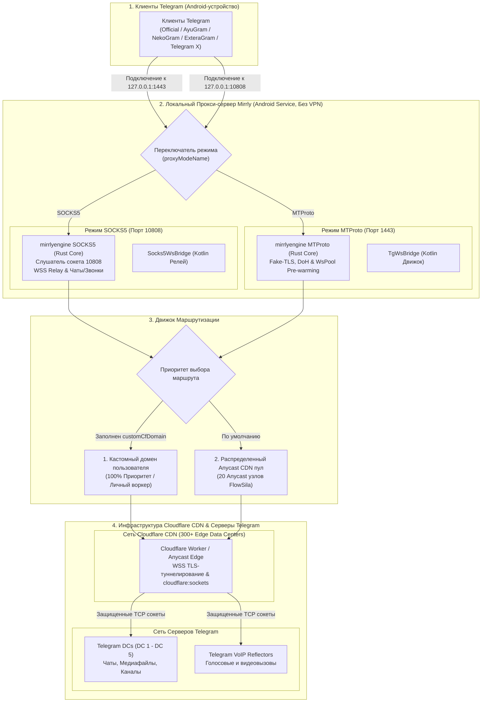
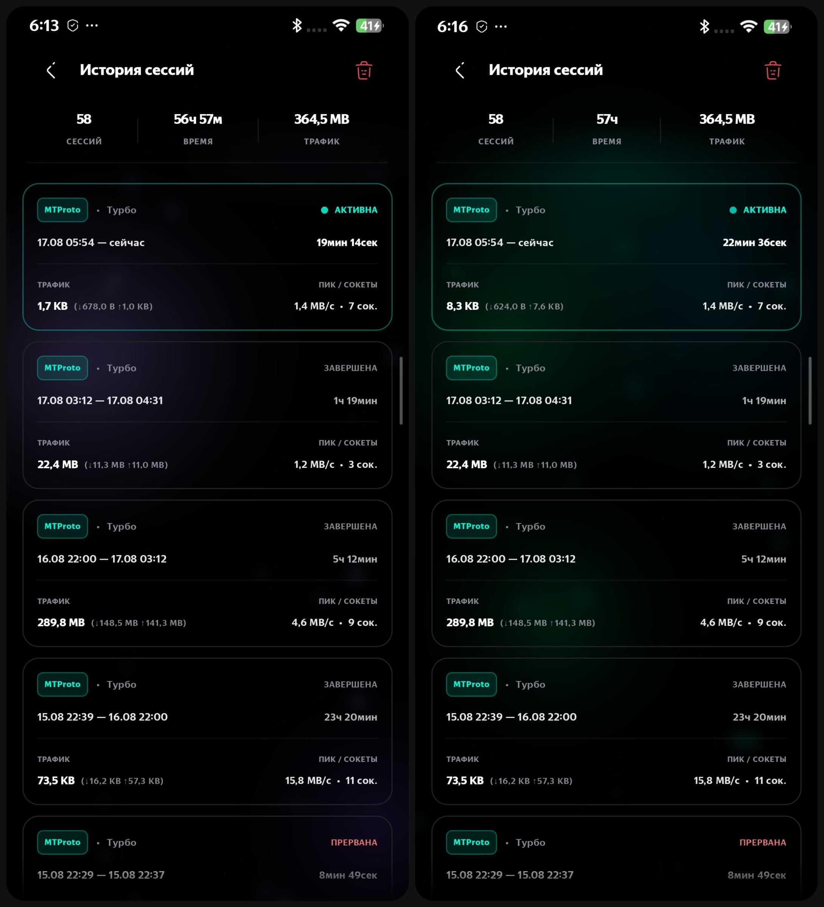

<div align="center">


# Mirrly TG Proxy для Android

**Локальный MTProto & SOCKS5 прокси-сервер на собственном движке Rust (mirrlyengine) с поддержкой FakeTLS и личных Cloudflare Worker для подключения Telegram без VPN**

[](https://developer.android.com)
[](https://kotlinlang.org)
[](https://developer.android.com/jetpack/compose)
[](mirrlyengine)
[](https://workers.cloudflare.com)
[](https://developer.android.com/ndk)
<br/>
[](https://github.com/joycecurcirt539-dot/Mirrly-TG-Proxy/releases)
[](https://github.com/joycecurcirt539-dot/Mirrly-TG-Proxy/releases)
[](https://github.com/joycecurcirt539-dot/Mirrly-TG-Proxy/stargazers)
[](https://github.com/joycecurcirt539-dot/Mirrly-TG-Proxy/issues)
[](https://github.com/joycecurcirt539-dot/Mirrly-TG-Proxy)
<br/>
[](https://t.me/WhyOkyHb)
[](#12-безопасность-и-условия-использования)
[](docs/cloudflare_worker.js)
<br/>
[](CHANGELOG.md)
[](TERMS_OF_USE.md)
[](LICENSE)

*Оптимизация маршрутизации трафика Telegram через собственный асинхронный нативный движок mirrlyengine на Rust, зашифрованные WebSocket-сессии Cloudflare и личные Cloudflare Worker. Работает локально в фоновом режиме без прав администратора и создания VPN-профиля.*

<br/>

<picture>
  <source media="(prefers-color-scheme: dark)" srcset="https://github.com/joycecurcirt539-dot/Mirrly-TG-Proxy/blob/output/github-contribution-grid-snake-dark.svg?raw=true">
  <source media="(prefers-color-scheme: light)" srcset="https://github.com/joycecurcirt539-dot/Mirrly-TG-Proxy/blob/output/github-contribution-grid-snake.svg?raw=true">
  
</picture>

---

</div>

## Оглавление

1. [Принцип работы](#1-принцип-работы)
2. [Личные Cloudflare Worker и Безопасность](#2-личные-cloudflare-worker-и-безопасность)
3. [Ключевые возможности](#3-ключевые-возможности)
4. [Архитектура системы](#4-архитектура-системы)
5. [Поддерживаемые клиенты Telegram](#5-поддерживаемые-клиенты-telegram)
6. [Интерфейс приложения](#6-интерфейс-приложения)
7. [Быстрый старт и установка](#7-быстрый-старт-и-установка)
8. [Конфигурация и параметры](#8-конфигурация-и-параметры)
9. [Сборка из исходного кода](#9-сборка-из-исходного-кода)
10. [График активности разработки](#10-график-активности-разработки)
11. [Динамика звезд репозитория](#11-динамика-звезд-репозитория)
12. [Безопасность и условия использования](#12-безопасность-и-условия-использования)
13. [Благодарности](#13-благодарности)

---

## 1. Принцип работы

Mirrly TG Proxy запускает на Android-устройстве высокопроизводительный локальный прокси-сервер на базе нативного Rust-движка **mirrlyengine** с двумя независимыми шлюзами:
* **MTProto Proxy (Порт 1443)**: нативный протокол с поддержкой маскировки FakeTLS (`ee` / `dd`), быстрым WSS-пулом сокетов (`WsPool`) и оптимизацией для мгновенной загрузки чатов, каналов и тяжелых медиафайлов.
* **SOCKS5 Proxy (Порт 10808)**: прозрачный TCP-релей для обхода блокировок голосовых и видеовызовов Telegram, работающий через WebSocket-туннель Anycast CDN.

Приложение инкапсулирует пакеты Telegram в зашифрованные HTTPS WebSocket-сессии (`wss://...`) и направляет их исключительно через глобальную сеть Cloudflare CDN (300+ Anycast дата-центров) или через личный Cloudflare Worker пользователя. Прямой TCP-доступ к Telegram DC полностью исключен для гарантии защиты от блокировок ТСПУ и анализа сетевых маршрутов.

### Преимущества архитектуры:
* **Собственное нативное ядро на Rust (`mirrlyengine`)**: обработка сетевых пакетов на скомпилированном машинном коде с неблокирующим вводом-выводом (Tokio runtime) устраняет задержки сборщика мусора (GC pauses) и минимизирует задержку.
* **Исключение прямого TCP-фоллбека**: весь трафик без исключений идет через защищенный CDN-слой, исключая раскрытие реальных IP-адресов Telegram дата-центров провайдерам.
* **Автономная работа через распределенный CDN-пул**: оба протокола функционируют «из коробки» на базе 20 Anycast-узлов без обязательной предварительной настройки сторонних серверов.
* **Поддержка протокола FakeTLS**: трафик маскируется под легитимные сессии TLS 1.3 к доверенным доменам, делая его неотличимым от обычного веб-серфинга.
* **Без системного VpnService**: работает как локальный сокет, не перехватывает трафик сторонних приложений и бережно расходует заряд аккумулятора.
* **Сквозное шифрование Telegram**: весь трафик защищен нативным шифрованием Telegram. Прокси выполняет транспортную роль и не имеет доступа к содержимому сообщений.

---

## 2. Cloudflare Worker: SOCKS5 Воркер по умолчанию и Личный Worker

Mirrly TG Proxy обеспечивает раздельное туннелирование трафика для двух протоколов:
* **MTProto (Чаты и Медиа)**: Трафик направляется через распределенный пул Anycast CDN FlowSila (20 Anycast-доменов).
* **SOCKS5 (Чаты, Медиа и Звонки)**: По умолчанию используется встроенный Cloudflare Worker разработчика (`mirrly-tg-proxy-worker.brawny-singer.workers.dev`), что позволяет SOCKS5 и аудио/видеозвонкам работать «из коробки» без дополнительных настроек.

> [!WARNING]
> **Ограничение лимитов на общем воркере разработчика**:
> Воркер разработчика является публичным и делит общую бесплатную квоту Cloudflare (100 000 запросов в день на всех пользователей).
> При высокой нагрузке или исчерпании лимитов SOCKS5-соединение может временно возвращать ошибку 429 (Too Many Requests).
> 
> **Решение**: Разверните собственный бесплатный Cloudflare Worker по встроенной инструкции в приложении (Настройки → «Инструкция по развертыванию» или файл [`docs/cloudflare_worker.js`](docs/cloudflare_worker.js)).

### Преимущества создания Личного Cloudflare Worker:
1. **100% Приватность и Контроль**: Трафик проходит исключительно через ваш личный аккаунт Cloudflare.
2. **Персональный Лимит 100 000 Запросов в День**: Персональная суточная квота, принадлежащая исключительно вам.
3. **Бесперебойные Звонки и Скорость**: Отсутствие конкуренции с другими пользователями гарантирует максимальную стабильность для голосовых и видеозвонков.
4. **Абсолютный приоритет**: При указании адреса личного воркера в Настройках приложение автоматически направляет трафик через него.

---

## 3. Ключевые возможности

* **Высокопроизводительное ядро на Rust (`mirrlyengine`)**:
  * Асинхронный многопоточный runtime на базе `tokio` (рабочие потоки `mirrlyengine-worker`).
  * Сборка с Link-Time Optimization (LTO) и стриппингом отладочной информации под 4 архитектуры: `arm64-v8a`, `armeabi-v7a`, `x86_64`, `x86`.
  * Zero-Copy передача сетевых буферов и полное отсутствие пауз сборщика мусора (GC).
* **Двойной шлюз маршрутизации (MTProto + SOCKS5)**:
  * **MTProto Proxy (Порт 1443)**: нативный движок с пулом сокетов `WsPool`, Fake-TLS маскировкой и быстрой загрузкой чатов.
  * **SOCKS5 Proxy (Порт 10808)**: высокоскоростной TCP-релей для передачи трафика чатов, медиафайлов и аудио/видеозвонков Telegram через WebSocket.
* **Поддержка протокола FakeTLS (`ee` / `dd` секреты)**:
  * Маскировка MTProto-соединений под валидные сессии TLS 1.3 (`ClientHello`, `ServerHello`, `ApplicationData`).
  * Полная невидимость для систем глубокого анализа пакетов (DPI).
  * Генерация случайных стойких ключей с префиксом `dd` в один клик.
* **Скоростной балансировщик Anycast (Fast Race & Latency Balancer)**:
  * Алгоритм гонки рукопожатий (RFC 8305 Happy Eyeballs) со ступенчатым стартом 25 мс и ультра-коротким таймаутом 450 мс (вместо 4–5 сек).
  * Мгновенный отклик: первый ответивший узел моментально передается Telegram без задержек при старте.
  * Формирование ранжированного списка серверов по времени отклика (RTT) и тихий фоновый замер 1 раз в 60 минут (расход всего 0.48% суточного лимита запросов).
* **Сетевой стек и DoH-клиент**:
  * Сквозная перешифровка пакетов в `MsgSplitter` (`client_dec -> plaintext -> upstream_enc`).
  * Встроенный DNS-over-HTTPS (DoH) клиент с параллельной гонкой запросов (Cloudflare, Google, Quad9, AdGuard).
* **Интерактивная инструкция по Cloudflare Worker**:
  * Полноэкранная встроенная вкладка с пошаговыми иллюстрированными руководствами для ПК и Смартфонов.
  * Копирование готового V8-скрипта воркера в один клик с вибрационным откликом и прямой переход в Cloudflare Dashboard.
* **Унифицированное WSS-туннелирование Cloudflare Worker**:
  * Единый протокол туннелирования `wss://$cfDomain/tcp?target=$dcIp:443` через `cloudflare:sockets` с поддержкой IPv6 в квадратных скобках `[::1]:port` и раздельных параметров `?host=...&port=...`.
* **Автоматическое переключение режимов в диалоге подключения**:
  * При нажатии на кнопку подключения MTProto или SOCKS5 в `TelegramConnectDialog` приложение автоматически переключает активный режим и перезапускает службу.
* **Оптимизация производительности (R8 & Baseline Profiles)**:
  * Настроен профиль компиляции `baseline-prof.txt` для AOT-ускорения холодного старта.
  * Агрессивные правила минификации R8 (`-optimizations`) для максимального сжатия байткода.
  * Потокобезопасный `AppLogger` и изоляция корутин сокетов с `SupervisorJob()`.
* **Профили производительности (Speed Presets)**: `Турбо` (16 сокетов / 2 МБ буфер), `Баланс` (8 сокетов / 256 КБ буфер), `Эко` (2 сокета / 32 КБ буфер).
* **Мгновенная отдача (TCP_NODELAY)**: отключение алгоритма Нагла устраняет сетевые задержки (40–200 мс).
* **Умный таймер сна (Sleep Timer)**: автовыключение прокси по интервалу (от 15 мин до 6 ч) с уведомлениями и продлением в один клик.
* **Встроенный установщик обновлений**: валидация целостности по SHA-256 и верификация подписи разработчика в нативном NDK-слое (C++ `SignatureVerifier`).
* **Человекопонятный журнал событий (`HumanLogTranslator`)**: отображение понятных событий Rust-ядра, рукопожатий и статусов подключения.

---

## 4. Архитектура системы



---

## 5. Поддерживаемые клиенты Telegram

Приложение автоматически сканирует установленные пакеты и позволяет подключить прокси в один клик:

* **Официальные клиенты**: Telegram, Telegram X
* **Расширенные клиенты**: AyuGram, NekoGram, Nagram, ExteraGram, Plus Messenger
* **Сторонние клиенты**: Cherrygram, Nicegram, iMe Messenger, Telegraph, MDGram, Dahl, Litegram, Nullgram, ForkClient, BifToGram

---

## 6. Интерфейс приложения

<div align="center">

| Главный экран | Таймер сна | История сессий |
| :-: | :-: | :-: |
|  |  |  |

<br />

| Настройки (1 часть) | Настройки (2 часть) | Логи | Экран обновлений |
| :-: | :-: | :-: | :-: |
|  |  |  |  |

</div>

---

## 7. Быстрый старт и установка

1. Скачайте официальный установочный пакет со страницы [Релизы GitHub](https://github.com/joycecurcirt539-dot/Mirrly-TG-Proxy/releases):
   * `app-universal-release.apk` — универсальная сборка под любое устройство (содержит библиотеки для всех 4 архитектур процессоров).
   * `app-arm64-v8a-release.apk` — оптимизированная компактная сборка для современных 64-битных смартфонов.
2. Установите APK на устройство под управлением Android 8.0 или новее.
3. Запустите **Mirrly TG Proxy** и нажмите центральную кнопку включения.
4. Нажмите кнопку **«В Telegram»** для автоматического применения настроек в выбранном мессенджере.
5. Приложение автоматически туннелирует трафик через распределенный пул Anycast CDN FlowSila без прямого подключения к Telegram DC.
6. При необходимости вы можете указать свой личный домен в поле «Кастомный домен» в Настройках.

---

## 8. Конфигурация и параметры

| Параметр | По умолчанию | Описание |
| :--- | :--- | :--- |
| `proxyModeName` | `MTPROTO` | Текущий активный режим работы прокси (`MTPROTO` или `SOCKS5`) |
| `bindHost` / `bindPort` | `127.0.0.1:1443` | Локальный IP-адрес и TCP-порт для MTProto |
| `socks5Port` | `10808` | Локальный TCP-порт для SOCKS5 |
| `secretHex` | `dd000000...` | Секретный ключ MTProto (поддерживаются префиксы FakeTLS `dd` и `ee`) |
| `customCfDomain` | `""` | Персональный кастомный Cloudflare домен пользователя (опционально) |
| `speedPreset` | `BALANCED` | Профиль скорости: `TURBO` (2 МБ / 16 сокетов), `BALANCED` (256 КБ / 8 сокетов), `ECO` (32 КБ / 2 сокета) |
| `tcpNoDelay` | `true` | Мгновенная отправка сетевых пакетов без задержек (TCP_NODELAY) |
| `poolSize` | `8` | Количество удерживаемых открытыми WSS-сокетов на каждый дата-центр |
| `autostartOnBoot` | `true` | Автоматический запуск службы при загрузке операционной системы |
| `disableAnimations` | `false` | Отключение визуальных эффектов для снижения энергопотребления |

---

## 9. Сборка из исходного кода

### Требования:
* Android SDK (API 35, Build-Tools 35.0.0)
* Android NDK (версия 25+)
* Rust toolchain (`cargo`, `rustup target add aarch64-linux-android armv7-linux-androideabi x86_64-linux-android i686-linux-android`) & `cargo-ndk`
* JDK 17+

```bash
# Клонирование репозитория
git clone https://github.com/joycecurcirt539-dot/Mirrly-TG-Proxy.git
cd Mirrly-TG-Proxy

# Сборка оптимизированных релизных пакетов
./gradlew assembleRelease
```

Собранные установочные пакеты будут доступны по пути: `app/build/outputs/apk/release/`.

---

## 10. График активности разработки

<div align="center">

[](https://github.com/joycecurcirt539-dot/Mirrly-TG-Proxy)

</div>

---

## 11. Динамика звезд репозитория

<div align="center">

<a href="https://www.star-history.com/?repos=joycecurcirt539-dot%2FMirrly-TG-Proxy&type=date&legend=top-left">
 <picture>
   <source media="(prefers-color-scheme: dark)" srcset="https://api.star-history.com/chart?repos=joycecurcirt539-dot/Mirrly-TG-Proxy&type=date&theme=dark&legend=top-left&sealed_token=2ZxdQVXYtszPQ2_C8iS9hYFI8zb-495pG47H9KSmQnTviNfwec-JUTZdeRmiaKkKmwYIJtF-i3x7BFk051JjPV3k1ensh6WvgBtwCmxaOybEdxs0ZFVSwdhZA0lCRQriwItHEtGZthEt_5HPt-BnP6JZcgNJkf69g2MAvm6KiC_6E8vZ1g7q8BLEmeFm" />
   <source media="(prefers-color-scheme: light)" srcset="https://api.star-history.com/chart?repos=joycecurcirt539-dot/Mirrly-TG-Proxy&type=date&legend=top-left&sealed_token=2ZxdQVXYtszPQ2_C8iS9hYFI8zb-495pG47H9KSmQnTviNfwec-JUTZdeRmiaKkKmwYIJtF-i3x7BFk051JjPV3k1ensh6WvgBtwCmxaOybEdxs0ZFVSwdhZA0lCRQriwItHEtGZthEt_5HPt-BnP6JZcgNJkf69g2MAvm6KiC_6E8vZ1g7q8BLEmeFm" />
   
 </picture>
</a>

</div>

---

## 12. Безопасность и условия использования

* **Отсутствие сбора данных**: приложение не содержит встроенной аналитики, телеметрии, рекламных SDK и не собирает пользовательские данные.
* **Криптографическая верификация**: встроенный механизм обновлений проверяет совпадение контрольных сумм SHA-256 и отпечатка ключа подписи разработчика перед установкой новых версий.
* **История изменений**: подробный список нововведений всех версий приведен в документе [CHANGELOG.md](CHANGELOG.md).
* **Лицензирование**: исходный код распространяется под лицензией [GNU General Public License v3 (GPLv3)](LICENSE).
* **Пользовательское соглашение**: правила распространения сборок и ограничения описаны в документе [TERMS_OF_USE.md](TERMS_OF_USE.md).

---

## 13. Благодарности

Отдельная благодарность разработчикам за их вклад, идеи и исходные наработки:

* **[Flowseal](https://github.com/Flowseal)** — за оригинальный проект [tg-ws-proxy](https://github.com/Flowseal/tg-ws-proxy), концепция, логика туннелирования и наработки которого легли в основу идеи проекта.
* **[amurcanov](https://github.com/amurcanov)** — за реализацию и наработки оригинального Rust-движка прокси [tg-ws-proxy-android](https://github.com/amurcanov/tg-ws-proxy-android), вдохновившего развитие архитектуры нативного ядра.

  ## Огромная благодарность самым лучшим людям на земле за помощь в развитии проекта, а именно за поиск багов, ошибок и проблем! Вы лучшие!)
1) Grovymon
2) zzzxxx888207-design
3) VikKalm
4) Astimir Meikulov

У меня есть свой телеграм канал) там иногда, может быть будет чтото полезное
