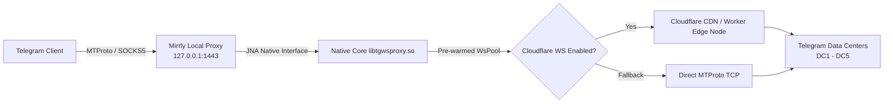

<div align="center">


# 🛡️ Mirrly TG Proxy for Android

**High-Performance MTProto & Cloudflare WebSocket Proxy Core for Telegram**

[-3DDC84?style=for-the-badge&logo=android&logoColor=white)](https://developer.android.com)
[](https://kotlinlang.org)
[](https://developer.android.com/jetpack/compose)
[](https://www.rust-lang.org)
[](https://github.com/joycecurcirt539-dot/Mirrly-TG-Proxy/releases/tag/v1.0.0)
[](LICENSE)

*⚡ Bypasses censorship, ISP throttling, and DPI blocks using local MTProto proxying, pre-warmed socket pools, and Cloudflare WebSocket CDN tunneling.*

---

[📖 English Description](#english) | [📖 Описание на русском](#russian)

---

</div>

<a name="english"></a>
## 🚀 Features & Technical Highlights

- ⚡ **Native High-Speed Engine (`libtgwsproxy`)**: Powered by a compiled Rust native core loaded directly via JNA (Java Native Access) for zero-overhead packet routing.
- 🌐 **Cloudflare WebSocket Tunneling**: Seamlessly tunnels MTProto traffic through Cloudflare Workers and CDN edge nodes to obscure proxy traffic from DPI filters.
- 🔄 **0ms Latency Pre-warmed Socket Pool (`WsPool`)**: Maintains up to 16 pre-warmed WebSocket connections per Telegram Data Center (DC1–DC5), eliminating handshake delays.
- 🎨 **Sleek AMOLED Pure Black UI**: Built with 100% Jetpack Compose featuring a glowing neon power indicator, smooth radial pulse animations, and AMOLED true black theme (`#000000`).
- ⚡ **Quick Settings Tile**: Control your proxy state directly from the Android status bar/notification shade with a single tap.
- 📱 **One-Tap Telegram Integration**: Automatically detects 17+ installed Telegram clients (Official, AyuGram, ExteraGram, Plus, Telegraph, NekoGram, Cherrygram, Nicegram, iMe, etc.) and routes connections instantaneously.
- 🔄 **Auto-Reconnect & Keep-Alive**: Includes an intelligent `NetworkChangeObserver` for seamless Wi-Fi ↔ Mobile Data handover, CPU `WakeLock` keep-alive (25-min auto-refresh cycle), and `BootReceiver` for optional start on system boot.
- 📊 **Real-Time Telemetry & Log Translator**: Features live download/upload speed counters (`B/s`, `KB/s`, `MB/s`), total traffic meters, active connection counters, and an in-app log viewer with human-translated messages.

---

<a name="russian"></a>
## 🚀 Описание и ключевые возможности (Russian)

**Mirrly TG Proxy** — это высокопроизводительный локальный прокси-сервер для Android, созданный для обхода блокировок, замедлений и DPI-фильтрации Telegram со стороны провайдеров.

- **Нативный движок на Rust (`libtgwsproxy.so`)**: Обработка трафика происходит на максимальной скорости через скомпилированную C/Rust библиотеку с прямым связыванием JNA.
- **Туннелирование через Cloudflare WebSocket**: Обходит глухую блокировку за счет туннелирования MTProto пакетов через Cloudflare CDN и пользовательские Cloudflare Workers.
- **Пул прогретых сокетов (0 мс задержка)**: Поддерживает постоянный бассейн активных WebSocket-соединений к каждому дата-центру Telegram (DC1-DC5), гарантируя моментальную доставку сообщений.
- **Премиальный AMOLED интерфейс**: Разработан на Jetpack Compose в стиле True Black (`#000000`) с динамической пульсирующей неоновой кнопкой питания и микро-анимациями.
- **Плитка быстрого доступа (Quick Settings Tile)**: Включение и отключение прокси в один клик прямо из шторки уведомлений Android.
- **Поддержка 17+ Telegram клиентов**: Автоматическое определение установленных мессенджеров (AyuGram, ExteraGram, Plus, NekoGram, Cherrygram, Nicegram, iMe и др.) и моментальная передача прокси-ссылки (`tg://proxy?...`).
- **Фоновая стабильность и автопереподключение**: Умный отслеживатель смены сети (Wi-Fi ↔ Мобильный интернет), энергоэффективный `WakeLock` с автоматическим обновлением и автозапуск при загрузке устройства.
- **Живая телеметрия и переводчик логов**: Мониторинг скорости входящего и исходящего трафика в реальном времени, подсчет активных сокетов и встроенный просмотрщик логов с переводом технических терминов на понятный язык.

---

## 🏗️ Architecture & Traffic Flow



---

## 📲 Supported Telegram Clients

Mirrly TG Proxy automatically detects and supports one-tap proxy configuration for:

- ✈️ **Official Telegram / Telegram X**
- 💜 **AyuGram Desktop & Mobile**
- 🚀 **ExteraGram**
- ➕ **Plus Messenger**
- 📰 **Telegraph**
- 🐱 **NekoGram / Nagram**
- 🍒 **Cherrygram**
- 💎 **Nicegram**
- 🤖 **iMe Messenger**
- 🛡️ **Nullgram / MDGram / ForkClient / Dahl / Litegram / BifToGram**

---

## 🛠️ Configuration Options

| Setting | Default Value | Description |
| :--- | :--- | :--- |
| `Bind Host` | `127.0.0.1` | Local loopback address for the proxy server |
| `Bind Port` | `1443` | Local port listened to by Telegram clients |
| `Secret Hex` | `ee0000...` | MTProto secret prefix (`dd...` obfuscated secret) |
| `Cloudflare Proxy` | `Enabled (true)` | Route MTProto packets over Cloudflare WebSocket |
| `Custom CF Domain` | `""` (Default) | Optional personal Cloudflare Worker domain |
| `Socket Pool Size` | `8` (Range: 2–16) | Number of pre-warmed WebSocket sockets per DC |
| `Autostart on Boot` | `Disabled (false)` | Automatically launch proxy when device boots |
| `Auto Reconnect` | `Enabled (true)` | Re-bind proxy socket seamlessly upon network switch |

---

## 🔧 Building from Source

### Prerequisites
- **JDK 17** or higher
- **Android SDK** (API Level 34)
- **Gradle 8.x**

### Command Line Build

1. Clone the repository:
   ```bash
   git clone https://github.com/your-username/Mirrly-TG-Proxy.git
   cd Mirrly-TG-Proxy
   ```

2. Build Debug APK:
   ```bash
   # Windows
   .\gradlew.bat assembleDebug

   # Linux / macOS
   ./gradlew assembleDebug
   ```

3. Build Release APK:
   ```bash
   # Windows
   .\gradlew.bat assembleRelease

   # Linux / macOS
   ./gradlew assembleRelease
   ```

Outputs will be generated in `app/build/outputs/apk/`.

---

## 🧰 Tech Stack

- **Language**: Kotlin (100% Modern Kotlin Coroutines & Flow)
- **UI Framework**: Jetpack Compose + Material 3
- **Native Interop**: Java Native Access (JNA) + C/Rust shared libraries (`libtgwsproxy.so`)
- **Architecture**: Clean Modular Architecture (`:app` & `:core`)
- **Background Engine**: Android Foreground Service, Quick Settings Tile Service, Broadcast Receivers

---

## 📄 License & Disclaimer

This project is open-source under the [MIT License](LICENSE). 

*Disclaimer: Mirrly TG Proxy is an independent open-source utility for personal proxy routing and privacy protection. It is not officially affiliated with Telegram FZ-LLC or Cloudflare, Inc.*
