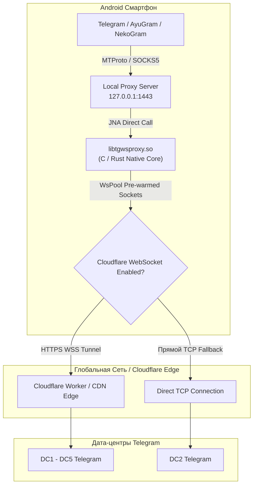

<div align="center">


# Mirrly TG Proxy для Android

**Нативный высокопроизводительный MTProto & Cloudflare WebSocket прокси-сервер для локальной фильтрации трафика и оптимизации соединения Telegram**

[-3DDC84?style=for-the-badge&logo=android&logoColor=white)](https://developer.android.com)
[](https://kotlinlang.org)
[](https://developer.android.com/jetpack/compose)
[](https://www.rust-lang.org)
[](https://github.com/joycecurcirt539-dot/Mirrly-TG-Proxy/releases)
[](LICENSE)

*Оптимизация сетевых маршрутов, снижение задержек соединения и туннелирование трафика MTProto через промежуточные WebSocket CDN-узлы. Работает на нативном C/Rust ядре с пулом прогретых сокетов WsPool.*

---

</div>

## 📌 Оглавление

1. [О проекте и Принцип работы](#1-о-проекте-и-принцип-работы)
2. [Ключевые возможности](#2-ключевые-возможности)
3. [Архитектура системы](#3-архитектура-системы)
4. [Поддерживаемые клиенты Telegram](#4-поддерживаемые-клиенты-telegram)
5. [Скриншоты интерфейса](#5-скриншоты-интерфейса)
6. [Быстрый старт и Установка](#6-быстрый-старт-и-установка)
7. [Конфигурация и Сборка](#7-конфигурация-и-сборка)
8. [Безопасность, Дисклеймер и Лицензия](#8-безопасность-дисклеймер-и-лицензия)

---

## 1. О проекте и Принцип работы

**Mirrly TG Proxy** разворачивает изолированный локальный прокси-сервер на адресе `127.0.0.1:1443` на Android-устройстве. Он принимает MTProto-трафик от клиентов Telegram и прозрачно туннелирует его через зашифрованные WebSocket-соединения к CDN-узлам Cloudflare.

### 🛡️ Какую проблему решает:
- **Стабилизация соединения с DC1-DC5**: Прокси оптимизирует маршрутизацию трафика к дата-центрам Telegram через распределенные узлы Cloudflare CDN, снижая процент потерь пакетов.
- **Шифрование и инкапсуляция трафика**: MTProto-пакеты инкапсулируются в стандартизированные защищенные HTTPS WebSocket-сессии (WSS), предотвращая сетевые помехи и нестабильность соединения.
- **Без VPN-сервиса**: Работает строго локально на `127.0.0.1:1443`. Не требует прав VpnService, не перехватывает трафик других приложений и не расходует лишний заряд батареи.

---

## 2. Ключевые возможности

- **Нативное ядро C/Rust + JNA**: Высокая скорость маршрутизации пакетов без overhead виртуальной машины Java.
- **Прогретые сокеты WsPool**: Постоянно поддерживает активные WebSocket-соединения к дата-центрам Telegram (DC1-DC5), устраняя задержку первичного рукопожатия (Handshake).
- **Поддержка кастомных Cloudflare Worker доменов**: Возможность привязать свой персональный домен Worker (например, `my-proxy.subdomain.workers.dev`).
- **Battery Lifecycle Guard**: Автоматически приостанавливает сенсоры и отрисовку при сворачивании для 0% расхода батареи в фоне.
- **Интеграция с Android Quick Settings Tile**: Включение и выключение прокси в 1 клик из шторки уведомлений Android.
- **Живая телеметрия и наглядный график**: График активности сокетов WsPool (120 FPS Liquid Wave Engine) и переводчик технических логов.

---

## 3. Архитектура системы



---

## 4. Поддерживаемые клиенты Telegram (17+ клиентов)

Приложение автоматически сканирует установленные клиенты и позволяет привязать прокси в 1 клик:

- **Официальные**: Telegram Official, Telegram X
- **Популярные форки**: AyuGram, NekoGram, Nagram, ExteraGram, Plus Messenger
- **Модификации**: Cherrygram, Nicegram, iMe Messenger, Telegraph, MDGram, Dahl, Litegram, Nullgram, ForkClient, BifToGram

---

## 5. Скриншоты интерфейса

<div align="center">

| Главный экран | Настройки | Логи работы |
| :-: | :-: | :-: |
|  |  |  |

<br />

| Проверка пинга и скорости в Telegram |
| :-: |
|  |

</div>

---

## 6. Быстрый старт и Установка

1. Скачайте актуальный файл `app-release.apk` со страницы [Релизы GitHub](https://github.com/joycecurcirt539-dot/Mirrly-TG-Proxy/releases).
2. Установите APK и запустите **Mirrly TG Proxy**.
3. Нажмите центральную кнопку включения.
4. Нажмите **«В Telegram»** и выберите ваш клиент для быстрой привязки.

---

## 7. Конфигурация и Сборка

### Основные параметры конфигурации:
| Параметр | Значение по умолчанию | Описание |
| :--- | :--- | :--- |
| `bindHost` / `bindPort` | `127.0.0.1:1443` | Локальный интерфейс и порт прокси |
| `secretHex` | `ee000000000000000000000000000000` | Секрет MTProto-соединения |
| `cfProxyEnabled` | `true` | Использование туннелирования Cloudflare |
| `customCfDomain` | `""` | Персональный домен Cloudflare Worker |
| `poolSize` | `8` (от 2 до 16) | Размер пула сокетов WsPool на один DC |
| `autostartOnBoot` | `false` | Автозапуск при загрузке устройства |

### Сборка из исходников:
```bash
# Клонирование репозитория
git clone https://github.com/joycecurcirt539-dot/Mirrly-TG-Proxy.git
cd Mirrly-TG-Proxy

# Сборка Release APK
.\gradlew.bat assembleRelease
```

---

## 8. Безопасность, Дисклеймер и Лицензия

- **100% Открытый код**: Приложение не собирает персональные данные, сообщения или историю посещений. Работает строго локально на `127.0.0.1:1443`.
- **Благодарности**: Выражаем благодарность **Flowseal** (автору tg-ws-proxy) и разработчикам библиотеки **JNA**.

### ⚠️ Отказ от ответственности (Legal Disclaimer)

Данный проект разработан исключительно в **учебно-исследовательских целях (Educational & Research Purpose)** для изучения механизмов туннелирования трафика MTProto поверх WebSocket и анализа параметров сетевой связности.

- **Отсутствие гарантий**: Программное обеспечение предоставляется по принципу «КАК ЕСТЬ» («AS IS»), без каких-либо явных или подразумеваемых гарантий.
- **Ограничение ответственности**: Авторы и правообладатели не несут ответственности за любые прямые или косвенные последствия использования данного ПО третьими лицами, а также за возможный ущерб или нарушение локального законодательства.
- **Соблюдение законов**: Пользователи самостоятельно несут полную ответственность за соблюдение законодательства своей страны или юрисдикции при использовании данного инструмента.
- **Целевое назначение**: Проект не оказывает коммерческих услуг, не является сервисом обхода ограничений и не призывает к нарушению действующего законодательства.

- **Лицензия**: Проект распространяется под открытой лицензией [Apache License 2.0](LICENSE).

