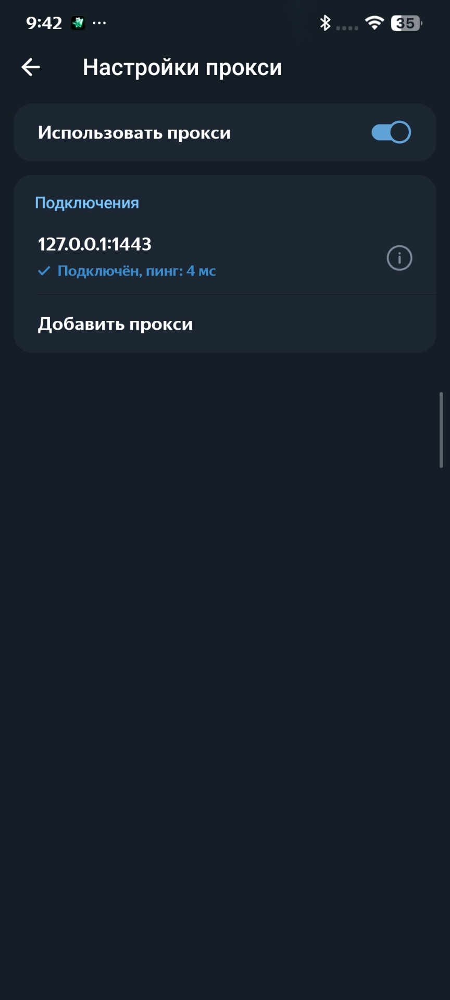

<div align="center">


# Mirrly TG Proxy для Android

**Локальный MTProto и WebSocket прокси-сервер для прямого подключения Telegram без VPN**

[-3DDC84?style=for-the-badge&logo=android&logoColor=white)](https://developer.android.com)
[](https://kotlinlang.org)
[](https://developer.android.com/jetpack/compose)
[](https://github.com/joycecurcirt539-dot/Mirrly-TG-Proxy/releases)
[](https://github.com/joycecurcirt539-dot/Mirrly-TG-Proxy/releases)
[](https://github.com/joycecurcirt539-dot/Mirrly-TG-Proxy/stargazers)
[](CHANGELOG.md)
[](LICENSE)

*Оптимизация маршрутизации трафика к серверам Telegram через защищенные WebSocket-соединения Cloudflare. Работает локально в фоновом режиме без прав администратора и создания VPN-профиля.*

---

</div>

## Оглавление

1. [Принцип работы](#1-принцип-работы)
2. [Ключевые возможности](#2-ключевые-возможности)
3. [Архитектура системы](#3-архитектура-системы)
4. [Поддерживаемые клиенты Telegram](#4-поддерживаемые-клиенты-telegram)
5. [Интерфейс приложения](#5-интерфейс-приложения)
6. [Быстрый старт и установка](#6-быстрый-старт-и-установка)
7. [Конфигурация и параметры](#7-конфигурация-и-параметры)
8. [Сборка из исходного кода](#8-сборка-из-исходного-кода)
9. [Безопасность и условия использования](#9-безопасность-и-условия-использования)

---

## 1. Принцип работы

Mirrly TG Proxy запускает на Android-устройстве локальный прокси-сервер на адресе `127.0.0.1:1443`. Приложение принимает MTProto-трафик от клиента Telegram, инкапсулирует его в HTTPS WebSocket-сессии (WSS) и направляет к инфраструктуре Cloudflare, обеспечивая прямое и стабильное соединение с дата-центрами мессенджера (DC1–DC5).

### Преимущества архитектуры:
* **Без системного VpnService**: приложение работает как локальный сетевой сокет, не перехватывает трафик других программ, не требует системных VPN-разрешений и не создает избыточной нагрузки на процессор и аккумулятор.
* **Сквозное шифрование MTProto**: весь трафик Telegram остается защищенным стандартным сквозным шифрованием. Прокси-сервер выполняет только транспортную роль и не имеет доступа к содержимому сообщений и ключам шифрования.
* **Обход сетевых ограничений**: инкапсуляция в стандартный WSS/HTTPS-трафик предотвращает избирательную блокировку пакетов Telegram на уровне сетевых провайдеров.

---

## 2. Ключевые возможности

* **Двойной шлюз маршрутизации (MTProto + SOCKS5)**:
  * **MTProto Proxy (Порт 1443, Рекомендуется)**: максимальная скорость загрузки, пулы сокетов WsPool, буфер 2 МБ, Fake-TLS маскировка для чатов и 4K-медиа.
  * **SOCKS5 Proxy (Порт 10808, Для звонков)**: поддержка обхода блокировок аудио- и видеозвонков через TCP VoIP туннель к рефлекторам Telegram.
* **Технология предварительно открытых сокетов (WsPool)**: постоянное удержание пула горячих WSS-соединений к дата-центрам Telegram устраняет задержку сетевого рукопожатия при отправке и получении сообщений.
* **Умный резервный канал (Smart Fast-Fail Fallback v1.0.8)**: быстрый 2.5-секундный таймаут переключения на прямой TCP при сбоях WSS предотвращает зависание интерфейса при фильтрации ТСПУ.
* **Профили производительности (Speed Presets)**:
  * **Турбо**: 16 сокетов на дата-центр, сетевой буфер 2 МБ для параллельной загрузки тяжелых медиафайлов и видеопотоков 4K на каналах до 1 Гбит/с.
  * **Баланс**: 8 сокетов на дата-центр, буфер 256 КБ — оптимальный баланс скорости и энергопотребления для повседневной работы.
  * **Эко**: 2 сокета на дата-центр, буфер 32 КБ — минимальный расход оперативной памяти и заряда батареи.
* **Мгновенная отдача (TCP_NODELAY)**: отключение алгоритма Нагла устраняет искусственные задержки буферизации пакетов (40–200 мс).
* **Умный таймер сна (Sleep Timer)**: настройка автоматического выключения прокси через заданный интервал (от 15 минут до 6 часов) с интерактивными предупреждениями в шторке уведомлений и возможностью продления в один клик.
* **История сессий и статистика**: учет суммарного времени работы, объемов входящего/исходящего трафика, пиковой скорости и детальный журнал последних 100 сессий.
* **Автоматическое восстановление сети**: отслеживание переключения интерфейсов (Wi-Fi ↔ Мобильная сеть) с мгновенной очисткой устаревших сокетов и упреждающим прогревом пула.
* **Встроенный установщик обновлений**: прямая загрузка релизов внутри приложения с автоматической проверкой целостности по контрольным суммам SHA-256 и нативной верификацией подписи разработчика (C++ NDK SignatureVerifier).
* **Режим скрытия интерфейса (Stealth UI)**: возможность отключения видимости элементов управления на главном экране.
* **Плитка быстрых настроек (Quick Settings Tile)**: запуск и остановка прокси в одно касание из шторки Android.
* **Поддержка собственных доменов**: возможность указания персонального Cloudflare Worker для независимой маршрутизации.

---

## 3. Архитектура системы

```mermaid
flowchart TD
    subgraph AndroidDevice ["Android-устройство (Без VPN)"]
        TGClient["Клиент Telegram\n(Official / AyuGram / NekoGram)"]
        MTProtoLocal["Локальный MTProto\n127.0.0.1:1443"]
        SocksLocal["Локальный SOCKS5 (Звонки)\n127.0.0.1:10808"]
        PoolMgr{"Маршрутизация WsPool & Fallback"}
        
        TGClient -->|Чаты / Медиа| MTProtoLocal
        TGClient -->|Звонки / Данные| SocksLocal
        MTProtoLocal --> PoolMgr
        SocksLocal --> PoolMgr
    end

    subgraph Internet ["Сеть Cloudflare CDN"]
        PoolMgr -->|Основной канал: HTTPS WSS| CFWorker["Cloudflare Worker / Edge CDN"]
    end

    subgraph DirectFallback ["Резервный канал (v1.0.8)"]
        PoolMgr -.->|Smart Fast-Fail TCP (2.5с)| DirectTCP["Прямое TCP-соединение"]
    end

    subgraph TelegramDCs ["Инфраструктура Telegram"]
        CFWorker --> DC1["DC1 - DC5 Telegram (Чаты)"]
        CFWorker --> VoIPReflectors["Telegram VoIP Reflectors (Звонки)"]
        DirectTCP -.-> DC1
        DirectTCP -.-> VoIPReflectors
    end
```

---

## 4. Поддерживаемые клиенты Telegram

Приложение автоматически сканирует установленные пакеты и позволяет подключить прокси в один клик:

* **Официальные клиенты**: Telegram, Telegram X
* **Расширенные клиенты**: AyuGram, NekoGram, Nagram, ExteraGram, Plus Messenger
* **Сторонние клиенты**: Cherrygram, Nicegram, iMe Messenger, Telegraph, MDGram, Dahl, Litegram, Nullgram, ForkClient, BifToGram

---

## 5. Интерфейс приложения

<div align="center">

| Главный экран | Таймер сна | История сессий (Временный интерфейс) |
| :-: | :-: | :-: |
|  |  |  |

<br />

| Настройки (1 часть) | Настройки (2 часть) | Журнал событий |
| :-: | :-: | :-: |
|  |  |  |

<br />

| Проверка задержки (Ping) в Telegram |
| :-: |
|  |

</div>

---

## 6. Быстрый старт и установка

1. Скачайте официальный установочный пакет `app-release.apk` со страницы [Релизы GitHub](https://github.com/joycecurcirt539-dot/Mirrly-TG-Proxy/releases).
2. Установите APK на устройство под управлением Android 8.0 или новее.
3. Запустите **Mirrly TG Proxy** и нажмите центральную кнопку включения.
4. Нажмите кнопку **«В Telegram»** и выберите установленный мессенджер для применения настроек.

---

## 7. Конфигурация и параметры

| Параметр | По умолчанию | Описание |
| :--- | :--- | :--- |
| `bindHost` / `bindPort` | `127.0.0.1:1443` | Локальный IP-адрес и TCP-порт для входящих подключений |
| `secretHex` | `ee000000...` | Секретный ключ MTProto (поддерживаются режимы стандартный `ee` и Fake TLS `dd`) |
| `speedPreset` | `BALANCED` | Профиль производительности: `TURBO` (2 МБ / 16 сокетов), `BALANCED` (256 КБ / 8 сокетов), `ECO` (32 КБ / 2 сокета) |
| `tcpNoDelay` | `true` | Немедленная отправка сетевых пакетов без ожидания заполнения буфера (TCP_NODELAY) |
| `customCfDomain` | `""` | Персональный домен Cloudflare Worker (если пусто — используется встроенный маршрут) |
| `poolSize` | `8` | Количество удерживаемых открытыми WSS-сокетов на каждый дата-центр |
| `autostartOnBoot` | `false` | Автоматический запуск службы при загрузке операционной системы |
| `fallbackDirectTcp` | `true` | Резервное прямое TCP-подключение при сбоях WSS-туннеля |
| `disableAnimations` | `false` | Отключение фоновых визуальных эффектов для снижения энергопотребления |

---

## 8. Сборка из исходного кода

### Требования:
* Android SDK (API 34, Build-Tools 34.0.0)
* Android NDK (версия 25+)
* JDK 17+

```bash
# Клонирование репозитория
git clone https://github.com/joycecurcirt539-dot/Mirrly-TG-Proxy.git
cd Mirrly-TG-Proxy

# Сборка оптимизированного релизного пакета
./gradlew assembleRelease
```

Собранный файл будет доступен по пути: `app/build/outputs/apk/release/app-release.apk`.

---

## 9. Безопасность и условия использования

* **Отсутствие сбора данных**: приложение не содержит встроенной аналитики, телеметрии, рекламных SDK и не собирает пользовательские данные.
* **Криптографическая верификация**: встроенный механизм обновлений проверяет совпадение контрольных сумм SHA-256 и отпечатка ключа подписи разработчика перед установкой любых новых версий.
* **История изменений**: подробный список нововведений всех версий приведен в документе [CHANGELOG.md](CHANGELOG.md).
* **Лицензирование**: исходный код распространяется под лицензией [GNU General Public License v3 (GPLv3)](LICENSE).
* **Пользовательское соглашение**: правила распространения сборок и ограничения описаны в документе [TERMS_OF_USE.md](TERMS_OF_USE.md).
