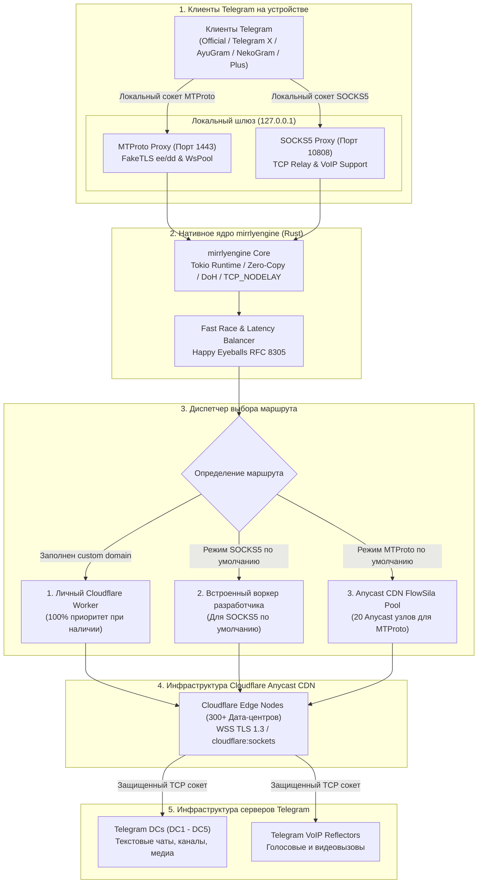

<div align="center">


# Mirrly TG Proxy для Android

**Локальный MTProto и SOCKS5 прокси-сервер на нативном движке Rust (mirrlyengine) с поддержкой FakeTLS и Cloudflare Worker для стабильной работы Telegram без использования системного VPN**

## Планируется в будущем релиз в гугл плей, в ближайшем будущем создам аккаунт разработчика, и в последующем займусь набором верифицированных разработчиков/тестировщиков для приложения! Не разобрался пока со всеми нюансами разбираюсь и изучаю, очень надеюсь что релиз состоится!
## ВАЖНО Mirrly TG Proxy всегда будет бесплатным, в нем никогда не будетт рекламы, но я удалю увтоустановщик перед публикацией релиза, я дулаю все ссылки на донат мне, и удалю все что будет мешать релизу! Самое важное, в будущем будет много полезных приложений для андроид но Mirrly TG Proxy останется у меня в сердечке навсегда, и обновления останутся навсегда!

[](https://developer.android.com)
[](https://kotlinlang.org)
[](https://developer.android.com/jetpack/compose)
[](mirrlyengine)
[](https://workers.cloudflare.com)
[](https://developer.android.com/ndk)
<br/>
[](https://github.com/joycecurcirt539-dot/Mirrly-TG-Proxy/releases)
[](https://github.com/joycecurcirt539-dot/Mirrly-TG-Proxy/releases)
[](https://github.com/joycecurcirt539-dot/Mirrly-TG-Proxy/stargazers)
[](https://github.com/joycecurcirt539-dot/Mirrly-TG-Proxy/issues)
[](https://github.com/joycecurcirt539-dot/Mirrly-TG-Proxy)
<br/>
[](https://t.me/WhyOkyHb)
[](#14-безопасность-и-условия-использования)
[](docs/cloudflare_worker.js)
<br/>
[](CHANGELOG.md)
[](TERMS_OF_USE.md)
[](LICENSE)

*Маршрутизация и маскировка трафика Telegram через асинхронное нативное ядро mirrlyengine на Rust, защищенные сессии WebSocket сети Cloudflare Anycast CDN и персональные Cloudflare Workers. Работает локально в фоновом режиме без прав суперпользователя (Root) и без создания системного VPN-подключения.*

<br/>

<picture>
  <source media="(prefers-color-scheme: dark)" srcset="https://github.com/joycecurcirt539-dot/Mirrly-TG-Proxy/blob/output/github-contribution-grid-snake-dark.svg?raw=true">
  <source media="(prefers-color-scheme: light)" srcset="https://github.com/joycecurcirt539-dot/Mirrly-TG-Proxy/blob/output/github-contribution-grid-snake.svg?raw=true">
  
</picture>

---

</div>

## Оглавление

1. [Что такое Mirrly TG Proxy (Простыми словами)](#1-что-такое-mirrly-tg-proxy-простыми-словами)
2. [Технический принцип работы](#2-технический-принцип-работы)
3. [Маршрутизация и Cloudflare Workers](#3-маршрутизация-и-cloudflare-workers)
4. [Ключевые возможности и технологии](#4-ключевые-возможности-и-технологии)
5. [Архитектура системы](#5-архитектура-системы)
6. [Поддерживаемые клиенты Telegram](#6-поддерживаемые-клиенты-telegram)
7. [Интерфейс приложения](#7-интерфейс-приложения)
8. [Быстрый старт и установка](#8-быстрый-старт-и-установка)
9. [Конфигурация и параметры](#9-конфигурация-и-параметры)
10. [Создание и настройка личного Cloudflare Worker](#10-создание-и-настройка-личного-cloudflare-worker)
11. [Сборка из исходного кода](#11-сборка-из-исходного-кода)
12. [График активности разработки](#12-график-активности-разработки)
13. [Динамика звезд репозитория](#13-динамика-звезд-репозитория)
14. [Безопасность и условия использования](#14-безопасность-и-условия-использования)
15. [Благодарности](#15-благодарности)

---

## 1. Что такое Mirrly TG Proxy (Простыми словами)

### Какую проблему решает приложение
Многие пользователи сталкиваются с ситуацией, когда Telegram начинает работать нестабильно: медленно отправляются сообщения, бесконечно загружаются фотографии, видеозаписи и «кружочки», не скачиваются файлы или обрываются голосовые и видеозвонки. Это происходит из-за сетевых ограничений, замедлений и фильтрации трафика со стороны интернет-провайдеров и мобильных операторов.

**Mirrly TG Proxy** — это бесплатное Android-приложение, созданное для того, чтобы полностью восстановить стабильную, быструю и комфортную работу Telegram в любых сетях (Wi-Fi, 4G/LTE, 5G) без необходимости включать постоянный VPN.

---

### Чем Mirrly TG Proxy лучше обычного VPN и публичных прокси

| Параметр | Обычный VPN | Публичные MTProto-прокси | Mirrly TG Proxy |
| :--- | :--- | :--- | :--- |
| **Влияние на другие приложения** | Замедляет весь телефон, ломает работу банков, Госуслуг и доставки | Влияет только на Telegram | **Работает только для Telegram**. Все остальные приложения работают напрямую на максимальной скорости интернета |
| **Расход батареи** | Быстро разряжает аккумулятор из-за перехвата и шифрования всего трафика устройства | Минимальный | **Минимальный**. Нативное ядро оптимизировано для работы в фоне без лишней нагрузки на процессор |
| **Стабильность и скорость** | Зависит от нагруженности VPN-сервера, частые обрывы и падение скорости | Постоянно отключаются, перегружены тысячами людей, требуют ручного поиска новых серверов | **Высокая и стабильная**. Трафик идет через глобальную сеть CDN и персональные серверы с автовыбором лучшего узла |
| **Реклама и спонсорские каналы** | Часто содержит рекламу в интерфейсе | Принудительно закрепляет чужие рекламные (спонсорские) каналы вверху списка чатов | **Полное отсутствие рекламы** и спонсорских каналов |
| **Звонки (аудио и видео)** | Часто работают с задержками или прерываются | Большинство не поддерживает голосовые и видеовызовы | **Полноценная поддержка звонков** в режиме SOCKS5 |
| **Конфиденциальность** | Неизвестно, кто владеет сервером и ведет ли он логи посещаемых сайтов | Чужой публичный сервер видит метаданные подключений | **100% приватность**. Работает локально на телефоне, исходный код открыт, трафик защищен сквозным шифрованием Telegram |

---

### Что умеет приложение (Обзор возможностей простыми словами)

* **Быстрый старт в 2 касания**: Нажмите одну кнопку запуска в приложении, затем кнопку «В Telegram» — настройки применятся автоматически, и мессенджер сразу заработает.
* **Два удобных режима работы**:
  * *MTProto* — специализированный режим для мгновенного открытия переписок, каналов, быстрой загрузки фото, видеозаписей и больших документов.
  * *SOCKS5* — универсальный режим с поддержкой стабильных голосовых и видеозвонков высокой четкости.
* **Работа «из коробки» без сложных настроек**: Сразу после установки приложение готово к работе через встроенные распределенные сетевые узлы.
* **Менеджер серверов (Cloudflare Workers)**: Вы можете подключать свои персональные бесплатные сервера или добавлять проверенные узлы от друзей буквально в один клик.
* **Импорт настроек по ссылке**: Если друг поделился с вами адресом сервера (ссылка вида `mirrly://worker`), приложение само распознает её и предложит добавить сервер в список без ручного ввода.
* **Проверка скорости отклика (Пинг)**: Встроенный замер задержки помогает наглядно увидеть скорость ответа каждого сервера и переключиться на самый быстрый.
* **Умный таймер отключения (Таймер сна)**: Если вы хотите использовать прокси только определенное время (например, 15 минут или 2 часа перед сном), задайте интервал, и служба отключится сама для экономии заряда.
* **Информативные уведомления в шторке**: Вы всегда видите текущий статус подключения, задержку сети, скорость передачи данных и можете отключить прокси кнопкой прямо из уведомления.
* **Совместимость с любыми клиентами Telegram**: Поддерживаются как официальные приложения (Telegram, Telegram X), так и популярные альтернативные сборки (AyuGram, NekoGram, Plus Messenger и другие).
* **Автоматическая проверка обновлений**: Приложение вовремя сообщит о выходе новой версии и автоматически проверит подлинность и целостность файла перед установкой.

---

## 2. Технический принцип работы

Mirrly TG Proxy запускает на Android-устройстве локальный шлюз маршрутизации на базе нативного движка **mirrlyengine**, скомпилированного на языке Rust:

* **MTProto Proxy (Локальный порт 1443)**: Нативная реализация протокола MTProto с поддержкой маскировки FakeTLS (`ee` / `dd`), быстрым пулом открытых сокетов (`WsPool`) и оптимизацией для непрерывной передачи тяжелых медиафайлов.
* **SOCKS5 Proxy (Локальный порт 10808)**: Прозрачный асинхронный TCP-релей с поддержкой команд `CONNECT`, доменных имен (FQDN), IPv4 и IPv6, обеспечивающий прохождение трафика голосовых и видеовызовов Telegram.

Приложение инкапсулирует пакеты Telegram в зашифрованные HTTPS WebSocket-сессии (`wss://...`) и направляет их исключительно через глобальную Anycast CDN Cloudflare (более 300 дата-центров по всему миру) или через личный Cloudflare Worker пользователя.

```
+-----------------------------------------------------------------------------------+
| Android-устройство (Локальный контур)                                             |
|                                                                                   |
|  [Клиент Telegram] ----(127.0.0.1:1443 или 10808)----> [mirrlyengine (Rust Core)]|
+------------------------------------------------------------------|----------------+
                                                                   | WSS TLS (Port 443)
                                                                   v
+-----------------------------------------------------------------------------------+
| Сеть Cloudflare Edge / Личный Cloudflare Worker (Anycast CDN)                     |
|                                                                                   |
|  [Cloudflare Worker / Edge Node] ----(cloudflare:sockets / TCP)-------------------+
+------------------------------------------------------------------|----------------+
                                                                   | TCP (443 / 80)
                                                                   v
+-----------------------------------------------------------------------------------+
| Серверная инфраструктура Telegram                                                 |
|                                                                                   |
|  [Telegram DCs: DC1 - DC5 (Чаты и Медиа)]   [Telegram VoIP Nodes (Звонки)]        |
+-----------------------------------------------------------------------------------+
```

### Архитектурные преимущества:
* **Нативный машинный код на Rust (`mirrlyengine`)**: Обработка пакетов на базе асинхронного runtime Tokio с неблокирующим вводом-выводом (epoll) исключает паузы сборщика мусора Android JVM и минимизирует задержки сетевого конвейера.
* **Исключение прямого TCP-фоллбека**: Трафик направляется исключительно через защищенный CDN-слой, предотвращая обнаружение прямых IP-адресов дата-центров Telegram системами анализа пакетов (DPI / ТСПУ).
* **Маскировка FakeTLS**: MTProto-соединения оформляются по стандарту TLS 1.3 (`ClientHello`, `ServerHello`, `ApplicationData`), делая трафик неотличимым от обычного защищенного веб-серфинга.
* **Работа без системного VpnService**: Не захватывает трафик других программ, не требует разрешений администратора и бережно относится к ресурсам аккумулятора.
* **Сквозная криптографическая защита**: Прокси выполняет исключительно транспортную функцию инкапсуляции. Все данные защищены сквозным нативным шифрованием протокола MTProto между клиентом и дата-центрами Telegram.

---

## 3. Маршрутизация и Cloudflare Workers

Mirrly TG Proxy поддерживает раздельное и гибкое туннелирование сетевого трафика:

* **MTProto (Чаты, каналы и медиафайлы)**: По умолчанию работает через распределенный автономный пул Anycast CDN Flowseal (20 встроенных узлов). При необходимости в Настройках можно включить переключатель «Применять к MTProto», чтобы направлять и MTProto-трафик через выбранный Cloudflare Worker.
* **SOCKS5 (Чаты, медиафайлы и звонки)**: По умолчанию использует встроенный Cloudflare Worker разработчика для моментальной работы сразу после установки.

> [!WARNING]
> **Ограничение суточных лимитов общего воркера разработчика**:
> Встроенный общий воркер разработчика делит бесплатную квоту Cloudflare (100 000 запросов в сутки на всех пользователей).
> При повышенной нагрузке или исчерпании лимита соединение может временно возвращать статус HTTP 429 (Too Many Requests).
> 
> **Рекомендация**: Создайте собственный бесплатный Cloudflare Worker по встроенной пошаговой инструкции в приложении (раздел «Менеджер воркеров» или «Инструкция»).

### Преимущества личного Cloudflare Worker:
1. **Персональная суточная квота**: 100 000 бесплатных запросов в сутки, выделенных персонально под ваше использование.
2. **Максимальная стабильность звонков**: Отсутствие конкуренции за пропускную способность гарантирует чистую передачу голоса и видеосвязи.
3. **Абсолютный приоритет маршрута**: При заполнении поля личного воркера приложение автоматически направляет трафик через него с наивысшим приоритетом.
4. **Защита Anti-Open-Relay**: Скрипт воркера содержит встроенную фильтрацию адресов назначения, разрешая подключения только к официальным подсетям и доменам Telegram.

---

## 4. Ключевые возможности и технологии

### Сетевой стек и ядро `mirrlyengine` (Rust)
* **Асинхронный многопоточный runtime**: Построен на базе Tokio с пулом рабочих потоков `mirrlyengine-worker`.
* **Zero-Copy буферизация**: Минимизация операций копирования байтов в памяти между сокетами клиента и сетевым туннелем.
* **Кроссплатформенная сборка**: Скомпилирован под 4 архитектуры процессоров Android NDK (`arm64-v8a`, `armeabi-v7a`, `x86_64`, `x86`) с применением Link-Time Optimization (LTO) и удалением отладочных символов.
* **Быстрое переключение интерфейсов (`ResetNetworkSockets`)**: При переходе между Wi-Fi и мобильной сетью (LTE/5G) служба атомарно сбрасывает устаревшие сокеты, очищает кэш DNS и кулдауны 429, моментально восстанавливая поток данных.

### Балансировка и протокол гонки подключений
* **Адаптивный алгоритм Happy Eyeballs (RFC 8305)**: Ступенчатый параллельный запуск подключений со сдвигом 100 мс, лимитом до 4 одновременных потоков и таймаутом 2000 мс.
* **Защита от флуктуаций радиосигнала (Hysteresis & Anti-Flapping)**: Удержание проверенного активного узла при небольших колебаниях пинга (порог 60 мс) предотвращает лишние переключения и разрывы сессий.
* **Фоновый мониторинг RTT**: Периодический замер задержки выполняется 1 раз в 60 минут, расходуя всего 0.48% суточного лимита запросов.

### Управление сетевым алгоритмом Нагла (TCP_NODELAY)
* **Режим АВТО**: Автоматически включает `TCP_NODELAY` при пропускной способности от 50 Мбит/с и задержке до 140 мс для мгновенной отдачи пакетов, и отключает его в медленных сетях для экономии радиоресурса.
* **Режимы ВКЛ / ВЫКЛ**: Принудительная фиксация поведения отправки пакетов по выбору пользователя.

### Профили производительности (Speed Presets)
* **Эко**: 2 открытых сокета на дата-центр, сетевой буфер 128 КБ (минимальное энергопотребление).
* **Баланс (по умолчанию)**: 4 открытых сокета, буфер 256 КБ (оптимальное соотношение скорости и автономности).
* **Турбо**: 8 открытых сокетов, буфер 1 МБ (высокая скорость для скачивания больших файлов).
* **Ультра**: 16 открытых сокетов, буфер 2 МБ (максимальная пропускная способность).
* **Авто**: Динамический выбор параметров на основе типа и качества активного сетевого подключения.

### Менеджер воркеров и Deep Links
* **Управление узлами**: Добавление, редактирование, удаление серверов, присвоение понятных названий («Домашний», «Сервер друга»).
* **Импорт по ссылкам `mirrly://worker` и App Links**: Мгновенное добавление узлов в один клик из сообщений или браузера.
* **Замер пинга и статус 429**: Наглядное отображение времени отклика и индикация исчерпания суточной квоты узла.

### Безопасность и проверка целостности
* **Нативная верификация подписи (C++ NDK `SignatureVerifier`)**: Проверка цифровой подписи пакета по алгоритму SHA-256 в нативном слое перед передачей файла в системный установщик.
* **Принцип Fail-Closed**: При любых ошибках чтения подписи или несоответствии ключа обновление блокируется со статусом `UNOFFICIAL_MODIFIED`.
* **Встроенный DNS-over-HTTPS (DoH)**: Защита DNS-запросов от подмены со стороны провайдера с параллельной гонкой серверов Cloudflare, Google, Quad9 и AdGuard.

---

## 5. Архитектура системы



---

## 6. Поддерживаемые клиенты Telegram

Приложение автоматически сканирует установленные пакеты и позволяет подключить прокси в один клик:

* **Официальные клиенты**: Telegram, Telegram X
* **Расширенные клиенты**: AyuGram, NekoGram, Nagram, ExteraGram, Plus Messenger
* **Сторонние клиенты**: Cherrygram, Nicegram, iMe Messenger, Telegraph, MDGram, Dahl, Litegram, Nullgram, ForkClient, BifToGram

---

## 7. Интерфейс приложения

<div align="center">

| Главный экран | Таймер сна | История сессий |
| :-: | :-: | :-: |
|  |  |  |

<br />

| Настройки (Параметры) | Настройки (Сеть и Воркеры) | Журнал событий | Экран обновлений |
| :-: | :-: | :-: | :-: |
|  |  |  |  |

</div>

---

## 8. Быстрый старт и установка

1. Скачайте установочный пакет APK со страницы [Релизы GitHub](https://github.com/joycecurcirt539-dot/Mirrly-TG-Proxy/releases):
   * `app-universal-release.apk` — универсальный установочный пакет для любых устройств (включает библиотеки под все 4 архитектуры: ARM64, ARMv7, x86, x86_64).
   * `app-arm64-v8a-release.apk` — оптимизированная сборка меньшего размера для современных 64-битных смартфонов.
2. Установите APK-файл на устройство под управлением Android 8.0 или новее.
3. Откройте **Mirrly TG Proxy** и нажмите круглую центральную кнопку включения.
4. Нажмите кнопку **«В Telegram»** и подтвердите добавление прокси в открывшемся диалоге мессенджера.
5. Приложение автоматически начнет безопасную маршрутизацию трафика.

---

## 9. Конфигурация и параметры

| Параметр | По умолчанию | Описание |
| :--- | :--- | :--- |
| `proxyModeName` | `MTPROTO` | Активный рабочий режим прокси (`MTPROTO` или `SOCKS5`) |
| `bindHost` / `bindPort` | `127.0.0.1:1443` | Локальный IP-адрес и порт для входящих подключений MTProto |
| `socks5Port` | `10808` | Локальный TCP-порт для входящих подключений SOCKS5 |
| `secretHex` | `dd000000...` | 32-байтный секретный ключ MTProto с префиксом FakeTLS (`dd` или `ee`) |
| `customCfDomain` | `""` | Персональный домен Cloudflare Worker пользователя |
| `speedPresetName` | `BALANCED` | Профиль скорости: `ECO` (128 КБ / 2 сокета), `BALANCED` (256 КБ / 4 сокета), `TURBO` (1 МБ / 8 сокетов), `ULTRA` (2 МБ / 16 сокетов), `AUTO` |
| `tcpNoDelayModeName` | `AUTO` | Режим управления алгоритмом Нагла: `AUTO` (адаптивный), `ON` (принудительно включен), `OFF` (отключен) |
| `poolSize` | `4` | Количество удерживаемых открытыми WSS-сокетов на каждый дата-центр |
| `useDefaultWorkerSocks5` | `true` | Использование встроенного Cloudflare Worker для режима SOCKS5 при отсутствии личного домена |
| `applyWorkerToMtproto` | `false` | Применение адреса личного воркера к режиму MTProto вместо автономного CDN-пула FlowSila |
| `autostartOnBoot` | `true` | Автоматический запуск службы прокси при включении устройства |
| `disableAnimations` | `false` | Отключение визуальных эффектов интерфейса для энергосбережения |
| `verboseLogs` | `true` | Подробное логирование сетевых событий в окне отладки |

---

## 10. Создание и настройка личного Cloudflare Worker

Создание собственного воркера занимает 2–3 минуты и не требует оплаты:

1. Зарегистрируйтесь на сайте [Cloudflare](https://dash.cloudflare.com/) или войдите в существующий аккаунт.
2. Перейдите в раздел **Workers & Pages** → нажмите **Create application** → **Create Worker**.
3. Задайте любое имя для воркера и нажмите **Deploy**.
4. Нажмите **Edit code** и полностью замените содержимое редактора кодом из файла [`docs/cloudflare_worker.js`](docs/cloudflare_worker.js).
5. Нажмите кнопку **Deploy** для сохранения.
6. Скопируйте полученный адрес воркера (например: `my-worker.username.workers.dev`).
7. Откройте **Mirrly TG Proxy** → перейдите в **Менеджер воркеров** (или Настройки) → добавьте ваш домен в список.

---

## 11. Сборка из исходного кода

### Требования к сборочному окружению:
* Android SDK (API Level 35, Build-Tools 35.0.0)
* Android NDK (версия 25 или новее)
* Rust Toolchain (`cargo`, `rustup target add aarch64-linux-android armv7-linux-androideabi x86_64-linux-android i686-linux-android`) и утилита `cargo-ndk`
* Java Development Kit (JDK 17+)

### Инструкция по сборке:
```bash
# Клонирование репозитория
git clone https://github.com/joycecurcirt539-dot/Mirrly-TG-Proxy.git
cd Mirrly-TG-Proxy

# Сборка релизных APK под все архитектуры
./gradlew assembleRelease
```

Собранные пакеты будут расположены в директории: `app/build/outputs/apk/release/`.

---

## 12. График активности разработки

<div align="center">

[](https://github.com/joycecurcirt539-dot/Mirrly-TG-Proxy)

</div>

---

## 13. Динамика звезд репозитория

<div align="center">

<a href="https://www.star-history.com/?repos=joycecurcirt539-dot%2FMirrly-TG-Proxy&type=date&legend=top-left">
 <picture>
   <source media="(prefers-color-scheme: dark)" srcset="https://api.star-history.com/chart?repos=joycecurcirt539-dot/Mirrly-TG-Proxy&type=date&theme=dark&legend=top-left&sealed_token=2ZxdQVXYtszPQ2_C8iS9hYFI8zb-495pG47H9KSmQnTviNfwec-JUTZdeRmiaKkKmwYIJtF-i3x7BFk051JjPV3k1ensh6WvgBtwCmxaOybEdxs0ZFVSwdhZA0lCRQriwItHEtGZthEt_5HPt-BnP6JZcgNJkf69g2MAvm6KiC_6E8vZ1g7q8BLEmeFm" />
   <source media="(prefers-color-scheme: light)" srcset="https://api.star-history.com/chart?repos=joycecurcirt539-dot/Mirrly-TG-Proxy&type=date&legend=top-left&sealed_token=2ZxdQVXYtszPQ2_C8iS9hYFI8zb-495pG47H9KSmQnTviNfwec-JUTZdeRmiaKkKmwYIJtF-i3x7BFk051JjPV3k1ensh6WvgBtwCmxaOybEdxs0ZFVSwdhZA0lCRQriwItHEtGZthEt_5HPt-BnP6JZcgNJkf69g2MAvm6KiC_6E8vZ1g7q8BLEmeFm" />
   
 </picture>
</a>

</div>

---

## 14. Безопасность и условия использования

* **Отсутствие сбора данных**: Приложение не содержит аналитических трекеров, рекламных SDK и не собирает персональные данные пользователей.
* **Контроль подлинности**: Встроенный установщик проверяет отпечаток ключа подписи и контрольные суммы SHA-256 скачиваемых обновлений.
* **История изменений**: Подробный журнал релизов доступен в документе [CHANGELOG.md](CHANGELOG.md).
* **Лицензирование**: Исходный код распространяется на условиях свободной лицензии [GNU General Public License v3 (GPLv3)](LICENSE).
* **Пользовательское соглашение**: Условия использования и правила распространения изложены в документе [TERMS_OF_USE.md](TERMS_OF_USE.md).

---

## 15. Благодарности

Выражаем благодарность разработчикам и сообществу за вклад в развитие сетевых технологий:

* **[Flowseal](https://github.com/Flowseal)** — за проект [tg-ws-proxy](https://github.com/Flowseal/tg-ws-proxy), концепция туннелирования которого послужила основой для архитектуры.
* **[amurcanov](https://github.com/amurcanov)** — за реализацию нативного прокси [tg-ws-proxy-android](https://github.com/amurcanov/tg-ws-proxy-android), вдохновившую создание Rust-ядра.

### Благодарность участникам сообщества за тестирование, поиск ошибок и развитие проекта:
1. Grovymon
2. zzzxxx888207-design
3. VikKalm
4. Astimir Meikulov
