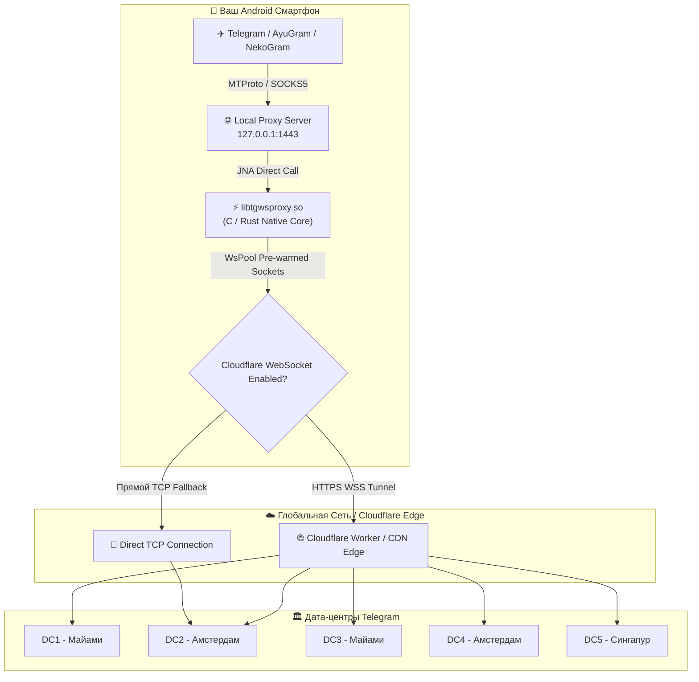

<div align="center">


# 🛡️ Mirrly TG Proxy для Android

**Нативный высокопроизводительный MTProto & Cloudflare WebSocket прокси-сервер для локального обхода блокировок Telegram**

[-3DDC84?style=for-the-badge&logo=android&logoColor=white)](https://developer.android.com)
[](https://kotlinlang.org)
[](https://developer.android.com/jetpack/compose)
[](https://www.rust-lang.org)
[](https://github.com/joycecurcirt539-dot/Mirrly-TG-Proxy/releases/tag/v1.0.0)
[](LICENSE)

*⚡ Полная защита от ТСПУ, DPI-фильтрации, замедлений и блокировок IP-адресов дата-центров Telegram со стороны провайдеров. Работает на нативном движке с предварительно прогретым пулом сокетов и поддержкой Cloudflare CDN.*

---

</div>

## 📋 Оглавление

- [📌 О проекте](#-о-проекте)
- [✨ Ключевые возможности](#-ключевые-возможности)
- [⚙️ Принцип работы и Архитектура](#️-принцип-работы-и-архитектура)
- [📱 Поддерживаемые клиенты Telegram (17+)](#-поддерживаемые-клиенты-telegram-17)
- [📥 Установка и Использование](#-установка-и-использование)
- [🛠️ Полное руководство по настройкам](#️-полное-руководство-по-настройкам)
- [🧱 Сборка из исходников](#-сборка-из-исходников)
- [📊 Телеметрия и Переводчик логов](#-телеметрия-и-переводчик-логов)
- [🤝 Благодарности (Credits)](#-благодарности-credits)
- [📄 Лицензия](#-лицензия)

---

## 📌 О проекте

**Mirrly TG Proxy** — это специализированное открытое приложение для Android, превращающее ваш смартфон в локальный ультра-быстрый прокси-сервер MTProto. 

В условиях жесткой DPI-фильтрации (ТСПУ) провайдеры блокируют прямые соединения к IP-адресам дата-центров Telegram (DC1-DC5) и сбрасывают гигабитные трафики. **Mirrly TG Proxy** решает эту проблему на корню: приложение поднимает локальный сервер на `127.0.0.1:1443` и оборачивает весь MTProto-трафик в маскированные WebSocket-туннели Cloudflare. Для провайдера ваш трафик выглядит как обычный просмотр зашифрованных веб-сайтов через HTTPS, что делает его блокировку невозможной без отключения глобального интернета.

В отличие от тяжеловесных системных VPN, Mirrly TG Proxy работает **исключительно для Telegram**, не за трачивает лишний трафик на другие приложения и практически не расходует заряд аккумулятора.

---

## ✨ Ключевые возможности

### ⚡ 1. Нативный движок `libtgwsproxy.so` (C/Rust + JNA)
Ядро прокси-сервера выполнено в виде скомпилированной нативной библиотеки на C/Rust для архитектур `arm64-v8a` и `armeabi-v7a`. Связывание с Android-кодом происходит через низкоуровневый интерфейс **Java Native Access (JNA)**. Это обеспечивает гигабитную скорость обработки пакетов без задержек виртуальной машины Java.

### 🌐 2. Туннелирование через Cloudflare WebSocket CDN
Весь входящий и исходящий трафик Telegram заворачивается в стандартные зашифрованные WebSocket-сессии. Вы можете использовать как встроенную сеть CDN Cloudflare, так и прописать свой собственный кастомный домен **Cloudflare Worker** для персонального изолированного обхода.

### 🔄 3. Бассейн прогретых сокетов `WsPool` (0 мс задержка)
Проблема традиционных WebSocket-прокси — задержка при первичном рукопожатии (Handshake). Mirrly TG Proxy поддерживает постоянный пул из 2–16 предварительно открытых сокетов к каждому из 5 дата-центров Telegram. Сообщения, фото и видео отправляются моментально, без пинга и «зависаний».

### 🎨 4. Премиальный AMOLED True Black интерфейс
Интерфейс приложения полностью написан на **Jetpack Compose** в строгом эстетичном стиле True Black (`#000000`). По центру расположена неоновая кнопка питания с живой динамической пульсацией и мягкими свечениями.

### ⚡ 5. Плитка быстрого доступа (Quick Settings Tile)
Включайте и выключайте прокси в один клик прямо из шторки уведомлений Android (`ProxyTileService`), не открывая само приложение.

### 📱 6. Автоматическая интеграция с 17+ клиентами Telegram
Приложение умеет автоматически определять установленные на устройстве сторонние и официальные клиенты Telegram и передавать прокси-ссылку (`tg://proxy?...`) в один клик.

### 🔄 7. Фоновая устойчивость и умный `WakeLock`
- **`NetworkChangeObserver`**: Автоматически переподключает прокси-сокеты при переключении между Wi-Fi и мобильной сетью.
- **`PowerManager.PARTIAL_WAKE_LOCK`**: Удерживает процессор от глубокого сна при активном прокси с автоматическим обновлением блокировки каждые 25 минут.
- **`BootReceiver`**: Опциональный автозапуск сервиса при включении смартфона.

---

## ⚙️ Принцип работы и Архитектура



---

## 📱 Поддерживаемые клиенты Telegram (17+)

Mirrly TG Proxy сканирует систему и предоставляет меню выбора в один клик для следующих клиентов:

| Клиент Telegram | Имя пакета Android | Описание |
| :--- | :--- | :--- |
| **Telegram Official** | `org.telegram.messenger` | Официальный клиент Telegram |
| **AyuGram Mobile** | `com.radolyn.ayugram` | Популярный клиент с поддержкой призрачного режима |
| **ExteraGram** | `com.exteragram.messenger` | Модифицированный клиент с расширенными настройками |
| **Plus Messenger** | `org.telegram.plus` | Мощный клиент с продвинутой табуляцией |
| **NekoGram** | `tw.nekomimi.nekogram` | Быстрый клиент на базе TelegramX / Official |
| **Nagram** | `xyz.nextalone.nagram` | Форк NekoGram с улучшенным функционалом |
| **Cherrygram** | `uz.unnarsx.cherrygram` | Клиент с кастомизацией дизайна |
| **Nicegram** | `app.nicegram` | Клиент с встроенными AI-инструментами |
| **iMe Messenger** | `com.iMe.android` | Клиент с криптокошельком и нейросетями |
| **Telegraph** | `ir.ilmili.telegraph` | Многоаккаунтный клиент |
| **Telegram X** | `org.thunderdog.challegram` | Альтернативный официальный клиент |
| **Другие** | `Nullgram`, `MDGram`, `ForkClient`, `Dahl`, `Litegram`, `BifToGram` | Поддерживаются автоматически |

---

## 📥 Установка и Использование

### Шаг 1. Скачивание
Перейдите в раздел **[Releases / Релизы](https://github.com/joycecurcirt539-dot/Mirrly-TG-Proxy/releases)** и скачайте свежий файл `MirrlyTGProxy-v1.0.0-release.apk`.

### Шаг 2. Установка
Установите APK-файл на ваше устройство. При необходимости разрешите установку из неизвестных источников.

### Шаг 3. Запуск прокси
1. Откройте приложение **Mirrly TG Proxy**.
2. Нажмите на большую центральную кнопку питания. Кнопка загорится неоново-зеленым светом.
3. Нажмите кнопку **«В Telegram»**. В появившемся окне выберите ваш Telegram-клиент и подтвердите добавление прокси.
4. Готово! Прокси подключен.

---

## 🛠️ Полное руководство по настройкам

Все параметры приложения настраиваются на экране **Настройки** (`SettingsScreen`):

| Параметр | Значение по умолчанию | Описание |
| :--- | :--- | :--- |
| **IP-адрес привязки** | `127.0.0.1` | Локальный интерфейс, на котором работает сервер |
| **Порт привязки** | `1443` | Порт прокси-сервера. Можно изменить при конфликте портов |
| **Секрет MTProto** | `ee000000000000000000000000000000` | 32-символьный HEX-секрет. Присутствует генератор случайных секретов |
| **Прокси Cloudflare** | `Включено (true)` | Использование туннелирования WebSocket через Cloudflare |
| **Кастомный домен CF** | `""` (Пусто) | Указание собственного Worker-домена (например, `my-proxy.worker.dev`) |
| **Размер пула сокетов** | `8` (Диапазон: 2–16) | Количество заранее подготовленных WebSocket-сокетов на каждый DC |
| **Автозапуск при загрузке** | `Отключено (false)` | Автоматический старт прокси при включении телефона |
| **Автопереподключение** | `Включено (true)` | Перепривязка сокетов при смене сети (Wi-Fi ↔ Мобильная сеть) |
| **Подробные логи** | `Включено (true)` | Вывод расширенных отладочных логов в встроенный экран |

---

## 🧱 Сборка из исходников

### Требования к окружению:
- **JDK 17** или выше
- **Android SDK** (API Level 34)
- **Gradle 8.x**

### Команды сборки:

1. Клонируйте репозиторий:
   ```bash
   git clone https://github.com/joycecurcirt539-dot/Mirrly-TG-Proxy.git
   cd Mirrly-TG-Proxy
   ```

2. Сборка Debug APK:
   ```bash
   # Windows (PowerShell / CMD)
   .\gradlew.bat assembleDebug

   # Linux / macOS
   ./gradlew assembleDebug
   ```

3. Сборка Release APK:
   ```bash
   # Windows (PowerShell / CMD)
   .\gradlew.bat assembleRelease

   # Linux / macOS
   ./gradlew assembleRelease
   ```

Готовый файл APK будет находиться по адресу: `app/build/outputs/apk/release/app-release-unsigned.apk`.

---

## 📊 Телеметрия и Переводчик логов

### Живая телеметрия
На главном экране в режиме реального времени отображаются:
- Скорость входящего и исходящего трафика (`Б/с`, `КБ/с`, `МБ/с`).
- Общий объем переданных и полученных данных.
- Время непрерывной работы прокси (Uptime таймер).
- Количество активных сокетов в пуле (`activeConns / poolSize`).

### Переводчик логов (`HumanLogTranslator`)
На экране **Логи** (`LogsScreen`) вы можете просматривать технические логи в реальном времени. Встроенный модуль `HumanLogTranslator` автоматически переводит сложные ошибки натива и MTProto на понятный русский язык:
- `Connection refused` → *Провайдер или брандмауэр блокирует соединение.*
- `Handshake timeout` → *Таймаут рукопожатия. Проверьте настройки Cloudflare.*
- `Socket closed unexpectedly` → *Сокет был разгружен сетью, выполняется переподключение.*

---

## 🤝 Благодарности (Credits)

Особая благодарность разработчикам и сообществу:

- **[Flowseal](https://github.com/Flowseal)** — Автор оригинального проекта **[tg-ws-proxy](https://github.com/Flowseal/zapret)** и концепции туннелирования MTProto-трафика через WebSocket и Cloudflare CDN. Проект Mirrly TG Proxy вдохновлен работами Flowseal и использует наработки нативного движка.
- **Разработчикам библиотеки Java Native Access (JNA)** — за удобное и быстрое связывание Kotlin и нативного C/Rust кода на Android.
- **Команде Google Jetpack Compose** — за современный фреймворк создания UI.

---

## 📄 Лицензия

Проект распространяется под открытой лицензией **[MIT License](LICENSE)**. Вы можете свободно использовать, модифицировать и распространять данный код.

*Дисклеймер: Mirrly TG Proxy является независимой открытой утилитой для обеспечения приватности и свободы информации. Проект не связан с Telegram FZ-LLC или Cloudflare, Inc.*
