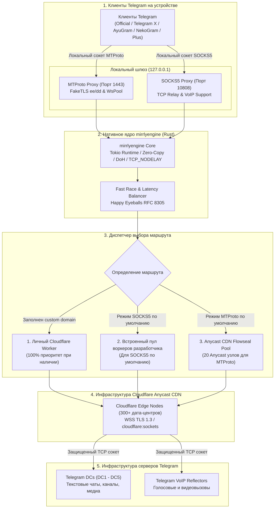

<div align="center">


# Mirrly TG Proxy для Android

**Локальный MTProto и SOCKS5 прокси-сервер на нативном движке Rust (mirrlyengine) с поддержкой FakeTLS и Cloudflare Worker для работы Telegram без системного VPN**

[](https://developer.android.com)
[](https://kotlinlang.org)
[](https://developer.android.com/jetpack/compose)
[](mirrlyengine)
[](https://workers.cloudflare.com)
[](https://developer.android.com/ndk)
<br/>
[](https://github.com/joycecurcirt539-dot/Mirrly-TG-Proxy/releases)
[](CHANGELOG.md)
[](https://github.com/joycecurcirt539-dot/Mirrly-TG-Proxy/releases)
[](https://github.com/joycecurcirt539-dot/Mirrly-TG-Proxy/stargazers)
[](https://github.com/joycecurcirt539-dot/Mirrly-TG-Proxy/issues)
<br/>
[](https://t.me/WhyOkyHb)
[](#15-безопасность-и-условия-использования)
[](docs/cloudflare_worker.js)
[](tools/deploy-worker)
[](CHANGELOG.md)
[](TERMS_OF_USE.md)
[](LICENSE)

*Маршрутизация трафика Telegram через нативное ядро mirrlyengine (Rust/Tokio), защищенные WebSocket-сессии в сети Cloudflare Anycast CDN и персональные Cloudflare Workers. Работает локально в фоновом режиме без прав суперпользователя и без создания системного VPN-подключения.*

<br/>

<picture>
  <source media="(prefers-color-scheme: dark)" srcset="https://github.com/joycecurcirt539-dot/Mirrly-TG-Proxy/blob/output/github-contribution-grid-snake-dark.svg?raw=true">
  <source media="(prefers-color-scheme: light)" srcset="https://github.com/joycecurcirt539-dot/Mirrly-TG-Proxy/blob/output/github-contribution-grid-snake.svg?raw=true">
  
</picture>

---

</div>

## Оглавление

1. [Планы развития и позиция автора](#планы-развития-и-позиция-автора)
2. [Что такое Mirrly TG Proxy](#1-что-такое-mirrly-tg-proxy)
3. [Технический принцип работы](#2-технический-принцип-работы)
4. [Маршрутизация и Cloudflare Workers](#3-маршрутизация-и-cloudflare-workers)
5. [Ключевые возможности и модули](#4-ключевые-возможности-и-модули)
6. [Архитектура системы](#5-архитектура-системы)
7. [Поддерживаемые клиенты Telegram](#6-поддерживаемые-клиенты-telegram)
8. [Интерфейс приложения](#7-интерфейс-приложения)
9. [Быстрый старт и установка](#8-быстрый-старт-и-установка)
10. [Конфигурация и параметры](#9-конфигурация-и-параметры)
11. [Создание и настройка личного Cloudflare Worker](#10-создание-и-настройка-личного-cloudflare-worker)
12. [Структура проекта и сборка из исходного кода](#11-структура-проекта-и-сборка-из-исходного-кода)
13. [График активности разработки](#12-график-активности-разработки)
14. [Динамика звезд репозитория](#13-динамика-звезд-репозитория)
15. [Хронология развития](#14-хронология-развития)
16. [Безопасность и условия использования](#15-безопасность-и-условия-использования)
17. [Благодарности](#16-благодарности)

---

## Планы развития и позиция автора

> [!NOTE]
> ### Расширение аудитории
> В ближайших планах — адаптация решения для пользователей из других стран, где Telegram сталкивается с сетевыми ограничениями, замедлениями или блокировками со стороны провайдеров.

> [!TIP]
> ### Публикация в Google Play
> Планируется официальный релиз в Google Play Store. В настоящее время ведется регистрация аккаунта разработчика и подготовка к обязательному закрытому тестированию.

> [!NOTE]
> ### Архитектурный стандарт: 4 протокола
> В экосистеме Mirrly TG Proxy будет реализовано строго 4 сетевых протокола:
> * **MTProto (FakeTLS)** — нативный протокол Telegram для чатов и медиа (реализован).
> * **SOCKS5** — асинхронный TCP-релей для голосовых и видеозвонков (реализован).
> * **WEB (WebTransport / WSS Tunnel)** — маскировка под HTTP/2 и HTTP/3 (в разработке; реализуемость через Cloudflare Worker ~85%).
> * **HTTP (HTTP CONNECT Tunnel)** — универсальный стандарт без накладных расходов (в планах; реализуемость через Cloudflare Worker ~90%).

> [!IMPORTANT]
> ### Монетизация
> * Приложение навсегда остается бесплатным: без рекламы, подписок и спонсорских каналов.
> * Для соответствия правилам Google Play из маркетной сборки будут исключены встроенный установщик APK и прямые ссылки на донаты.

---

## 1. Что такое Mirrly TG Proxy

**Mirrly TG Proxy** — бесплатное Android-приложение, которое запускает локальный прокси-сервер для маршрутизации трафика Telegram через сеть Cloudflare. Решает проблему нестабильной работы мессенджера при сетевых ограничениях и фильтрации DPI со стороны провайдеров.

Приложение не использует системный VPN и не перехватывает трафик других программ. Все подключения Telegram направляются через локальный шлюз (`127.0.0.1`) на нативное ядро `mirrlyengine`, которое инкапсулирует пакеты в зашифрованные WebSocket-соединения через Cloudflare.

### Что умеет приложение

* **Два режима работы**:
  * *MTProto* — для чатов, каналов, фото, видео и файлов. Трафик идет через пул Anycast CDN Flowseal (20 узлов) без расхода квоты Cloudflare Worker.
  * *SOCKS5* — для голосовых и видеозвонков. Трафик идет через персональный Cloudflare Worker или встроенный пул воркеров разработчика.
* **Работа без настройки**: после установки приложение готово к работе через встроенные узлы.
* **Менеджер воркеров**: добавление персональных Cloudflare Workers, замер пинга, экспорт и импорт по ссылке.
* **Импорт воркера по ссылке**: поддержка App Links `https://mirrly.app/worker?domain=...` и deep links `mirrly://worker?domain=...`.
* **Таймер отключения**: автоматическое завершение службы через заданный интервал.
* **Аналитика квоты воркера**: локальный учет WSS-соединений с интерактивным графиком Безье и счетчиком суточного лимита.
* **Индекс качества сети (SQI)**: взвешенный скоринг (RTT, джиттер, надежность доставки пакетов) с отображением на главном экране.
* **Автообновления**: проверка новых версий, валидация SHA-256 и проверка цифровой подписи перед установкой.

---

## 2. Технический принцип работы

Приложение запускает на устройстве локальный шлюз маршрутизации на базе нативного движка **mirrlyengine**, скомпилированного на Rust.

* **MTProto Proxy (локальный порт 1443)**: реализация протокола MTProto с маскировкой FakeTLS (`ee` / `dd`) и пулом открытых WebSocket-сокетов (`WsPool`).
* **SOCKS5 Proxy (локальный порт 10808)**: прозрачный асинхронный TCP-релей с поддержкой `CONNECT`, доменных имен (FQDN), IPv4 и IPv6. Пропускает трафик голосовых и видеозвонков Telegram.

```
+-----------------------------------------------------------------------------------+
| Android-устройство (Локальный контур)                                             |
|                                                                                   |
|  [Клиент Telegram] ----(127.0.0.1:1443 или 10808)---->[mirrlyengine (Rust Core)] |
+------------------------------------------------------------------|----------------+
                                                                   | WSS TLS (Port 443)
                                                                   v
+-----------------------------------------------------------------------------------+
| Cloudflare Edge / Личный Cloudflare Worker                                        |
|                                                                                   |
|  [Cloudflare Worker / Edge Node] ----(cloudflare:sockets / TCP)-------------------+
+------------------------------------------------------------------|----------------+
                                                                   | TCP (443 / 80)
                                                                   v
+-----------------------------------------------------------------------------------+
| Серверная инфраструктура Telegram                                                 |
|                                                                                   |
|  [Telegram DCs: DC1 - DC5 (Чаты и медиа)]   [Telegram VoIP Nodes (Звонки)]      |
+-----------------------------------------------------------------------------------+
```

### Архитектурные детали

* **Нативный Rust (`mirrlyengine`)**: асинхронный runtime Tokio с неблокирующим вводом-выводом (epoll), Zero-Copy буферизация. Исключает паузы сборщика мусора JVM.
* **Без прямых TCP-подключений к Telegram**: трафик направляется исключительно через защищенный CDN-слой.
* **Маскировка FakeTLS**: MTProto-соединения оформляются в стандартные TLS 1.3 записи (`ClientHello`, `ServerHello`, `ApplicationData`).
* **Без VpnService**: не захватывает трафик других приложений, не требует специальных системных прав.
* **Сквозное шифрование**: прокси выполняет только транспортную функцию. Данные защищены нативным шифрованием MTProto между клиентом и серверами Telegram.

---

## 3. Маршрутизация и Cloudflare Workers

* **MTProto (чаты, каналы, фото, видео, файлы)**: маршрутизируется через пул Anycast CDN Flowseal (20 встроенных узлов) с ступенчатой гонкой со сдвигом 25 мс. Не расходует суточную квоту Cloudflare Workers.
* **SOCKS5 (чаты, медиа, голосовые и видеозвонки)**: работает через TCP-туннель WebSocket. Приоритет маршрутов:
  1. Персональный домен пользователя (`customCfDomain`) — 100% приоритет при наличии.
  2. Встроенный пул воркеров разработчика (4 узла на независимых аккаунтах Cloudflare).

> [!WARNING]
> **Ограничения встроенного пула воркеров разработчика**:
> Каждый аккаунт Cloudflare на бесплатном тарифе предоставляет 100 000 запросов в сутки. При повышенной нагрузке узел может вернуть HTTP 429 (Too Many Requests). Приложение детектирует этот статус и автоматически переключается на резервный узел.
>
> Для гарантированной стабильности звонков создайте персональный Cloudflare Worker по инструкции в разделе 10.

### Преимущества персонального Cloudflare Worker

1. Персональная квота: 100 000 запросов в сутки выделены только вам.
2. Отсутствие конкуренции за пропускную способность с другими пользователями.
3. Абсолютный приоритет: при наличии пользовательского домена приложение всегда использует его.
4. Встроенная Anti-Open-Relay защита: скрипт воркера разрешает подключения только к официальным адресам и доменам Telegram.

---

## 4. Ключевые возможности и модули

### Сетевой стек — ядро `mirrlyengine` (Rust)

* **Асинхронный runtime**: Tokio с пулом рабочих потоков `mirrlyengine-worker`.
* **Zero-Copy буферизация**: минимизация операций копирования байтов между сокетами клиента и сетевым туннелем.
* **Кроссплатформенная сборка**: скомпилирован под 4 архитектуры (`arm64-v8a`, `armeabi-v7a`, `x86_64`, `x86`) с LTO и stripping.
* **Сброс соединений при смене сети (`ResetNetworkSockets`)**: атомарный сброс устаревших сокетов, очистка кэша DoH и рейтинга Happy Eyeballs при переходе Wi-Fi ↔ LTE/5G.
* **Кулдаун ошибок**: изоляция узлов при кодах HTTP 429, 500–504, 520–524 с моментальным переключением на резерв.
* **Поддержка фрагментации WebSocket (RFC 6455)**: сборка фрагментированных фреймов (`OP_CONTINUATION`) до 16 МБ.

### Алгоритмы устойчивости соединения

* **DNS-over-HTTPS с Race Resolver (`DohResolver`)**: параллельный опрос Cloudflare (1.1.1.1), Google (8.8.8.8), Quad9 (9.9.9.9). Фиксация первого ответа, локальный кэш со скользящим TTL (30–3600 сек), fallback на системный DNS.
* **Happy Eyeballs v2 (RFC 8305) для Anycast IP (`HappyEyeballsEngine`)**: ступенчатый параллельный опрос Anycast IP с задержкой 200 мс, локальный рейтинг IP с EWMA RTT.
* **Детектор DPI-аномалий и Circuit Breaker (`DpiAnomalyDetector` / `WorkerCircuitBreaker`)**: эвристический анализ (`ECONNRESET`, `SSLHandshakeException`, `bad_record_mac`), перевод в изоляцию с первого критического сбоя, 10-минутный карантин.
* **Автопереключение воркеров (`WorkerFailoverManager`)**: бесшовный переход на резервный узел за менее чем 300 мс.
* **Telegram DC-Affinity (`TelegramDCAffinityEngine`)**: поведенческий анализ активных соединений по дата-центрам DC1–DC5, динамическое перераспределение ресурсов пула сокетов.
* **Экспоненциальное сглаживание скорости (`EmaSpeedFilter`)**: двухканальный EMA-фильтр для устранения джиттера и стабилизации UI-спидометров.
* **Многофакторная авто-адаптация стека (`NetworkConditionEvaluator`)**: оценка RTT, джиттера, MOS, QoS и динамическое переключение `TCP_NODELAY` и размеров буфера.

### Управление энергопотреблением

* **Battery & Thermal QoS (`BatteryThermalQoSEngine`)**: уменьшение пула сокетов и таймаутов при низком заряде или нагреве, восстановление при заряде выше 50% или подключении питания. Использует Android Thermal API.
* **Adaptive Heartbeat (`AdaptiveHeartbeatEngine`)**: адаптивная частота keep-alive пингов по типу сети: Wi-Fi 45–60 сек, сотовая 15–20 сек, с учетом состояния экрана.
* **Predictive Pre-Warm (`PredictivePreWarmManager`)**: упреждающий прогрев пула WSS-сокетов при разблокировке экрана и подключении питания (дебаунс 30 сек).

### Оркестратор переключения протоколов

* **3-фазное переключение (`ProtocolSwitchManager`)**: `DISCONNECTING` → `PAUSE_DARK` (1000 мс) → `RECONNECTING`. В паузе гарантируется освобождение сетевых дескрипторов и применяется смена акцентного цвета интерфейса.
* **Секретный ключ MTProto**: генерируется один раз при первой установке, сохраняется постоянно. Переключение между режимами не затрагивает ключ — изменить его может только пользователь вручную.

### Профили скорости (`SpeedPreset`)

| Профиль | Сокетов на DC | Буфер | Назначение |
| :--- | :--- | :--- | :--- |
| **Авто** | динамически | динамически | Автовыбор по состоянию сети |
| **Эко** | 2 | 128 КБ | Минимальное энергопотребление |
| **Баланс** | 4 | 256 КБ | Оптимальное соотношение |
| **Турбо** | 8 | 1 МБ | Высокая скорость скачивания |
| **Ультра** | 16 | 2 МБ | Максимальная пропускная способность |

### Управление алгоритмом Нагла (`TCP_NODELAY`)

* **Авто**: включает `TCP_NODELAY` при пропускной способности >= 50 Мбит/с и RTT <= 140 мс, иначе отключает.
* **ВКЛ / ВЫКЛ**: принудительная фиксация.

### Менеджер воркеров и Deep Links

* Добавление, редактирование, удаление воркеров с именами.
* Замер пинга, индикация HTTP 429.
* Импорт по App Links (`https://mirrly.app/worker?domain=...`) и deep links (`mirrly://worker?domain=...`).
* Экспорт: генерация текста с ссылкой и инструкцией для отправки через любой мессенджер.
* Аналитика использования воркера: отдельный экран `WorkerAnalyticsScreen` с интерактивным графиком Безье, тач-скраббером, 8 временными срезами (от «Сессия» до «Всего»), счетчиком суточной квоты и таймером до сброса (00:00 UTC).

### Индекс качества сети и диагностика

* **`LiquidWaveQualityCircle`**: анимированный круговой индикатор на главном экране. Цвет адаптируется под протокол: изумрудный для MTProto, индиго для SOCKS5.
* **`NetworkDiagnosticScreen`**: SQI 0–100% по взвешенной формуле (45% RTT EWMA, 25% джиттер LTE, 30% надежность доставки). Расчет MOS / R-Factor по ITU-T G.107, отслеживание Min-RTT (BBR) и индекса буферизации (Bufferbloat).

### Безопасность и верификация обновлений

* **Нативная проверка подписи (C++ NDK `SignatureVerifier`)**: сверка цифровой подписи APK по SHA-256 в нативном слое перед передачей в системный установщик.
* **Принцип Fail-Closed**: при любой ошибке чтения подписи или несовпадении — обновление блокируется со статусом `UNOFFICIAL_MODIFIED`.
* **Multi-APK Architecture Engine**: автоопределение ABI устройства (`Build.SUPPORTED_ABIS`), диалог выбора архитектуры с характеристиками каждого пакета, режим переустановки без сброса настроек.

### Графический движок

* **Zero-Allocation Canvas (120 FPS)**: отрисовка частиц `CyberEnergyCanvas` на предвыделенных `FloatArray` без аллокаций в цикле отрисовки.
* **Аппаратное размытие (`DialogBlurHelper`)**: нативный эффект `FLAG_BLUR_BEHIND` (Android 12+) с акриловым fallback для Android 8–11.
* **Тактильный контроллер (`HapticHelper`)**: профили на базе примитивов Android 12+ (`PRIMITIVE_LOW_TICK`, `PRIMITIVE_SPIN`, `PRIMITIVE_TICK`).

---

## 5. Архитектура системы



---

## 6. Поддерживаемые клиенты Telegram

Приложение автоматически сканирует установленные пакеты и позволяет подключить прокси в один клик:

* **Официальные клиенты**: Telegram, Telegram X
* **Расширенные клиенты**: AyuGram, NekoGram, Nagram, ExteraGram, Plus Messenger
* **Сторонние клиенты**: Cherrygram, Nicegram, iMe Messenger, Telegraph, MDGram, Dahl, Litegram, Nullgram, ForkClient, BifToGram

---

## 7. Интерфейс приложения

<div align="center">

| Главный экран | Таймер сна | История сессий |
| :-: | :-: | :-: |
|  |  |  |

<br />

| Настройки (Параметры) | Настройки (Сеть и Воркеры) | Журнал событий | Экран обновлений |
| :-: | :-: | :-: | :-: |
|  |  |  |  |

</div>

---

## 8. Быстрый старт и установка

1. Скачайте APK со страницы [Релизы GitHub](https://github.com/joycecurcirt539-dot/Mirrly-TG-Proxy/releases):
   * `app-universal-release.apk` — универсальный пакет для любых устройств (ARM64, ARMv7, x86, x86_64).
   * `app-arm64-v8a-release.apk` — оптимизированная сборка для 64-битных ARM-смартфонов.
   * `app-armeabi-v7a-release.apk` — для 32-битных ARM-устройств.
   * `app-x86_64-release.apk` — для 64-битных эмуляторов x86_64.
   * `app-x86-release.apk` — для 32-битных эмуляторов x86.
2. Установите APK на устройство под управлением Android 8.0 (API 26) или новее.
3. Откройте **Mirrly TG Proxy** и нажмите центральную кнопку включения.
4. Нажмите кнопку **«В Telegram»** и подтвердите добавление прокси в открывшемся диалоге мессенджера.

---

## 9. Конфигурация и параметры

| Параметр | По умолчанию | Описание |
| :--- | :--- | :--- |
| `proxyModeName` | `MTPROTO` | Активный режим прокси: `MTPROTO` или `SOCKS5` |
| `bindHost` / `bindPort` | `127.0.0.1:1443` | Локальный адрес и порт для MTProto |
| `socks5Port` | `10808` | Локальный TCP-порт для SOCKS5 |
| `secretHex` | генерируется при первом запуске | 34-символьный секретный ключ MTProto с префиксом FakeTLS (`dd`) |
| `customCfDomain` | `""` | Персональный домен Cloudflare Worker |
| `speedPresetName` | `AUTO` | Профиль скорости: `AUTO`, `ECO`, `BALANCED`, `TURBO`, `ULTRA` |
| `tcpNoDelayModeName` | `AUTO` | Режим алгоритма Нагла: `AUTO`, `ON`, `OFF` |
| `poolSize` | `4` | Количество удерживаемых WSS-сокетов на каждый DC |
| `useDefaultWorkerSocks5` | `true` | Использование встроенного пула воркеров при отсутствии личного домена |
| `autostartOnBoot` | `true` | Автозапуск службы при включении устройства |
| `verboseLogs` | `true` | Подробное логирование сетевых событий |

---

## 10. Создание и настройка личного Cloudflare Worker

Создание занимает около 1 минуты и не требует оплаты.

### Способ 1: Автоматический деплой (рекомендуется)

#### Вариант A: Windows — двойным щелчком
1. Скачайте репозиторий или откройте директорию `tools/deploy-worker/`.
2. Дважды кликните по файлу **`deploy.bat`**.

#### Вариант B: PowerShell — одной строкой (без скачивания)
```powershell
irm https://raw.githubusercontent.com/joycecurcirt539-dot/Mirrly-TG-Proxy/main/tools/deploy-worker/deploy.ps1 | iex
```

#### Вариант C: Linux / macOS / WSL
```bash
chmod +x tools/deploy-worker/deploy.sh
./tools/deploy-worker/deploy.sh
```

#### Что делает скрипт

* Создает воркер с авто-генерацией имени или вводом собственного названия.
* Поддерживает регистрацию поддомена `workers.dev` для новых аккаунтов Cloudflare.
* Позволяет переключаться между аккаунтами (`wrangler logout`) для обхода суточного лимита.
* Сохраняет историю созданных воркеров в `my_workers.txt` с доменом и ссылкой импорта.
* Копирует домен воркера в буфер обмена.

---

### Способ 2: Ручное создание через веб-панель Cloudflare

1. Зарегистрируйтесь на [dash.cloudflare.com](https://dash.cloudflare.com/) или войдите в аккаунт.
2. Перейдите в **Workers & Pages** → **Create application** → **Create Worker**.
3. Задайте имя воркера и нажмите **Deploy**.
4. Нажмите **Edit code** и вставьте содержимое файла [`docs/cloudflare_worker.js`](docs/cloudflare_worker.js).
5. Нажмите **Deploy** для сохранения.
6. Скопируйте адрес воркера (например: `my-tg-proxy.username.workers.dev`).
7. Откройте **Mirrly TG Proxy** → **Менеджер воркеров** → **Добавить воркер** и вставьте адрес.

### Масштабирование

* На одном бесплатном аккаунте Cloudflare можно создать до 100 воркеров.
* Каждый аккаунт предоставляет 100 000 запросов в сутки.
* Для распределения нагрузки создайте воркеры на нескольких аккаунтах с помощью функции смены сессии в скрипте деплоя.

---

## 11. Структура проекта и сборка из исходного кода

### Структура каталогов

```text
Mirrly TG Proxy/
├── app/                  # Android-приложение (Jetpack Compose UI, Foreground Service, NDK C++)
├── core/                 # Kotlin-модули (LocalProxyServer, UpdateChecker, движки балансировки)
├── mirrlyengine/         # Нативное ядро на Rust/Tokio (SOCKS5, MTProto, FakeTLS, WebSocket)
├── tools/                # Вспомогательные утилиты
│   ├── deploy-worker/    # Деплоер Cloudflare Worker (deploy.bat, deploy.ps1, deploy.sh)
│   └── build/            # Скрипты компиляции нативного ядра
├── docs/                 # Документация, скриншоты, эталонный cloudflare_worker.js
├── build_native.ps1      # Компиляция Rust-движка под 4 ABI (Windows)
├── build_native.sh       # Компиляция Rust-движка под 4 ABI (Linux / macOS / CI)
└── clean_all.ps1         # Очистка кэшей сборки
```

### Требования к окружению

* Android SDK (API Level 35, Build-Tools 35.0.0)
* Android NDK (версия 25 или новее, рекомендована NDK 27+)
* Rust Toolchain: `cargo`, `rustup target add aarch64-linux-android armv7-linux-androideabi x86_64-linux-android i686-linux-android`
* Java Development Kit (JDK 17+)

### Инструкция по сборке

```bash
# 1. Клонирование репозитория
git clone https://github.com/joycecurcirt539-dot/Mirrly-TG-Proxy.git
cd Mirrly-TG-Proxy

# 2. Компиляция нативного ядра Rust под 4 ABI
# Windows (PowerShell):
.\build_native.ps1
# Linux / macOS (Bash):
./build_native.sh

# 3. Сборка релизных APK
./gradlew assembleRelease

# 4. Очистка кэшей (при необходимости)
.\clean_all.ps1
```

Собранные пакеты расположены в `app/build/outputs/apk/release/`.

---

## 12. График активности разработки

<div align="center">

[](https://github.com/joycecurcirt539-dot/Mirrly-TG-Proxy)

</div>

---

## 13. Динамика звезд репозитория

<div align="center">

<a href="https://www.star-history.com/?repos=joycecurcirt539-dot%2FMirrly-TG-Proxy&type=date&legend=top-left">
 <picture>
   <source media="(prefers-color-scheme: dark)" srcset="https://api.star-history.com/chart?repos=joycecurcirt539-dot/Mirrly-TG-Proxy&type=date&theme=dark&legend=top-left&sealed_token=2ZxdQVXYtszPQ2_C8iS9hYFI8zb-495pG47H9KSmQnTviNfwec-JUTZdeRmiaKkKmwYIJtF-i3x7BFk051JjPV3k1ensh6WvgBtwCmxaOybEdxs0ZFVSwdhZA0lCRQriwItHEtGZthEt_5HPt-BnP6JZcgNJkf69g2MAvm6KiC_6E8vZ1g7q8BLEmeFm" />
   <source media="(prefers-color-scheme: light)" srcset="https://api.star-history.com/chart?repos=joycecurcirt539-dot/Mirrly-TG-Proxy&type=date&legend=top-left&sealed_token=2ZxdQVXYtszPQ2_C8iS9hYFI8zb-495pG47H9KSmQnTviNfwec-JUTZdeRmiaKkKmwYIJtF-i3x7BFk051JjPV3k1ensh6WvgBtwCmxaOybEdxs0ZFVSwdhZA0lCRQriwItHEtGZthEt_5HPt-BnP6JZcgNJkf69g2MAvm6KiC_6E8vZ1g7q8BLEmeFm" />
   
 </picture>
</a>

</div>

---

## 14. Хронология развития

Проект начат **27 июля 2026 года** публикацией первого релиза `v1.0.0`. За первый месяц разработки прошел путь от базового MTProto-шлюза до многокомпонентной системы с нативным Rust-ядром.

| Дата / Версия | Ключевой этап | Суть изменений |
| :--- | :--- | :--- |
| **27.07.2026** `v1.0.0` | Генезис | Первый публичный релиз. Нативное ядро `libtgwsproxy` (C/JNA), MTProto-шлюз на порту 1443, WsPool, интеграция с 17+ клиентами Telegram. |
| **Конец июля** `v1.0.4–1.0.5` | Лицензия и скорость | Лицензия GPLv3, скоростные буферы Турбо (2 МБ), сквозной `TCP_NODELAY`. |
| **Начало августа** `v1.0.6–1.0.8` | Безопасность и UI | Нативная проверка подписи SHA-256 (`SignatureVerifier`), таймер сна, аппаратное размытие `FLAG_BLUR_BEHIND`. |
| **Середина августа** `v1.0.9` | SOCKS5 и звонки | Асинхронный TCP-релей SOCKS5 на порту 10808 через `cloudflare:sockets`. Поддержка HD-звонков Telegram. |
| **Август** `v1.1.0–1.1.1` | Стабилизация | Устранение JNI-конфликтов, трехцветная индикация статус-бара, переход на ABI Splits. |
| **Август** `v1.1.2` | Rust-ядро | Перепись нативного ядра на Rust (`mirrlyengine`): Zero-Copy, epoll, нативный FakeTLS, устранение пауз GC. |
| **Август** `v1.1.3–1.1.3.1` | Менеджер воркеров | Менеджер воркеров Cloudflare, ступенчатый балансировщик (RFC 8305), импорт по `mirrly://worker`. |
| **Август** `v1.1.4` | 100% Rust | Удаление устаревшего Kotlin/JVM стека, Fast Failover (RFC 8305), Anti-Open-Relay защита воркера. |
| **Август** `v1.1.5` | ProtocolSwitchManager | 3-фазный оркестратор переключения протоколов, гонка воркеров разработчика. |
| **Август** `v1.1.6–1.1.6.1` | WebSocket и деплой | Сборка WS-фреймов до 16 МБ, очередь `writeQueue`, инструмент деплоя `deploy.bat`, 4 независимых аккаунта. |
| **Август** `v1.1.7` | Anycast CDN и GPU | MTProto переведен на Anycast CDN Flowseal, задержка гонки 25 мс, Zero-Allocation рендеринг (120 FPS), Haptic. |
| **27.08.2026** `v1.1.8` | DoH, аналитика, QoS | DoH Race Resolver, Happy Eyeballs v2, DC-Affinity, Battery & Thermal QoS, аналитика с графиком Безье, Multi-APK Engine. |

> [!TIP]
> В приложении встроена скрытая летопись проекта: перейдите в раздел **«О разработчике»** и нажмите **5 раз** по аватару автора или бейджу Genesis, чтобы открыть подробную историю версий.

---

## 15. Безопасность и условия использования

* **Отсутствие сбора данных**: приложение не содержит аналитических трекеров, рекламных SDK и не собирает персональные данные.
* **Верификация обновлений**: встроенный установщик проверяет отпечаток ключа подписи и SHA-256 перед установкой.
* **История изменений**: [CHANGELOG.md](CHANGELOG.md).
* **Лицензия**: [GNU General Public License v3 (GPLv3)](LICENSE).
* **Пользовательское соглашение**: [TERMS_OF_USE.md](TERMS_OF_USE.md).

---

## 16. Благодарности

* **[amurcanov](https://github.com/amurcanov)** — разработчик [tg-ws-proxy-android](https://github.com/amurcanov/tg-ws-proxy-android). Его архитектурный фундамент послужил отправной точкой, на основе которой был создан Mirrly TG Proxy.
* **[Flowseal](https://github.com/Flowseal)** — автор [tg-ws-proxy](https://github.com/Flowseal/tg-ws-proxy), оригинальная концепция туннелирования трафика Telegram через WebSocket-сессии Cloudflare.

### Охотники за багами

* **[Grovymon](https://github.com/Grovymon)** — аудит безопасности ядра, выявление багов Window Insets (Redmi Note 13 Pro+ 5G, Android 16), диагностика сетевых сбоев (Issues #3, #4, #5, #7, #8).
* **[zzzxxx888207-design](https://github.com/zzzxxx888207-design)** — диагностика сброса ключа прокси в памяти (Xiaomi 12T, POCO X8 Pro Max), отладка Cloudflare Workers (Issues #1, #9, #10, #13).
* **[BbIBux](https://github.com/BbIBux)** — диагностика загрузки медиа в MTProto (T2, Ростелеком), исправление прозрачности диалогов (Issues #11, #12, #13).
* **[VikKalm](https://github.com/VikKalm)** — логи и локализация блокировки воркеров в v1.1.2 на Android 13 arm64-v8a (Issue #6).

### Бета-тестировщики

* **Shon4k** — тестирование предварительных сборок и стабильности соединений.
* **Linar S** — тестирование сетевых сценариев и совместимости на различных Android-устройствах.

### Сообщество

* **Astimir Meikulov** — активный участник канала [@WhyOkyHb](https://t.me/WhyOkyHb).
