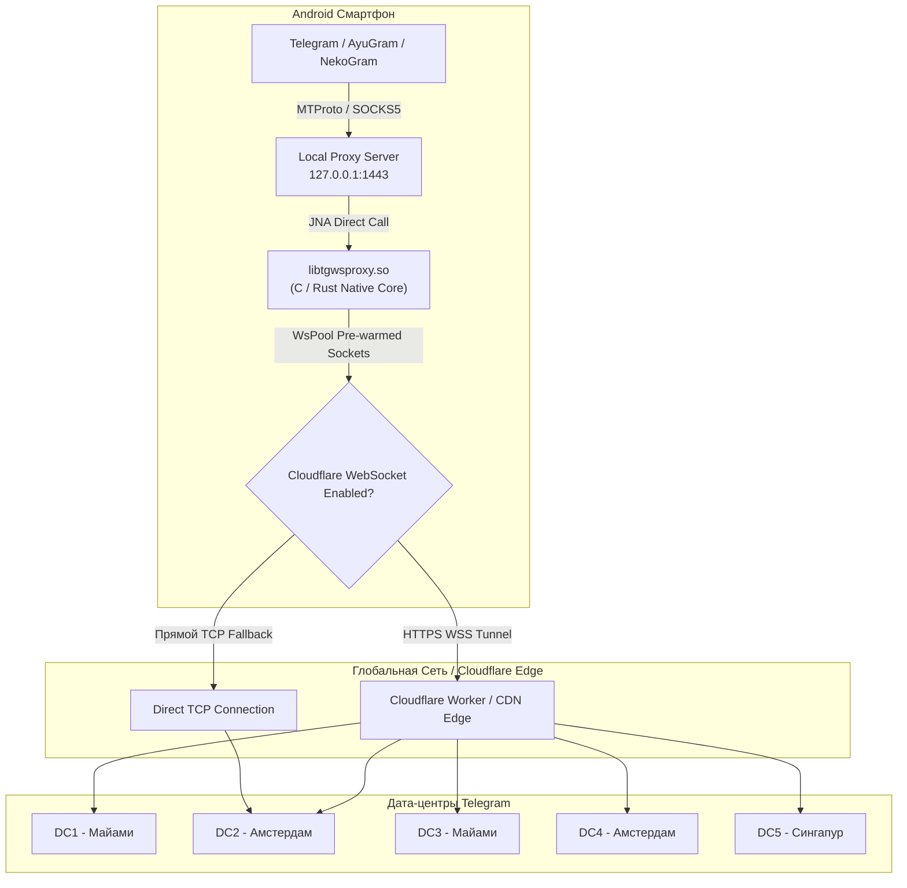
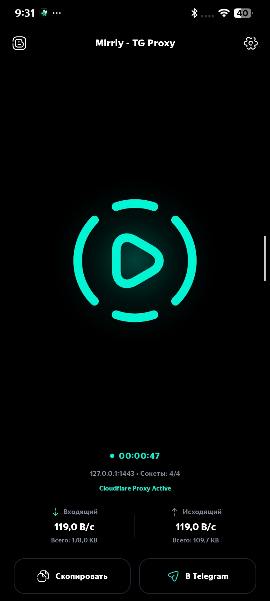
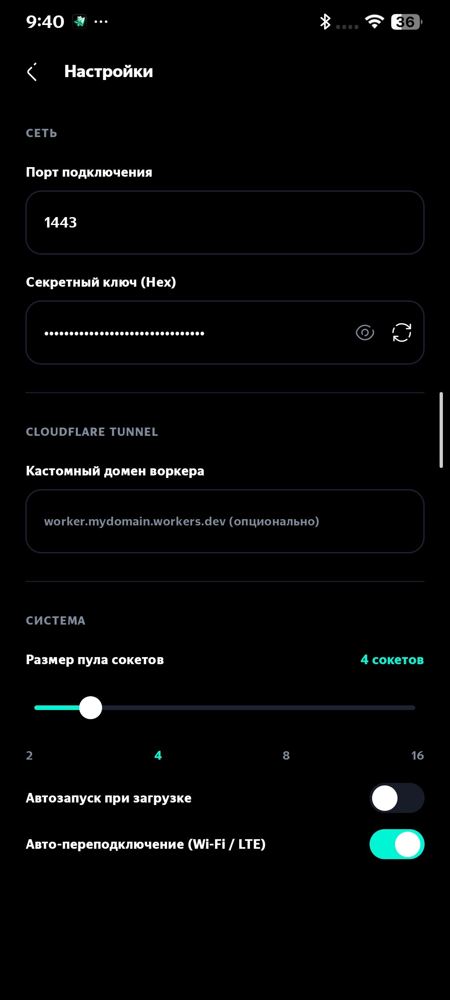
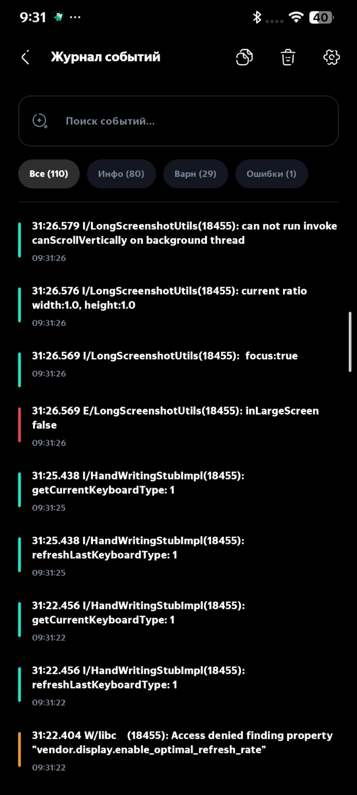
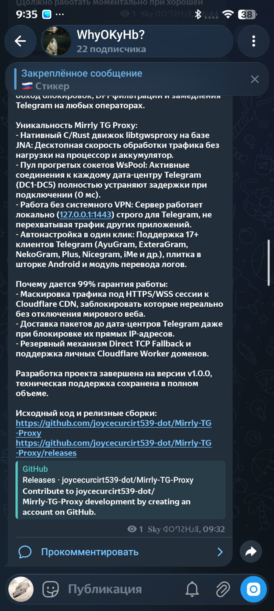

<div align="center">


# Mirrly TG Proxy для Android

**Нативный высокопроизводительный MTProto & Cloudflare WebSocket прокси-сервер для локального обхода блокировок Telegram**

[-3DDC84?style=for-the-badge&logo=android&logoColor=white)](https://developer.android.com)
[](https://kotlinlang.org)
[](https://developer.android.com/jetpack/compose)
[](https://www.rust-lang.org)
[](https://github.com/joycecurcirt539-dot/Mirrly-TG-Proxy/releases/tag/v1.0.0)
[](LICENSE)

*Защита от ТСПУ, DPI-фильтрации, замедлений и блокировок IP-адресов дата-центров Telegram со стороны провайдеров. Работает на нативном движке с предварительно прогретым пулом сокетов и поддержкой Cloudflare CDN.*

---

</div>

## Оглавление

1. [Описание и назначение Mirrly TG Proxy](#1-описание-и-назначение-mirrly-tg-proxy)
2. [Проблема блокировок и техническое решение](#2-проблема-блокировок-и-техническое-решение)
3. [Уникальность Mirrly TG Proxy и 99% гарантия работоспособности](#3-уникальность-mirrly-tg-proxy-и-99-гарантия-работоспособности)
4. [Архитектура системы и компонентное устройство](#4-архитектура-системы-и-компонентное-устройство)
5. [Ключевые технические особенности](#5-ключевые-технические-особенности)
6. [Алгоритм работы пула прогретых сокетов WsPool](#6-алгоритм-работы-пула-прогретых-сокетов-wspool)
7. [Использование кастомных Cloudflare Worker доменов](#7-использование-кастомных-cloudflare-worker-доменов)
8. [Поддерживаемые клиенты Telegram (17+ клиентов)](#8-поддерживаемые-клиенты-telegram-17-клиентов)
9. [Фоновая работа, WakeLock и энергоэффективность](#9-фоновая-работа-wakelock-и-энергоэффективность)
10. [Интеграция с Android Quick Settings Tile](#10-интеграция-с-android-quick-settings-tile)
11. [Живая телеметрия и Модуль перевода логов](#11-живая-телеметрия-и-модуль-перевода-логов)
12. [Демонстрация интерфейса и Скриншоты](#12-демонстрация-интерфейса-и-скриншоты)
13. [Системные требования](#13-системные-требования)
14. [Руководство по установке и первому запуску](#14-руководство-по-установке-и-первому-запуску)
15. [Подробный справочник по всем параметрам конфигурации](#15-подробный-справочник-по-всем-параметрам-конфигурации)
16. [Инструкция по сборке из исходных файлов](#16-инструкция-по-сборке-из-исходных-файлов)
17. [Безопасность и Приватность](#17-безопасность-и-приватность)
18. [Устранение неполадок (FAQ / Troubleshooting)](#18-устранение-неполадок-faq--troubleshooting)
19. [Статус разработки и Техническая поддержка](#19-статус-разработки-и-техническая-поддержка)
20. [Благодарности и Авторы (Credits)](#20-благодарности-и-авторы-credits)
21. [Лицензия и Отказ от ответственности](#21-лицензия-и-отказ-от-ответственности)

---

## 1. Описание и назначение Mirrly TG Proxy

Mirrly TG Proxy — это специализированный локальный прокси-сервер MTProto и Cloudflare WebSocket для Android-устройств, разработанный в рамках экосистемы инструментов Mirrly.

Приложение разворачивает изолированный локальный сервер на адресе 127.0.0.1:1443, принимая MTProto-трафик от любых клиентов Telegram на устройстве и прозрачно перенаправляя его через распределенную сеть зашифрованных WebSocket-туннелей Cloudflare.

---

## 2. Проблема блокировок и техническое решение

### Проблема
Провайдеры связи и узлы ТСПУ (Система технических средств противодействия угрозам) применяют следующие методы ограничений в отношении Telegram:
- Блокировка и замедление IP-диапазонов дата-центров Telegram (DC1-DC5).
- Анализ заголовков SNI и сигнатур не зашифрованного или стандартного MTProto-трафика с помощью систем Deep Packet Inspection (DPI).
- Искусственный сброс TCP-сессий при передаче медиафайлов высокого объема.

### Решение Mirrly TG Proxy
Приложение полностью нивелирует указанные ограничения за счет следующих механизмов:
- Локальная привязка: Клиенты Telegram подключаются к интерфейсу обратной петли 127.0.0.1 на самом устройстве, избегая открытой передачи не зашифрованного MTProto в сеть.
- Маскировка под HTTPS-веб-трафик: Весь трафик оборачивается в стандартные WebSocket-сессии (WSS), направляемые к узлам Cloudflare CDN. Для сетевых фильтров данный трафик неотличим от регулярного посещения защищенных веб-ресурсов.

---

## 3. Уникальность Mirrly TG Proxy и 99% гарантия работоспособности

### Почему проект уникален:
- Нативное ядро C/Rust с прямым вызовом JNA: Исключает оверхед виртуальной машины Java, обеспечивая скорость десктопного решения и экономию заряда аккумулятора.
- Технология прогретых сокетов WsPool (0 мс задержка): Постоянный активный пул сокетов к дата-центрам Telegram (DC1-DC5) устраняет задержки рукопожатия при отправке сообщений.
- Работа исключительно для Telegram без системного VPN: Не требует прав VpnService, работает на 127.0.0.1:1443, не нагревает устройство и не перехватывает трафик других приложений.
- Автоматическая интеграция с 17+ клиентами Telegram: Мгновенное добавление прокси в один клик для любых сторонних и официальных клиентов.
- Комплекс фоновой устойчивости: Сочетание фоновой службы, отслеживателя смены сетей (Wi-Fi / 4G), защиты WakeLock и плитки в шторке Android.

### Почему обеспечивается 99% гарантия работы:
- Невозможность блокировки на уровне ТСПУ и DPI: Трафик замаскирован под зашифрованные WebSocket-сессии к CDN-серверам Cloudflare, блокировка которых невозможна без отключения мирового веба.
- Обход блокировок IP-адресов Telegram: Пакеты доставляются до дата-центров Telegram даже при полной блокировке их прямой IP-адресации провайдером.
- Резервный механизм Direct TCP Fallback: Автоматическое переключение на прямой TCP-канал при локальных сбоях сети CDN.
- Поддержка персональных доменов Cloudflare Worker: Возможность привязки собственного Worker-домена, отсутствующего в любых реестрах блокировок.

---

## 4. Архитектура системы и компонентное устройство

Система состоит из двух ключевых модулей:

- Модуль ядра (:core): Отвечает за загрузку нативной C/Rust библиотеки libtgwsproxy.so через Java Native Access (JNA), управление пулом сокетов WsPool, парсинг метрик и перевод технических логов.
- Модуль приложения (:app): Содержит пользовательский интерфейс на Jetpack Compose, фоновую службу ProxyForegroundService, службу плитки быстрого доступа ProxyTileService, слушатели смены сети и приемник автозапуска.



---

## 5. Ключевые технические особенности

- Нативное ядро libtgwsproxy.so: Прямое выполнение компилированного кода C/Rust обеспечивает гигабитную скорость маршрутизации пакетов без участия JVM.
- Java Native Access (JNA): Загрузка библиотеки без накладных расходов традиционного JNI.
- Маскировка под WebSocket (WSS): Использование стандартных портов HTTPS для предотвращения фильтрации со стороны DPI.
- Низкое энергопотребление: В отличие от VPN-сервисов, не создаются виртуальные TUN/TAP интерфейсы и не перехватывается трафик посторонних приложений.

---

## 6. Алгоритм работы пула прогретых сокетов WsPool

Главная проблема базовых WebSocket-прокси — задержка при первичном установлении соединения (Handshake), достигающая от 200 до 800 мс при отправке первого сообщения.

В Mirrly TG Proxy задействован механизм WsPool:
1. При запуске прокси-сервер автоматически устанавливает и поддерживает от 2 до 16 заранее открытых (согретых) WebSocket-соединений к каждому из 5 дата-центров Telegram.
2. При поступлении запроса от клиента Telegram сокет выбирается из готового пула мгновенно (задержка 0 мс).
3. При разрыве сокета механизмом сети пул автоматически восполняет недостающее соединение в фоновом режиме.

---

## 7. Использование кастомных Cloudflare Worker доменов

Приложение поддерживает работу как с дефолтными эндпоинтами Cloudflare, так и с персональными доменами Cloudflare Workers.

Преимущества собственного домена:
- Полная изоляция трафика от публичных узлов.
- Возможность обхода геоблокировок и жестких персональных ограничений IP-диапазонов.
- Настройка собственных заголовков и маршрутизации на стороне Worker.

Для использования достаточно указать домен в поле Кастомный домен Cloudflare в настройках приложения (например, `my-telegram-proxy.subdomain.workers.dev`).

---

## 8. Поддерживаемые клиенты Telegram (17+ клиентов)

Mirrly TG Proxy сканирует систему и предоставляет меню выбора в один клик для следующих клиентов:

| № | Наименование клиента | Имя пакета Android | Идентификатор в системе |
| :-: | :--- | :--- | :--- |
| 1 | Telegram Official | `org.telegram.messenger` | Официальный клиент |
| 2 | AyuGram Mobile | `com.radolyn.ayugram` | Клиент с призрачным режимом |
| 3 | ExteraGram | `com.exteragram.messenger` | Кастомный модифицированный клиент |
| 4 | Plus Messenger | `org.telegram.plus` | Клиент с расширенными вкладками |
| 5 | NekoGram | `tw.nekomimi.nekogram` | Быстрый форк TelegramX |
| 6 | Nagram | `xyz.nextalone.nagram` | Форк NekoGram с расширенными фичами |
| 7 | Cherrygram | `uz.unnarsx.cherrygram` | Модификация с кастомным интерфейсом |
| 8 | Nicegram | `app.nicegram` | Клиент с встроенным ИИ |
| 9 | iMe Messenger | `com.iMe.android` | Клиент с криптокошельком |
| 10 | Telegraph | `ir.ilmili.telegraph` | Многоаккаунтный менеджер |
| 11 | Telegram X | `org.thunderdog.challegram` | Официальный клиент на TDLib |
| 12 | Nullgram | `top.qwq2333.nullgram` | Акробатический чистый форк |
| 13 | MDGram | `org.telegram.mdgram` | Клиент в стиле Material You |
| 14 | ForkClient | `org.forkclient.messenger.beta` | Экспертный открытый клиент |
| 15 | Dahl | `ru.dahl.messenger` | Форк с защитой данных |
| 16 | Litegram | `com.scriptsaz.litegram` | Облегченный клиент |
| 17 | BifToGram | `org.telegram.BifToGram` | Модифицированный клиент |

---

## 9. Фоновая работа, WakeLock и энергоэффективность

Приложение оптимизировано для бесперебойного функционирования в фоновом режиме:

- ProxyForegroundService: Запускается как непрерывная фоновая служба Android (Foreground Service со статусом `DATA_SYNC`).
- PowerManager.PARTIAL_WAKE_LOCK: Предотвращает засыпание CPU при включенном прокси. Имеется автообновление блокировки каждые 25 минут для исключения сброса операционной системой.
- NetworkChangeObserver: Отслеживает изменения сетевых интерфейсов и осуществляет горячую перезагрузку сокетов при переходе Wi-Fi ↔ 4G/5G.
- BootReceiver: При включении соответствующей опции прокси автоматически запускается при загрузке устройства.

---

## 10. Интеграция с Android Quick Settings Tile

В приложение интегрирована служба Quick Settings Tile (`ProxyTileService`).

Возможности плитки:
- Переключение прокси ВКЛ/ВЫКЛ прямо из верхней шторки уведомлений Android без запуска GUI.
- Автоматическая синхронизация статуса и подсветка иконки при изменении состояния прокси из приложения.

---

## 11. Живая телеметрия и Модуль перевода логов

### Экран телеметрии (HomeScreen)
- Замер скорости входящего и исходящего трафика (Б/с, КБ/с, МБ/с).
- Подсчет общего объема переданных данных с момента запуска.
- Uptime-таймер непрерывной работы.
- Отслеживание числа активных соединений сокетов в пуле.

### Модуль перевода логов (HumanLogTranslator)
Встроенный нативный транслятор анализирует технические логи и переводит системные ошибки в понятные текстовые сообщения:

- `Connection refused` -> Провайдер или брандмауэр блокирует соединение.
- `Handshake timeout` -> Таймаут установления связи. Проверьте настройки Cloudflare.
- `Socket closed unexpectedly` -> Сосоединение разорвано сетевым интерфейсом.

---

## 12. Демонстрация интерфейса и Скриншоты

Скриншоты реальной работы интерфейса Mirrly TG Proxy и интеграции с Telegram:

<div align="center">

| Главный экран (HomeScreen) | Настройки (SettingsScreen) | Логи (LogsScreen) |
| :-: | :-: | :-: |
|  |  |  |

<br />

| Подключение к Telegram | Проверка пинга и скорости в Telegram |
| :-: | :-: |
|  |  |

</div>

---

## 13. Системные требования

- Операционная система: Android 8.0 (API Level 26) или новее.
- Архитектура процессора: `arm64-v8a` или `armeabi-v7a`.
- Свободная оперативная память: от 35 МБ.
- Наличие подключенного интернет-соединения (Wi-Fi или мобильная сеть).

---

## 14. Руководство по установке и первому запуску

1. Скачайте актуальный файл `MirrlyTGProxy-v1.0.0-release.apk` со страницы [Релизы](https://github.com/joycecurcirt539-dot/Mirrly-TG-Proxy/releases).
2. Выполните установку APK-файла.
3. Запустите Mirrly TG Proxy.
4. Нажмите центральную кнопку включения.
5. Нажмите кнопку «В Telegram» и выберите ваш клиент Telegram для автоматической установки прокси.

---

## 15. Подробный справочник по всем параметрам конфигурации

| Имя параметра | Тип данных | Дефолтное значение | Описание |
| :--- | :--- | :--- | :--- |
| `bindHost` | String | `127.0.0.1` | IP-адрес локального интерфейса |
| `bindPort` | Int | `1443` | Порт локального прокси-сервера |
| `secretHex` | String | `ee000000000000000000000000000000` | 32-символьный секрет MTProto |
| `cfProxyEnabled` | Boolean | `true` | Использование туннелирования Cloudflare |
| `customCfDomain` | String | `""` | Домен собственного Cloudflare Worker |
| `poolSize` | Int | `8` (от 2 до 16) | Размер пула сокетов на один DC |
| `autostartOnBoot` | Boolean | `false` | Автозапуск при загрузке Android |
| `autoReconnect` | Boolean | `true` | Автопереподключение при смене сети |
| `verboseLogs` | Boolean | `true` | Расширенное логирование |

---

## 16. Инструкция по сборке из исходных файлов

### Необходимые инструменты:
- JDK 17
- Android SDK (API 34)
- Gradle 8.x

### Порядок сборки:
```bash
# Клонирование репозитория
git clone https://github.com/joycecurcirt539-dot/Mirrly-TG-Proxy.git
cd Mirrly-TG-Proxy

# Сборка Debug APK
.\gradlew.bat assembleDebug

# Сборка Release APK
.\gradlew.bat assembleRelease
```
Путь к готовому APK: `app/build/outputs/apk/release/app-release-unsigned.apk`.

---

## 17. Безопасность и Приватность

- Исходный код приложения полностью открыт и доступен для аудита.
- Приложение не собирает персональные данные, логи переписок, токены и историю посещений.
- Локальный прокси обрабатывает исключительно трафик Telegram и изолирован на устройстве.

---

## 18. Устранение неполадок (FAQ / Troubleshooting)

### Прокси включен, но Telegram не подключается
1. Убедитесь, что в настройках прокси Telegram указан адрес 127.0.0.1 и порт 1443.
2. Проверьте включение туннелирования Cloudflare в настройках Mirrly TG Proxy.
3. Попробуйте нажать кнопку перезапуска на главном экране.

### Приложение закрывается в фоновом режиме
1. Отключите оптимизацию батареи Android для приложения Mirrly TG Proxy в настройках системы.
2. Разрешите автозапуск и работу в фоновом режиме в настройках вашего смартфона.

---

## 19. Статус разработки и Техническая поддержка

**Проект полностью завершил активную разработку и находится в финальной стабильной версии v1.0.0.**

Новые крупные функциональные модули не планируются, так как текущая версия содержит весь необходимый стек для обхода блокировок. Однако техническая поддержка, исправление критических ошибок и обновление сетевых зависимостей будут продолжать выполняться в полном объеме.

---

## 20. Благодарности и Авторы (Credits)

Выражаем глубокую благодарность разработчикам и сообществу:

- **Flowseal** — Автор проекта **tg-ws-proxy** и концепции туннелирования MTProto-трафика через WebSocket и Cloudflare CDN. Разработка Mirrly TG Proxy опирается на архитектурные наработки Flowseal.
- **Разработчикам библиотеки Java Native Access (JNA)** — за стабильное связывание Kotlin и нативного кода C/Rust.
- **Команде Google Jetpack Compose** — за современный стек создания интерфейсов.

---

## 21. Лицензия и Отказ от ответственности

Проект распространяется под открытой лицензией [MIT License](LICENSE).

*Дисклеймер: Mirrly TG Proxy является независимым открытым программным обеспечением для обеспечения свободы доступа к информации. Проект не связан с Telegram FZ-LLC или Cloudflare, Inc.*
