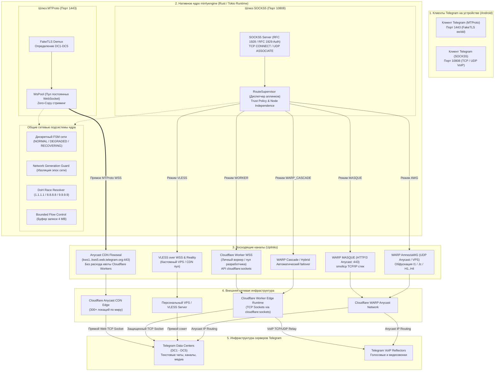

<div align="center">


# Mirrly TG Proxy для Android

**Локальный шлюз маршрутизации для Telegram на нативном движке Rust (mirrlyengine) с поддержкой MTProto, SOCKS5, мульти-аплинк туннелирования (Anycast CDN Flowseal, Cloudflare Worker WSS) без системного VPN**

<br/>

**[ 🇷🇺 Русский ](README.md)** &nbsp;|&nbsp; **[ 🇬🇧 English ](README_EN.md)**

<br/>

[](https://developer.android.com)
[](https://kotlinlang.org)
[](https://developer.android.com/jetpack/compose)
[](mirrlyengine)
[](https://workers.cloudflare.com)
[](https://developer.android.com/ndk)
<br/>
[](https://github.com/joycecurcirt539-dot/Mirrly-TG-Proxy/releases)
[](#7-интерфейс-приложения)
[](CHANGELOG.md)
[](https://github.com/joycecurcirt539-dot/Mirrly-TG-Proxy/releases)
[](https://github.com/joycecurcirt539-dot/Mirrly-TG-Proxy/stargazers)
[](https://github.com/joycecurcirt539-dot/Mirrly-TG-Proxy/issues?q=is%3Aissue+is%3Aclosed)
[](https://github.com/joycecurcirt539-dot/Mirrly-TG-Proxy/issues)
<br/>
[](https://t.me/WhyOkyHb)
[](#15-безопасность-и-условия-использования)
[](tools/deploy-worker/worker.js)
[](tools/deploy-worker)
[](CHANGELOG.md)
[](TERMS_OF_USE.md)
[](LICENSE)

*Маршрутизация трафика Telegram через нативное ядро mirrlyengine (Rust/Tokio). Поддерживает протоколы MTProto и SOCKS5, дискретный конечный автомат стабильности сети FSM, потоковый контроль буферов 4 МБ и безопасную экспресс-диагностику. Работает локально на устройстве без root-прав и без создания системного VPN-соединения.*

<br/>

<picture>
  <source media="(prefers-color-scheme: dark)" srcset="https://github.com/joycecurcirt539-dot/Mirrly-TG-Proxy/blob/output/github-contribution-grid-snake-dark.svg?raw=true">
  <source media="(prefers-color-scheme: light)" srcset="https://github.com/joycecurcirt539-dot/Mirrly-TG-Proxy/blob/output/github-contribution-grid-snake.svg?raw=true">
  
</picture>

---

</div>

## Оглавление

1. [Что такое Mirrly TG Proxy](#1-что-такое-mirrly-tg-proxy)
2. [Технический принцип работы](#2-технический-принцип-работы)
3. [Режимы восходящего канала (Uplink Modes)](#3-режимы-восходящего-канала-uplink-modes)
4. [Ключевые возможности и архитектурные модули](#4-ключевые-возможности-и-архитектурные-модули)
5. [Архитектура системы](#5-архитектура-системы)
6. [Поддерживаемые клиенты Telegram](#6-поддерживаемые-клиенты-telegram)
7. [Интерфейс приложения](#7-интерфейс-приложения)
8. [Быстрый старт и установка](#8-быстрый-старт-и-установка)
9. [Конфигурация и параметры](#9-конфигурация-и-параметры)
10. [Создание и настройка Cloudflare Worker](#10-создание-и-настройка-cloudflare-worker)
11. [Структура проекта и сборка из исходного кода](#11-структура-проекта-и-сборка-из-исходного-кода)
12. [График активности разработки](#12-график-активности-разработки)
13. [Динамика звезд репозитория](#13-динамика-звезд-репозитория)
14. [Хронология развития](#14-хронология-развития)
15. [Безопасность и условия использования](#15-безопасность-и-условия-использования)
16. [Благодарности и Зал Славы](#16-благодарности-и-зал-славы)

---

## 1. Что такое Mirrly TG Proxy

**Mirrly TG Proxy** — бесплатное Android-приложение с открытым исходным кодом, выполняющее роль локального шлюза проксирования трафика Telegram. Приложение решает проблему нестабильной связи, блокировок протоколов, замедления медиафайлов и фильтрации DPI со стороны интернет-провайдеров и мобильных операторов.

Приложение **не использует** системный интерфейс `VpnService` для проксирования Telegram и **не перехватывает** трафик сторонних программ устройства. Соединение Telegram направляется через локальный сетевой сокет (`127.0.0.1:1443` для MTProto или `127.0.0.1:10808` для SOCKS5) на высокопроизводительное нативное ядро `mirrlyengine` (Rust/Tokio). Ядро инкапсулирует пакеты в защищенные внешние туннели и передает их в дата-центры Telegram через инфраструктуру Cloudflare Edge, персональные Cloudflare Workers, VLESS или кастомные туннели.

---

### Статус и классификация возможностей

#### 1. Готовый функционал (Стабильно)
* **Два локальных протокола Telegram**:
  * *MTProto* (порт `1443`): FakeTLS маскировка `ee` / `dd`, пул постоянных соединений `WsPool` и прямое взаимодействие с Anycast CDN.
  * *SOCKS5* (порт `10808`): прозрачный TCP-релей с субнегоциацией логина и пароля (RFC 1928 / RFC 1929), поддержкой доменных имен, IPv4/IPv6, передачи голосовых и видеозвонков.
* **Стабильные режимы восходящего канала (Uplinks)**:
  * `WORKER`: туннелирование через Cloudflare Worker по протоколу WebSocket TLS 1.3 на порт 443 с фильтрацией Anti-Open-Relay.
  * `VLESS`: протокол VLESS over WebSocket с маскировкой под HTTPS-трафик на порт 443, поддержкой пула CDN-доменов и Reality.
  * `SOCKS5`: прямое туннелирование TCP-потоков через защищенные релеи.
  * `HYBRID`: автоматическое резервирование соединения при недоступности основного узла.
* **Сетевой стек и стабильность**:
  * *DC-Affinity Engine*: привязка сессий Telegram к дата-центрам DC1–DC5 для исключения повторных рукопожатий.
  * *Политика доверия (Trust Policy)*: изоляция персональных VPS-конфигураций от утечки на публичные релеи (`allowPublicRelayFallbackForPrivateVps`).
  * *Дискретный FSM*: автомат состояний (`NORMAL`, `DEGRADED`, `RECOVERING`) с защитой от флэппинга (окно фиксации 5–10 сек, охлаждение 30–60 сек).
  * *Network Generation Guard*: изоляция сетевых поколений для исключения гонок сокетов при переключении Wi-Fi / LTE.
  * *Bounded Flow Control*: буфер записи 4 МБ в воркере и Rust-ядре с контрольными водяными знаками (устранение ошибки WebSocket 1009 при отправке тяжелых медиафайлов).
  * *Smart Connect*: экспресс-анализ сетевого стека за 2–3 секунды перед установлением соединения.
* **Интерфейс и локализация**:
  * *Двухуровневые настройки*: Простой режим (Simple) для быстрого старта и Продвинутый режим (Advanced) для тонкого тюнинга сокетов (`TCP_NODELAY`, буферы).
  * *Полная двуязычность*: поддержка русского и английского языков (`values-en`), а также выбор языка приложения в Android 13+ (`locales_config`).
  * *Экран первого запуска (Onboarding)*: стартовое руководство для новых пользователей.
  * *Официальный Telegram-канал*: экран взаимодействия с сообществом проекта (`@WhyOkyHb`).
  * *Безопасный диагностический отчёт*: генерация моноширинного отчёта с автоматическим маскированием паролей, ключей и персональных доменов (`Zero Secret Leak`).
  * *Доменная классификация ошибок (Error Taxonomy)*: понятные тексты для пользователей и машиночитаемые коды для логов.
  * *Проверка подлинности обновлений*: нативная C++ NDK верификация цифровой подписи APK (`SignatureVerifier`) и парсинг контрольных сумм SHA-256 в `UpdateChecker`.

#### 2. Функционал на стадии тестирования (Экспериментально / зависит от провайдера)
* **Режим MASQUE (Anycast HTTP/3)**: прямое туннелирование через Cloudflare WARP (`CONNECT-UDP` и QUIC-дейтаграммы). Зависит от доступности UDP/Anycast у конкретного оператора связи.
* **Режим AWG (AmneziaWG Anycast)**: обфусцированный WireGuard для обхода DPI (`H1..H4`, `Jc`, инициализация `I1`, поддержка кастомных INI-конфигураций).
* **Каскадный режим (WARP_CASCADE)**: интеллектуальная цепочка переключений `MASQUE` -> `AWG` -> `Worker WSS`.
* **WARP Pipeline Profiler**: инструментальный замер миллисекундных задержек 4 фаз подключения.
* **Менеджер аккаунтов WARP**: регистрация учетных данных и сканирование Anycast-эндпоинтов на стороне клиента.

#### 3. В разработке (Превью)
* **Системный VPN-режим (VpnService)**: графический интерфейс с кинетическим орбитальным кольцом для будущего перехвата общесистемного трафика (в текущем релизе проксирование Telegram полностью автономно и не требует системного VPN).
* **Встроенный замер скорости (SpeedTest)**: модуль измерения пропускной способности соединения внутри приложения.

---

## 2. Технический принцип работы

Приложение запускает на устройстве два независимых локальных шлюза на базе нативного движка **mirrlyengine** (Rust/Tokio):

### Пайплайн 1: MTProto Gateway (`127.0.0.1:1443`) — Прямое Anycast CDN туннелирование
1. Клиент Telegram подключается к локальному адресу `127.0.0.1:1443` по протоколу MTProto FakeTLS (с секретным ключом `ee` / `dd`).
2. Нативное ядро `mirrlyengine` выполняет разбор FakeTLS, извлекает целевой дата-центр Telegram (DC1–DC5) и тип трафика (сообщения или медиа).
3. Модуль пула соединений `WsPool` берёт готовое или открывает новое постоянное WebSocket-соединение с официальными шлюзами Telegram Web (`kws1..kws5.web.telegram.org:443/apiws`) через Anycast CDN.
4. Выбор пограничного сервера Cloudflare CDN осуществляется через DoH-резолвер (`dns.rs`), алгоритм Happy Eyeballs (RFC 8305) и балансировщик задержек (`balancer.rs`).
5. **Расход квоты воркеров равен нулю**: MTProto взаимодействует напрямую с Anycast CDN Telegram Web и не расходует суточные лимиты Cloudflare Workers.

### Пайплайн 2: SOCKS5 Gateway (`127.0.0.1:10808`) — Мульти-аплинк супервизор (RouteSupervisor)
1. Клиент Telegram подключается к локальному адресу `127.0.0.1:10808` по протоколу SOCKS5 с обязательной аутентификацией RFC 1929 (логин и пароль).
2. Обрабатываются команды:
   * `CONNECT (0x01)`: проксирование TCP-потоков чатов, каналов, ботов и загрузки медиафайлов;
   * `UDP ASSOCIATE (0x03)`: туннелирование UDP-дейтаграмм для голосовых и видеозвонков Telegram VoIP.
3. Диспетчер маршрутизации `RouteSupervisor` направляет поток в выбранный восходящий транспорт (Uplink):
   * **`WORKER`**: туннелирование через WebSocket TLS 1.3 на персональный Cloudflare Worker (или пул разработчика), который открывает прямое TCP-соединение с целевым DC через API `cloudflare:sockets`;
   * **`VLESS`**: передача данных по протоколу VLESS over WebSocket (TLS 1.3 :443) или Reality напрямую на личный VPS или CDN;
   * **`MASQUE`** *(в тестировании)*: Anycast туннелирование через HTTP/3 QUIC (`CONNECT-UDP`) с встроенным стеком TCP/IP `smoltcp` в сеть Cloudflare WARP;
   * **`AWG`** *(в тестировании)*: обфусцированный WireGuard Anycast с защитой от сигнатурного анализа DPI (`I1`, `Jc`, `H1..H4`) и стеком `smoltcp`;
   * **`WARP_CASCADE` / `HYBRID`**: интеллектуальное переключение между протоколами при деградации радиоканала или блокировках.

---

## 3. Режимы восходящего канала (Uplink Modes для SOCKS5)

В режиме SOCKS5 маршрутизатор `RouteSupervisor` ядра `mirrlyengine` поддерживает следующие транспорты (в режиме MTProto используется специализированный Anycast CDN пул `WsPool`):

| Режим (`UplinkMode`) | Статус | Протокол и порт | Описание и назначение |
| :--- | :--- | :--- | :--- |
| **`WORKER`** | **Стабильно** | WebSocket TLS 1.3 (`:443`) | Трафик инкапсулируется в WebSocket к Cloudflare Worker, где через `cloudflare:sockets` открывается TCP-сокет к дата-центрам или VoIP-узлам Telegram. Защищен правилами Anti-Open-Relay. |
| **`VLESS`** | **Стабильно** | VLESS WSS TLS 1.3 (`:443`) | Протокол VLESS с маскировкой под стандартный HTTPS-трафик на порт 443. Поддерживает пулы доменов CDN, кастомные VPS и технологию Reality. |
| **`HYBRID`** | **Стабильно** | WSS + Резерв | Основным каналом выступает Cloudflare Worker WSS. При возникновении ошибок или исчерпании суточного лимита (HTTP 429) соединение прозрачно переключается на резервный канал. |
| **`MASQUE`** | **Тестирование** | HTTP/3 QUIC (`:443`) | Прямое Anycast туннелирование через архитектуру Cloudflare WARP MASQUE (`CONNECT-UDP`) с юзерспейс-стеком `smoltcp`. Зависит от доступности UDP у оператора связи. |
| **`AWG`** | **Тестирование** | WireGuard UDP | Обфусцированный WireGuard Anycast с защитой от сигнатурного анализа DPI (`H1..H4`, `Jc`, `I1`) и стеком `smoltcp`. Доступна загрузка кастомных конфигураций INI для собственных серверов. |
| **`WARP_CASCADE`** | **Тестирование** | MASQUE + AWG + WSS | Интеллектуальный каскадный режим: приоритетный запуск MASQUE с автоматическим переходом на AWG при блокировке UDP и аварийным возвратом на Worker WSS. |

---

## 4. Ключевые возможности и архитектурные модули

### Стабилизация сети и устранение флэппинга (FSM & Anti-Flapping)
* **Дискретный конечный автомат (FSM)**:
  * `NORMAL`: задержки в норме, потери отсутствуют, активен стандартный режим сокетов;
  * `DEGRADED`: подтвержденная деградация радиоканала (рост RTT > 500 мс, джиттер > 60 мс или серия потерь);
  * `RECOVERING`: фаза плавной стабилизации после смены сетевого интерфейса.
* **Окно гистерезиса (Hysteresis Window)**: переключение профилей происходит только при фиксации деградации в течение 5–10 секунд непрерывного наблюдения.
* **Период охлаждения (Cool-down Period)**: после любого изменения параметров соединения накладывается блокировка повторных переключений на 30–60 секунд для исключения паразитного циклического резонанса.

### Изоляция поколений сети (Network Generation Guard)
Каждому сетевому состоянию присваивается уникальный номер поколения (`network_generation`). При смене сети (Wi-Fi ↔ LTE) сокеты и DNS-ответы предыдущего поколения инвалидируются, что предотвращает зависание соединений.

### Экспресс-анализ перед подключением (Smart Connect)
При включении служба выполняет быструю проверку готовности сетевого стека за 2–3 секунды:
1. Экспресс-валидация доступности DNS-резолверов (DoH и системный DNS);
2. Проверка пула адресов для активного режима подключения;
3. Выбор наименее загруженного узла с минимальным пингом;
4. Отображение статуса в интерфейсе («Оптимизация маршрута...»).

### Разделение настроек (Simple vs Advanced Settings UX)
* **Простой режим (Simple Mode — по умолчанию)**: лаконичный интерфейс без инженерной терминологии. Содержит только выбор режима прокси (MTProto / SOCKS5), выбор аплинка, таймер сна, расписание работы, автозапуск при загрузке устройства, выбор языка и темы.
* **Продвинутый режим (Advanced Mode)**: активируется переключателем внизу экрана настроек. Открывает секции тонкой настройки сокетов (`TCP_NODELAY`: Авто / Вкл / Выкл), управление буферами сокетов, емкостью пула WebSocket, параметрами Happy Eyeballs, ручным вводом Anycast IP и кастомных параметров AWG/VLESS.

### Безопасный диагностический отчёт (Zero Secret Leak)
* Формирование структурированного отчёта о состоянии устройства и сетевого стека в моноширинном формате на экране `DiagnosticReportScreen`.
* **Строгая анонимизация**: автоматическое маскирование паролей SOCKS5, токенов учетных записей, закрытых ключей WireGuard (`[REDACTED]`), персональных IP-адресов и приватных доменов воркеров (`***.workers.dev`).
* Экспорт в один клик: копирование в буфер обмена и отправка через системное меню `ShareSheet` для оформления GitHub Issues.

### Доменная классификация ошибок (Error Taxonomy)
* **Пользовательский уровень (UI и уведомления)**: понятный текст на выбранном языке («Превышен суточный лимит воркера», «Нет связи с DNS-сервером», «Мобильный интернет отключён»).
* **Инженерный уровень (отчёт и логи)**: машиночитаемые коды:
  * `WORKER_QUOTA_EXCEEDED` — исчерпание суточного лимита бесплатного тарифа Cloudflare (HTTP 429, 1015, 1027);
  * `DNS_RESOLUTION_UNAVAILABLE` — сбой резолвинга доменных имен;
  * `SOCKS5_AUTH_REJECTED` — ошибка аутентификации пользователя SOCKS5 (RFC 1929);
  * `CLOUDFLARE_EDGE_BLOCKED` — сброс соединения на уровне DPI провайдера;
  * `WARP_HANDSHAKE_TIMEOUT` — блокировка UDP-пакетов WireGuard;
  * `NETWORK_INTERFACE_DOWN` — полное отключение сетевых интерфейсов устройства.

### Потоковый контроль медиа и видео (Bounded Flow Control)
* Лимит буфера записи в JS-воркере и Rust-ядре увеличен до 4 МБ (`MAX_PENDING_WRITE_BYTES = 4 * 1024 * 1024`).
* Последовательная FIFO-очередь с асинхронным чтением Blob и ArrayBuffer.
* Защита от обрыва сессий WebSocket (код 1009) при параллельной отправке нескольких медиафайлов клиентом Telegram.

### Энергосбережение Deep Dormancy и Battery Guard
* **Спящий режим при отсутствии сети (Deep Dormancy)**: при отключении интернета (авиарежим, потеря сигнала) служба закрывает сетевые сокеты и приостанавливает циклы DoH-запросов и пинга. При восстановлении сети соединение возобновляется моментально без холостого расхода батареи.
* **Защита аккумулятора (Battery Guard)**: настраиваемое автоматическое отключение прокси при снижении заряда батареи ниже заданного порога (5%, 10%, 15%, 20%, 25%) или переходе Android в режим энергосбережения при работе не от зарядного устройства.

### SOCKS5-аутентификация (RFC 1928 / RFC 1929)
* Нативная поддержка Username/Password Subnegotiation в ядре `mirrlyengine`.
* Диалог обязательной настройки учетных данных перед первым запуском SOCKS5 для исключения работы открытого прокси в локальной сети устройства.
* Автоматическая передача логина и пароля в ссылках быстрого подключения: `tg://socks?server=127.0.0.1&port=10808&user=...&pass=...`.

---

## 5. Архитектура системы



---

## 6. Поддерживаемые клиенты Telegram

Приложение автоматически определяет установленные клиенты Telegram и позволяет активировать прокси в один клик:

* **Официальные клиенты**: Telegram, Telegram X
* **Расширенные клиенты**: AyuGram, NekoGram, Nagram, ExteraGram, Plus Messenger
* **Сторонние клиенты**: Cherrygram, Nicegram, iMe Messenger, Telegraph, MDGram, Dahl, Litegram, Nullgram, ForkClient, BifToGram

---

## 7. Интерфейс приложения

Пользовательский интерфейс разработан на Jetpack Compose с адаптацией под размеры экранов (`AdaptiveLayoutHelper`) и поддержкой двух языков (Русский и English):

* **Главный экран (`HomeScreen`)**: центральная кнопка управления прокси, статус подключения, кольцо качества сети, переключатель режимов MTProto / SOCKS5, кнопка быстрого перехода «В Telegram» и лаконичная карточка активного маршрута (`Cloudflare WSS · Защищено`).
* **Экран настроек (`SettingsScreen`)**:
  * *Простой режим*: выбор режима прокси, аплинка, таймер сна, расписание работы, автозапуск при включении устройства, выбор языка и темы.
  * *Продвинутый режим*: параметры сокетов `TCP_NODELAY`, буферы сокетов, емкость WebSocket-пула, параметры Anycast WARP, кастомные конфигурации AWG/VLESS.
* **Экран первого запуска (`OnboardingScreen`)**: пошаговый интерактивный мастер для быстрой начальной настройки.
* **Официальный Telegram-канал (`TelegramChannelScreen`)**: информация о сообществе проекта и прямая ссылка на канал `@WhyOkyHb`.
* **Менеджер воркеров (`WorkerManagerScreen`)**: список добавленных воркеров Cloudflare с замером пинга, статусными кодами (включая HTTP 429), вкладка сканера QR-кодов CameraX + Google ML Kit и вкладка генератора QR-кодов для обмена узлами.
* **Аналитика воркера (`WorkerAnalyticsScreen`)**: детальный график Безье суточного использования квоты Cloudflare с тач-скраббером и таймером до сброса квоты (00:00 UTC).
* **Сетевая диагностика (`NetworkDiagnosticScreen`)**: отображение метрик SQI (0–100%), задержки RTT, джиттера, надежности доставки, расчет рейтинга ITU-T G.107 MOS и кнопка перехода к формированию диагностического отчёта.
* **Диагностический отчёт (`DiagnosticReportScreen`)**: безопасный просмотр отчёта о конфигурации с маскированием конфиденциальных данных и кнопками экспорта для GitHub Issues.
* **История сессий (`HistoryScreen`)**: журнал запусков прокси с продолжительностью сессий, объемом переданного трафика и зафиксированными протоколами.
* **Журнал событий (`LogsScreen`)**: просмотр системных логов в реальном времени с дедупликацией записей, фильтрацией и экспортом.
* **Экран обновлений (`UpdateScreen`)**: проверка обновлений через GitHub API, отображение списка изменений, валидация отпечатков SHA-256 и нативная верификация подписи APK (`SignatureVerifier`).
* **Экран системного VPN (`VpnModeScreen`)**: кинетический интерфейс с орбитальным кольцом и Aegis-контуром (функция в разработке).
* **Тестирование скорости (`TunnelSpeedTestScreen`)**: замер скорости туннеля (модуль в разработке).

---

## 8. Быстрый старт и установка

1. Скачайте установочный пакет со страницы [Релизы GitHub](https://github.com/joycecurcirt539-dot/Mirrly-TG-Proxy/releases).
2. Выберите подходящий файл APK для вашего устройства:
   * **`app-universal-release.apk`**: универсальная сборка со всеми нативными библиотеками (ARM64, ARMv7, x86, x86_64). Подходит для любого Android-устройства. Основной файл для автообновлений.
   * **`app-arm64-v8a-release.apk`**: оптимизированная сборка для большинства современных смартфонов и планшетов (64-битные процессоры ARM). Обладает наименьшим размером файла.
   * **`app-armeabi-v7a-release.apk`**: для старых 32-битных ARM-устройств.
   * **`app-x86_64-release.apk`**: для 64-битных эмуляторов Android (Android Studio, LDPlayer, BlueStacks) и устройств на базе процессоров Intel/AMD.
   * **`app-x86-release.apk`**: для 32-битных эмуляторов Android x86.
3. Установите APK на устройство под управлением Android 8.0 (API 26) или новее.
4. Откройте **Mirrly TG Proxy** и нажмите центральную кнопку включения. Приложение выполнит экспресс-проверку (Smart Connect) и запустит службу.
5. Нажмите кнопку **«В Telegram»** и подтвердите сохранение прокси в открывшемся окне мессенджера.

---

## 9. Конфигурация и параметры

Основные параметры конфигурации прокси (`ProxyConfig`), сохраняемые в локальном защищенном хранилище:

| Параметр | По умолчанию | Описание |
| :--- | :--- | :--- |
| `proxyModeName` | `MTPROTO` | Активный локальный режим: `MTPROTO` или `SOCKS5` |
| `uplinkModeName` | `WORKER` | Режим восходящего канала: `WORKER`, `VLESS`, `HYBRID`, `MASQUE`, `AWG`, `WARP_CASCADE` |
| `bindHost` / `bindPort` | `127.0.0.1:1443` | Локальный IP-адрес и порт для MTProto |
| `socks5Port` | `10808` | Локальный TCP-порт для SOCKS5 |
| `socks5Username` / `socks5Password` | `""` | Учетные данные SOCKS5-аутентификации (RFC 1929) |
| `secretHex` | генерируется при первом запуске | Секретный ключ MTProto (34 hex-символа с префиксом `dd`) |
| `customCfDomain` | `""` | Персональный домен Cloudflare Worker |
| `speedPresetName` | `AUTO` | Профиль скорости: `AUTO`, `ECO`, `BALANCED`, `TURBO`, `ULTRA` |
| `tcpNoDelayModeName` | `AUTO` | Режим алгоритма Нагла: `AUTO`, `ON`, `OFF` |
| `bufferSizeBytes` | `262144` (256 КБ) | Размер буфера сокетов по умолчанию |
| `useDefaultWorkerSocks5` | `true` | Использование пула воркеров разработчика при отсутствии личного домена |
| `isBatteryGuardEnabled` | `false` | Автоматическое отключение при критическом разряде аккумулятора |
| `batteryGuardThreshold` | `15` | Порог срабатывания защиты аккумулятора (в процентах) |
| `awgStrategyName` | `BALANCED` | Пресет обфускации AmneziaWG: `FAST`, `BALANCED`, `DEEP_STEALTH`, `CUSTOM` |
| `awgCustomIni` | `""` | Пользовательская конфигурация AmneziaWG INI для личного VPS |
| `allowPublicRelayFallbackForPrivateVps` | `false` | Запрет перенаправления приватного VPS на публичные релеи |
| `autostartOnBoot` | `false` | Автозапуск прокси-службы при загрузке системы Android |
| `verboseLogs` | `true` | Подробная запись сетевых событий в журнал |

---

## 10. Создание и настройка Cloudflare Worker

Развертывание персонального Cloudflare Worker занимает 1–2 минуты и не требует платных подписок. Персональный воркер предоставляет индивидуальную суточную квоту в 100 000 запросов и исключает конкуренцию за полосу пропускания.

### Способ 1: Автоматическое развертывание через CLI (рекомендуется)

Инструменты автодеплоя расположены в каталоге [`tools/deploy-worker/`](tools/deploy-worker/):

#### Вариант A: Windows (в 1 клик)
1. Перейдите в каталог `tools/deploy-worker/`.
2. Запустите файл **`deploy.bat`** двойным щелчком.
3. Скрипт проверит наличие Node.js (при необходимости предложит установку), установит Wrangler CLI, откроет авторизацию в браузере и выполнит развертывание.
4. В консоли отобразится готовый QR-код для моментального сканирования камерой смартфона.

#### Вариант B: PowerShell (одной строкой)
```powershell
irm https://raw.githubusercontent.com/joycecurcirt539-dot/Mirrly-TG-Proxy/main/tools/deploy-worker/deploy.ps1 | iex
```

#### Вариант C: Linux / macOS / WSL
```bash
chmod +x tools/deploy-worker/deploy.sh
./tools/deploy-worker/deploy.sh
```

### Способ 2: Ручное создание через панель управления Cloudflare

1. Войдите в панель [dash.cloudflare.com](https://dash.cloudflare.com/).
2. Перейдите в раздел **Workers & Pages** → **Create application** → **Create Worker**.
3. Задайте имя воркера и нажмите **Deploy**.
4. Нажмите **Edit code**, удалите шаблонный код и вставьте содержимое файла [`tools/deploy-worker/worker.js`](tools/deploy-worker/worker.js) (или [`docs/cloudflare_worker.js`](docs/cloudflare_worker.js)).
5. Нажмите **Deploy** для сохранения.
6. Скопируйте полученный адрес (например: `my-proxy.username.workers.dev`).
7. В приложении **Mirrly TG Proxy** перейдите в **Менеджер воркеров** → **Добавить воркер** и сохраните адрес.

---

## 11. Структура проекта и сборка из исходного кода

### Дерево каталогов репозитория

```text
Mirrly TG Proxy/
├── app/                  # Android-клиент (Jetpack Compose UI, Foreground Service, NDK C++ native_sec.cpp)
│   ├── src/main/cpp/     # Нативный C++ модуль верификации подписи APK (native_sec.cpp, CMakeLists.txt)
│   ├── src/main/java/    # UI экраны, онбординг, каналы, сервисы фоновой работы, локализация
│   └── src/main/res/     # Ресурсы, разметка, векторные иконки, strings.xml (RU / EN)
├── core/                 # Модуль бизнес-логики и сетевых алгоритмов Kotlin
│   └── src/main/kotlin/  # LocalProxyServer, FFI NativeProxy, DoH, FSM, GenerationGuard, UpdateChecker
├── mirrlyengine/         # Высокопроизводительное нативное ядро на языке Rust (Tokio runtime)
│   ├── src/awg.rs        # Протокол AmneziaWG (обфускация WireGuard, QUIC I1, мусорные пакеты Jc)
│   ├── src/balancer.rs   # Happy Eyeballs v2 (RFC 8305) и балансировщик Anycast
│   ├── src/bridge.rs     # FFI-мост между Kotlin и нативным рантаймом Tokio
│   ├── src/budget.rs     # Управление бюджетом соединений (Dial Budget)
│   ├── src/cfproxy.rs    # Туннелирование через Cloudflare WSS с защитой от 429 ошибок
│   ├── src/dns.rs        # DoH-резолвер и гонка DNS-ответов
│   ├── src/faketls.rs    # MTProto FakeTLS (домены, ee/dd префиксы)
│   ├── src/generation_guard.rs # Защита от гонок сетевых поколений
│   ├── src/masque.rs     # WARP MASQUE HTTP/3 CONNECT-UDP
│   ├── src/network_profile.rs  # Дискретный FSM стабильности сети (NORMAL, DEGRADED, RECOVERING)
│   ├── src/node_independence.rs # Политики изоляции приватных и публичных узлов
│   ├── src/proxy.rs      # MTProto-сервер, FakeTLS ee/dd, WsPool
│   ├── src/recovery.rs   # Механизмы восстановления соединений и дренажа потоков
│   ├── src/socks5.rs     # SOCKS5-сервер, RFC 1929 субнегоциация, TCP relay
│   ├── src/supervisor.rs # Оркестратор мульти-аплинков (RouteSupervisor) и Trust Policy
│   ├── src/timeline.rs   # Профилирование фаз запуска туннелей
│   ├── src/tls_observability.rs # Наблюдаемость параметров TLS-хэндшейков
│   ├── src/vless.rs      # VLESS over WebSocket & Reality
│   ├── src/ws.rs         # Потоковый контроль буферов WebSocket (4 MB)
│   └── Cargo.toml        # Конфигурация крейта и зависимости Rust
├── tools/                # Вспомогательные утилиты разработки и сборки
│   ├── build/            # Скрипты компиляции нативного Rust-ядра под 4 ABI (build_native.ps1, build_native.sh, clean_all.ps1)
│   └── deploy-worker/    # Автодеплой воркеров (deploy.bat, deploy.ps1, deploy.sh, worker.js)
├── docs/                 # Документация, релиз-ноутсы и скрипт cloudflare_worker.js
└── gradle/               # Конфигурация Gradle Wrapper
```

### Системные требования для сборки

* Android SDK (API Level 35, Build-Tools 35.0.0)
* Android NDK (рекомендуется NDK 27+)
* Rust Toolchain (`cargo`), установленные таргеты:
  ```bash
  rustup target add aarch64-linux-android armv7-linux-androideabi x86_64-linux-android i686-linux-android
  ```
* Java Development Kit (JDK 17+)

### Порядок сборки из консоли

```bash
# 1. Клонирование репозитория
git clone https://github.com/joycecurcirt539-dot/Mirrly-TG-Proxy.git
cd Mirrly-TG-Proxy

# 2. Компиляция нативного Rust-ядра под все 4 архитектуры ABI
# Windows PowerShell:
.\tools\build\build_native.ps1
# Linux / macOS Bash:
chmod +x tools/build/build_native.sh
./tools/build/build_native.sh

# 3. Сборка релизных пакетов APK
./gradlew assembleRelease
```

Скомпилированные установочные пакеты формируются в директории `app/build/outputs/apk/release/`.

---

## 12. График активности разработки

<div align="center">

[](https://github.com/joycecurcirt539-dot/Mirrly-TG-Proxy)

</div>

---

## 13. Динамика звезд репозитория

<div align="center">

<a href="https://www.star-history.com/?repos=joycecurcirt539-dot%2FMirrly-TG-Proxy&type=date&legend=top-left">
 <picture>
   <source media="(prefers-color-scheme: dark)" srcset="https://api.star-history.com/chart?repos=joycecurcirt539-dot/Mirrly-TG-Proxy&type=date&theme=dark&legend=top-left&sealed_token=2ZxdQVXYtszPQ2_C8iS9hYFI8zb-495pG47H9KSmQnTviNfwec-JUTZdeRmiaKkKmwYIJtF-i3x7BFk051JjPV3k1ensh6WvgBtwCmxaOybEdxs0ZFVSwdhZA0lCRQriwItHEtGZthEt_5HPt-BnP6JZcgNJkf69g2MAvm6KiC_6E8vZ1g7q8BLEmeFm" />
   <source media="(prefers-color-scheme: light)" srcset="https://api.star-history.com/chart?repos=joycecurcirt539-dot/Mirrly-TG-Proxy&type=date&legend=top-left&sealed_token=2ZxdQVXYtszPQ2_C8iS9hYFI8zb-495pG47H9KSmQnTviNfwec-JUTZdeRmiaKkKmwYIJtF-i3x7BFk051JjPV3k1ensh6WvgBtwCmxaOybEdxs0ZFVSwdhZA0lCRQriwItHEtGZthEt_5HPt-BnP6JZcgNJkf69g2MAvm6KiC_6E8vZ1g7q8BLEmeFm" />
   
 </picture>
</a>

</div>

---

## 14. Хронология развития

Проект начат **27 июля 2026 года** с публикации версии `v1.0.0`. Эволюция ключевых этапов развития системы:

| Версия / Дата | Этап развития | Ключевые изменения |
| :--- | :--- | :--- |
| **`v1.0.0`** (27.07.2026) | Генезис | Первый публичный релиз. Локальный MTProto-шлюз на порту 1443, WsPool, интеграция с клиентами Telegram. |
| **`v1.0.4–1.0.5`** | Лицензия и буферизация | Переход на лицензию GPLv3, скоростные буферы, управление `TCP_NODELAY`. |
| **`v1.0.6–1.0.8`** | Защита и интерфейс | Нативная проверка цифровой подписи по SHA-256 (`SignatureVerifier`), таймер сна, аппаратное размытие `FLAG_BLUR_BEHIND`. |
| **`v1.0.9`** | SOCKS5 и звонки | Асинхронный TCP-релей SOCKS5 на порту 10808 через API `cloudflare:sockets`. Поддержка голосовых и видеозвонков. |
| **`v1.1.0–1.1.1`** | Стабилизация | Устранение JNI-конфликтов, индикация статус-бара, переход на ABI Splits. |
| **`v1.1.2`** | Переход на Rust | Перепись ядра на Rust (`mirrlyengine`): Zero-Copy, Tokio runtime, неблокирующий ввод-вывод epoll, устранение пауз GC. |
| **`v1.1.3–1.1.3.1`** | Менеджер воркеров | Менеджер узлов Cloudflare, алгоритм Happy Eyeballs (RFC 8305), deep links `mirrly://worker`. |
| **`v1.1.4`** | Полный Rust стек | Удаление устаревших JVM-сокетов, мгновенный failover, Anti-Open-Relay фильтрация в скрипте воркера. |
| **`v1.1.5`** | Оркестратор протоколов | 3-фазный менеджер переключения протоколов, гонка воркеров разработчика. |
| **`v1.1.6–1.1.6.1`** | WebSocket оптимизация | Сборка фрагментированных фреймов до 16 МБ, очередь записи, автодеплой `deploy.bat`. |
| **`v1.1.7`** | Anycast CDN и UI | Перевод MTProto на Anycast CDN Flowseal, гонка со сдвигом 25 мс, рендеринг без аллокаций памяти (120 FPS). |
| **`v1.1.8`** | DoH, аналитика, QoS | DoH Race Resolver, DC-Affinity, аналитика суточной квоты с графиком Безье, Battery & Thermal QoS, Multi-APK Architecture Engine. |
| **`v1.1.8.1`** | Редизайн таймера сна | Нормализация доменов воркеров, Pre-Flight проверка узлов, обновленный диалог таймера сна. |
| **`v1.1.8.2`** | ML Kit и изоляция | Аппаратный сканер QR-кодов Google ML Kit, генератор фирменных QR-кодов, изоляция секретного ключа MTProto, WebPKI сертификаты. |
| **`v1.1.8.3`** | Спидтест и расписание | Тест скорости туннеля, субнегоциация SOCKS5 RFC 1929, планировщик по дням недели, спящий режим Deep Dormancy при офлайне. |
| **`v2.0.0`** | Мульти-аплинк и FSM сети | Мульти-аплинк супервизор `RouteSupervisor` (Cloudflare Worker WSS, VLESS over WSS & Reality, SOCKS5, HYBRID, экспериментальные MASQUE, AWG, Cascade), дискретный FSM сети (`NORMAL`, `DEGRADED`, `RECOVERING`) с защитой от флэппинга, Network Generation Guard, Bounded Flow Control 4 МБ, экспресс-анализ Smart Connect, двухуровневые настройки (Simple/Advanced), экран первого запуска Onboarding, экран Telegram-канала `@WhyOkyHb`, безопасный диагностический отчёт (`Zero Secret Leak`), Error Taxonomy, полная английская и русская локализация, исправление TypeScript в воркере и превью системного VPN-режима. |

---

## 15. Безопасность и условия использования

* **Отсутствие аналитики и слежки**: приложение не содержит рекламных трекеров, сторонних аналитических SDK и не ведет сбор персональных данных пользователей.
* **Принцип нулевой утечки секретов (Zero Secret Leak)**: диагностический отчёт и журналы событий подвергаются обязательной санитарной очистке с маскированием паролей, ключей шифрования и личных доменов.
* **Проверка подлинности сборок**: встроенный модуль `UpdateChecker` выполняет двухэтапную проверку контрольных отпечатков SHA-256 и нативную валидацию цифровой подписи (C++ NDK `SignatureVerifier`). При обнаружении несовпадений установка блокируется (`Fail-Closed`).
* **История изменений**: подробный список изменений задокументирован в файле [CHANGELOG.md](CHANGELOG.md).
* **Лицензия**: исходный код распространяется на условиях свободной лицензии [GNU General Public License v3 (GPLv3)](LICENSE).
* **Пользовательское соглашение**: юридические условия использования сервиса изложены в [TERMS_OF_USE.md](TERMS_OF_USE.md).

---

## 16. Благодарности и Зал Славы

* **[amurcanov](https://github.com/amurcanov)** — разработчик [tg-ws-proxy-android](https://github.com/amurcanov/tg-ws-proxy-android). Архитектурный базис проекта послужил отправной точкой для создания Mirrly TG Proxy.
* **[Flowseal](https://github.com/Flowseal)** — автор [tg-ws-proxy](https://github.com/Flowseal/tg-ws-proxy), создатель оригинальной концепции туннелирования трафика Telegram через WebSocket-сессии Cloudflare.

### Зал Славы исследователей и охотников за багами

* **[Grovymon](https://github.com/Grovymon)** — комплексный аудит безопасности ядра, исследование обхода блокировок на мобильных сетях, выявление специфических багов Window Insets и инициатива внедрения авторизации SOCKS5 RFC 1929 (Issues #3, #4, #5, #7, #8, #15, #16, #18, #19, #20).
* **[zzzxxx888207-design](https://github.com/zzzxxx888207-design)** — диагностика стабильности ключей в оперативной памяти устройства и отладка работы скриптов Cloudflare Workers (Issues #1, #9, #10, #13).
* **[BbIBux](https://github.com/BbIBux)** — диагностика загрузки медиафайлов MTProto на операторах Т2 и Ростелеком, улучшение прозрачности диалогов (Issues #11, #12, #17).
* **[ustiprog](https://github.com/ustiprog)** — инициатива внедрения постоянного таймера сна (Auto-Stop on Start) и предоставление детальной телеметрии разряда аккумулятора при отсутствии интернета, послужившей основой режима Deep Dormancy (Issue #21).
* **[40OIL](https://github.com/40OIL)** — выявление дефекта перекрытия кнопок модальных окон системной трехкнопочной навигацией Android на Samsung Galaxy A55, инициировавшее аудит отступов (Issue #22).
* **[VikKalm](https://github.com/VikKalm)** — телеметрия и локализация блокировок воркеров на Android 13 arm64-v8a (Issue #6).
* **[liveonloan](https://github.com/liveonloan)** — обнаружение визуального бага перекрытия элементов управления на Realme GT7 (Issue #14).
* **[Dimaakaj](https://github.com/Dimaakaj)** — обнаружение синтаксической ошибки TypeScript `ts(2554)` в вызове `serverWs.accept()` в скрипте Cloudflare Worker, восстановившее деплой через веб-интерфейс Cloudflare.

### Содействие локализации и сообществу

* **[MSLight](https://github.com/MSLight)** — инициатива внедрения полной английской локализации интерфейса приложения (Issue #23).
* **[Aseptronn](https://github.com/Aseptronn)** — инициатива персидской локализации (Farsi) и распространение проекта в международном сообществе (Issue #23).
* **Shon4k** — тестирование предварительных сборок и стабильности сетевых соединений.
* **Linar S** — тестирование сетевых сценариев и совместимости на различных аппаратных платформах.
* **Astimir Meikulov** — активный участник официального Telegram-канала [@WhyOkyHb](https://t.me/WhyOkyHb).
* **Илье Вайцману** — автор канала [@airfield1972](https://t.me/airfield1972)„Запасной аэродром.“, за внимание к проекту и публикацию о Mirrly TG Proxy.
