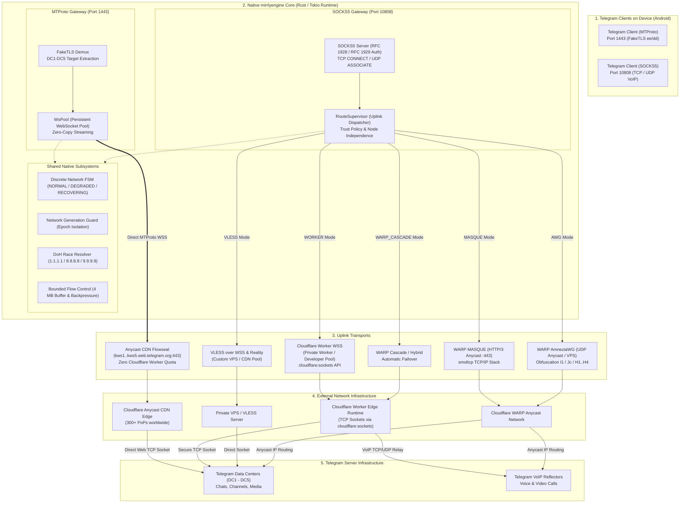

<div align="center">


# Mirrly TG Proxy for Android

**Local routing gateway for Telegram powered by the native Rust engine (mirrlyengine) with MTProto, SOCKS5, and multi-uplink tunneling support (Cloudflare Worker WSS, WARP MASQUE HTTP/3, AmneziaWG, VLESS, WARP Cascade) without system VPN**

<br/>

**[ 🇷🇺 Русский ](README.md)** &nbsp;|&nbsp; **[ 🇬🇧 English ](README_EN.md)**

<br/>

[](https://developer.android.com)
[](https://kotlinlang.org)
[](https://developer.android.com/jetpack/compose)
[](mirrlyengine)
[](https://workers.cloudflare.com)
[](https://developer.android.com/ndk)
<br/>
[](https://github.com/joycecurcirt539-dot/Mirrly-TG-Proxy/releases)
[](#7-application-ui)
[](CHANGELOG.md)
[](https://github.com/joycecurcirt539-dot/Mirrly-TG-Proxy/releases)
[](https://github.com/joycecurcirt539-dot/Mirrly-TG-Proxy/stargazers)
[](https://github.com/joycecurcirt539-dot/Mirrly-TG-Proxy/issues?q=is%3Aissue+is%3Aclosed)
[](https://github.com/joycecurcirt539-dot/Mirrly-TG-Proxy/issues)
<br/>
[](https://t.me/WhyOkyHb)
[](#15-security-and-terms-of-use)
[](tools/deploy-worker/worker.js)
[](tools/deploy-worker)
[](CHANGELOG.md)
[](TERMS_OF_USE.md)
[](LICENSE)

*Telegram traffic routing powered by the native mirrlyengine core (Rust/Tokio). Supports MTProto and SOCKS5 protocols, multi-uplink architecture (Cloudflare Worker WSS, VLESS, WARP MASQUE HTTP/3, AmneziaWG, WARP Cascade), discrete FSM network stabilization, 4 MB buffer flow control, and secure preflight diagnostics. Runs locally on the device without root privileges and without creating a system VPN tunnel.*

<br/>

<picture>
  <source media="(prefers-color-scheme: dark)" srcset="https://github.com/joycecurcirt539-dot/Mirrly-TG-Proxy/blob/output/github-contribution-grid-snake-dark.svg?raw=true">
  <source media="(prefers-color-scheme: light)" srcset="https://github.com/joycecurcirt539-dot/Mirrly-TG-Proxy/blob/output/github-contribution-grid-snake.svg?raw=true">
  
</picture>

---

</div>

## Table of Contents

1. [About Mirrly TG Proxy](#1-about-mirrly-tg-proxy)
2. [How It Works](#2-how-it-works)
3. [Uplink Modes](#3-uplink-modes)
4. [Key Features & Architecture Modules](#4-key-features--architecture-modules)
5. [System Architecture](#5-system-architecture)
6. [Supported Telegram Clients](#6-supported-telegram-clients)
7. [Application UI](#7-application-ui)
8. [Quick Start & Installation](#8-quick-start--installation)
9. [Configuration & Parameters](#9-configuration--parameters)
10. [Cloudflare Worker Setup & Deployment](#10-cloudflare-worker-setup--deployment)
11. [Project Structure & Building from Source](#11-project-structure--building-from-source)
12. [Development Activity Graph](#12-development-activity-graph)
13. [Star History](#13-star-history)
14. [Project Roadmap & Chronology](#14-project-roadmap--chronology)
15. [Security and Terms of Use](#15-security-and-terms-of-use)
16. [Acknowledgements & Hall of Fame](#16-acknowledgements--hall-of-fame)

---

## 1. About Mirrly TG Proxy

**Mirrly TG Proxy** is a free and open-source Android application serving as a high-performance local proxy gateway for Telegram traffic. The application addresses unstable connectivity, protocol throttling, media download slowdowns, and DPI filtering imposed by ISPs and mobile carriers.

The app **does not use** the system `VpnService` for routing Telegram and **does not intercept** third-party device traffic. Telegram connects to a local socket on the device (`127.0.0.1:1443` for MTProto or `127.0.0.1:10808` for SOCKS5) handled by the native `mirrlyengine` core (Rust/Tokio). The engine encapsulates packets into secure external tunnels and relays them to Telegram data centers via Cloudflare Edge Anycast, private Cloudflare Workers, VLESS, or custom tunnels.

---

### Feature Status & Maturity Levels

#### 1. Production-Ready Features (Stable)
* **Dual Local Protocols for Telegram**:
  * *MTProto* (port `1443`): FakeTLS domain masquerading (`ee` / `dd`), persistent connection pool (`WsPool`), and direct interaction with Anycast CDN.
  * *SOCKS5* (port `10808`): Transparent TCP relay with username/password subnegotiation (RFC 1928 / RFC 1929), domain name resolution, IPv4/IPv6 support, and voice/video calls.
* **Stable Uplink Modes**:
  * `WORKER`: Tunneling via Cloudflare Worker over WebSocket TLS 1.3 on port 443 with Anti-Open-Relay security rules.
  * `VLESS`: VLESS over WebSocket masqueraded as standard HTTPS traffic on port 443, supporting CDN domain pools and Reality.
  * `SOCKS5`: Direct TCP stream relaying through secure upstreams.
  * `HYBRID`: Automatic connection failover when the primary upstream becomes unavailable.
* **Networking & Stability Core**:
  * *Telegram DC-Affinity Engine*: Direct session routing to Telegram DCs (DC1–DC5) preventing repeated cryptographic handshakes.
  * *Trust Policy & Node Isolation*: Isolation of private VPS configurations from public relay fallback (`allowPublicRelayFallbackForPrivateVps`).
  * *Discrete FSM Network State Machine*: Three-stage state machine (`NORMAL`, `DEGRADED`, `RECOVERING`) with anti-flapping filters (5–10s hysteresis, 30–60s cooldown).
  * *Network Generation Guard*: Epoch-based socket and DNS cache invalidation during network switches (Wi-Fi ↔ Cellular).
  * *Bounded Flow Control*: 4 MB write buffer in JS Worker and Rust core with watermark backpressure (prevents WebSocket 1009 frame errors during high-volume media transfers).
  * *Smart Connect*: 2–3 second preflight diagnostic check before establishing connections.
* **UI & Localization**:
  * *Dual-Level Settings*: Simple Mode for standard usage and Advanced Mode for socket tuning (`TCP_NODELAY`, socket buffers, TLS).
  * *Full Bilingual Support*: Complete Russian and English localizations (`values-en`), per-app language selection on Android 13+ (`locales_config`).
  * *Onboarding Wizard*: Step-by-step introduction for first-time users.
  * *Official Telegram Channel*: Integrated screen for project community updates (`@WhyOkyHb`).
  * *Safe Diagnostic Report*: Monospace report generator with automatic token, password, and private domain redaction (`Zero Secret Leak`).
  * *Error Taxonomy*: User-friendly localization and machine-readable error codes for logs.
  * *Cryptographic Integrity Verification*: Native C++ NDK signature validation (`SignatureVerifier`) and automated SHA-256 hash checks via `UpdateChecker`.

#### 2. Experimental Features (In Testing / ISP Dependent)
* **MASQUE Mode (Anycast HTTP/3)**: Direct tunneling via Cloudflare WARP using `CONNECT-UDP` and QUIC datagrams. Dependent on UDP/Anycast reachability on the local carrier.
* **AWG Mode (AmneziaWG Anycast)**: Obfuscated WireGuard Anycast designed to bypass DPI (`H1..H4`, `Jc`, `I1` initialization, custom INI import for private VPS).
* **WARP Cascade Mode (`WARP_CASCADE`)**: Intelligent fallback sequence: `MASQUE` -> `AWG` -> `Worker WSS`.
* **WARP Pipeline Profiler**: Millisecond-precision latency profiling across 4 tunnel startup phases.
* **WARP Account Manager**: Client-side device registration and Anycast endpoint scanning.

#### 3. In Active Development (Preview)
* **System VPN Mode (`VpnModeScreen` / `MirrlyVpnService`)**: Kinetic UI preview with orbital ring animation for future device-wide traffic protection (Telegram proxying remains completely autonomous and does not require system VPN).
* **In-App Speed Test (`TunnelSpeedTestScreen` / `SpeedTestInDevDialog`)**: Built-in throughput measurement module.

---

## 2. How It Works

The application operates two independent local gateways powered by the native **mirrlyengine** (Rust/Tokio):

### Pipeline 1: MTProto Gateway (`127.0.0.1:1443`) — Direct Anycast CDN Tunneling
1. The Telegram client connects to `127.0.0.1:1443` using the MTProto FakeTLS protocol (with an `ee` / `dd` secret key).
2. The native `mirrlyengine` core performs FakeTLS demultiplexing, extracting the destination Telegram Data Center (DC1–DC5) and stream type (messages or media).
3. The `WsPool` connection pool borrows or establishes a persistent WebSocket connection to official Telegram Web gateways (`kws1..kws5.web.telegram.org:443/apiws`) through Anycast CDN.
4. Edge server selection is handled by the DoH race resolver (`dns.rs`), Happy Eyeballs (RFC 8305), and the latency-based balancer (`balancer.rs`).
5. **Zero Worker Quota Consumption**: MTProto communicates directly with Telegram Web Anycast CDN edge servers, bypassing Cloudflare Workers and consuming 0 requests from daily worker quotas.

### Pipeline 2: SOCKS5 Gateway (`127.0.0.1:10808`) — Multi-Uplink Route Supervisor
1. The Telegram client connects to `127.0.0.1:10808` via standard SOCKS5 with mandatory RFC 1929 authentication (username/password).
2. Supported commands:
   * `CONNECT (0x01)`: Proxies TCP streams for chats, channels, bots, and media downloads;
   * `UDP ASSOCIATE (0x03)`: Tunnels UDP datagrams for Telegram VoIP audio and video calls.
3. The `RouteSupervisor` dispatcher routes the stream into the active Uplink transport:
   * **`WORKER`**: Encapsulates TCP into WebSocket TLS 1.3 to a personal Cloudflare Worker (or developer pool), which opens raw TCP sockets to target DCs via the `cloudflare:sockets` API;
   * **`VLESS`**: Relays traffic over VLESS WebSocket (TLS 1.3 :443) or Reality directly to a private VPS or CDN;
   * **`MASQUE`** *(in testing)*: Anycast tunneling via HTTP/3 QUIC (`CONNECT-UDP`) with an embedded `smoltcp` userspace TCP/IP stack into Cloudflare WARP;
   * **`AWG`** *(in testing)*: Obfuscated WireGuard Anycast designed to bypass DPI (`I1`, `Jc`, `H1..H4`) with the `smoltcp` stack;
   * **`WARP_CASCADE` / `HYBRID`**: Intelligent multi-stage fallback across transports during radio degradation or ISP blocks.

---

## 3. Uplink Modes (SOCKS5 Orchestration)

In SOCKS5 mode, the `RouteSupervisor` module in `mirrlyengine` manages the following upstream transports (MTProto uses its dedicated Anycast CDN pool `WsPool`):

| Mode (`UplinkMode`) | Status | Protocol & Port | Description |
| :--- | :--- | :--- | :--- |
| **`WORKER`** | **Stable** | WebSocket TLS 1.3 (`:443`) | Traffic is encapsulated into WebSocket to Cloudflare Worker, where `cloudflare:sockets` opens direct TCP sockets to Telegram DCs and VoIP reflectors. Protected by Anti-Open-Relay filters. |
| **`VLESS`** | **Stable** | VLESS WSS TLS 1.3 (`:443`) | VLESS protocol disguised as standard HTTPS traffic on port 443. Supports CDN domain pools, private VPS endpoints, and Reality. |
| **`HYBRID`** | **Stable** | WSS + Failover | Primary connection via Cloudflare Worker WSS with seamless automatic failover if upstream errors or rate limits (HTTP 429) occur. |
| **`MASQUE`** | **Testing** | HTTP/3 QUIC (`:443`) | Direct Anycast tunneling via Cloudflare WARP MASQUE (`CONNECT-UDP`) with userspace `smoltcp` stack. Dependent on UDP reachability. |
| **`AWG`** | **Testing** | WireGuard UDP | Obfuscated WireGuard Anycast designed to bypass DPI (`H1..H4`, `Jc`, `I1`) with `smoltcp` stack. Supports custom INI imports for private servers. |
| **`WARP_CASCADE`** | **Testing** | MASQUE + AWG + WSS | Multi-tier failover cascade: priority start with MASQUE, automatic switch to AWG on UDP drop, and emergency fallback to Worker WSS. |

---

## 4. Key Features & Architecture Modules

### Network Stabilization & Anti-Flapping (FSM)
* **Discrete Finite State Machine (FSM)**:
  * `NORMAL`: Normal latency, zero packet loss, standard socket policy.
  * `DEGRADED`: Verified radio channel degradation (RTT > 500 ms, jitter > 60 ms, or burst losses).
  * `RECOVERING`: Smooth stabilization stage following network interface handovers.
* **Hysteresis Window**: Profile switches require 5–10 seconds of continuous confirmation to prevent oscillatory switching.
* **Cool-down Period**: 30–60 second re-trigger block applied after any configuration adjustment to eliminate routing resonance.

### Network Generation Guard
Assigns an incrementing epoch counter (`network_generation`) to each connection state. When transitioning between Wi-Fi and Cellular networks, obsolete sockets and DNS records from prior epochs are discarded immediately to eliminate stale socket stalls.

### Pre-Flight Smart Connect
Performs a fast 2–3 second validation sequence upon activation:
1. Fast validation of DoH and system DNS resolvers;
2. Reachability verification of uplink endpoint pools;
3. Selection of the lowest-latency, least-loaded node;
4. Real-time stage indication in the UI ("Optimizing route...").

### Dual-Level Settings (Simple vs Advanced UX)
* **Simple Mode (Default)**: Clean interface focused on core preferences: proxy mode (MTProto / SOCKS5), uplink selector, sleep timer, scheduler, auto-start on boot, language, and theme.
* **Advanced Mode**: Toggleable mode providing full control over socket flags (`TCP_NODELAY`: Auto / On / Off), buffer tuning, WebSocket pool capacity, Happy Eyeballs parameters, Anycast IP overrides, and custom AWG/VLESS parameters.

### Secure Diagnostic Report (Zero Secret Leak)
* Monospace configuration report generation via `DiagnosticReportScreen`.
* **Strict Redaction**: Automated masking of SOCKS5 passwords, authentication tokens, WireGuard private keys (`[REDACTED]`), private IPs, and worker subdomains (`***.workers.dev`).
* One-click export to clipboard or system `ShareSheet` for GitHub Issue submissions.

### Error Taxonomy
* **User Layer (UI & Notifications)**: Contextual descriptions in the selected language ("Worker daily quota exceeded", "DNS server unreachable", "Mobile data disconnected").
* **Engineering Layer (Report & Logs)**: Machine-readable error codes:
  * `WORKER_QUOTA_EXCEEDED` — Cloudflare Free tier limit reached (HTTP 429, 1015, 1027);
  * `DNS_RESOLUTION_UNAVAILABLE` — Domain resolution failure;
  * `SOCKS5_AUTH_REJECTED` — RFC 1929 authentication error;
  * `CLOUDFLARE_EDGE_BLOCKED` — Upstream TCP reset at carrier DPI level;
  * `WARP_HANDSHAKE_TIMEOUT` — WireGuard UDP packets dropped;
  * `NETWORK_INTERFACE_DOWN` — All device network interfaces offline.

### Bounded Flow Control for High-Bandwidth Media
* 4 MB write buffer limit in JS Worker and Rust core (`MAX_PENDING_WRITE_BYTES = 4 * 1024 * 1024`).
* Asynchronous FIFO queue processing for Blob and ArrayBuffer chunks.
* Full protection against WebSocket frame disconnects (code 1009) during concurrent media and video uploads.

### Deep Dormancy & Battery Guard
* **Deep Dormancy**: Upon total network loss (Airplane mode, no signal), the service closes active sockets and suspends periodic DoH and ping cycles, instantly resuming when connectivity returns.
* **Battery Guard**: Configurable auto-shutdown when battery drops below a specified threshold (5%, 10%, 15%, 20%, 25%) or Android enters power saver mode while disconnected from power.

### SOCKS5 RFC 1928 / RFC 1929 Authentication
* Native username/password subnegotiation implemented directly in `mirrlyengine`.
* Mandatory credential setup dialog on first SOCKS5 launch to prevent open proxy exposure.
* Instant connection links: `tg://socks?server=127.0.0.1&port=10808&user=...&pass=...`.

---

## 5. System Architecture



---

## 6. Supported Telegram Clients

The app automatically detects installed Telegram clients and enables one-click configuration:

* **Official Clients**: Telegram, Telegram X
* **Advanced Clients**: AyuGram, NekoGram, Nagram, ExteraGram, Plus Messenger
* **Third-Party Clients**: Cherrygram, Nicegram, iMe Messenger, Telegraph, MDGram, Dahl, Litegram, Nullgram, ForkClient, BifToGram

---

## 7. Application UI

The user interface is built with Jetpack Compose featuring adaptive layouts (`AdaptiveLayoutHelper`) and dual-language localization (Russian and English):

* **Home Screen (`HomeScreen`)**: Master toggle button, real-time connection status, quality circle ring, MTProto/SOCKS5 mode switch, one-click "To Telegram" button, and concise route status badge (`Cloudflare WSS · Protected`).
* **Settings Screen (`SettingsScreen`)**:
  * *Simple Mode*: Proxy protocol selection, uplink selector, sleep timer, schedule timer, boot autostart, language selector, and theme.
  * *Advanced Mode*: Socket tuning (`TCP_NODELAY`), buffer sizes, WebSocket pool capacity, Anycast WARP parameters, and custom AWG/VLESS parameters.
* **Onboarding Screen (`OnboardingScreen`)**: Step-by-step introductory wizard for new users.
* **Official Telegram Channel (`TelegramChannelScreen`)**: Community screen with direct link to `@WhyOkyHb`.
* **Worker Manager (`WorkerManagerScreen`)**: Cloudflare worker list with latency probes, status codes (including HTTP 429), CameraX + Google ML Kit QR scanner, and link generator.
* **Worker Analytics (`WorkerAnalyticsScreen`)**: Interactive Bezier curve of daily Cloudflare quota utilization with touch-scrubber and quota reset countdown (00:00 UTC).
* **Network Diagnostics (`NetworkDiagnosticScreen`)**: Comprehensive SQI metric breakdown (0–100%), RTT, jitter, delivery reliability, ITU-T G.107 MOS score, and one-tap access to diagnostic report generation.
* **Diagnostic Report (`DiagnosticReportScreen`)**: Safe configuration viewer with automatic secret redaction and one-click GitHub Issue export.
* **Session History (`HistoryScreen`)**: Connection session log with duration, traffic volume, and protocol usage.
* **Event Log (`LogsScreen`)**: Real-time log viewer with line deduplication, level filtering, and file export.
* **Update Screen (`UpdateScreen`)**: GitHub API update checker, release changelog viewer, SHA-256 validation, and native NDK signature verification (`SignatureVerifier`).
* **System VPN Screen (`VpnModeScreen`)**: Kinetic UI with orbital ring (preview mode in development).
* **Speed Test Screen (`TunnelSpeedTestScreen`)**: Tunnel throughput benchmark (preview mode in development).

---

## 8. Quick Start & Installation

1. Download the installation package from the [GitHub Releases](https://github.com/joycecurcirt539-dot/Mirrly-TG-Proxy/releases) page.
2. Select the APK tailored for your device:
   * **`app-universal-release.apk`**: Universal build containing native libraries for all architectures (ARM64, ARMv7, x86, x86_64). Guaranteed to work on any device. Recommended for auto-updates.
   * **`app-arm64-v8a-release.apk`**: Optimized build for modern 64-bit ARM smartphones and tablets. Smallest file size.
   * **`app-armeabi-v7a-release.apk`**: For legacy 32-bit ARM devices.
   * **`app-x86_64-release.apk`**: For 64-bit Android emulators (Android Studio, LDPlayer, BlueStacks) and Intel/AMD tablets.
   * **`app-x86-release.apk`**: For 32-bit x86 emulators.
3. Install the APK on your Android device (Android 8.0 / API 26 or higher).
4. Launch **Mirrly TG Proxy** and tap the central power button. The app runs a fast preflight check (Smart Connect) and starts the service.
5. Tap **"To Telegram"** and confirm proxy addition in the messenger prompt.

---

## 9. Configuration & Parameters

Core parameters defined in [ProxyConfig.kt](core/src/main/kotlin/com/mirrly/tgproxy/core/ProxyConfig.kt):

| Parameter | Default | Description |
| :--- | :--- | :--- |
| `proxyModeName` | `MTPROTO` | Active local proxy mode: `MTPROTO` or `SOCKS5` |
| `uplinkModeName` | `WORKER` | Uplink transport: `WORKER`, `VLESS`, `HYBRID`, `MASQUE`, `AWG`, `WARP_CASCADE` |
| `bindHost` / `bindPort` | `127.0.0.1:1443` | Local IP address and port for MTProto |
| `socks5Port` | `10808` | Local TCP port for SOCKS5 |
| `socks5Username` / `socks5Password` | `""` | SOCKS5 credentials (RFC 1929) |
| `secretHex` | generated on 1st run | MTProto secret key (34 hex characters with `dd` prefix) |
| `customCfDomain` | `""` | Personal Cloudflare Worker domain |
| `speedPresetName` | `AUTO` | Speed profile: `AUTO`, `ECO`, `BALANCED`, `TURBO`, `ULTRA` |
| `tcpNoDelayModeName` | `AUTO` | Nagle's algorithm mode: `AUTO`, `ON`, `OFF` |
| `bufferSizeBytes` | `262144` (256 KB) | Default socket buffer size |
| `useDefaultWorkerSocks5` | `true` | Fallback to developer worker pool when no custom domain is configured |
| `isBatteryGuardEnabled` | `false` | Automatic shutdown on low battery |
| `batteryGuardThreshold` | `15` | Battery threshold percentage for shutdown |
| `awgStrategyName` | `BALANCED` | AmneziaWG obfuscation preset: `FAST`, `BALANCED`, `DEEP_STEALTH`, `CUSTOM` |
| `awgCustomIni` | `""` | Custom AmneziaWG INI configuration for private VPS |
| `allowPublicRelayFallbackForPrivateVps` | `false` | Prevent private VPS traffic from routing to public relays |
| `autostartOnBoot` | `false` | Auto-launch proxy service on Android system boot |
| `verboseLogs` | `true` | Detailed network logging |

---

## 10. Cloudflare Worker Setup & Deployment

Deploying a personal Cloudflare Worker takes 1–2 minutes and operates fully within Cloudflare's free plan (100,000 requests/day per account).

### Method 1: Automated CLI Deployment (Recommended)

Deployment scripts are located in [`tools/deploy-worker/`](tools/deploy-worker/):

#### Option A: Windows (1-Click)
1. Navigate to `tools/deploy-worker/`.
2. Double-click **`deploy.bat`**.
3. The script verifies Node.js, installs Wrangler CLI, handles browser authentication, and deploys the worker.
4. An interactive QR code will appear in the console for instant scanning with the app.

#### Option B: PowerShell (One-Liner)
```powershell
irm https://raw.githubusercontent.com/joycecurcirt539-dot/Mirrly-TG-Proxy/main/tools/deploy-worker/deploy.ps1 | iex
```

#### Option C: Linux / macOS / WSL
```bash
chmod +x tools/deploy-worker/deploy.sh
./tools/deploy-worker/deploy.sh
```

### Method 2: Manual Setup via Cloudflare Dashboard

1. Log in to [dash.cloudflare.com](https://dash.cloudflare.com/).
2. Go to **Workers & Pages** → **Create application** → **Create Worker**.
3. Set a worker name and click **Deploy**.
4. Click **Edit code**, replace the template code with [`tools/deploy-worker/worker.js`](tools/deploy-worker/worker.js) (or [`docs/cloudflare_worker.js`](docs/cloudflare_worker.js)).
5. Click **Deploy** to publish.
6. Copy your assigned domain (e.g., `my-proxy.username.workers.dev`).
7. In **Mirrly TG Proxy**, open **Worker Manager** → **Add Worker** and paste the domain.

---

## 11. Project Structure & Building from Source

### Repository File Tree

```text
Mirrly TG Proxy/
├── app/                  # Android client (Jetpack Compose UI, Foreground Service, NDK C++ native_sec.cpp)
│   ├── src/main/cpp/     # Native C++ signature verification module (native_sec.cpp, CMakeLists.txt)
│   ├── src/main/java/    # UI screens, onboarding, channels, background services, localization
│   └── src/main/res/     # Resources, themes, vector drawables, strings.xml (RU / EN)
├── core/                 # Kotlin business logic & networking core
│   └── src/main/kotlin/  # LocalProxyServer, NativeProxy FFI, DoH, FSM, GenerationGuard, UpdateChecker
├── mirrlyengine/         # High-performance Rust native engine (Tokio runtime)
│   ├── src/awg.rs        # AmneziaWG protocol (WireGuard obfuscation, QUIC I1, Jc garbage packets)
│   ├── src/balancer.rs   # Happy Eyeballs v2 (RFC 8305) & Anycast balancer
│   ├── src/bridge.rs     # FFI bridge connecting Kotlin and Tokio runtime
│   ├── src/budget.rs     # Dial budget management
│   ├── src/cfproxy.rs    # Cloudflare WSS tunneling with HTTP 429 rate-limit handling
│   ├── src/dns.rs        # DoH race resolver and DNS cache
│   ├── src/faketls.rs    # MTProto FakeTLS (domains, ee/dd prefixes)
│   ├── src/generation_guard.rs # Network generation epoch guard
│   ├── src/masque.rs     # WARP MASQUE HTTP/3 CONNECT-UDP
│   ├── src/network_profile.rs  # Discrete network FSM (NORMAL, DEGRADED, RECOVERING)
│   ├── src/node_independence.rs # Node isolation policies
│   ├── src/proxy.rs      # MTProto server, FakeTLS ee/dd, WsPool
│   ├── src/recovery.rs   # Connection recovery and flow draining mechanisms
│   ├── src/socks5.rs     # SOCKS5 server, RFC 1929 subnegotiation, TCP relay
│   ├── src/supervisor.rs # Multi-uplink route supervisor and trust policy
│   ├── src/timeline.rs   # Tunnel startup phase timeline profiler
│   ├── src/tls_observability.rs # TLS handshake observability
│   ├── src/vless.rs      # VLESS over WebSocket & Reality
│   ├── src/ws.rs         # WebSocket bounded flow control (4 MB)
│   └── Cargo.toml        # Rust crate manifest and dependencies
├── tools/                # Build and deployment utilities
│   ├── build/            # Native Rust build scripts for 4 ABIs (build_native.ps1, build_native.sh, clean_all.ps1)
│   └── deploy-worker/    # Auto-deployment scripts (deploy.bat, deploy.ps1, deploy.sh, worker.js)
├── docs/                 # Documentation, release notes, and reference cloudflare_worker.js
└── gradle/               # Gradle wrapper configuration
```

### Build Requirements

* Android SDK (API Level 35, Build-Tools 35.0.0)
* Android NDK (NDK 27+ recommended)
* Rust Toolchain (`cargo`) with installed targets:
  ```bash
  rustup target add aarch64-linux-android armv7-linux-androideabi x86_64-linux-android i686-linux-android
  ```
* Java Development Kit (JDK 17+)

### Command-Line Build Instructions

```bash
# 1. Clone repository
git clone https://github.com/joycecurcirt539-dot/Mirrly-TG-Proxy.git
cd Mirrly-TG-Proxy

# 2. Compile native Rust core for all 4 Android ABIs
# Windows PowerShell:
.\tools\build\build_native.ps1
# Linux / macOS Bash:
chmod +x tools/build/build_native.sh
./tools/build/build_native.sh

# 3. Assemble Release APK packages
./gradlew assembleRelease
```

Compiled APK files will be located in `app/build/outputs/apk/release/`.

---

## 12. Development Activity Graph

<div align="center">

[](https://github.com/joycecurcirt539-dot/Mirrly-TG-Proxy)

</div>

---

## 13. Star History

<div align="center">

<a href="https://www.star-history.com/?repos=joycecurcirt539-dot%2FMirrly-TG-Proxy&type=date&legend=top-left">
 <picture>
   <source media="(prefers-color-scheme: dark)" srcset="https://api.star-history.com/chart?repos=joycecurcirt539-dot/Mirrly-TG-Proxy&type=date&theme=dark&legend=top-left&sealed_token=2ZxdQVXYtszPQ2_C8iS9hYFI8zb-495pG47H9KSmQnTviNfwec-JUTZdeRmiaKkKmwYIJtF-i3x7BFk051JjPV3k1ensh6WvgBtwCmxaOybEdxs0ZFVSwdhZA0lCRQriwItHEtGZthEt_5HPt-BnP6JZcgNJkf69g2MAvm6KiC_6E8vZ1g7q8BLEmeFm" />
   <source media="(prefers-color-scheme: light)" srcset="https://api.star-history.com/chart?repos=joycecurcirt539-dot/Mirrly-TG-Proxy&type=date&legend=top-left&sealed_token=2ZxdQVXYtszPQ2_C8iS9hYFI8zb-495pG47H9KSmQnTviNfwec-JUTZdeRmiaKkKmwYIJtF-i3x7BFk051JjPV3k1ensh6WvgBtwCmxaOybEdxs0ZFVSwdhZA0lCRQriwItHEtGZthEt_5HPt-BnP6JZcgNJkf69g2MAvm6KiC_6E8vZ1g7q8BLEmeFm" />
   
 </picture>
</a>

</div>

---

## 14. Project Roadmap & Chronology

Project started on **July 27, 2026** with the `v1.0.0` release. Key development milestones:

| Version / Date | Milestone | Key Changes |
| :--- | :--- | :--- |
| **`v1.0.0`** (27.07.2026) | Genesis | Initial public release. C/JNA core, local MTProto gateway on port 1443, WsPool, multi-client integration. |
| **`v1.0.4–1.0.5`** | License & Buffers | Migration to GPLv3, high-throughput buffers, `TCP_NODELAY` control. |
| **`v1.0.6–1.0.8`** | Security & UI | Native SHA-256 signature verification (`SignatureVerifier`), sleep timer, `FLAG_BLUR_BEHIND` background blur. |
| **`v1.0.9`** | SOCKS5 & Calls | Asynchronous SOCKS5 TCP relay on port 10808 using `cloudflare:sockets` API. Support for voice and video calls. |
| **`v1.1.0–1.1.1`** | Stabilization | JNI conflict resolution, status bar indicator, migration to ABI Splits. |
| **`v1.1.2`** | Rust Migration | Rewrite of proxy core in Rust (`mirrlyengine`): Zero-Copy, Tokio runtime, non-blocking epoll, elimination of GC pauses. |
| **`v1.1.3–1.1.3.1`** | Worker Manager | Cloudflare worker manager, Happy Eyeballs (RFC 8305), deep links `mirrly://worker`. |
| **`v1.1.4`** | Pure Rust Stack | Legacy JVM socket elimination, instant failover, Anti-Open-Relay worker protection. |
| **`v1.1.5`** | Protocol Orchestration | 3-phase protocol manager, developer worker race. |
| **`v1.1.6–1.1.6.1`** | WebSocket Optimization | 16 MB frame assembly, write queue, 1-click `deploy.bat`. |
| **`v1.1.7`** | Anycast CDN & UI | MTProto Anycast CDN migration, 25 ms staggered race, allocation-free UI rendering (120 FPS). |
| **`v1.1.8`** | DoH, Analytics, QoS | DoH Race Resolver, DC-Affinity, Bezier quota analytics, Battery & Thermal QoS, Multi-APK Architecture Engine. |
| **`v1.1.8.1`** | Sleep Timer Redesign | Worker domain normalization, pre-flight probe, redesigned sleep dialog. |
| **`v1.1.8.2`** | ML Kit & Isolation | CameraX + Google ML Kit QR scanner, stylized QR generator, secret key isolation, WebPKI certificates. |
| **`v1.1.8.3`** | Speed Test & Schedule | Tunnel speed test, SOCKS5 RFC 1929 subnegotiation, weekly scheduler, Deep Dormancy offline power saving. |
| **`v2.0.0`** | Multi-Uplink & Network FSM | `RouteSupervisor` multi-uplink engine (Worker WSS, VLESS over WSS & Reality, SOCKS5, HYBRID, experimental MASQUE/AWG/Cascade), discrete FSM network stabilization (`NORMAL`, `DEGRADED`, `RECOVERING`) with anti-flapping, Network Generation Guard, Bounded Flow Control 4 MB, Pre-flight Smart Connect, Simple/Advanced settings, Onboarding wizard, official Telegram channel screen `@WhyOkyHb`, safe diagnostic report (`Zero Secret Leak`), Error Taxonomy, full English and Russian localization, TypeScript worker fix, and system VPN preview. |

---

## 15. Security and Terms of Use

* **No Analytics or Telemetry**: The application contains no ads, third-party analytics trackers, or telemetry collectors.
* **Zero Secret Leak Guarantee**: Diagnostic reports and log dumps undergo strict sanitization, redacting passwords, encryption keys, and private domains.
* **Build Integrity Validation**: The built-in `UpdateChecker` enforces two-stage SHA-256 checksum validation and native digital signature verification (NDK C++ `SignatureVerifier`). Modified packages fail closed.
* **Changelog**: Detailed release history is documented in [CHANGELOG.md](CHANGELOG.md).
* **License**: Released under the terms of the [GNU General Public License v3 (GPLv3)](LICENSE).
* **Terms of Service**: Legal terms governing application usage are available in [TERMS_OF_USE.md](TERMS_OF_USE.md).

---

## 16. Acknowledgements & Hall of Fame

* **[amurcanov](https://github.com/amurcanov)** — Developer of [tg-ws-proxy-android](https://github.com/amurcanov/tg-ws-proxy-android). The foundational architecture served as the inspiration for Mirrly TG Proxy.
* **[Flowseal](https://github.com/Flowseal)** — Author of [tg-ws-proxy](https://github.com/Flowseal/tg-ws-proxy), creator of the original concept of tunneling Telegram traffic over Cloudflare WebSocket sessions.

### Security Researchers & Bug Hunters

* **[Grovymon](https://github.com/Grovymon)** — Comprehensive core security audits, mobile network circumvention research, Window Insets debugging, and initiative for RFC 1929 SOCKS5 authentication (Issues #3, #4, #5, #7, #8, #15, #16, #18, #19, #20).
* **[zzzxxx888207-design](https://github.com/zzzxxx888207-design)** — In-memory cryptographic key stability debugging and Cloudflare Worker script testing (Issues #1, #9, #10, #13).
* **[BbIBux](https://github.com/BbIBux)** — MTProto media download diagnostics on T2 and Rostelecom carriers, dialog transparency improvements (Issues #11, #12, #17).
* **[ustiprog](https://github.com/ustiprog)** — Auto-Stop on Start sleep timer initiative and telemetry for offline battery drain leading to Deep Dormancy (Issue #21).
* **[40OIL](https://github.com/40OIL)** — Discovery of 3-button system navigation bar overlap on Samsung Galaxy A55, leading to comprehensive window inset audit (Issue #22).
* **[VikKalm](https://github.com/VikKalm)** — Telemetry and localization of worker blockages on Android 13 arm64-v8a (Issue #6).
* **[liveonloan](https://github.com/liveonloan)** — UI overlap defect report on Realme GT7 (Issue #14).
* **[Dimaakaj](https://github.com/Dimaakaj)** — Identification of TypeScript `ts(2554)` syntax error in `serverWs.accept()` call within Cloudflare Worker script, restoring web dashboard deployment.

### Community & Localization Contributors

* **[MSLight](https://github.com/MSLight)** — Initiative for complete English localization of application interface (Issue #23).
* **[Aseptronn](https://github.com/Aseptronn)** — Initiative for Persian (Farsi) localization and international community outreach (Issue #23).
* **Shon4k** — Pre-release build testing and network stability verification.
* **Linar S** — Cross-platform compatibility testing.
* **Astimir Meikulov** — Active contributor in the official Telegram community [@WhyOkyHb](https://t.me/WhyOkyHb).
