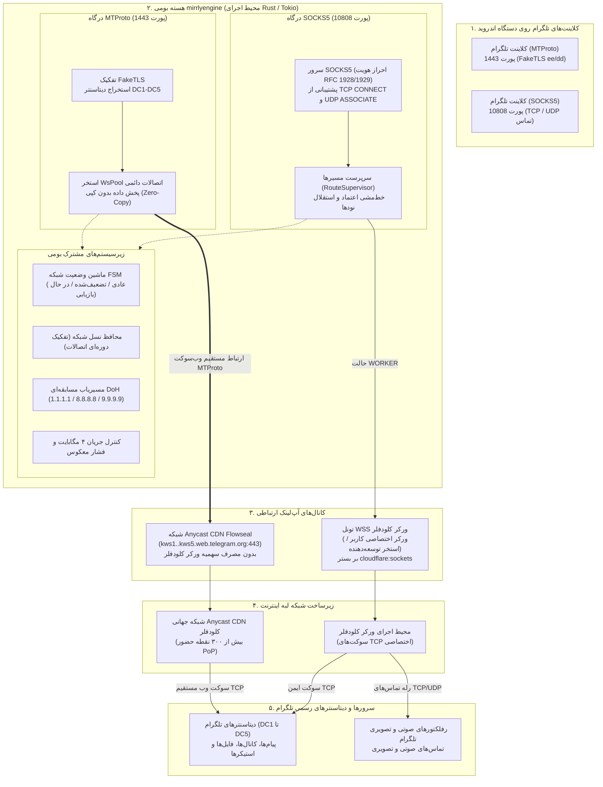

<div align="center">


# Mirrly TG Proxy برای اندروید

**گیت‌وی مسیریابی محلی برای تلگرام با هسته بومی Rust (mirrlyengine) با پشتیبانی از MTProto، SOCKS5، و تونل‌سازی چند مسیره (Anycast CDN Flowseal، Cloudflare Worker WSS) بدون نیاز به VPN سیستمی**

<br/>

**[ 🇷🇺 Русский ](README.md)** &nbsp;|&nbsp; **[ 🇬🇧 English ](README_EN.md)** &nbsp;|&nbsp; **[ 🇮🇷 فارسی ](README_FA.md)**

<br/>

[](https://developer.android.com)
[](https://kotlinlang.org)
[](https://developer.android.com/jetpack/compose)
[](mirrlyengine)
[](https://workers.cloudflare.com)
[](https://developer.android.com/ndk)
<br/>
[](https://github.com/joycecurcirt539-dot/Mirrly-TG-Proxy/releases)
[](#7-رابط-کاربری-برنامه)
[](CHANGELOG.md)
[](https://github.com/joycecurcirt539-dot/Mirrly-TG-Proxy/releases)
[](https://github.com/joycecurcirt539-dot/Mirrly-TG-Proxy/stargazers)
[](https://github.com/joycecurcirt539-dot/Mirrly-TG-Proxy/issues?q=is%3Aissue+is%3Aclosed)
[](https://github.com/joycecurcirt539-dot/Mirrly-TG-Proxy/issues)
<br/>
[](https://t.me/WhyOkyHb)
[](#15-امنیت-و-شرایط-استفاده)
[](tools/deploy-worker/worker.js)
[](tools/deploy-worker)
[](CHANGELOG.md)
[](TERMS_OF_USE.md)
[](LICENSE)

*مسیریابی ترافیک تلگرام بر پایه هسته بومی mirrlyengine (Rust/Tokio). پشتیبانی از پروتکل‌های MTProto و SOCKS5، پایدارسازی شبکه FSM، کنترل جریان بافر ۴ مگابایت و عیب‌یابی سریع و امن قبل از اتصال. کاملاً محلی بر روی دستگاه، بدون نیاز به دسترسی روت و بدون ایجاد تونل VPN سیستمی.*

<br/>

<picture>
  <source media="(prefers-color-scheme: dark)" srcset="https://github.com/joycecurcirt539-dot/Mirrly-TG-Proxy/blob/output/github-contribution-grid-snake-dark.svg?raw=true">
  <source media="(prefers-color-scheme: light)" srcset="https://github.com/joycecurcirt539-dot/Mirrly-TG-Proxy/blob/output/github-contribution-grid-snake.svg?raw=true">
  
</picture>

---

</div>

## فهرست مطالب

1. [Mirrly TG Proxy چیست](#1-mirrly-tg-proxy-چیست)
2. [نحوه کارکرد فنی](#2-نحوه-کارکرد-فنی)
3. [حالت‌های آپ‌لینک (Uplink Modes)](#3-حالت‌های-آپ‌لینک-uplink-modes)
4. [قابلیت‌های کلیدی و معماری ماژول‌ها](#4-قابلیت‌های-کلیدی-و-معماری-ماژول‌ها)
5. [معماری سیستم](#5-معماری-سیستم)
6. [کلاینت‌های تلگرام پشتیبانی‌شده](#6-کلاینت‌های-تلگرام-پشتیبانی‌شده)
7. [رابط کاربری برنامه](#7-رابط-کاربری-برنامه)
8. [شروع سریع و نصب](#8-شروع-سریع-و-نصب)
9. [پیکربندی و تنظیمات](#9-پیکربندی-و-تنظیمات)
10. [راه‌اندازی و دیپلوی Cloudflare Worker](#10-راه‌اندازی-و-دیپلوی-cloudflare-worker)
11. [ساختار پروژه و بیلد از سورس‌کد](#11-ساختار-پروژه-و-بیلد-از-سورس‌کد)
12. [نمودار فعالیت توسعه](#12-نمودار-فعالیت-توسعه)
13. [تاریخچه ستاره‌های ریپازیتوری](#13-تاریخچه-ستاره‌های-ریپازیتوری)
14. [نقشه راه و تاریخچه توسعه](#14-نقشه-راه-و-تاریخچه-توسعه)
15. [امنیت و شرایط استفاده](#15-امنیت-و-شرایط-استفاده)
16. [تقدیر و تالار مشاهیر](#16-تقدیر-و-تالار-مشاهیر)

---

## 1. Mirrly TG Proxy چیست

**Mirrly TG Proxy** یک برنامه رایگان و متن‌باز برای اندروید است که به عنوان یک گیت‌وی پروکسی محلی با کارایی بالا برای هدایت ترافیک تلگرام عمل می‌کند. این برنامه مشکلات قطعی و ناپایداری اتصال، فیلترینگ و کاهش عمدی سرعت، کندی دانلود رسانه‌ها و فیلترینگ عمیق بسته‌ها (DPI) را توسط اپراتورها و سرویس‌دهندگان اینترنت برطرف می‌سازد.

این برنامه برای هدایت ترافیک تلگرام از رابط سیستمی `VpnService` **استفاده نمی‌کند** و ترافیک سایر برنامه‌های دستگاه را **رهگیری نمی‌کند**. تلگرام به یک سوکت محلی بر روی خود دستگاه متصل می‌شود (`127.0.0.1:1443` برای MTProto یا `127.0.0.1:10808` برای SOCKS5). این سوکت توسط هسته بومی `mirrlyengine` (Rust/Tokio) پردازش شده و ترافیک را از طریق شبکه جهانی Anycast CDN یا ورکر Cloudflare به دیتاسنترهای رسمی تلگرام می‌رساند.

> **حالت VPN در حال توسعه است و هنوز برای استفاده عمومی آماده نیست.** پروتکل‌های VLESS، WARP، MASQUE، AWG و مسیرهای آبشاری در نسخه فعلی به عنوان قابلیت پایدار فعال نیستند.

---

### وضعیت و دسته‌بندی امکانات

#### ۱. امکانات آماده و پایدار (Stable)
* **دو پروتکل محلی برای تلگرام**:
  * *MTProto* (پورت `1443`): استتار ترافیک به عنوان FakeTLS با کلیدهای `ee` / `dd`، استخر اتصالات پایدار `WsPool` و اتصال مستقیم به Anycast CDN تلگرام.
  * *SOCKS5* (پورت `10808`): رله شفاف TCP با احراز هویت RFC 1928 / RFC 1929 (نام کاربری و رمز عبور)، پشتیبانی از نام‌های دامنه، IPv4/IPv6 و برقراری تماس‌های صوتی و تصویری.
* **حالت آپ‌لینک پایدار**:
  * `WORKER`: تونل‌سازی از طریق Cloudflare Worker بر بستر پروتکل WebSocket TLS 1.3 روی پورت 443 همراه با قوانین ضد سوءاستفاده (Anti-Open-Relay).
* **پشته شبکه و پایداری**:
  * *موتور DC-Affinity تلگرام*: اتصال مستقیم نشست‌ها به دیتاسنترهای اختصاصی تلگرام (DC1 تا DC5) برای حذف دست‌تکانی‌های مکرر رمزنگاری.
  * *خط‌مشی اعتماد (Trust Policy)*: جداسازی تنظیمات سرور اختصاصی VPS کاربر از نودهای عمومی (`allowPublicRelayFallbackForPrivateVps`).
  * *ماشین وضعیت گسسته FSM*: سه سطح عملکرد شبکه (`NORMAL`, `DEGRADED`, `RECOVERING`) با فیلتر ضد نوسان شدید (۵ تا ۱۰ ثانیه تأیید پایداری، ۳۰ تا ۶۰ ثانیه خنک‌سازی).
  * *Network Generation Guard*: باطل‌سازی خودکار سوکت‌ها و کش DNS با تغییر شبکه (وای‌فای به دیتای موبایل) برای جلوگیری از قطعی سوکت‌های معلق.
  * *Bounded Flow Control*: بافر کنترل ترافیک ۴ مگابایت در ورکر و هسته Rust با اعمال فشار معکوس (رفع خطای قطع اتصال فریم 1009 وب‌سوکت در ارسال ویدیو و فایل‌های حجیم).
  * *Smart Connect*: بررسی سلامت و پایداری ۲ تا ۳ ثانیه‌ای مسیر قبل از فعال‌سازی نهایی پروکسی.
* **رابط کاربری و بومی‌سازی**:
  * *تنظیمات دو سطحی*: حالت ساده (Simple Mode) برای استفاده روزمره و حالت پیشرفته (Advanced Mode) برای تنظیم دقیق سوکت‌ها (`TCP_NODELAY`، اندازه‌های بافر و TLS).
  * *پشتیبانی کامل سه زبانه*: زبان‌های روسی، انگلیسی و فارسی به همراه امکان انتخاب زبان درون برنامه‌ای در اندروید ۱۳ به بالا (`locales_config`).
  * *ویزارد خوش‌آمدگویی (Onboarding)*: راهنمای گام‌به‌گام برای کاربران جدید در اولین اجرا.
  * *کانال رسمی تلگرام*: صفحه تعاملی اختصاصی جهت دریافت آخرین اخبار و راهنماهای پروژه (`@WhyOkyHb`).
  * *گزارش تشخیصی امن (Zero Secret Leak)*: تولید لاگ مونو‌اسپیس با ماسک‌گذاری خودکار پسوردها، توکن‌ها و دامنه‌های خصوصی جهت ارسال به پشتیبانی.
  * *تأیید یکپارچگی کریپتوگرافیک*: اعتبارسنجی امضای دیجیتال بسته APK در لایه NDK C++‎ توسط `SignatureVerifier` و بررسی هش SHA-256 توسط `UpdateChecker`.

#### ۲. در حال توسعه (In Development)
* **سرویس VPN سیستمی**: ماژول‌های VLESS، WARP Anycast، MASQUE HTTP/3 و AmneziaWG به همراه مسیرهای آبشاری در حال پیاده‌سازی هستند.
* **تست سرعت درون برنامه‌ای (`TunnelSpeedTestScreen`)**: سنجش پویای سرعت و پایداری پهنای باند تونل.

---

## 2. نحوه کارکرد فنی

برنامه دو درگاه محلی مستقل را با قدرت موتور بومی **mirrlyengine** (توسعه‌یافته با Rust و رانتایم ناهمگام Tokio) مدیریت می‌کند:

### مسیر ۱: درگاه MTProto (پورت `127.0.0.1:1443`) — تونل مستقیم Anycast CDN
1. کلاینت تلگرام با پروتکل MTProto FakeTLS (با پیشوندهای کلید `ee` یا `dd`) به آدرس `127.0.0.1:1443` متصل می‌شود.
2. هسته بومی `mirrlyengine` تفکیک داده‌های FakeTLS را انجام داده و دیتاسنتر مقصد تلگرام (از DC1 تا DC5) و نوع جریان (پیام‌ها یا مدیا) را استخراج می‌کند.
3. استخر اتصال `WsPool` یک اتصال دائمی WebSocket به سرورهای رسمی وب تلگرام (`kws1..kws5.web.telegram.org:443/apiws`) از طریق شبکه Anycast CDN برقرار یا قرض می‌گیرد.
4. انتخاب نزدیک‌ترین سرور با DoH چندمسیره (`dns.rs`)، الگوریتم Happy Eyeballs (استاندارد RFC 8305) و متعادل‌کننده بار مبتنی بر تأخیر (`balancer.rs`) انجام می‌پذیرد.
5. **مصرف سهمیه صفر در کلودفلر**: پروتکل MTProto مستقیماً با سرورهای لبه Anycast CDN در ارتباط است و هیچ درخواستی از سهمیه روزانه ورکر کلودفلر مصرف نمی‌کند.

### مسیر ۲: درگاه SOCKS5 (پورت `127.0.0.1:10808`) — سرپرست مسیرهای چندگانه
1. کلاینت تلگرام طبق پروتکل استاندارد SOCKS5 با احراز هویت اجباری RFC 1929 (نام کاربری و رمز عبور) به `127.0.0.1:10808` متصل می‌شود.
2. دستورات پشتیبانی‌شده:
   * `CONNECT (0x01)`: پروکسی جریان‌های TCP برای پیام‌ها، کانال‌ها، ربات‌ها و دانلود رسانه‌ها؛
   * `UDP ASSOCIATE (0x03)`: ایجاد تونل برای بسته‌های UDP جهت برقراری تماس‌های صوتی و تصویری تلگرام.
3. ترافیک از طریق تونل وب‌سوکت امن ورکر کلودفلر (WSS) رله می‌گردد.

### تماس‌های صوتی و تصویری تلگرام

تماس‌های تلگرام تنها در پروتکل **SOCKS5** پشتیبانی می‌شوند. هر دو طرف تماس باید از پروکسی با قابلیت TCP فعال استفاده کنند و گزینه «Use proxy for calls» را در تنظیمات تلگرام روشن کرده باشند. کیفیت تماس به نوع شبکه و محدودیت‌های اپراتور طرفین بستگی دارد. حالت MTProto به دلیل ماهیت پروتکل تلگرام از تماس پشتیبانی نمی‌کند.

---

## 3. حالت‌های آپ‌لینک (Uplink Modes)

در پروتکل SOCKS5، ماژول `RouteSupervisor` در موتور `mirrlyengine` هدایت داده‌ها را بر عهده دارد (در حالی که MTProto از استخر اختصاصی Anycast CDN `WsPool` بهره می‌برد):

| حالت (`UplinkMode`) | وضعیت | پروتکل و پورت | توضیحات |
| :--- | :--- | :--- | :--- |
| **`WORKER`** | **پایدار** | WebSocket TLS 1.3 (`:443`) | ترافیک در قالب وب‌سوکت به ورکر کلودفلر ارسال شده و از طریق API بومی `cloudflare:sockets` سوکت‌های TCP مستقیم به دیتاسنترها و رفلکتورهای تماس تلگرام متصل می‌گردند. کاملاً محافظت‌شده با فیلتر Anti-Open-Relay. |

---

## 4. قابلیت‌های کلیدی و معماری ماژول‌ها

### پایدارسازی شبکه و ضد نوسان (Discrete FSM)
* **ماشین وضعیت سه مرحله‌ای**:
  * `NORMAL`: پینگ طبیعی، بدون افت بسته و رفتار استاندارد سوکت‌ها.
  * `DEGRADED`: تشخیص افت کیفیت کانال رادیویی (تأخیر بیش از ۵۰۰ میلی‌ثانیه، جیتر بالای ۶۰ میلی‌ثانیه یا افت بسته‌ها).
  * `RECOVERING`: بازیابی آرام و تنظیم تدریجی پایداری پس از جابجایی شبکه.
* **پنجره هیسترزیس (Hysteresis)**: جلوگیری از سوئیچ مکرر با الزام به تأیید ثبات ۵ تا ۱۰ ثانیه‌ای قبل از تغییر وضعیت.
* **دوره خنک‌سازی (Cool-down)**: مکث ۳۰ تا ۶۰ ثانیه‌ای پس از هر تغییر کانفیگ جهت جلوگیری از نوسان فرکانسی مسیرها.

### محافظ تغییر نسل شبکه (Network Generation Guard)
اختصاص یک شمارنده نسلی (`network_generation`) به وضعیت شبکه. هنگام جابجایی بین وای‌فای و اینترنت همراه، سوکت‌های نسل قبل و کش قدیمی DNS فوراً بسته می‌شوند تا از فریز شدن ارتباط جلوگیری شود.

### اتصال هوشمند قبل از شروع (Smart Connect)
اجرای توالی تست سریع ۲ الی ۳ ثانیه‌ای هنگام اتصال:
1. اعتبارسنجی سریع DoH و سرورهای DNS سیستمی؛
2. بررسی دسترسی به استخر نودهای آپ‌لینک؛
3. انتخاب سریع‌ترین و خلوت‌ترین نود ارتباطی؛
4. نمایش مرحله به مرحله وضعیت در رابط کاربری ("در حال بهینه‌سازی مسیر...").

### تنظیمات دو سطحی (Simple در برابر Advanced)
* **حالت ساده (پیش‌فرض)**: تمرکز بر نیازهای اصلی: انتخاب پروتکل (MTProto / SOCKS5)، انتخاب ورکر، تایمر خواب، زمان‌بندی هفتگی، اجرای خودکار هنگام بوت، زبان و پوسته.
* **حالت پیشرفته**: تنظیم دقیق سوکت‌ها اعم از `TCP_NODELAY`، حجم بافرها، ظرفیت استخر وب‌سوکت و پارامترهای Happy Eyeballs.

### گزارش تشخیصی ایمن (Zero Secret Leak)
* ساخت گزارش کامل سیستم در صفحه `DiagnosticReportScreen` با فونت تک‌فاصله.
* **پاکسازی خودکار اطلاعات حساس**: حذف رمز عبور SOCKS5، توکن‌ها، کلیدهای اختصاصی WireGuard با عبارت `[REDACTED]`، آی‌پی‌های خصوصی و نام زیردامنه‌ها (`***.workers.dev`).
* امکان کپی با یک کلیک یا اشتراک‌گذاری سیستمی در بخش ایشیوهای گیت‌هاب.

### بافر کنترل جریان داده (Bounded Flow Control)
* محدودیت حافظه بافر نوشتن به ۴ مگابایت در ورکر و هسته Rust (`MAX_PENDING_WRITE_BYTES = 4 * 1024 * 1024`).
* صف‌بندی ناهمگام FIFO برای قطعات Blob و ArrayBuffer.
* محافظت کامل در برابر خطای قطع وب‌سوکت (کد 1009) در هنگام ارسال و دانلود فایل‌های حجیم و ویدیوها.

### حالت خواب عمیق و محافظ باتری (Battery Guard)
* **خواب عمیق (Deep Dormancy)**: هنگام قطع کامل اینترنت (حالت هواپیما یا نبود آنتن)، سوکت‌ها بسته شده و بررسی‌های پریودیک DoH معلق می‌گردند تا در مصرف باتری صرفه‌جویی شود و با برقراری شبکه بلافاصله از سر گرفته می‌شوند.
* **محافظ باتری**: توقف خودکار برنامه با رسیدن شارژ باتری به حد نصاب انتخابی (۵٪، ۱۰٪، ۱۵٪، ۲۰٪، ۲۵٪) یا فعال‌سازی حالت Power Saver سیستم در حالت بدون شارژر.

### احراز هویت SOCKS5 با استانداردهای RFC 1928 / RFC 1929
* پیاده‌سازی درون‌سازه‌ای مکانیزم احراز هویت در هسته `mirrlyengine`.
* درخواست نام کاربری و کلمه عبور در اولین راه‌اندازی SOCKS5 برای جلوگیری از ایجاد پروکسی باز و سوءاستفاده‌های امنیتی.
* لینک اتصال سریع: `tg://socks?server=127.0.0.1&port=10808&user=...&pass=...`.

---

## 5. معماری سیستم



---

## 6. کلاینت‌های تلگرام پشتیبانی‌شده

برنامه به صورت خودکار کلاینت‌های نصب‌شده را شناسایی کرده و امکان اتصال با یک لمس را فراهم می‌آورد:

* **کلاینت‌های رسمی**: Telegram، Telegram X
* **کلاینت‌های پیشرفته**: AyuGram، NekoGram، Nagram، ExteraGram، Plus Messenger
* **سایر کلاینت‌ها**: Cherrygram، Nicegram، iMe Messenger، Telegraph، MDGram، Dahl، Litegram، Nullgram، ForkClient، BifToGram

---

## 7. رابط کاربری برنامه

رابط کاربری با فریم‌ورک مدرن Jetpack Compose، طراحی واکنش‌گرا (`AdaptiveLayoutHelper`) و پشتیبانی کامل از سه زبان (فارسی، روسی و انگلیسی) ساخته شده است:

* **صفحه اصلی (`HomeScreen`)**: کلید اصلی روشن/خاموش، وضعیت اتصال بلادرنگ، حلقه وضعیت کیفیت شبکه، کلید جابجایی بین پروتکل MTProto و SOCKS5، دکمه مستقیم «اتصال تلگرام» و نشان شفاف وضعیت محافظت.
* **صفحه تنظیمات (`SettingsScreen`)**:
  * *حالت ساده*: انتخاب پروتکل، انتخاب ورکر، تایمر خواب، زمان‌بندی، اجرای خودکار در بوت، انتخاب زبان و پوسته.
  * *حالت پیشرفته*: تنظیم دقیق سوکت‌ها (`TCP_NODELAY`)، بافرها و ظرفیت استخر اتصالات.
* **راهنمای آغازین (`OnboardingScreen`)**: خوش‌آمدگویی و آموزش ۳ مرحله‌ای برنامه برای راه‌اندازی سریع.
* **کانال رسمی تلگرام (`TelegramChannelScreen`)**: دسترسی آسان به جامعه کاربری و اخبار پروژه در `@WhyOkyHb`.
* **مدیریت ورکرها (`WorkerManagerScreen`)**: لیست ورکرهای کلودفلر، پایش میزان تأخیر، کدهای وضعیت HTTP، اسکنر سریع QR با دوربین (CameraX + Google ML Kit) و تولیدکننده لینک اشتراک‌گذاری.
* **تحلیل عملکرد ورکر (`WorkerAnalyticsScreen`)**: نمودار تعاملی منحنی بزیه از سهمیه مصرفی ورکر کلودفلر با خط زمان و شمارش معکوس بازنشانی سهمیه (ساعت 00:00 UTC).
* **عیب‌یابی شبکه (`NetworkDiagnosticScreen`)**: تحلیل شاخص کیفیت سرویس (SQI بین ۰ تا ۱۰۰٪)، پینگ، جیتر، ضریب تحویل بسته‌ها، شاخص کیفیت مکالمه MOS و ایجاد گزارش سیستمی.
* **گزارش تشخیصی (`DiagnosticReportScreen`)**: مشاهده لاگ‌های فنی بدون افشای رمز عبور یا دامنه‌های خصوصی و ارسال آسان به گیت‌هاب.
* **تاریخچه نشست‌ها (`HistoryScreen`)**: ثبت مدت زمان و حجم تبادل اطلاعات در اتصالات پیشین.
* **لاگ‌های زنده (`LogsScreen`)**: نمایش وقایع سیستمی با امکان فیلتر بر اساس سطح اهمیت و خروجی فایل.
* **صفحه به‌روزرسانی (`UpdateScreen`)**: بررسی نسخه جدید از گیت‌هاب، نمایش لاگ تغییرات، اعتبارسنجی هش‌های SHA-256 و بررسی امضای دیجیتال NDK C++‎.

---

## 8. شروع سریع و نصب

۱. فایل نصبی APK متناسب با دستگاه خود را از صفحه [انتشارها (Releases)](https://github.com/joycecurcirt539-dot/Mirrly-TG-Proxy/releases) دانلود کنید.
۲. انتخاب نسخه مناسب پردازنده:
   * **`app-universal-release.apk`**: نسخه جامع و یونیورسال شامل کتابخانه‌های تمامی معماری‌ها (ARM64, ARMv7, x86, x86_64). سازگار با تمامی گوشی‌ها و مناسب جهت آپدیت خودکار.
   * **`app-arm64-v8a-release.apk`**: بهینه‌شده برای گوشی‌ها و تبلت‌های مدرن ۶۴ بیتی ARM (کمترین حجم فایل).
   * **`app-armeabi-v7a-release.apk`**: برای دستگاه‌های قدیمی‌تر ۳۲ بیتی ARM.
   * **`app-x86_64-release.apk`**: برای شبیه‌سازهای اندروید و تبلت‌های مبتنی بر پردازنده‌های اینتل و AMD.
   * **`app-x86-release.apk`**: برای شبیه‌سازهای ۳۲ بیتی x86.
۳. برنامه را نصب کرده و آن را باز کنید (نیازمند اندروید 8.0 یا بالاتر).
۴. کلید دایره‌ای بزرگ را لمس نمایید تا پس از اعتبارسنجی سریع شبکه (Smart Connect)، پروکسی آغاز به کار کند.
۵. دکمه **«اتصال تلگرام»** را بزنید و در برنامه تلگرام تأیید اتصال پروکسی را انتخاب فرمایید.

---

## 9. پیکربندی و تنظیمات

پارامترهای پایه در فایل [ProxyConfig.kt](core/src/main/kotlin/com/mirrly/tgproxy/core/ProxyConfig.kt):

| پارامتر | پیش‌فرض | توضیحات |
| :--- | :--- | :--- |
| `proxyModeName` | `MTPROTO` | پروتکل فعال محلی: `MTPROTO` یا `SOCKS5` |
| `bindHost` / `bindPort` | `127.0.0.1:1443` | آدرس IP محلی و پورت MTProto |
| `socks5Port` | `10808` | پورت TCP محلی برای پروتکل SOCKS5 |
| `socks5Username` / `socks5Password` | `""` | مشخصات احراز هویت SOCKS5 (استاندارد RFC 1929) |
| `secretHex` | تولید خودکار در اولین اجرا | کلید امنیتی MTProto (رشته ۳۴ کاراکتری با پیشوند `dd`) |
| `customCfDomain` | `""` | دامنه اختصاصی ورکر کلودفلر کاربر |
| `speedPresetName` | `AUTO` | پروفایل سرعت: `AUTO`, `ECO`, `BALANCED`, `TURBO`, `ULTRA` |
| `tcpNoDelayModeName` | `AUTO` | تنظیم الگوریتم نیگل: `AUTO`, `ON`, `OFF` |
| `bufferSizeBytes` | `262144` (256 کیلوبایت) | حجم پیش‌فرض بافرهای سوکت شبکه |
| `useDefaultWorkerSocks5` | `true` | استفاده از ورکر توسعه‌دهندگان در صورت خالی بودن دامنه کاربر |
| `isBatteryGuardEnabled` | `false` | خاموش‌سازی هوشمند برنامه با کاهش باتری |
| `batteryGuardThreshold` | `15` | درصد بحرانی باتری جهت توقف سرویس |
| `allowPublicRelayFallbackForPrivateVps` | `false` | جلوگیری از نشت ترافیک سرور شخصی به نودهای عمومی |
| `autostartOnBoot` | `false` | اجرای خودکار پروکسی همراه با روشن شدن گوشی |
| `verboseLogs` | `true` | ثبت کامل گزارش‌های تشخیصی شبکه |

---

## 10. راه‌اندازی و دیپلوی Cloudflare Worker

ساخت و دیپلوی یک ورکر کلودفلر اختصاصی تنها ۱ تا ۲ دقیقه زمان می‌برد و به صورت کامل در پلن رایگان کلودفلر (۱۰۰,۰۰۰ درخواست در روز) قابل استفاده است.

### روش ۱: دیپلوی خودکار از طریق CLI (روش پیشنهادی)

اسکریپت‌های نصب در پوشه [`tools/deploy-worker/`](tools/deploy-worker/) قرار دارند:

#### گزینه الف: در ویندوز (اجرای آسان با یک کلیک)
۱. به پوشه `tools/deploy-worker/` بروید.
۲. روی فایل **`deploy.bat`** دوبار کلیک کنید.
۳. اسکریپت وضعیت Node.js را بررسی کرده، ابزار Wrangler را نصب، لاگین به کلودفلر را باز کرده و کد ورکر را مستقر می‌کند.
۴. در پایان یک کد QR تعاملی نمایش داده می‌شود که با اسکنر درون برنامه قابل خواندن است.

#### گزینه ب: از طریق خط فرمان PowerShell
```powershell
irm https://raw.githubusercontent.com/joycecurcirt539-dot/Mirrly-TG-Proxy/main/tools/deploy-worker/deploy.ps1 | iex
```

#### گزینه ج: لینوکس / مک / WSL
```bash
chmod +x tools/deploy-worker/deploy.sh
./tools/deploy-worker/deploy.sh
```

### روش ۲: ساخت دستی در داشبورد کلودفلر

۱. وارد حساب خود در [dash.cloudflare.com](https://dash.cloudflare.com/) شوید.
۲. از منو به بخش **Workers & Pages** رفته و گزینه **Create application** و سپس **Create Worker** را انتخاب کنید.
۳. یک نام دلخواه وارد کرده و **Deploy** را بزنید.
۴. گزینه **Edit code** را باز کنید، کدهای پیش‌فرض را پاک کرده و محتوای فایل [`tools/deploy-worker/worker.js`](tools/deploy-worker/worker.js) (یا [`docs/cloudflare_worker.js`](docs/cloudflare_worker.js)) را در آن قرار دهید.
۵. دکمه **Deploy** را بزنید تا اسکریپت منتشر شود.
۶. دامنه تخصیص داده شده (مثلاً `my-proxy.username.workers.dev`) را کپی کنید.
۷. در برنامه **Mirrly TG Proxy**، به بخش **مدیریت ورکرها** رفته، **افزودن ورکر** را بزنید و دامنه خود را ذخیره نمایید.

---

## 11. ساختار پروژه و بیلد از سورس‌کد

### درخت فایل‌های ریپازیتوری

```text
Mirrly TG Proxy/
├── app/                  # برنامه اندروید (رابط Jetpack Compose، سرویس‌های پس‌زمینه، ماژول C++ NDK)
│   ├── src/main/cpp/     # کتابخانه C++ بررسی امضای برنامه (native_sec.cpp, CMakeLists.txt)
│   ├── src/main/java/    # صفحات رابط کاربری، سرویس پس‌زمینه و منطق اتصال
│   └── src/main/res/     # منابع گرافیکی، پوسته‌ها و متون چندزبانه strings.xml (روسی، انگلیسی، فارسی)
├── core/                 # هسته بیزینس‌لاجیک کاتلین
│   └── src/main/kotlin/  # کلاس‌های LocalProxyServer، رابط بومی NativeProxy، موتورهای DoH و FSM و UpdateChecker
├── mirrlyengine/         # هسته قدرتمند و فوق‌سریع بومی نوشته‌شده با زبان Rust (محیط Tokio)
│   ├── src/awg.rs        # پروتکل AmneziaWG (استتار WireGuard و بسته‌های جعلی Jc)
│   ├── src/balancer.rs   # پیاده‌سازی Happy Eyeballs v2 (استاندارد RFC 8305) و موازنه بار Anycast
│   ├── src/bridge.rs     # پل ارتباطی FFI میان کاتلین و موتور Rust
│   ├── src/budget.rs     # مدیریت بودجه و زمان‌بندی تلاش‌های اتصال
│   ├── src/cfproxy.rs    # تونل WSS کلودفلر و مدیریت محدودیت‌های نرخ HTTP 429
│   ├── src/dns.rs        # مسیریاب مسابقه‌ای DoH و کش بهینه دامنه‌ها
│   ├── src/faketls.rs    # لایه استتار FakeTLS تلگرام (دامنه‌ها و کلیدهای ee/dd)
│   ├── src/generation_guard.rs # محافظ سوییچ نسل‌های شبکه
│   ├── src/masque.rs     # پروتکل WARP MASQUE بر بستر HTTP/3 CONNECT-UDP
│   ├── src/network_profile.rs  # پیاده‌سازی FSM پایداری شبکه (NORMAL, DEGRADED, RECOVERING)
│   ├── src/node_independence.rs # سیاست‌های جداسازی نودها و حفظ حریم خصوصی
│   ├── src/proxy.rs      # سرور MTProto، مدیریت کلیدهای FakeTLS و استخر WsPool
│   ├── src/recovery.rs   # مکانیزم‌های بازیابی خودکار و تخلیه کانال
│   ├── src/socks5.rs     # سرور SOCKS5، احراز هویت RFC 1929 و رله داده‌های TCP
│   ├── src/supervisor.rs # مدیریت مسیرهای چندگانه آپ‌لینک
│   ├── src/timeline.rs   # پروفایلر فازهای زمانی ایجاد تونل
│   ├── src/tls_observability.rs # مانیتورینگ دست‌تکانی TLS
│   ├── src/vless.rs      # پیاده‌سازی VLESS روی وب‌سوکت و Reality
│   ├── src/ws.rs         # بافر کنترل جریان داده ۴ مگابایت وب‌سوکت
│   └── Cargo.toml        # مانیفست و وابستگی‌های کریت رستم
├── tools/                # ابزارهای ساخت و دیپلوی
│   ├── build/            # اسکریپت‌های کامپایل Rust برای ۴ معماری (build_native.ps1, build_native.sh)
│   └── deploy-worker/    # اسکریپت‌های راه‌اندازی سریع ورکر کلودفلر (deploy.bat, deploy.ps1, deploy.sh)
├── docs/                 # مستندات تکمیلی، فایل‌های راهنما و اسکریپت مرجع کلودفلر
└── gradle/               # تنظیمات گرادل
```

### پیش‌نیازهای بیلد

* اندروید SDK (سطح API 35 به همراه Build-Tools 35.0.0)
* اندروید NDK (نسخه NDK 27 یا جدیدتر پیشنهاد می‌شود)
* تولچین زبان Rust (`cargo`) به همراه تارگت‌های زیر:
  ```bash
  rustup target add aarch64-linux-android armv7-linux-androideabi x86_64-linux-android i686-linux-android
  ```
* کیت توسعه جاوا (JDK 17 به بالا)

### مراحل بیلد با خط فرمان

```bash
# ۱. کلون ریپازیتوری پروژه
git clone https://github.com/joycecurcirt539-dot/Mirrly-TG-Proxy.git
cd Mirrly-TG-Proxy

# ۲. کامپایل هسته بومی Rust برای ۴ معماری اندروید
# در ویندوز (PowerShell):
.\tools\build\build_native.ps1
# در لینوکس / مک (Bash):
chmod +x tools/build/build_native.sh
./tools/build/build_native.sh

# ۳. بیلد بسته‌های نصبی ریلیز
./gradlew assembleRelease
```

فایل‌های APK خروجی در مسیر `app/build/outputs/apk/release/` قرار خواهند گرفت.

---

## 12. نمودار فعالیت توسعه

<div align="center">

[](https://github.com/joycecurcirt539-dot/Mirrly-TG-Proxy)

</div>

---

## 13. تاریخچه ستاره‌های ریپازیتوری

<div align="center">

<a href="https://www.star-history.com/?repos=joycecurcirt539-dot%2FMirrly-TG-Proxy&type=date&legend=top-left">
 <picture>
   <source media="(prefers-color-scheme: dark)" srcset="https://api.star-history.com/chart?repos=joycecurcirt539-dot/Mirrly-TG-Proxy&type=date&theme=dark&legend=top-left&sealed_token=2ZxdQVXYtszPQ2_C8iS9hYFI8zb-495pG47H9KSmQnTviNfwec-JUTZdeRmiaKkKmwYIJtF-i3x7BFk051JjPV3k1ensh6WvgBtwCmxaOybEdxs0ZFVSwdhZA0lCRQriwItHEtGZthEt_5HPt-BnP6JZcgNJkf69g2MAvm6KiC_6E8vZ1g7q8BLEmeFm" />
   <source media="(prefers-color-scheme: light)" srcset="https://api.star-history.com/chart?repos=joycecurcirt539-dot/Mirrly-TG-Proxy&type=date&legend=top-left&sealed_token=2ZxdQVXYtszPQ2_C8iS9hYFI8zb-495pG47H9KSmQnTviNfwec-JUTZdeRmiaKkKmwYIJtF-i3x7BFk051JjPV3k1ensh6WvgBtwCmxaOybEdxs0ZFVSwdhZA0lCRQriwItHEtGZthEt_5HPt-BnP6JZcgNJkf69g2MAvm6KiC_6E8vZ1g7q8BLEmeFm" />
   
 </picture>
</a>

</div>

---

## 14. نقشه راه و تاریخچه توسعه

شروع توسعه پروژه در تاریخ **۲۷ ژوئیه ۲۰۲۶** با انتشار نسخه `v1.0.0` کلید خورد. مراحل برجسته توسعه:

| نسخه / تاریخ | مرحله | تغییرات کلیدی |
| :--- | :--- | :--- |
| **`v1.0.0`** (27.07.2026) | پیدایش اولیه | انتشار اولین نسخه عمومی با هسته C/JNA، گیت‌وی محلی MTProto روی پورت 1443، استخر WsPool و هماهنگی با کلاینت‌ها. |
| **`v1.0.4–1.0.5`** | لایسنس و بافرها | ارتقا به مجوز GPLv3، افزایش ظرفیت بافرها و کنترل `TCP_NODELAY`. |
| **`v1.0.6–1.0.8`** | امنیت و زیبایی | پیاده‌سازی اعتبارسنجی بومی امضای SHA-256 (`SignatureVerifier`)، تایمر خواب و جلوه‌های شیشه‌ای تار `FLAG_BLUR_BEHIND`. |
| **`v1.0.9`** | پروتکل SOCKS5 و تماس | رله ناهمگام SOCKS5 TCP روی پورت 10808 با استفاده از API کلودفلر. برقراری تماس‌های صوتی و تصویری. |
| **`v1.1.0–1.1.1`** | پایدارسازی | رفع تداخل‌های JNI، نشانگر نوار وضعیت و مهاجرت به بسته‌های مجزای معماری پردازنده (ABI Splits). |
| **`v1.1.2`** | بازنویسی با Rust | بازنویسی کامل موتور با زبان راست (`mirrlyengine`): پردازش بدون کپی (Zero-Copy)، ناهمگام با Tokio و حذف وقفه‌های بازیافت حافظه GC. |
| **`v1.1.3–1.1.3.1`** | مدیریت ورکرها | صفحه اختصاصی مدیریت ورکرها، الگوریتم Happy Eyeballs و لینک‌های عمیق `mirrly://worker`. |
| **`v1.1.4`** | پشته خالص Rust | حذف سوکت‌های سنتی JVM، جابجایی بلادرنگ مسیر و فیلترهای محافظ Anti-Open-Relay. |
| **`v1.1.5`** | سازماندهی پروتکل | مدیریت سه فازی پروتکل‌ها و سنجش سرعت استخر ورکرها. |
| **`v1.1.6–1.1.6.1`** | بهینه‌سازی وب‌سوکت | مونتاژ فریم‌های ۱۶ مگابایتی، صف نوشتن و اسکریپت راه‌اندازی سریع `deploy.bat`. |
| **`v1.1.7`** | مهاجرت Anycast CDN | اتصال مستقیم MTProto به Anycast CDN تلگرام، مسابقه ۲۵ میلی‌ثانیه‌ای سرورها و بازطراحی رابط کاربری با نرخ نوسازی 120 هرتز. |
| **`v1.1.8`** | DoH، تحلیل مصرف و QoS | تفکیک‌کننده DoH، اتصال هوشمند دیتاسنترها DC-Affinity، نمودار مصرف سهمیه بزیه، مدیریت هوشمند حرارت و شارژ و موتور مولتی-APK. |
| **`v1.1.8.1`** | بازطراحی تایمر خواب | استانداردسازی دامنه‌های ورکر، پروب‌های قبل از اتصال و بازطراحی دیالوگ خواب. |
| **`v1.1.8.2`** | اسکنر ML Kit و جداسازی | اسکنر کد QR با Google ML Kit، تولیدکننده کدهای QR، ایزوله‌سازی کلیدهای اختصاصی و گواهی‌های امنیتی WebPKI. |
| **`v1.1.8.3`** | آزمون سرعت و برنامه زمان‌بندی | تست سرعت تونل، احراز هویت RFC 1929 برای SOCKS5، زمان‌بند هفتگی و ذخیره انرژی Deep Dormancy. |
| **`v2.0.0`** | پایداری FSM و چندزبانه | ماشین وضعیت گسسته شبکه (`NORMAL`, `DEGRADED`, `RECOVERING`)، محافظ تغییر نسل شبکه، کنترل جریان داده ۴ مگابایت، اتصال سریع Smart Connect، تنظیمات ساده و پیشرفته و پشتیبانی چندزبانه. |
| **`v2.0.0.2`** | بهینه‌سازی مقیاس و زبان فارسی | اضافه شدن زبان فارسی، ارتقای نمودار پویایی سرعت و حلقه سنجش کیفیت، جداسازی ایمن و اعلان در حال توسعه برای سرویس VPN. |

---

## 15. امنیت و شرایط استفاده

* **عدم جمع‌آوری تله‌متری و تحلیل داده**: برنامه فاقد هرگونه تبلیغات، پایشگر تجاری یا ارسال‌کننده اطلاعات رفتاری به سرورهای شخص ثالث است.
* **تضمین عدم نشت اطلاعات محرمانه (Zero Secret Leak)**: گزارش‌های عیب‌یابی و لاگ‌ها به شکل خودکار تمامی اطلاعات خصوصی از جمله رمزهای عبور، کلیدهای رمزنگاری و دامنه‌ها را پیش از صدور ماسک می‌کنند.
* **اعتبارسنجی اصالت برنامه**: ماژول `UpdateChecker` بسته‌های به‌روزرسانی را در دو مرحله از نظر هش SHA-256 و امضای دیجیتال NDK C++‎ (`SignatureVerifier`) اعتبارسنجی می‌کند. بسته‌های دستکاری‌شده مسدود می‌شوند.
* **تاریخچه تغییرات**: لاگ کامل تغییرات در فایل [CHANGELOG.md](CHANGELOG.md) در دسترس است.
* **مجوز نرم‌افزاری**: منتشرشده تحت شرایط مجوز عمومی گنو نسخه ۳ ([GNU General Public License v3](LICENSE)).
* **شرایط استفاده**: قوانین و چارچوب حقوقی استفاده از برنامه در [TERMS_OF_USE.md](TERMS_OF_USE.md) ثبت گردیده است.

---

## 16. تقدیر و تالار مشاهیر

* **[amurcanov](https://github.com/amurcanov)** — توسعه‌دهنده [tg-ws-proxy-android](https://github.com/amurcanov/tg-ws-proxy-android) که معماری اولیه آن الهام‌بخش ساخت Mirrly TG Proxy بود.
* **[Flowseal](https://github.com/Flowseal)** — پدیدآورنده [tg-ws-proxy](https://github.com/Flowseal/tg-ws-proxy) و خالق ایده اولیه تونل‌سازی ترافیک تلگرام از بستر نشست‌های وب‌سوکت کلودفلر.

### پژوهشگران امنیت و مشارکت‌کنندگان عیب‌یابی

* **[Grovymon](https://github.com/Grovymon)** — ممیزی‌های عمیق امنیتی هسته، تحقیق پیرامون دور زدن فیلترینگ دیتای موبایل، هماهنگ‌سازی فاصله‌های پنجره سیستم (Window Insets) و پیشنهاد احراز هویت RFC 1929 برای SOCKS5 (ایشیوهای ۳، ۴، ۵، ۷، ۸، ۱۵، ۱۶، ۱۸، ۱۹ و ۲۰).
* **[zzzxxx888207-design](https://github.com/zzzxxx888207-design)** — بهینه‌سازی پایداری کلیدهای رمزنگاری در حافظه و عیب‌یابی اسکریپت ورکر کلودفلر (ایشیوهای ۱، ۹، ۱۰ و ۱۳).
* **[BbIBux](https://github.com/BbIBux)** — عیب‌یابی دانلود مدیا در پروتکل MTProto در شبکه‌های T2 و روستلکام و ارتقای شفافیت دیالوگ‌ها (ایشیوهای ۱۱، ۱۲ و ۱۷).
* **[ustiprog](https://github.com/ustiprog)** — ایده تایمر توقف خودکار هنگام استارت و گزارش‌های تخلیه باتری در نبود آنتن که منجر به ایجاد Deep Dormancy گردید (ایشیو ۲۱).
* **[40OIL](https://github.com/40OIL)** — کشف هم‌پوشانی کلیدهای ناوبری سه‌گانه در گوشی سامسونگ گلکسی A55 و کمک به استانداردسازی اینست‌ها (ایشیو ۲۲).
* **[CrazyGhostRider](https://github.com/CrazyGhostRider)** — گزارش فریز شدن صفحه انتخاب زبان در اولین راه‌اندازی سامسونگ S21 اولترا / اندروید ۱۴ که به اصلاح فرآیند خوش‌آمدگویی و زبان‌ها انجامید (ایشیو ۲۹).
* **[VikKalm](https://github.com/VikKalm)** — ثبت گزارش اختلالات ورکر در اندروید ۱۳ نسخه arm64-v8a (ایشیو ۶).
* **[liveonloan](https://github.com/liveonloan)** — گزارش خطای تداخل چیدمان در گوشی ریلمی GT7 (ایشیو ۱۴).
* **[Dimaakaj](https://github.com/Dimaakaj)** — شناسایی و رفع خطای تایپ‌اسکریپت `ts(2554)` در متد `serverWs.accept()` اسکریپت ورکر کلودفلر.

### جامعه کاربری و مترجمان

* **[MSLight](https://github.com/MSLight)** — پیشنهاد و پیگیری ترجمه کامل رابط کاربری به زبان انگلیسی (ایشیو ۲۳).
* **[Aseptronn](https://github.com/Aseptronn)** — پیشنهاد و پیگیری ترجمه کامل رابط کاربری به زبان فارسی (Farsi) و توسعه جامعه بین‌المللی کاربران (ایشیو ۲۳).
* **Shon4k** — آزمون نسخه‌های پیش از انتشار و سنجش پایداری شبکه.
* **Linar S** — ارزیابی سازگاری روی پلتفرم‌های مختلف اندروید.
* **Astimir Meikulov** — از همراهان فعال در جامعه تلگرامی [@WhyOkyHb](https://t.me/WhyOkyHb).
